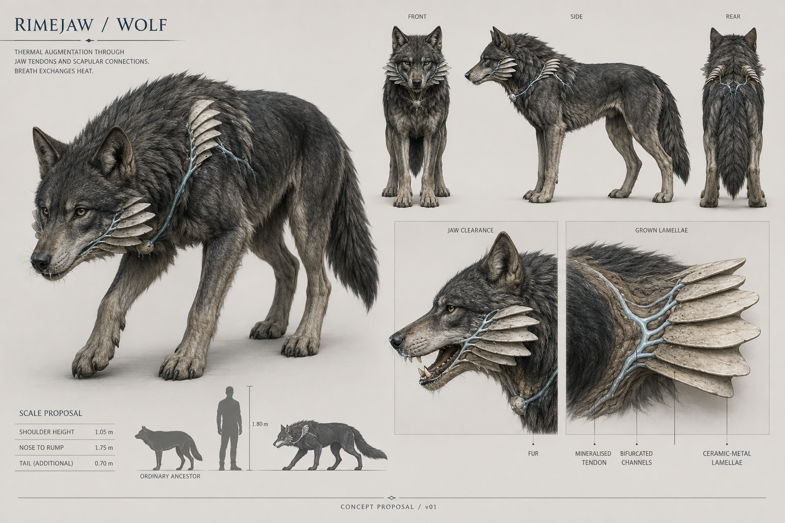
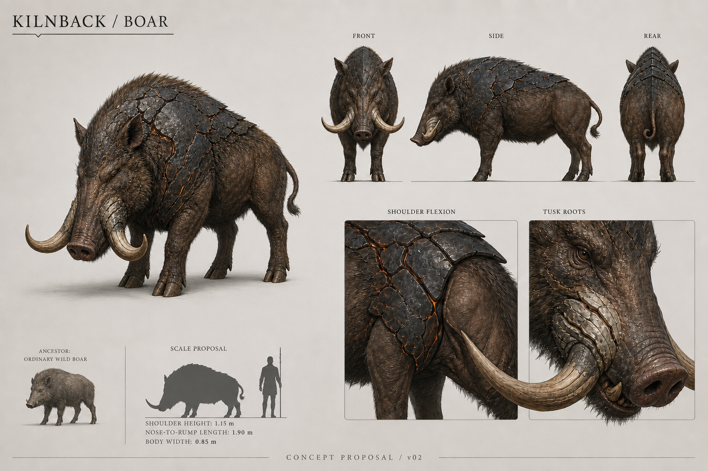
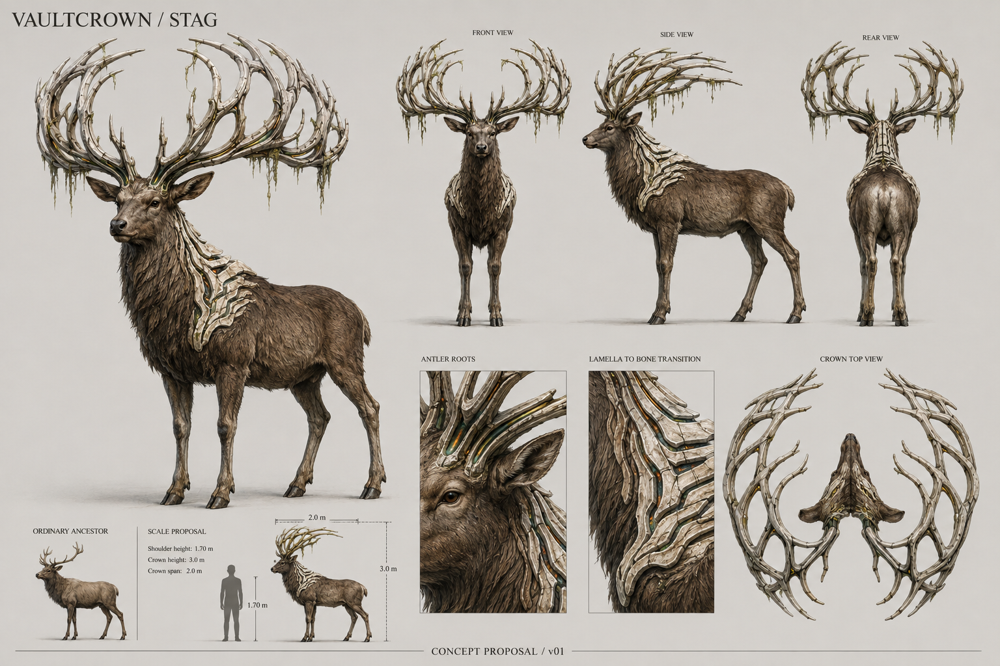
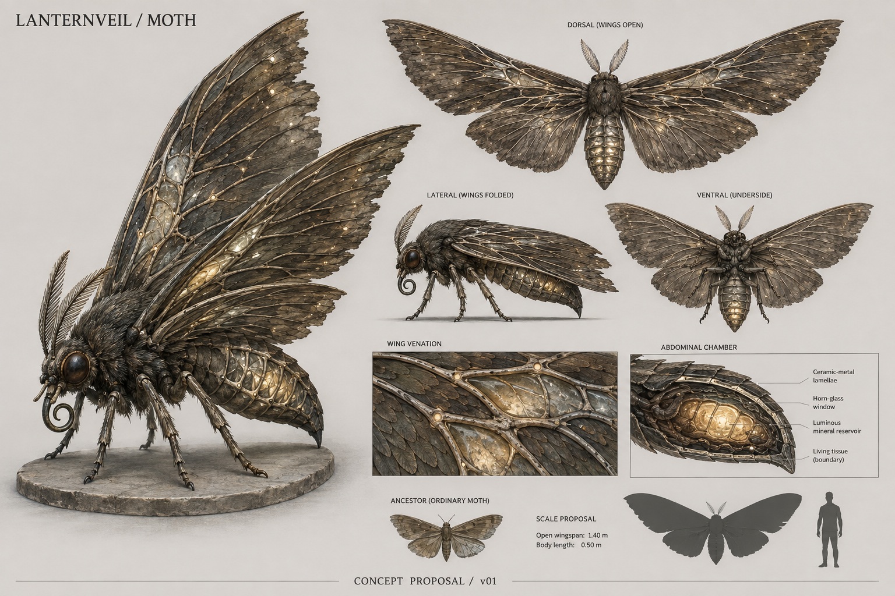

# Augmented beasts — first design set

**Status:** concept proposals for owner review, 7 September 2026.
**Deliverable:** four original image sheets and a Blender modelling brief.

The [owner's references and direction](../../../references/README.md) ask for
ordinary animals made fantastical by meteor-borne augmentation. D-013 supplies
weathered materials and readable forms; D-030 supplies the shared cause. The
request covers visual exploration and reference storage, not new playable mobs.
No runtime assets, tuning, combat rules, drops, rig adapter or saves change here.

## Design logic

Each creature follows **ordinary animal → affected biological structure →
exaggerated property → visible new form**. The technological connection appears
in grown branching channels, layered ceramic-metal ribs and recessed energy.
It should be visible through shape and attachment even with emission disabled.

The mixture is wonder, age and unease: beautiful natural proportions made
uncomfortably excessive. Familiar animal faces, living coats and readable joints
anchor the fantasy. Avoid arbitrary crystals, armour strapped onto animals,
generic demon horns, wet gore or an identical glowing material across every mob.
The material names below describe appearance, not new inventory resources.

| Proposal | Original animal | Augmented structure | Strong silhouette feature | Relationship to current roster |
| --- | --- | --- | --- | --- |
| Rimejaw | Wolf | Jaw tendons and respiratory heat exchange | Long low predator with swept cheek radiators | Canine study; not an accepted ancestry or frost conversion for Ash Hound |
| Kilnback | Wild boar | Thick shoulder shield, metabolism and tusk dentine | Low snout under a heavy broken heat shield | New visual candidate; no boar actor added |
| Vaultcrown | Elk/deer | Antler growth, blood supply and neck support | Tall open branching crown on a living cervid | Augmented cervid candidate; current passive Valley Elk stays the quiet comparison |
| Lanternveil | Ordinary non-luminous moth | Light-sensing scales and wing veins | Broad veined wings around a small abdominal lantern | Possible wisp-like appearance; no wisp ancestry or flight rules accepted |

Biology beyond the ordinary ancestors is fictional concept design. Sender,
intent and history of the meteorites remain open. Visible structures can suggest
the recovered technology behind existing Kinds/catalysts without promising that
an appendage is targetable, removable or a guaranteed drop.

## Rimejaw — wolf

**Read:** a lean hunter whose breathing apparatus has become a cold exchange
organ. Coarse charcoal and silver fur survives across most of the torso. Thin
pale layers grow from mineralised jaw tendons into backward-swept cheek fans;
small shoulder layers repeat the growth. Narrow cold channels and edge
condensation tell the transformation without hiding the face.

**Anatomy:** long muzzle; two triangular ears; ordinary eyes; separate lower jaw;
deep chest tapering into flank; mobile scapulae; four digitigrade legs, four paws
and one bushy tail. Fans attach behind the moving jaw and must clear the neck
when the head turns. Do not read the hind hock as a reversed knee.

**Blender parts:** body/neck skin, lower jaw, eyes, broad fur masses, paired cheek
lamella groups and short shoulder groups. Start with a complete wolf blockout;
add the growth after it reads in unlit silhouette. Keep lamella roots fixed to
local supports and any tip movement secondary. Model fan silhouettes; bake fine
fur/vein relief. Materials: rough fur, horn-like roots, worn ceramic-metal plates,
recessed cold emission and separate optional condensation FX.

**Pose review:** walk/trot, lowered sniff, head turn, jaw opening and bite reach.
Check fan/shoulder intersection at maximum neck bend. Frost and temperature
effects here are appearance proposals, not installed attacks.

## Kilnback — boar

**Read:** natural shoulder protection and internal heat have grown into a living
furnace shield. The back remains a muscle-supported barrel, with overlapping
dark ceramic plates and narrow warm seams. Porcine nose, bristles, small eyes
and cloven feet make the ancestry immediate.

**Anatomy:** high shoulders tapering to lower haunches, low rooting snout, strong
neck, four short weight-bearing legs, split hooves and a short curled tail. Two
main lower tusks grow from the jaw; roots must agree between front/side views.
Plates stop short of elbow, groin and neck folds.

**Blender parts:** soft body/muzzle, jaw/tusks, large shield sections, grouped
bristle ridge, eyes and hooves. Plate overlaps open with shoulder motion rather
than stretching like skin. Use rough ceramic, chipped edges and dark recesses
to distinguish it from ordinary stone. Seams are narrow and have solid backing.
Materials: coarse hide/bristles, charred ceramic, heat-stained dentine and dim
ember recesses. No open lava holes through the animal.

**Pose review:** stand, rooting, walk and turning lean. Charge/windup behaviour,
heat damage and tusk hurt shapes need a gameplay work item if this is selected.

## Vaultcrown — stag

**Read:** a stag with growth driven beyond biological limits. Open antler arches
recall the woodland reference; ribbed mineral growth tracks strengthened neck
support. Large spaces between branches keep it readable against dark forest.
The torso remains living fur and muscle, legs hooved, and ears visible.

**Anatomy:** two pedicles rooted into one cervid skull; two coherent main antler
beams; long supported neck; deep chest, strong haunches, four ungulate legs and
short tail. Moss is caught debris, not a tree canopy or trunk. Crown weight must
have a visible support path through skull, neck and chest.

**Blender parts:** body, eyes, paired crown meshes, neck growth and sparse moss.
Block crown from front, side AND top before detailing. Mark branch intersections
so painted overlaps do not become impossible junctions. Antlers stay rigid to
the skull; neck/torso deform. Materials: winter coat, natural antler blending into
pale ceramic ribs, worn mineral collar and restrained warm recessed channels.

**Pose review:** walk, graze, look behind and turn beneath canopy. Record crown
envelope separately from body. Do not enlarge the current elk collider or make
it hostile for this proposal. Placement and hostility remain unselected.

## Lanternveil — moth

**Read:** light-sensitive structures now gather and store light. Wing veins feed
a small mineralised abdominal chamber; glimpsed through reeds, it could look
like a supernatural wisp. Up close there is a whole insect with scaled wings
and identifiable mouthparts. Its ordinary ancestor did not already glow.

**Anatomy:** head, fuzzy thorax, segmented abdomen, two antennae, coiled proboscis,
exactly six legs attached to thorax, two forewings and two hindwings at distinct
roots. The chamber is inside the abdomen, never a detached orb or a replacement
for the thorax/wing anchors.

**Blender parts:** body, paired antennae, eyes/proboscis, six jointed legs, four
independently controlled wings, chamber shell and inner emission. Resolve dorsal,
side-folded and underside anatomy first. Model silhouette and major vein ribs;
bake small scales. Start with opaque wings and small controlled window areas.
Materials: dusty scales, thorax fuzz, muted ceramic veins, horn-glass windows and
warm internal light. Transparency, two-sided shading and light effects need a
later Godot/crowd performance review.

**Pose review:** perched rest, folded wings, antenna movement and wing opening.
Flight/combat support actions remain proposals. Independent wing roots and insect
legs cannot be expressed by the current six-part wisp proxy without a deliberate
rig adapter change.

## Proposed size study

These are art measurements, not approved tuning or collision dimensions. They
make later Blender blockouts comparable; do not measure the illustrative sheets
as exact orthographic blueprints.

| Creature | Starting dimensions | Purpose |
| --- | --- | --- |
| Rimejaw | Shoulder 1.05 m; nose to rump 1.75 m; tail 0.70 m additional | Unsettling canine scale, jaw/neck clearance |
| Kilnback | Shoulder 1.15 m; nose to rump 1.90 m; body width 0.85 m | Low heavy mass with four supporting legs |
| Vaultcrown | Shoulder 1.70 m; total crown height 3.0 m; crown span 2.0 m | Crown negative space, neck support and canopy clearance |
| Lanternveil | Open wingspan 1.40 m; body length 0.50 m | Readability between reeds, wing-root separation |

A 1.8 m review figure is only a comparison aid, not a change to the actual player
capsule. No triangle, bone or texture budget is selected: establish one after a
representative in-engine crowd review.

## From a selected sheet to Blender

1. Select the design/version and settle ambiguities with a three-dimensional
   grey model and front/side/back/top cameras. Generated multi-view art can
   disagree about small anatomy or branch placement.
2. Author in metres with applied object scale and a ground origin. Follow the
   bridge's Blender/Godot axis conversion and Godot-facing -Z contract.
3. Establish animal silhouette, proportions and support before augmentation.
   Review clay and flat-colour renders with emission off.
4. Separate moving skin, rigid growths, mouth/wing parts and cosmetic effects.
   Add deformation loops around actual joints. Author UVs and detail after poses
   work; the sheet does not provide topology or skin weights.
5. Compare visual bounds with movement/hurt shapes and attack reach. The
   [previous mob study](../../../blender-mobs-study-2026-09-06.md) records real
   mismatches. Review model size and gameplay implications before integration.
6. Preview locomotion/rest/turning and relevant existing windup/release poses.
   Godot combat clocks remain authoritative. The current adapter discards
   imported rigs/clips in favour of `CreatureMotion`; richer rigs need an
   explicit implementation plan, not just an animated GLB export.
7. Review groups at player height against dense woodland, current status VFX
   and darkness. Then establish materials, LOD and crowd cost.

This set supplies images and design instructions, not `.blend` meshes, clean
topology, validated rigs, exact turnarounds or runtime art. Names, scale, role,
transformation and final versions remain selectable.

## Provenance and verification

The four sheets use the built-in image generation tool and
[saved exact prompts](prompts.md). They are original generated concepts, not
renders of existing Blender assets. Owner images informed the written mood and
were not modified into creatures.

Delivery checks cover saved images, copied originals, local links and whitespace.
The [image manifest](../../../references/manifest.json) records provenance,
dimensions and SHA-256 checksums, including the superseded boar draft.
Visual findings are in [review.md](review.md). Gameplay tests and new tuning
values are outside this concept-only deliverable because no runtime code changes.
