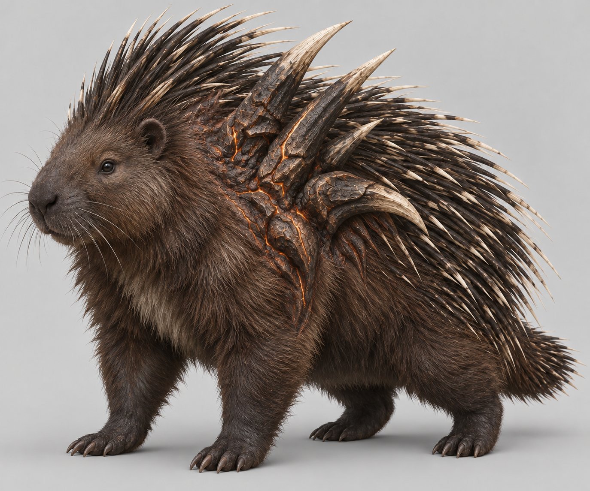
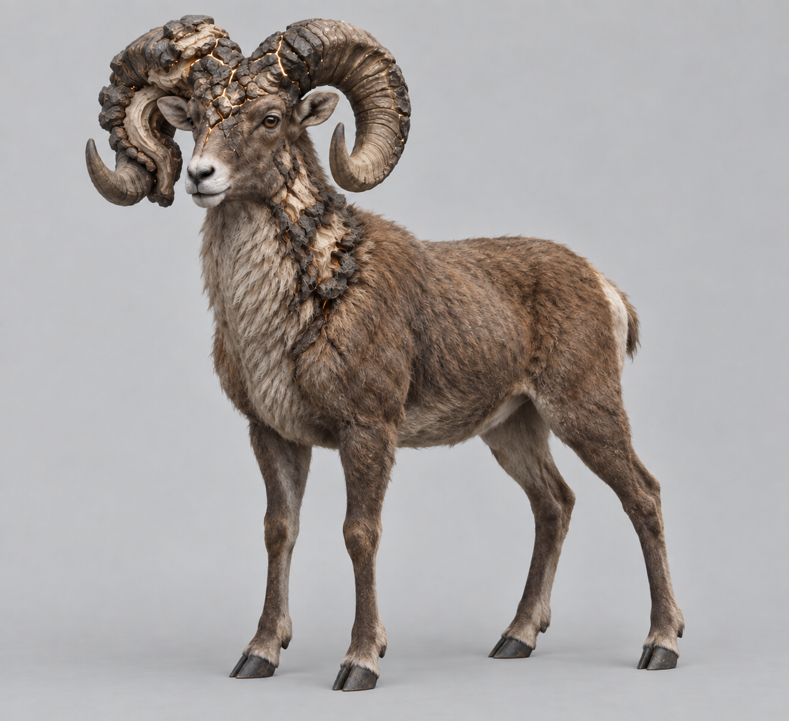
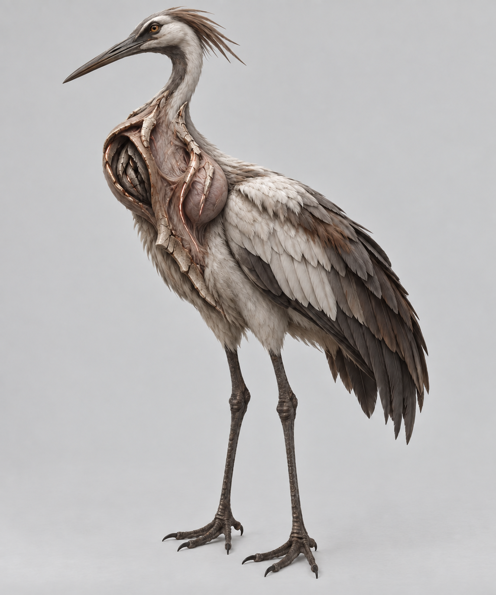
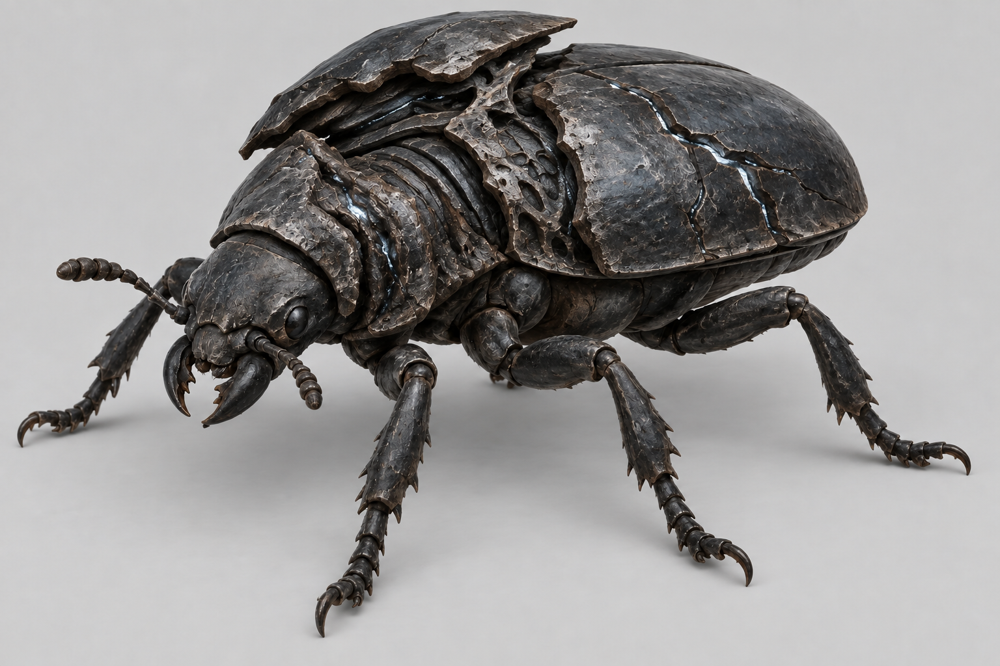
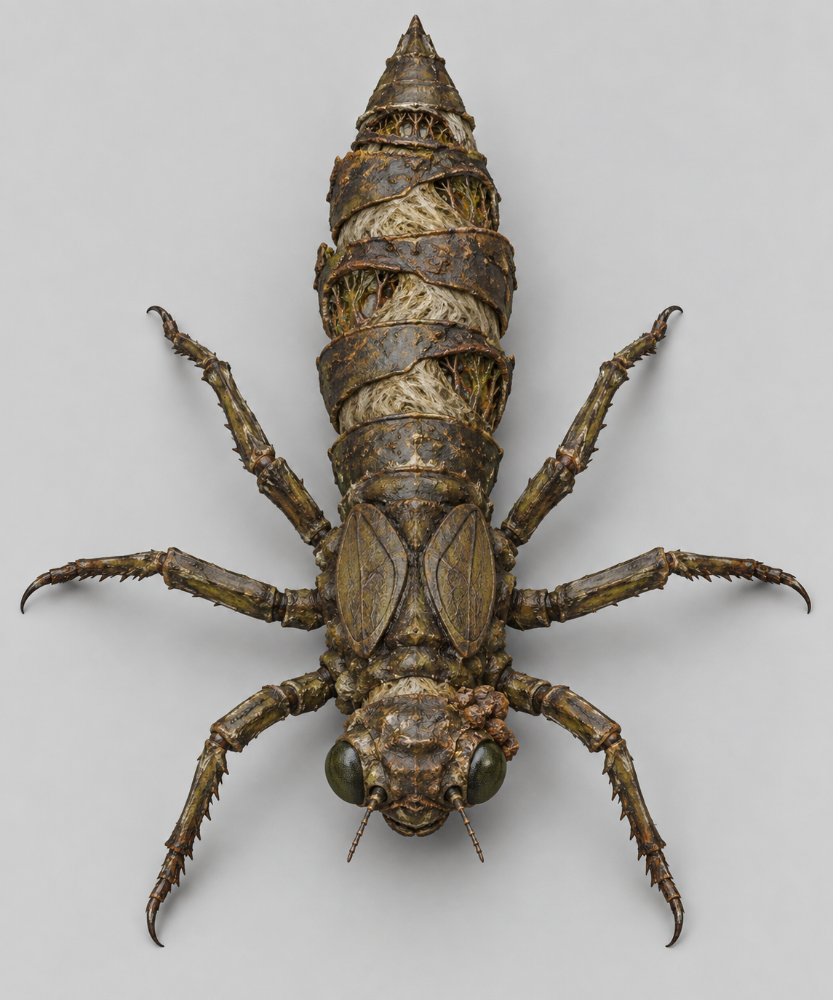
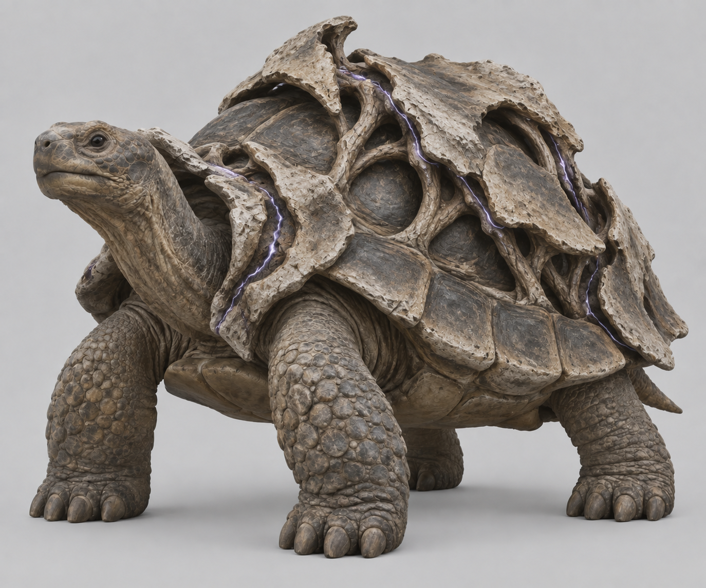

# Remaining animal mobs — concept and source selection

Owner-directed art work, 9 September 2026. The owner selected augmented animal
ancestry for the four remaining humanoid-looking regular mobs; the established
human Conservator stays human. All six animal directions below were approved
in chat. The armadillo Husk was rejected as too similar to the boar, and the
ram replaced it. The liked boar, wolf, stag and moth are preserved.

After ancestry approval, the owner asked for stronger grotesque augmentation
**now** and **more extra augments per era**. These are cumulative directions:
the stronger starting forms below leave room for later physical additions to
the same animals. A simple colour or scale change does not satisfy that intent.
Existing roles, damage, drops, bodies, three-era campaign and geography remain.

## Current stronger concepts

These are original built-in imagegen revisions of the ancestry-approved concepts.
Most are edits; the corrected nymph v04 uses a newly generated dorsal view.
They are image-to-3D source/design images, not renders of final game meshes.
The exact prompts and their reference roles are tracked in
[the production recipe](../../../../../tools/wroughtwild-roster/README.md).
The [work item](../../../../prototype/remaining-mob-art-2026-09-09.md) records
authority, era direction, generation/finishing boundaries and source evidence.

| Existing mob | Selected animal | Stronger source input | Earlier version |
| --- | --- | --- | --- |
| Cinder Archer | Porcupine | [v02: swollen, partly fused quill roots](cinder_archer-v02.png) | [v01](cinder_archer-v01.png) |
| Stone Husk | Bighorn ram | [v03: uneven horn buttress and neck callus](stone_husk-v03.png) | [approved ram v02](stone_husk-v02.png); [rejected armadillo v01](stone_husk-v01.png) |
| Shrieker | Crane | [v02: asymmetric exposed throat resonator](shrieker-v02.png) | [v01](shrieker-v01.png) |
| Gloom Crawler | Ground beetle | [v02: displaced shell and nested inner plates](gloom_crawler-v02.png) | [v01](gloom_crawler-v01.png) |
| Bog Lurker | Dragonfly nymph | [v04: explicit three-pair anatomy from above](bog_lurker-v04.png) | [v01](bog_lurker-v01.png); [v02: generated eight legs, rejected](bog_lurker-v02.png); [v03: still ambiguous, not generated](bog_lurker-v03.png) |
| Hollow Knight | Tortoise | [v02: irregular ossified shell layers](hollow_knight-v02.png) | [v01](hollow_knight-v01.png) |

## Generation provenance and interpretation

The adjacent manifest records every untouched PNG hash/dimension, prompt and
edit-parent image. Base imagery was generated with the built-in imagegen tool;
stronger variants were edited with that tool using the stated local reference,
except the nymph v04's newly generated anatomy correction.
Neither generation prompt nor text in an image grants gameplay scope.

Local TRELLIS uses the installed pinned v0.6.0 runtime, resolution 1024, seed 42,
BiRefNet and PNG export. Both cleaner and stronger sources are retained under
ignored `build/roster-art06/` for comparison. No mesh was generated from the
rejected armadillo. Raw generated GLBs have no rigs, animation or emission maps;
they require Blender finishing and authored scar masks before game integration.

The stronger concepts follow the owner's requested correction but have not yet
received a separate final mesh/art sign-off. Preserve clear version selection
and actual geometry evidence instead of treating the illustrations as proof
that all depicted cavities, fine tissue, asymmetry or light survived generation.
