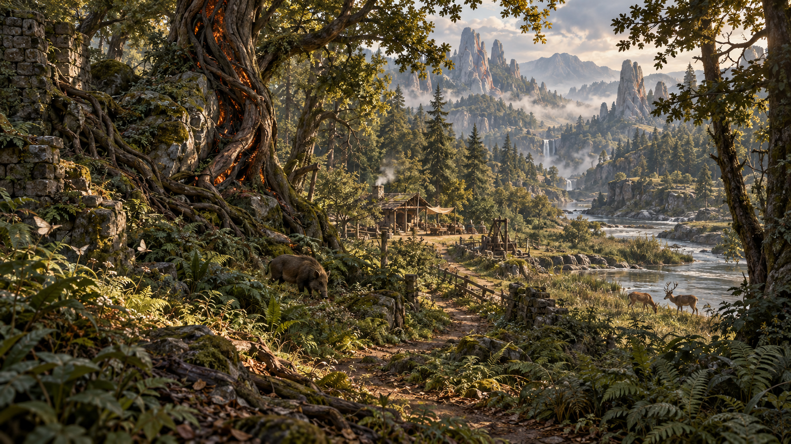
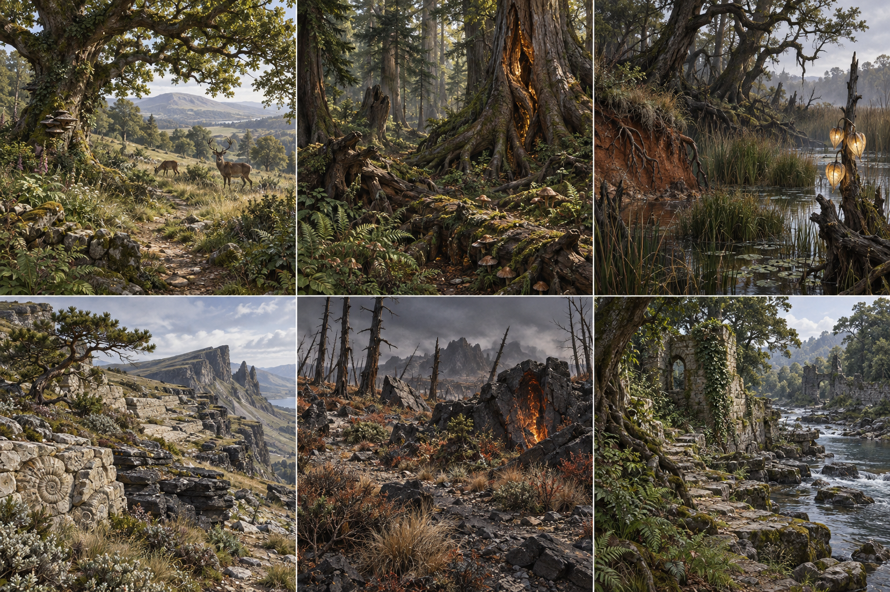
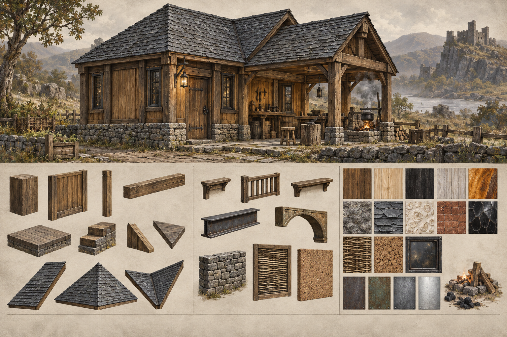
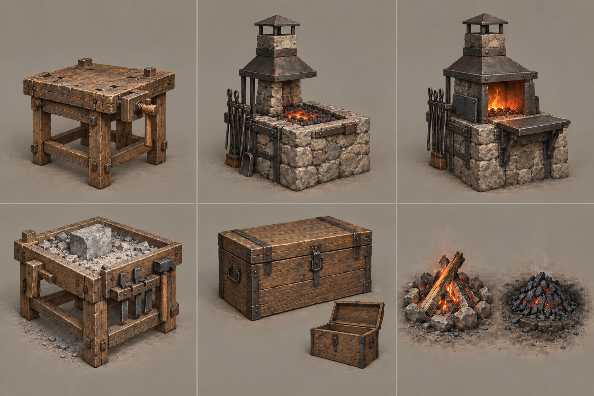
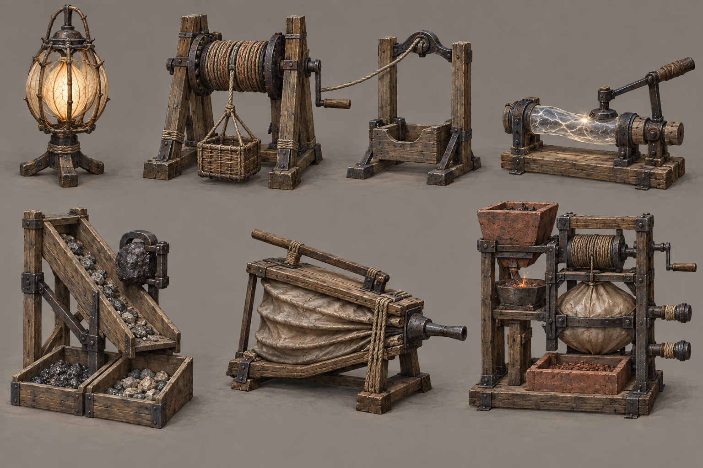

# Wroughtwild — the living frontier and the things we build

**ART-07A design proposals, 9 September 2026.** Five original built-in imagegen
boards respond to the owner's request for nature/world fullness and all current
craftable placeables. These are concept images, not screenshots, dimensioned
plans, generated 3D assets or owner-approved final designs.

The [work item and production sequence](../../../../prototype/world-and-placeable-art-2026-09-09.md)
define the scope. The [complete asset catalogue](asset-catalogue.md) provides
individual briefs and the [JSON inventory](asset-catalogue.json) records actual
IDs, dimensions, recipe/profile references and legal material pairings.

Coverage is complete for the current tables: 26 shapes, 19 material families,
273 legal pairings, 14 craftable kits and one forge upgrade. Ordinary profiles
have ten kits; four additional kits require a supported Living Frontier profile.
There are 22 current resource types, 33 supporting environmental art roles and
presentation briefs retaining all 16 overworld actor/host IDs. These counts
describe design coverage, not the number of finished game meshes.

## 1. The whole world should feel like a habitat

The original [ENV-002 wide shot](../../../references/environment/env-002-dense-frontier-original.png)
guided canopy overlap, foreground richness, layered distance and clearings.
Its exact landmark and geography were not copied. This concept gives nature
the first read, a small workshop the second, and a deep scarred host the local
discovery. Preserve the original reference unchanged.

Visual review: strong near/middle/far vegetation and readable river/home route.
The hero tree contains deep warm fractures; wildlife has plausible scale.
The generated deer/boar are habitat placeholders, not replacements for approved
augmented animals. The mountain range, river and cottage arrangement are an
aspirational composition, not a new seed, map or construction blueprint.

## 2. Regional fullness, with different silhouettes

Read left to right: meadow/woodland edge, Rootvault/oldgrowth, Lantern Fen;
then Glasswind/Shellcut, recovering Ember Wastes, river/ruin margin.

Visual review: the groups differ by canopy, ground shape, moisture and mineral
structure. Shellstone fossils and dark slate connect the quarry to building
materials. The wastes remains damaged but gains ground texture and surviving
plants. Fen Lanternheart forms are a proposed host shape needing comparison
with the actual staged core extraction. Fossil motifs should become less
regular/repetitive in production. These are scenic kit briefs, not six new biomes.

## 3. A gathered-material home

The cottage establishes timber joinery, rough low footings, layered roofing,
smoky fixed glazing and an approachable workshop front. The lower sheet shows
family samples, roof transitions, small trim and material structure.

Visual review: the style is coherent and the material families read beyond
colour. The illustrated roof hips/valleys are assembled examples; production
must use the actual one-cell forms. The exact arch is malleable metal, not a
new stone arch. Fine pieces, complete material permutations and the full wedge
are covered by the catalogue rather than separately readable diagrams here.
Incidental stool, fence treatment, pot and cottage lamp are scene dressing,
not new crafting recipes. Do not build new functionality from these details.

## 4. Compact stations and useful home pieces

Read left to right: workbench, basic forge, upgraded forge; mason's yard,
chest with small open-state inset, timber/charcoal fire setting.

Visual review: each workface is distinct; the forge tiers share the same base.
The initial sheet cropped the forge tops and is retained as
[v01 provenance](04-stations-and-home-v01.png); the current revision corrects
the framing. Clamps, tool rests and projecting working plates still require
precise fitting inside native bounds. The apparent pile of spare stones around
the mason's block is surface detail, not an extra inventory. Fire stone edging
is illustrative ground dressing, not an additional paid ingredient. Metal
details on the wood chest/bench must not imply a new iron cost or unlock.

## 5. Strange finds put to useful work

Top row: Lanternheart lamp, Thrumroot winch, ordinary landing, Stormglass lever.
Bottom row: Pullstone sorting chute, Ventlung bellows, pressure feeder.

Visual review: all seven silhouettes are present, supported and distinct. The
sorter's two trays and feeder's separate components are readable. Refine the
winch/feeder winding from rope-like fibres into recognisable recovered Thrumroot
in its individual production sheet. Stormglass shows a pulse instant, not
continuous free power. Feeder output must read as the existing fired bricks,
and its two attachment ports need exact native socket placement. The landing
cradle does not own a duplicate basket/inventory. These multi-object images
are art direction, not direct whole-board inputs for TRELLIS.

## Already approved and retained

The four coloured source → recovered material → fixture families are already
visually approved. Reuse their individual handoffs and state evidence:

- [Red host, salt and heat buffer](../../../../prototype/source-workshop-art-2026-09-09.md).
- [White host, mineral and connection](../../../../prototype/white-workshop-art-2026-09-09.md).
- [Blue host, flakes and delay](../../../../prototype/blue-workshop-art-2026-09-09.md).
- [Green host, resin and junction](../../../../prototype/green-workshop-art-2026-09-09.md).
- [ART-02 grove](../../../../prototype/affected-grove-2026-09-09.md),
  [approved small fauna](../../../../prototype/fauna-art-2026-09-09.md) and
  [approved ART-06C lifelines/porcupine face](../../../../prototype/roster-lifelines-2026-09-09.md).

## Provenance and checks

The built-in `image_gen.imagegen` tool generated five original boards and one
framing edit. No third-party generation service or new dependency was added.
Exact submitted prompts, source paths, selected/superseded status, edit parent,
PNG dimensions and byte hashes are in [image-manifest.json](image-manifest.json).
The adjacent prompt files retain exact UTF-8 submitted text. Every PNG is copied
unchanged from its generated original; the owner's references are untouched.

[Reproduction and validation](../../../../../tools/wroughtwild-world-design/README.md)
cover current table/native-kit completeness, dimensions, source hashes,
catalogue freshness, image integrity and local documentation links. This pass
passes the full catalogue check and verifies six PNG/prompt pairs, all six
unchanged local generator copies, the framing edit parent, the unchanged owner
reference and 23 local documentation links. This pass
does not run gameplay tests because it edits only design documents, concept
images and their catalogue/check tool. No runtime performance, collision fit,
animation or full-world art adoption is claimed.

Next recommended production: **ART-07B canopy and ground continuity**, reusing
the approved grove in an isolated environment kit, then expanding habitat and
building families in the bounded sequence recorded in the work item.
