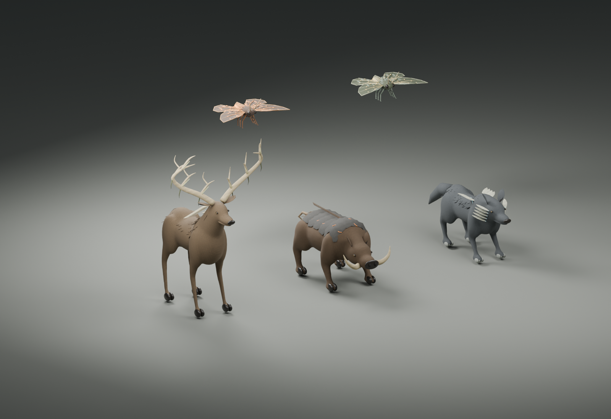
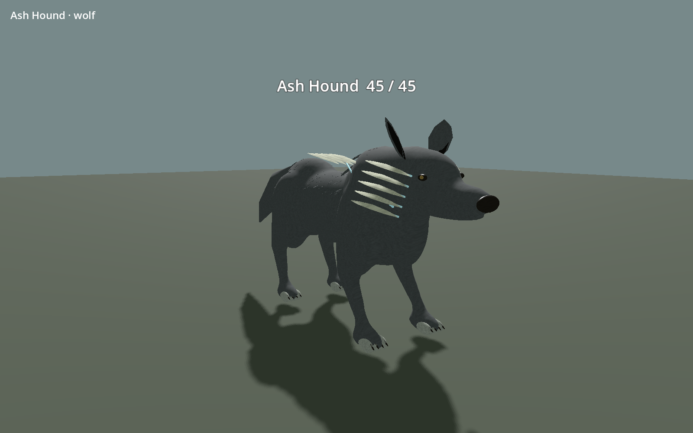
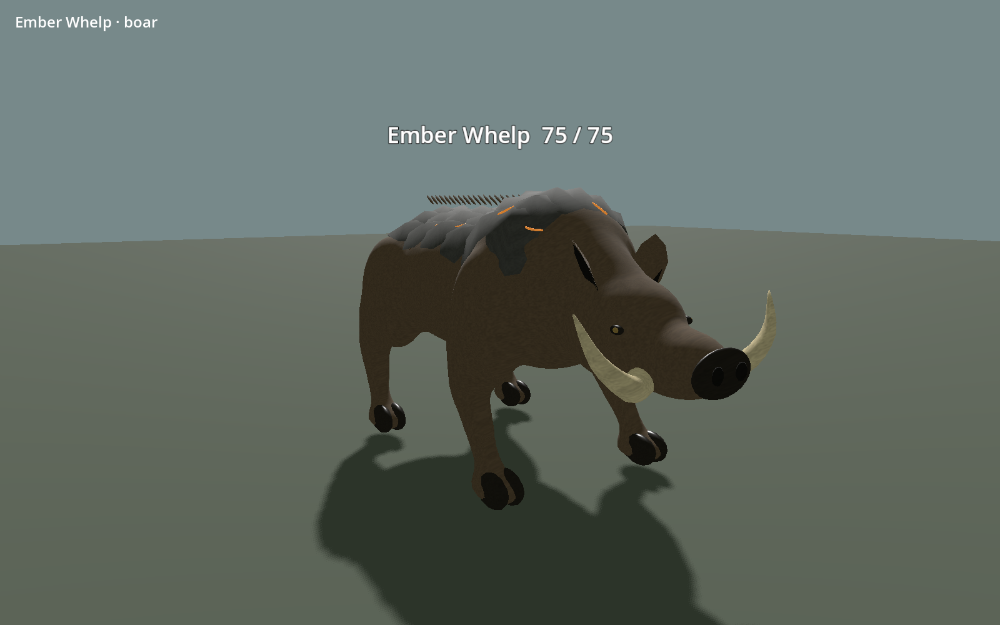
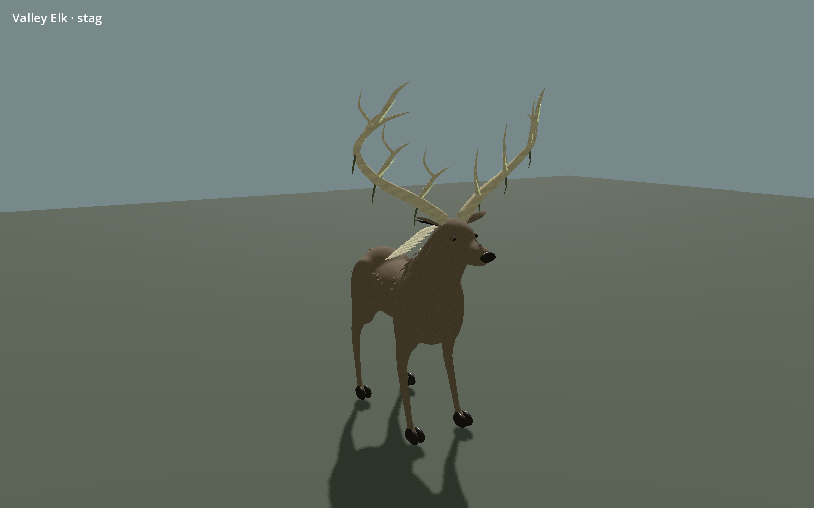
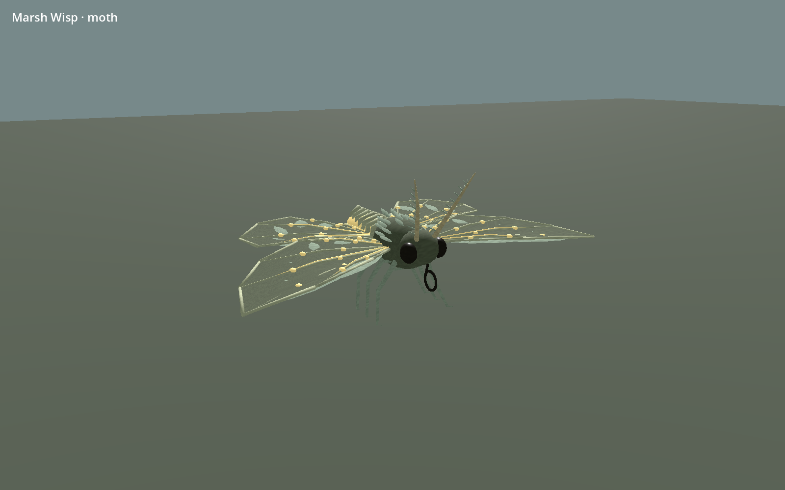
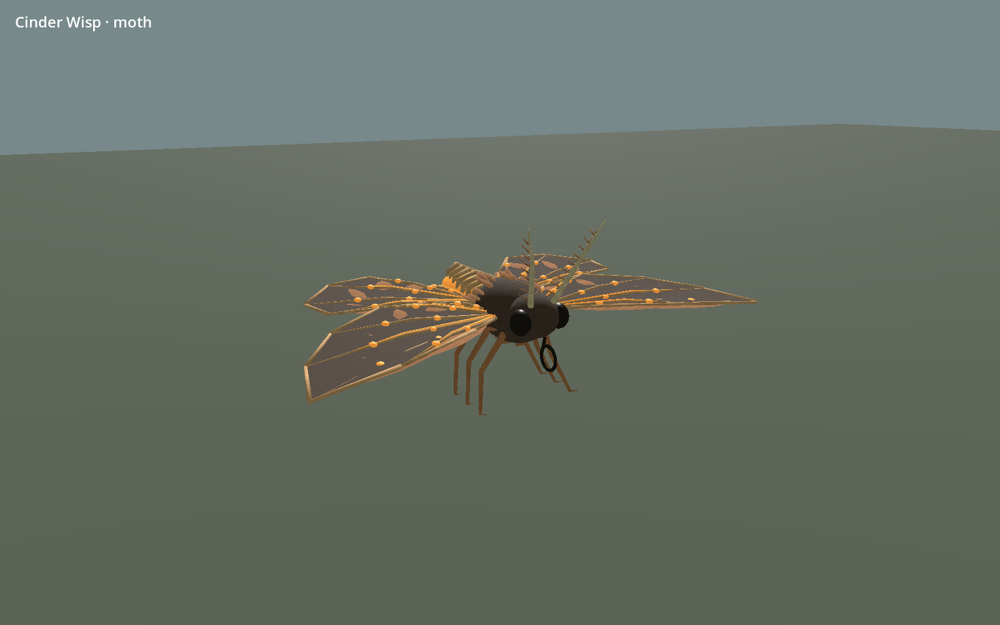
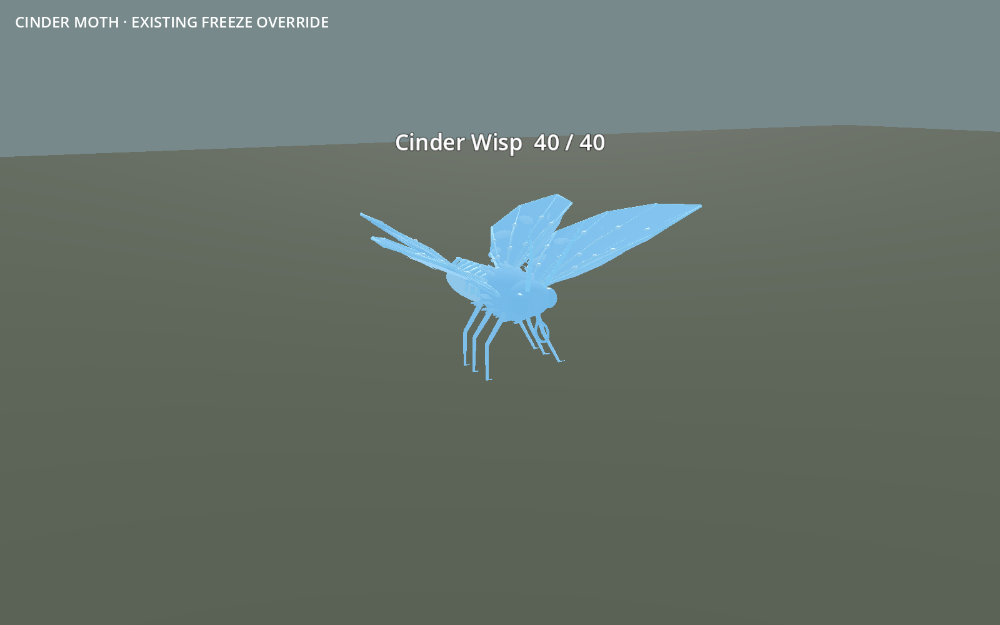

# Selected creatures: first Blender/game pass

Owner-selected animals, created locally in Blender 4.5.9 and adopted through
the existing Godot 4.5 enemy spawning path. These are actual mesh renders.
The richer [concept sheets](../../concepts/creatures/2026-09-07/README.md) remain
the finish target; modelling and integration do not imply owner acceptance of
this first 3D interpretation.

[Editable Blender master and instructions](../../../../art/blender/README.md).

## Geometry and material budget

Dimensions are the complete resting visual envelope in world metres, including
tails, tusks, wing tips and antlers. They are not new gameplay sizes or hitboxes.

| Family | Animal | Triangles | Bones | Width × height × depth |
| --- | --- | ---: | ---: | --- |
| Ash Hound | Wolf | 19,416 | 17 | 0.65 × 1.35 × 2.71 m |
| Ember Whelp | Boar | 21,070 | 17 | 1.00 × 1.26 × 2.40 m |
| Valley Elk | Stag | 24,466 | 17 | 1.91 × 3.29 × 2.19 m |
| Marsh Wisp | Moth | 11,236 | 21 | 1.40 × 0.57 × 0.81 m |
| Cinder Wisp | Moth | 11,236 | 21 | 1.40 × 0.57 × 0.81 m |

Each family uses one material surface with embedded 512px albedo, roughness and
emission atlases. Normal emission is restricted to growth channels/reservoirs;
freeze, hit and burn use the existing whole-body override. Godot's established
embedded-texture import mode avoids loose extracted PNGs as source dependencies.
The adapter caches a shared mesh per family and conserves the sum of quantised
16-bit skin weights. Existing seven other actor skins keep the legacy path.

## Actual Godot views

The full local review under `build/augmented-beasts/godot` also contains six
walk samples per mammal, hostile windup/release and eight moth wing phases.
The review uses real Enemy nodes on an isolated floor. It is not a new world
scene or a claim that landscape density has been completed.

## Verification

[Machine-readable evidence](verification.json) records export hashes, visual
bounds, source hash and fixture results. An independent Blender rebuild
reproduced all five geometry hashes and all five GLBs byte for byte. The packed
master was reopened and checked for five armatures and embedded file textures.

Six headless suites passed: augmented beasts 167, actor/craft regression 200,
creature motion 100, combat presentation 65, general presentation 33 and ranged
fairness 53: **618 checks, zero failures**. The rendered beast fixture passed
**204 checks**, including capture output. Freeze holds all joints; stagger
cancels follow-through; joints/UVs/bind reconstruction, supporting-foot plane,
status priority, elite scale and reconfiguration are covered. Native save data,
stats and combat clocks are checked unchanged by the visual work.

A 60-actor mixed group was sampled for 90 frames, retaining the last 60. On the
local RTX 5090 at 1600×1000 with Forward+, the recorded pose and frame timings
are in the JSON. This small isolated floor is not a normal-world benchmark,
minimum-spec certification or a long performance soak. The environment emitted
unrelated certificate-store and occasional shader-cache write warnings; the
fixtures and rendering completed. No assets or gameplay depend on that cache.

## Remaining finish limits

These are first playable models. Faces and coats remain simplified compared
with the concept art; fur cards/tufts, shoulder plates and wing ornaments can
show small intersections or aliasing at close range. Unique fur/scar bakes,
more naturalistic anatomy and hand-authored LODs are future polish. The runtime
adapter rebuilds its shared surface and does not carry the importer's generated
LODs across. The local sole correction is not terrain-aware foot IK; gait may
slide on uneven ground. Blender preview clips are motion studies, while Godot
uses the established gameplay clocks.

All five existing movement/hurt capsules remain radius 0.35 m, height 1.3 m.
The complete visuals exceed that capsule radially by approximately 1.11 m
(wolf tail), 1.01 m (boar), 0.95 m (stag) and 0.45 m (moths). Appendages are
decorative and can overlap nearby scenery. Any change to reach, collider shape
or targetable wings/antlers needs a separate gameplay decision.

Different coloured leyline influences now have an accepted place in the visual
lore and authoring profiles. Dynamic exposure, new damage types, breeding,
mixed influences and additional creature variants were not implemented here.
