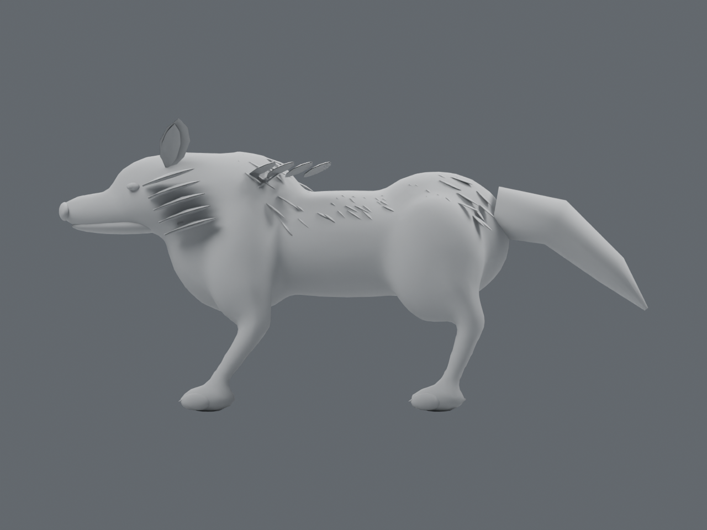
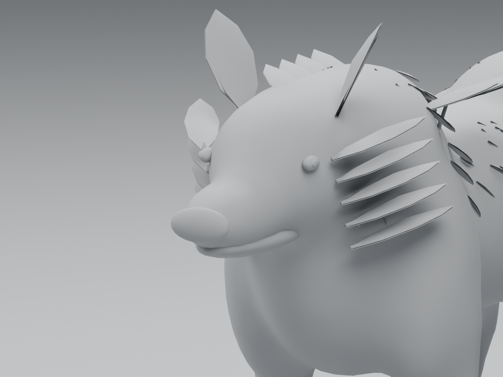
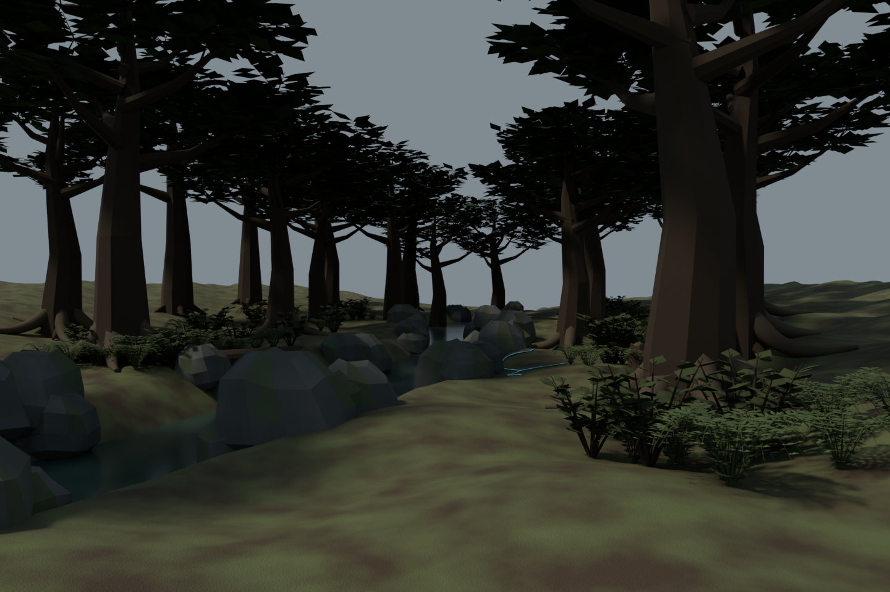

# Leyline art study: baseline and first composition trial

8 September 2026. **Preparation and diagnostic evidence, not finished new art.**
[Approved scope and next checkpoints](../../../prototype/leyline-art-studies-2026-09-08.md).

The owner likes the moth and the selected concept designs but rejects the
current mammals' appearance. They specifically preserve ordinary animals made
fantastical by the same impact-borne leyline currents/scars visible in the land.

## Wolf: actual baseline geometry

These are Blender renders of the existing `ash_hound.glb` from `dc64aea`, **not
a replacement wolf**. Neutral material overrides remove texture and emission
so the anatomy can be compared against the selected concept. The source skin
contains 19,416 triangles. Blender's imported bone-display helper is excluded
from bounds/rendering; it is not part of the animal.






Additional actual views: [front](wolf-baseline/clay-front.png),
[three-quarter clay](wolf-baseline/clay-three-quarter.png),
[three-quarter materials](wolf-baseline/material-three-quarter.png).
[Input hash, geometry and cameras](wolf-baseline/report.json).

The untextured views expose the broad rounded muzzle, bead eyes without a fitted
socket/lid structure, smooth inflated shoulders/haunches, simplified limb joints
and flat projecting cheek plates. More glow or a larger texture will not fix
those forms. A new starting mesh has **not** been created or selected in this
checkpoint. The owner subsequently approved an image-to-3D experiment; see the
[completed generation/Blender experiment](wolf-image3d/README.md). The 6 Lite
candidate now has a preserved raw export, editable Blender copy, matched clay
renders and verified handoff. It improves the starting animal but remains below
the concept's finish target; no game replacement has occurred.

The review script accepts an optional baseline report. With it, later candidates
reuse the exact cameras, targets and orthographic spans rather than fitting each
model independently and concealing a scale/proportion difference. Candidates must
first be aligned to the documented metre/+Y-front/+Z-up convention.

## Woodland: composition trial using existing source meshes

This is a new isolated Blender arrangement of the current tree, boulder, shrub,
fern, deadfall and stump assets. The river bank, roots and mark below are review
geometry only. It is **not a Godot screenshot or a change to saved geography**.



Other views: [with distance mist](woodland-trial/river-approach.png),
[near bank/current](woodland-trial/bank-and-current.png),
[layout overview](woodland-trial/layout-overview.png).
[Source hashes, exact placements and cameras](woodland-trial/report.json).

**Agent visual assessment: below the intended standard; do not adopt.** The
composed banks and connected plant groups provide a useful test setting, but
the repeated straight trunks, angular foliage, rounded rocks and sparse ground
detail remain too conspicuous. The visible river corridor is too narrow and
its bank rocks read as repeated large props. The neutral-light comparison shows
that mist alone does not address the source-asset shortcomings.

The narrow current has dark grounded margins and is much quieter than a
whole-object glow. It is still a surface ribbon: it does not demonstrate a
sculpted recessed scar through a tree/animal, and it must not be presented as a
finished material treatment. The next host study needs actual broken/raised
edges, exposed interior and a branching path integrated with its surface.

## Reproduce and edit

Use the installed Blender 4.5.9 executable. Paths below are relative to the
repository; replace OUTPUT with a new ignored directory on each run.

```text
blender --background --python-exit-code 1 --python tools/wroughtwild-blender/scripts/review_wolf.py -- game/assets/authored/mobs/ash_hound.glb OUTPUT/wolf
blender --background --python-exit-code 1 --python tools/wroughtwild-blender/scripts/review_wolf.py -- CANDIDATE.glb OUTPUT/candidate docs/art/leyline-studies/2026-09-08/wolf-baseline/report.json
blender --background --python-exit-code 1 --python tools/wroughtwild-blender/scripts/study_leyline_woodland.py -- . OUTPUT/woodland
```

Each produces an editable `.blend`, actual PNG renders and a JSON report in its
output directory. The initial local editable review scenes are at
`build/leyline-art-study-20260908/wolf-baseline-v02/wolf-review.blend` and
`build/leyline-art-study-20260908/woodland-v03/leyline-woodland-study.blend`.
The recipes and selected evidence are tracked; these unaccepted generated
review scenes are not adopted source masters.

Authoring controls and their purposes are in
`tools/wroughtwild-blender/leyline_woodland_study.json`: camera framing, deliberate
placements, plant-group spread, palette, narrow-current intensity, sky fill,
sunlight, atmospheric density and offline render quality. They do not configure
runtime density, budgets or resource amounts.

This initial baseline/composition checkpoint used only installed Blender and
repository assets. No external upload, image-to-3D job, new package, purchase
or game replacement had occurred at that checkpoint. The subsequent
[Meshy experiment](wolf-image3d/README.md) records the authorized upload and
generated candidates separately. Original references, the liked moth, normal
saves, portable playtest
packages and game assets remain intact. Runtime animation, scene streaming and
performance have not been evaluated for this isolated composition.

## Checks

[Verification](verification.json) records 44 passed evidence/source checks and
[eight saved-scene reopening checks](reopen-verification.json). Both editable
scenes reopen with their required objects, cameras and available textures. The
six repeated wolf renders use identical cameras and have exactly identical
decoded RGBA pixels; encoded PNG files differ, so file-byte equality is not used
as a visual oracle. Rig-display helpers are excluded from the measured skin.
The six nature-source hashes and existing wolf GLB are unchanged. Script parsing,
finite placements, image dimensions and `git diff --check` pass.

No gameplay test suite was rerun because no runtime code, game asset, gameplay
tuning or save contract changed. These checks establish reproducible inspection,
not an attractive replacement model or an accepted woodland scene.
