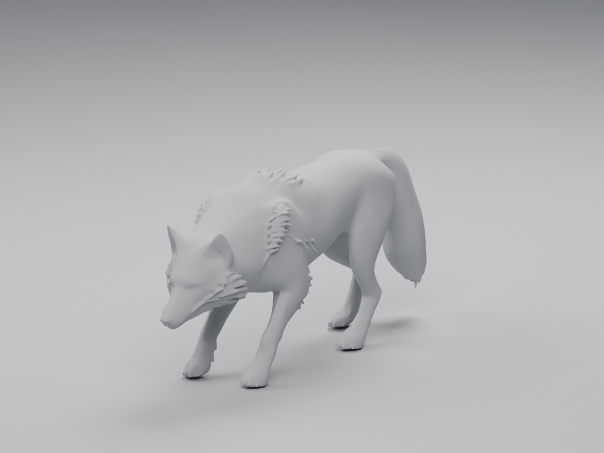
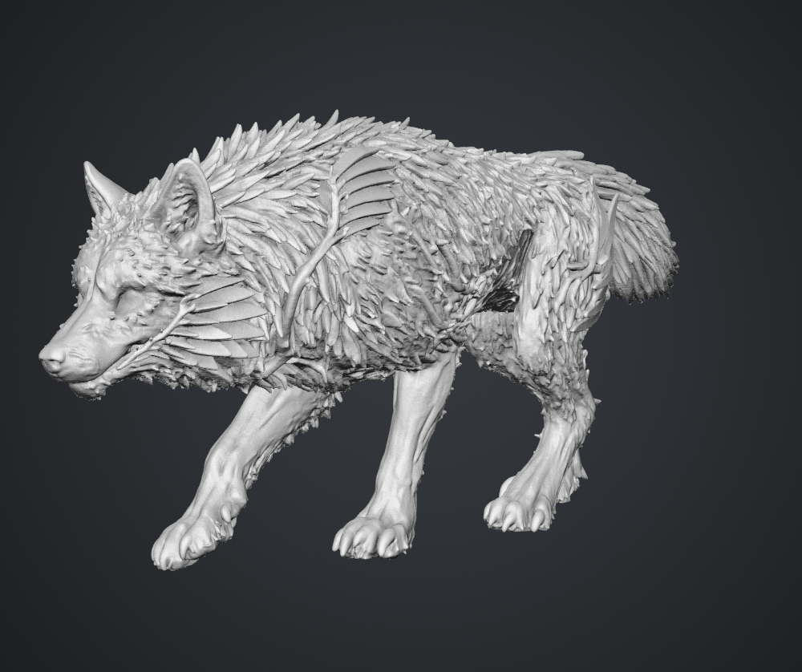

# Wolf image-to-3D experiment — Blender checkpoint complete

8 September 2026. **The bounded generation/import/inspection experiment is complete.**
The 6 Lite wolf has been imported, normalized, lightly corrected for shading and
reviewed in Blender. **It is a better starting shape, but is not accepted final art
or an adopted game asset.** The broader wolf/woodland quality pass remains open.

## Actual Blender result



[Original wolf with the exact same camera](../wolf-baseline/clay-three-quarter.png).
The candidate's lowered pose differs from the original's raised head. Uniform
scale uses the concept's proposed 1.05 m withers height; camera fitting does not
hide the difference. The candidate's total bounds are about 0.57 × 2.40 × 1.05 m.
These are review dimensions, not changes to gameplay size or collision.

Matched views: [side](blender-review/clay-side.png), [front](blender-review/clay-front.png),
[rear](blender-review/clay-rear.png), [original head camera](blender-review/clay-head.png).
The original head camera crops this lower pose. These additional
[head](blender-review/head-lowered.png) and [underside](blender-review/underside.png)
views have explicitly different cameras; they are not matched comparisons.
[Audit](blender-review/audit.json), [matched cameras](blender-review/report.json),
[extra cameras](blender-review/extra-views.json), [verification](blender-review/verification.json).

| Brief requirement | Observed in the actual 6 Lite mesh |
| --- | --- |
| Natural canine head and long muzzle | Much better taper and skull/ear silhouette than the old procedural wolf; eyes are weak surface impressions, without separate eyeballs or useful lids. |
| Separate lower jaw and bite motion | Not supplied. The muzzle is closed and fused; there is no rig or mouth interior suitable for a bite. |
| Chest-to-flank transition, four jointed legs and paws | More convincing overall proportions and readable hocks; four distinct limbs and paws survive. Dense triangulation and the crouched pose still need deformation work. |
| Coarse charcoal/silver coat and bushy tail | Most coat relief is absent. Broad smooth surfaces and a solid tail mass do not meet the fur target. |
| Layered, rooted jaw/shoulder lamellae | Fans and roots survive in geometry, but some layers merge into thick webbed forms. They cannot currently move independently of the skin. |
| Recessed narrow scars with weathered edges | Raised branching ridges survive. Recessed channels, weathering and emission materials are not present. |

**Assessment:** image-to-3D is useful for obtaining a more coherent starting
animal. It did not supply a finished character, clean animation topology or the
concept's surface treatment. The free 6 Lite model loses too much detail to be
accepted as-is. The next bounded art pass should resolve eyes/mouth, distinct
plate construction and fur masses, then demonstrate a head turn and jaw opening
before texture polish. The detailed Meshy 7 model has now also been reviewed in
the owner's larger screenshot below; its GLB has not been locally evaluated.

## Meshy 7 owner comparison



The owner supplied this 1000 × 838 screenshot on 8 September. It is preserved
unmodified, SHA-256
`0a7a096c88e32f58afed9028a0a1bbb46c50f0a5ce2e9856ef1ec800e00514e0`.
This is service-view evidence, not a Blender render or a matched-camera test.

**Visually, 7 is substantially closer to the selected concept than 6 Lite.**
The muzzle, inner ears, paw/toe forms and thin layered cheek/shoulder shapes
survive much more clearly. It reads as a transformed wolf before needing glow,
which supports the intended ordinary-animal/leyline relationship.

It still falls short in specific ways: the densely overlapping pointed coat
reads partly as feathers or scales; the torso is heavy relative to the lean
concept; the tail appears short; and the underbelly has noisy merged detail.
Raised vein-like ridges need to become the brief's narrow recessed current scars.
Clay removes material distinctions, so colour, roughness and emission cannot
be assessed here. Camera and pose may contribute to the apparent proportions.
The screenshot cannot establish separate eyes/jaw, mouth interior, clean hidden
surfaces, usable topology, UVs, rigging or deformation. The earlier service
viewer reported 1,947,834 triangles; that is a high-detail source to rebuild/bake
from, not an approved runtime mesh budget.

The useful next step is to compare one alternative using the same input and
actual exported geometry, then choose a starting mesh for anatomy, separate
parts, retopology and a head-turn/bite test. See the dated
[lower-cost pipeline options](pipeline-options-2026-09-08.md). Those alternatives
have been researched, not generated or installed.

## What changed and what was checked

The raw export is preserved byte-for-byte. On a separate review copy, the recipe:

- Rotates 180 degrees around Blender Z: raw inspection showed the nose pointed
  -Y rather than the project's +Y review convention.
- Applies uniform scale 1.2622303957, centres horizontally and grounds the mesh.
- Enables smooth shading and retains normal breaks at folds above 55 degrees.
  No vertex smoothing, decimation, remeshing or anatomical alteration was done.

The source contains 42,489 vertices and **85,014 triangles**, versus 19,416 in
the original wolf. It is one connected mesh with zero boundary/non-manifold
edges, loose vertices/edges, inconsistent winding edges or effectively zero-area
faces. Those checks do not rule out every self-intersection or certify anatomy.
There are no UV layers, materials, textures, armatures, vertex groups, shape keys
or animation clips. Rigging this mesh directly would not resolve missing parts.

**31 checks passed**, including actual GLB reimport, saved-candidate and saved-review
reopening, surface-vertex preservation within one micrometre, eight rendered PNGs,
exact camera equality for all six baseline views and unchanged game-wolf/moth/
original-master hashes. A real review-helper issue was also corrected: neutral
clay now survives saving and reopening after the last material view. Runtime
tests were not rerun because no game asset, code, tuning or save contract changed.

## Source and reproducibility

[Preserved raw source and license](../../../../../art/blender/studies/meshy-wolf-2026-09-08/README.md).
Raw SHA-256:
`be617990bd397254ead88d5a59ea002c27c852dca60048a41c527bbdb723baff`.

Local editable candidate:
`build/wolf-image3d/normalized-v02/wolf-candidate.blend`.
Local editable review scene:
`build/wolf-image3d/matched-v03/wolf-review.blend`.
These generated review scenes are not adopted source masters.

Run with installed Blender 4.5.9. Replace RAW with the preserved source above,
and OUT with a fresh ignored directory. CONFIG is
`tools/wroughtwild-blender/meshy_wolf_review.json`; it explains every review
setting and is pinned to the inspected raw file's hash.

```text
blender --background --python-exit-code 1 --python tools/wroughtwild-blender/scripts/prepare_meshy_wolf.py -- RAW CONFIG OUT/prepared
blender --background --python-exit-code 1 --python tools/wroughtwild-blender/scripts/review_wolf.py -- OUT/prepared/wolf-normalized.glb OUT/matched docs/art/leyline-studies/2026-09-08/wolf-baseline/report.json
blender --background --python-exit-code 1 --python tools/wroughtwild-blender/scripts/extra_wolf_views.py -- OUT/matched/wolf-review.blend CONFIG OUT/details
blender --background --python-exit-code 1 --python tools/wroughtwild-blender/scripts/verify_meshy_wolf_review.py -- RAW OUT/prepared OUT/matched OUT/details CONFIG OUT/verification.json
```

## Generation provenance, credits and export history

[input-three-quarter-v01.png](input-three-quarter-v01.png) is a reframed built-in
imagegen edit of the [selected concept](../../../concepts/creatures/2026-09-07/rimejaw-wolf-v01.png),
using the [saved prompt](input-prompt.txt). It removes other animals and labels;
it is not a pixel-exact crop or a Blender render. Input SHA-256:
`603da99abb16c5a34295ab8e5bf8117cd0fea05bb0f8b9cb24c9765eb80b2126`.

The owner approved the experiment, then explicitly resolved the initial
automatic-review upload rejection: "Signed in - you may upload the wolf image
to Meshy". Both actual meshes remain in the [Meshy workspace](https://www.meshy.ai/workspace).

| Model | Task ID | Viewer triangles | Credits |
| --- | --- | ---: | ---: |
| Meshy 7 | `01a080b3-b963-748c-8467-e3f19ef5a9da` | 1,947,834 | 20 |
| Meshy 6 Lite | `01a080b5-1ec0-7004-9ae0-25884c6adbd3` | 85,014 | 10 |

Meshy 7 used High Detail, Standard, one image, Texture off, Image Enhancement
off, Split off and Pose off. 6 Lite used the same image with Pose off; its UI did
not expose the 7-specific controls. Both used CC BY 4.0. The starting balance
was 100 credits, a Day 1 reward automatically added 30, and generation spent 30.
The final observed balance was 100. No purchase was made.

[7 thumbnail](meshy7-service-thumbnail.webp) and
[6 Lite thumbnail](meshy6lite-service-thumbnail.webp) are small service previews.
The detailed 7 viewport appeared to retain far more fur relief, with a compact/
heavy side silhouette and short-looking tail; this remains a preliminary viewer
assessment, not the locally inspected file.

[Free-plan rules](https://help.meshy.ai/en/articles/15696428-what-is-included-on-the-free-plan)
allow 6 Lite downloads; Meshy 6/7 exports require a subscription. Credits alone
do not unlock them. Two automated 6 Lite exports stalled in the in-app browser
while reducing the allowance from 10 to 8; retries stopped. The owner subsequently
obtained the GLB and supplied it in `build/wolf-image3d/`. The initial browser
failure cause remains unknown, but the local file handoff is now resolved.

Model created with [Meshy](https://www.meshy.ai/) — [CC BY 4.0](https://creativecommons.org/licenses/by/4.0/).
The Blender renders depict that mesh with the review modifications described
above. Preserve attribution with redistributed source or derivative assets.
The game wolf, moth, original master, normal saves and running playtest remain
unchanged. Woodland and Living Frontier work are separate.

## Source publication approval

Automatic approval review initially rejected staging the raw GLB under
`art/blender/studies`, interpreting the generated/imported-engine-artifact
restriction as covering this study source. The owner then explicitly answered
yes to committing the raw Meshy wolf as an intentional art source, adding:
"You have approval for automatic staging and pushing" (8 September).
That scoped approval covers this preserved source and experiment evidence.
Generated review builds, caches and engine import artifacts remain excluded.
Local commit and remote push results are reported separately after publication.
