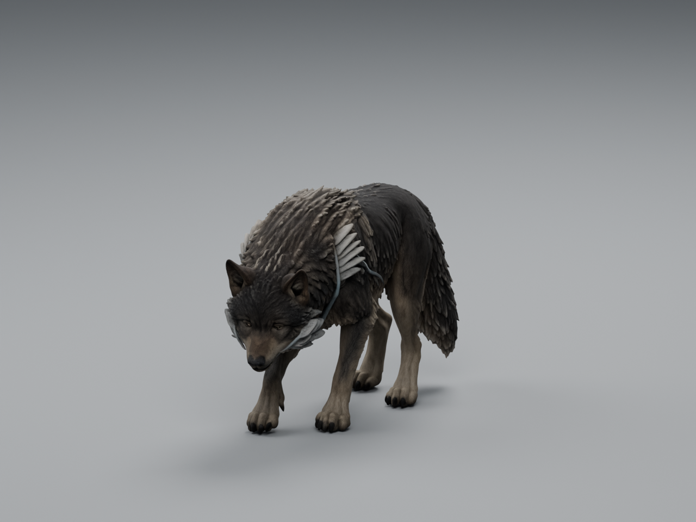

# Local TRELLIS.2 wolf trial — 8 September 2026

**Status: local installation and bounded wolf experiment complete. Art not adopted.**
The owner's direction was "Lets try the local trellis - get that going" after
the [Meshy comparison](../README.md). A complete textured wolf now generates on
this machine without hosted credits or uploading the input. Trellis Studio was
launched and its loopback server responds. The actual wolf was generated through
the logged CLI, imported into Blender, rendered and reopened for verification;
the GUI's generation controls were not separately exercised.

## Result and visual judgement

This is a useful local starting point for further art work. Compared with the
actual Meshy 6 Lite export, the coarse coat, tail, toes and shoulder/jaw plates
retain substantially more shape. The animal still reads as a wolf with the
material removed. That improvement also costs more geometry: **295,880 triangles**
versus Meshy 6 Lite's 85,014 and the existing game wolf's 19,416. It is not a
finished animation or runtime asset.

The current brief still fails in several visible places:

- The long pale branches stand proud of the coat like cables, especially below
  the shoulder. They need to become narrow recessed scars with weathered edges.
- The eyes depend heavily on the texture; the clay face has shallow, indistinct
  eye forms. The mouth has a lip crease but no demonstrated usable jaw opening,
  teeth or independent lower jaw. There is no rig to test a bite.
- Fur forms alternate between pointed scales and smooth patches, particularly
  on the hips. The shoulder remains bulky and the pose is hunched. More polygons
  alone would not resolve those design issues.
- Paw bottoms are flat and simplified. The underside is plausible from this
  inspection, but no self-intersection or deformation certification is implied.
- The generated material has base colour and metallic/roughness textures, with
  no authored emissive scar channel or normal map. The reference's luminous
  currents still need deliberate material work.

The owner-supplied Meshy 7 screenshot shows denser surface detail, but its raw
mesh is still unavailable locally. This comparison cannot establish which one
animates better. TRELLIS is a stronger detailed starting source than the tested
6 Lite geometry; it is not evidence that the full wolf brief is now satisfied.

Next art checkpoint: use this candidate to review the silhouette, then correct
eyes, jaw, coat grouping and embedded scars in Blender before retopology, baking,
rigging and a movement test. Broad roster replacement remains outside this trial.

## Installation and measured run

WSL is not installed. The selected route is the portable CUDA build of
[trellis.cpp v0.6.0](https://github.com/pwilkin/trellis.cpp/tree/v0.6.0), a
community Windows implementation of Microsoft's TRELLIS.2 pipeline, using
unquantized 16-bit GGUF conversions. It is not the official Python implementation;
the port's advertised parity is not independently established here.

Release target commit: `06fc9000719c912ddc4929d21db075972c26ac3e`.
The verified release binary reports build commit
`16f3109e82f3922033bfa62b83c42899678b7b6f`, built `2026-08-21T08:39:09Z`.
These are recorded separately; package checksums pin the actual installed build.
Model repository: `ilintar/trellis2-gguf`, revision
`a57397bd3d351599d9729fc144b3f87c3f87d65b`.
[Pinned files/checksums](../../../../../../tools/wroughtwild-trellis/install-manifest.json)
and [setup/use instructions](../../../../../../tools/wroughtwild-trellis/README.md).

| Checkpoint | Observed result |
| --- | --- |
| Hardware | RTX 5090, compute capability 12.0, 32606 MiB reported by runtime; driver 591.86. This is installed VRAM, not measured peak usage. |
| Downloads | Both release archives and all ten model files passed size and SHA-256 checks; about 17.2 GB downloaded. Full-file transfers stalled; the isolated Hugging Face chunked client completed them. |
| GPU smoke | Original input background removal completed in 6.2 seconds with `--require-gpu`; paws, tail and pale plates survived the inspected cutout. |
| Full wolf | Same exact Meshy input, seed 42, resolution 1024, BiRefNet, PNG textures, eight CPU threads, required CUDA. CLI reported 182.4 seconds; wrapper wall time 182.86 seconds. |
| Final raw GLB | 23,587,696 bytes; 295,880 triangles; 238,576 exported vertices. Blender imports 238,570 vertices, retaining all triangles. |
| Textures | Two embedded 2048×2048 PNGs: base colour and metallic/roughness. One material, one UV layer; no armature, weights or animation. |
| Desktop | Trellis Studio launched outside the restricted agent sandbox; server health returned `ok` at `127.0.0.1:8743`. The restricted launch had failed during native window initialization. |
| Blender handoff | Blender 4.5.9 LTS: normalized candidate and review reopen; GLB reimports; 32 checks pass, including zero measured vertex roundtrip error and byte-identical embedded PNGs. |
| Helpers | PowerShell/Python syntax, JSON parsing and local documentation links pass. Isolated archive fixtures confirm normal nested extraction and rejection of a parent-directory traversal entry. |

The earlier geometry-only diagnostic took 84.0 seconds and emitted 8.49 million
triangles. In this build, `--no-texture` skips the final remeshing/simplification
path. Its visibly noisy raw surface is not the finished result shown above.
The complete run remeshed and simplified that surface, removed small components,
and baked the final atlas. Its log reports **two uncharted faces retained with
point-collapsed UVs**. That limitation is recorded, not treated as clean UV proof.

## Evidence and reproducibility

- [Generation record](generation.json): original export-time status is preserved;
  [subsequent verification](verification.json) records the completed Blender review.
- [Import/normalization audit](audit.json), [six matched cameras](report.json),
  [supplementary cameras](extra-views.json).
- Clay: [side](clay-side.png), [front](clay-front.png), [rear](clay-rear.png),
  [three-quarter](clay-three-quarter.png), [baseline head camera](clay-head.png).
  The lowered pose needs the separately labelled [head close-up](head-lowered.png)
  and [underside](underside.png) for a useful detailed inspection.

All six baseline cameras, lights and rendering settings use the existing review
helper. Only a documented uniform rotation, scale and translation align the
candidate to approximately +Y front and 1.05 m maximum height; the generated pose
and anatomy are retained. There is no added smoothing, remeshing or decimation in
the Blender normalization step. UV seams split touching vertices, so the audit's
many connected components/boundary edges do not by themselves mean detached
anatomical pieces. No welding was applied to conceal those counts.

Blender warned that multiple image nodes shared a texture when exporting. Both
PNGs are byte-identical after export, with their material roles preserved. The
source left sampling filters unspecified; Blender wrote linear/mipmapped-linear
filters explicitly. The [verification record](verification.json) preserves both
sampler descriptions. A denied optional Blender extension-cache write did not
prevent the isolated imports, renders or reopen checks.

Local working files (intentionally ignored, not game dependencies):

- `build/trellis-local/output/wolf-1024-seed42-20260908-221914-245/wolf.glb`
  and `generation.log` — untouched finished source and processing log.
- `build/trellis-local/normalized-review/wolf-candidate.blend` — editable candidate.
- `build/trellis-local/normalized-review/wolf-normalized.glb` — oriented export.
- `build/trellis-local/matched-review/wolf-review.blend` — lighting/camera review.

Raw GLB SHA-256: `584b615a050af649602c2b09aeffbb649f4727f4fc8095874ad7c073c70d5e1f`.
The setup and review helpers, metadata and selected render evidence are committed;
downloaded dependencies, caches and generated working assets remain local. No
global Python package, driver change, image upload or paid generation was used.
The runtime, core model, DINOv3 conditioner and other dependencies have distinct
licenses linked in the setup instructions.

Original wolf, moth, editable beast master, Meshy source and comparison image
hashes are unchanged. No gameplay tuning, normal save, geography, progression or
concurrent Living Frontier work was modified by this experiment. Art acceptance,
animation quality and gameplay performance remain separate checks.
