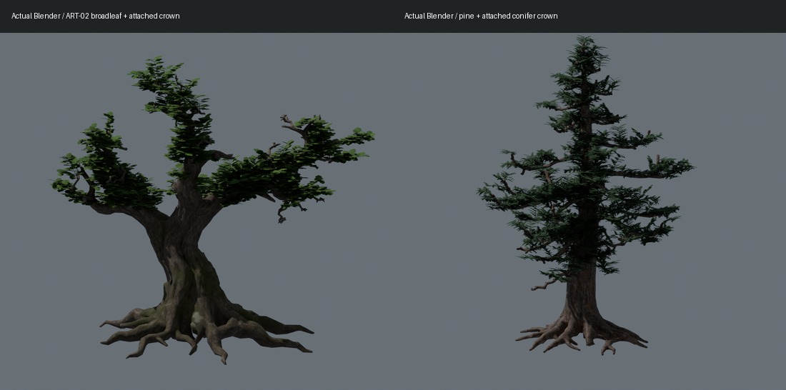
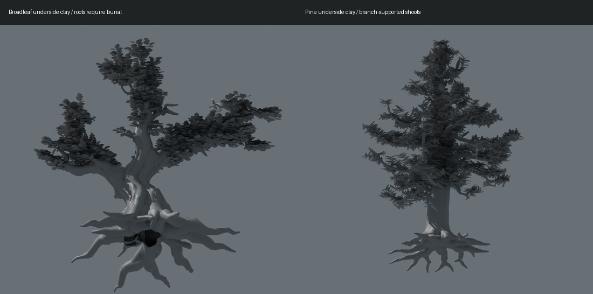
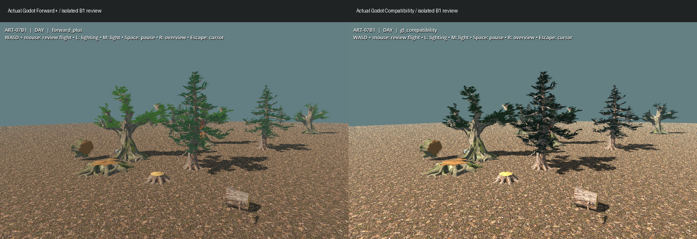
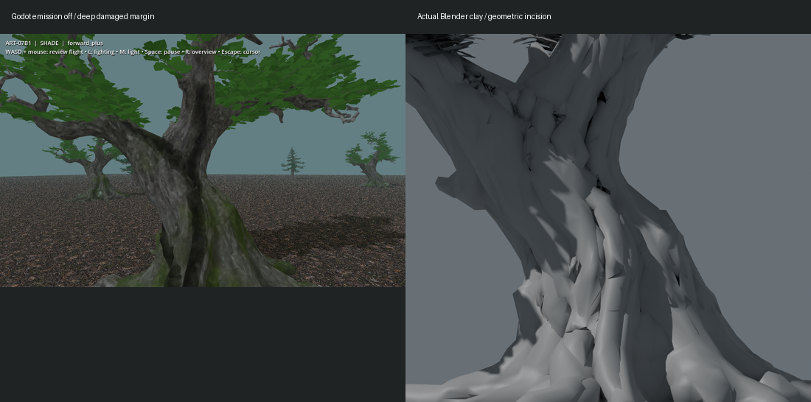
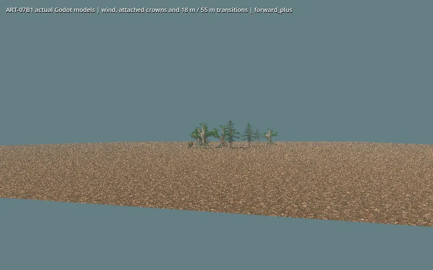
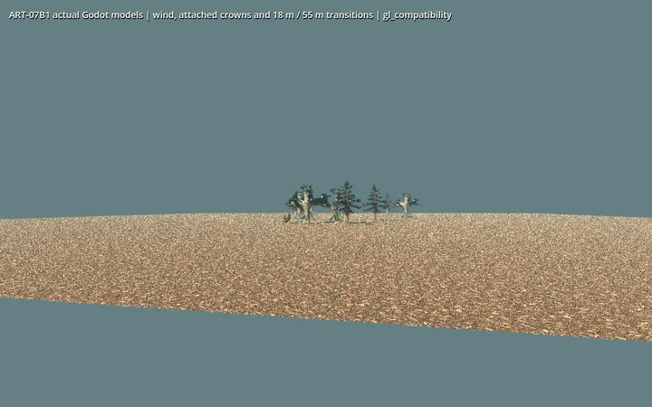
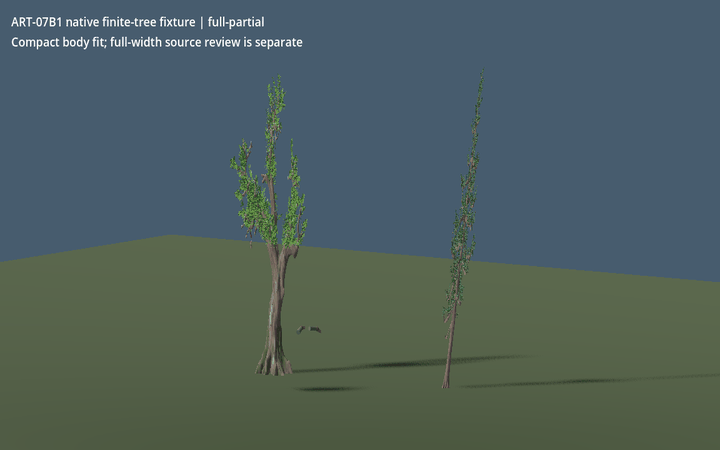

# B1 actual model review

ART-02 broadleaf and rock language is retained. Pine adds a separately generated structural source, with authored attached crowns on both species. See the [technical receipt](../../../../../prototype/art07-production/receipts/b1.md) and [recipe README](../../../../../../tools/wroughtwild-art07/b1/README.md) for source hashes, dimensions, controls, exact commands and costs.

Source review uses full-width masters; the separate native fixture fits the existing collider by narrowing the whole visual, particularly pine. This is a visible compromise and not ordinary-world adoption. Native work remains six presses / fourteen units, and the inert stump remains session-only. Animation samples are actual rendered frames, not benchmark FPS. Far models remain dense, reduced bark facets and source underside cavities remain visible, and root seating assumes the documented flat-ground burial. Owner visual acceptance is pending.
