# ART-07B2 — actual groundcover models

Technical source delivery for six assigned families. Owner visual acceptance
and normal-game adoption remain pending. These are actual Blender/Godot
renders, not the concept illustration. Full commands, hashes, measurements
and local package location are in the [B2 receipt](../../../../../prototype/art07-production/receipts/b2.md).

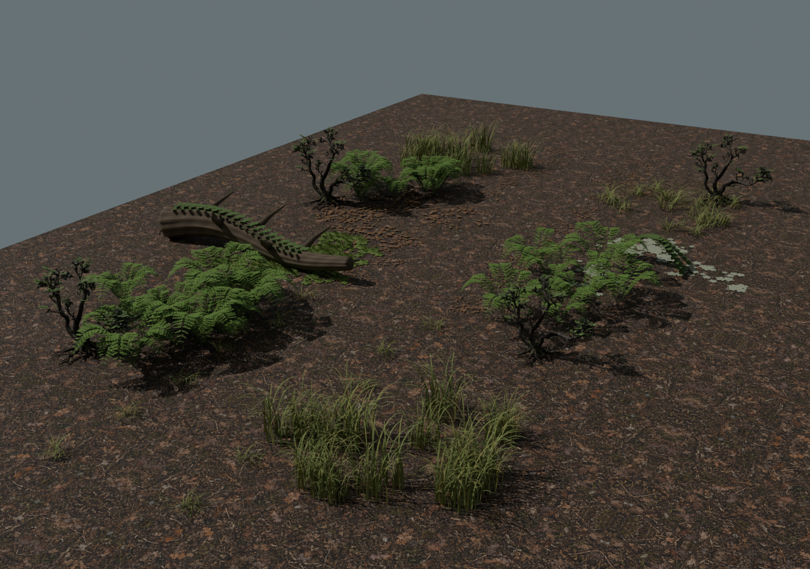
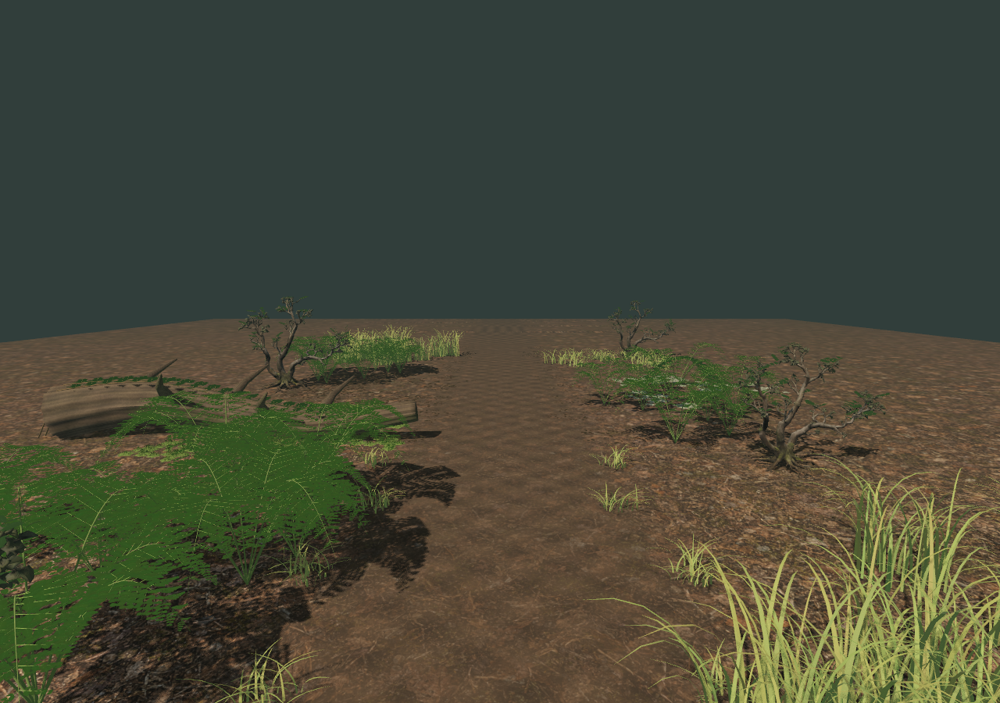
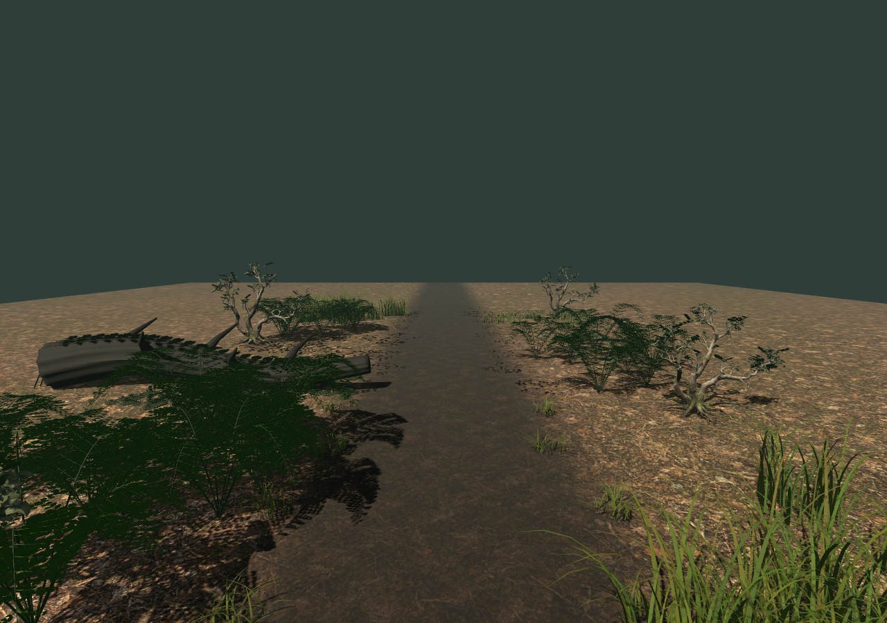

The generated shrub preserves the connected bent woody host. The fern has
individual attached pinnae, grass has curved strips and a flattened edge,
the bramble is rooted and the climber follows the retained ART-02 deadfall.
Moss cushions, pale lichen, leaf chips and needles create separate pockets;
the route transitions into exposed humus instead of a blanket scatter.

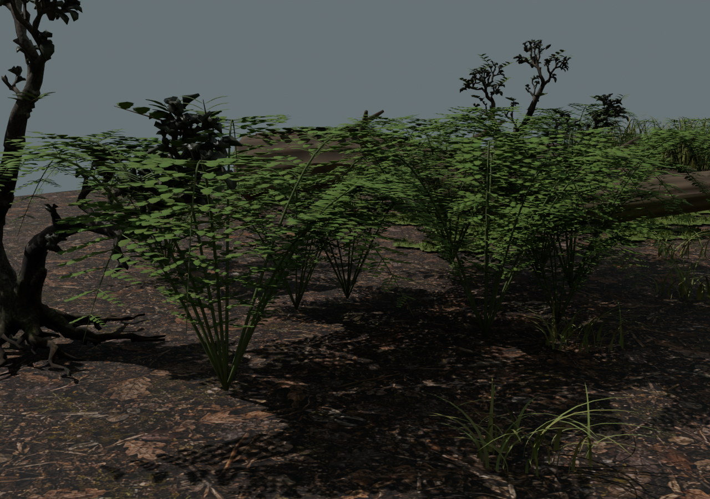
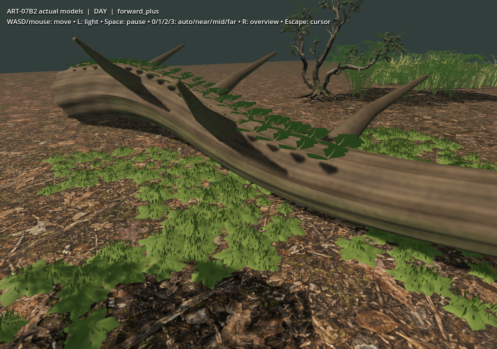
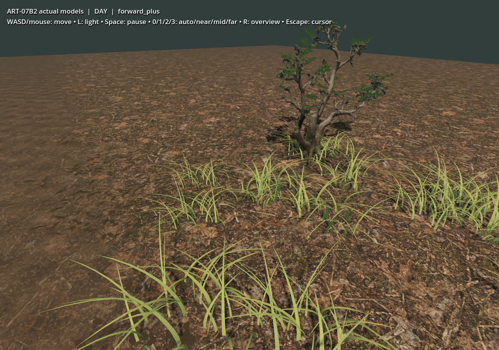

## Motion and detail

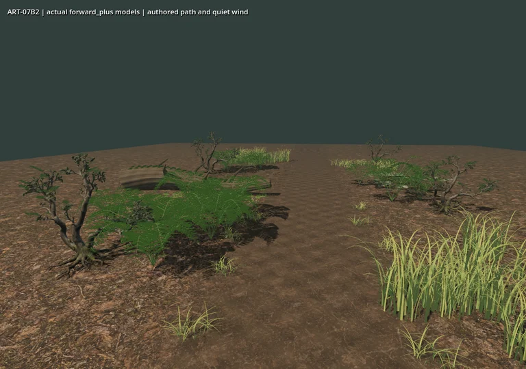
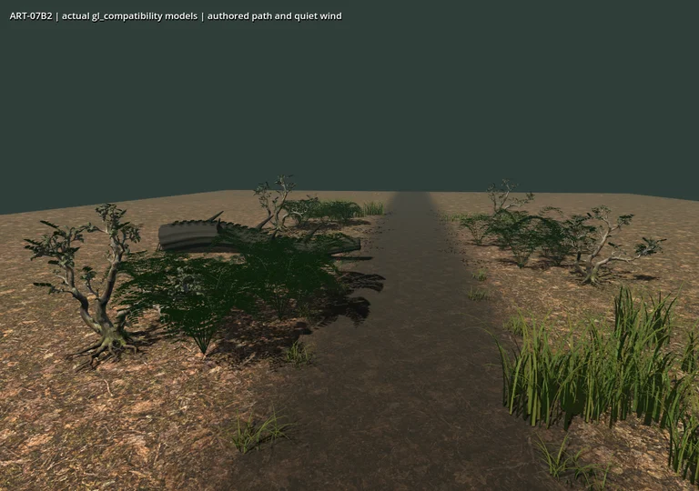

Each loop samples an eight-second camera walk and four-second close view,
holding the last two seconds still. Original PNG frames run at a deterministic
12 Hz clock; these compressed derivatives retain every second actual frame.
No interpolated frames or benchmark FPS claim. Both paused frame comparisons
are pixel-identical; active wind changes rendered pixels.

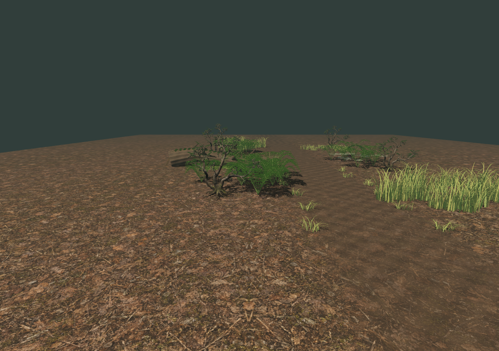
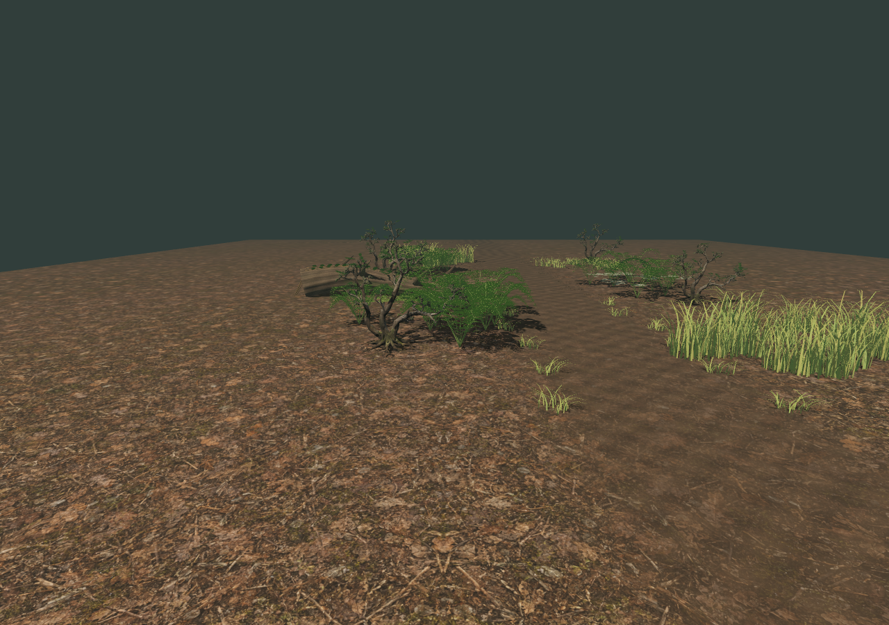
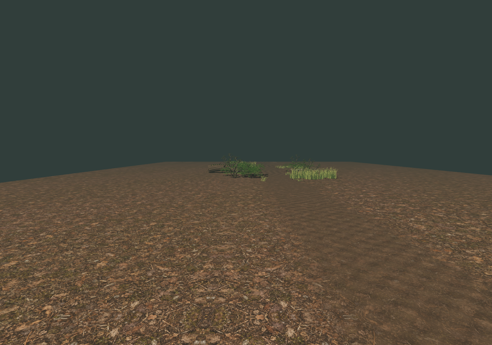
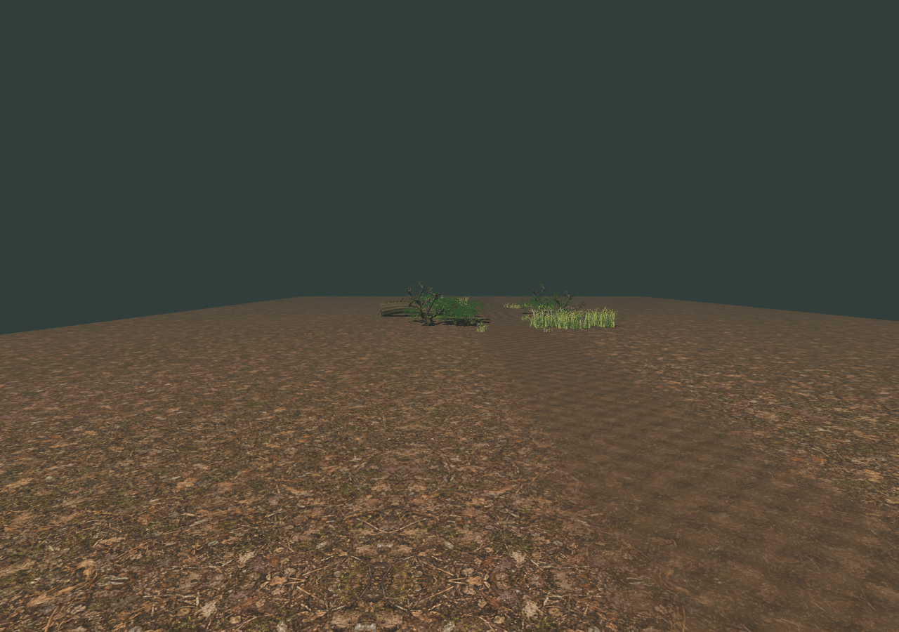

## Candid limits

This is an exposed source-kit review patch, not the dense full forest in the
ART-07 board. Generated shrub tips remain coarse, the deadfall retains the
approved ART-02 simplified form, and repeated fern/moss silhouettes are
visible. Pale lichen patches can read as separate plates close up. The
Compatibility foliage is darker than Forward+; renderer parity is not claimed.
Near ferns are expensive source geometry, and the 687-draw composition is not
an approved world-scale budget. Detail switches are discrete and arbitrary
slopes need later fitting. No foliage harvesting, saved-world scatter,
interactive cosmetic kit, lower-spec approval or owner visual approval is
implied by the checks.

The original [single-shrub input](shrub-input-v01.png) is retained with its
exact prompt in tools/wroughtwild-art07/b2/shrub-prompt.txt. The production
selection is kit v08, review v09, packed handoff v10. Prior local versions
retain inspection/packing, mipmap and LOD issues for the evidence trail.
