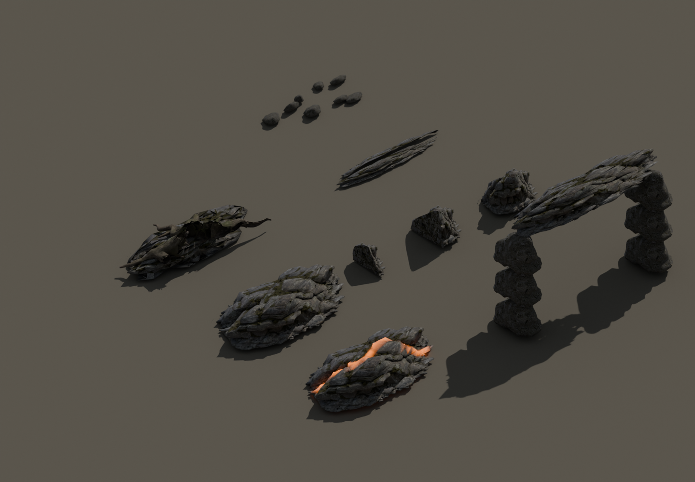
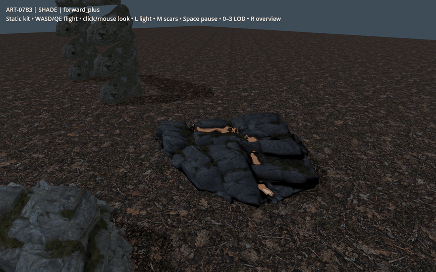
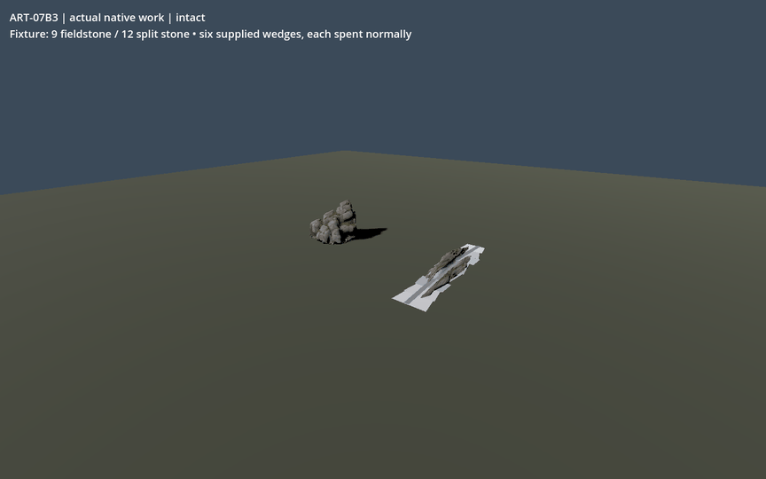

# ART-07B3 actual model evidence

Technical delivery; owner visual acceptance pending. These are renders of the delivered models, not the concept illustration.

The ordinary source preserves its fractured bedding and weathered colour. The incision is 64.5 mm deep at game scale. The bank retains attached roots; the cave lip uses repeated rock modules around a tested clear passage. Repetition, simplified distant UV detail, open source topology and duplicated embedded texture residency remain visible limitations.

Static compositions are labelled. Native motion uses actual work, wedges, pickups and depletion in an authored copied-game fixture. Six test wedges are supplied and consumed normally; this is not a paid first-hour playthrough or normal-world adoption. GIFs contain actual rendered frames, with held state views and no interpolated frames.

Forward+ and Compatibility evidence, including emission-off views, is alongside this report. The package holds all 43 Blender views, original source inspection, full exports, logs and the independent model audit.

## Imported costs

| Candidate | Near triangles | Mid | Far | Near surfaces |
| --- | ---: | ---: | ---: | ---: |
| boulder-full | 11980 | 4500 | 1200 | 2 |
| boulder-remnant | 2745 | 2745 | 1124 | 2 |
| boulder-worked | 7422 | 4500 | 1200 | 2 |
| cave-threshold | 11674 | 4494 | 1190 | 7 |
| released-chunk | 5493 | 4491 | 1200 | 2 |
| river-bank | 12846 | 3129 | 1199 | 3 |
| rock-shelf | 11981 | 2176 | 1200 | 2 |
| rock-shelf-altered | 11981 | 2220 | 1200 | 2 |
| stone-seam | 9046 | 4499 | 1199 | 4 |
| talus-pebbles | 3996 | 3996 | 1200 | 8 |

All 30 imported exports have finite coordinates and zero degenerate triangles. All selected GLB materials use OPAQUE alpha mode; there are no transparent foliage layers. Boundary-edge counts are retained in model-audit.json; this is not a watertight certification. Runtime copies use 1024-square albedo and linear ORM; the packed master also retains original 2048-square maps.

## Separate settled benchmarks

| Renderer | Art | p50 / p95 / worst ms | Draws | Primitives | Texture MiB |
| --- | --- | --- | ---: | ---: | ---: |
| forward_plus | art | 0.293 / 0.414 / 3.926 | 99 | 81034 | 453.07 |
| forward_plus | hidden | 0.173 / 0.265 / 1.25 | 6 | 220 | 453.07 |
| gl_compatibility | art | 0.267 / 0.405 / 0.723 | 99 | 81042 | 375.59 |
| gl_compatibility | hidden | 0.202 / 0.25 / 1.073 | 6 | 228 | 375.59 |

RTX 5090, Godot 4.5, 1440 × 900, MSAA 4×, shadows on, VSync off, fixed camera, automatic detail, 180 warm-up frames and 600 samples per independent run. These are process-frame wall intervals, not isolated GPU timestamps or display-present latency. Hidden-art comparison retains all loaded textures. Shadow cost is included, not isolated. No competing authoring/capture job ran during the benchmarks. Texture residency needs shared-material/deduplication work before any ordinary-world adoption; no lower-spec approval or world budget is claimed.

Existing unchanged checks: 8225 checks in 14 jobs, zero failures. Native flow additionally checks source stock, real bodies, support removal/restoration, capsule passage and separate-process partial/depleted saves. See verification.json and the B3 receipt for exact paths and results.

The authoritative handoff is local-only: C:\Users\Matty\Dev\project-wroughtwild\build\art07\b3\worktree\build\art07\b3\v01\handoff-v02. A clean clone contains these recipes and curated evidence, not the ignored masters, runtime GLBs, DLL or package.
