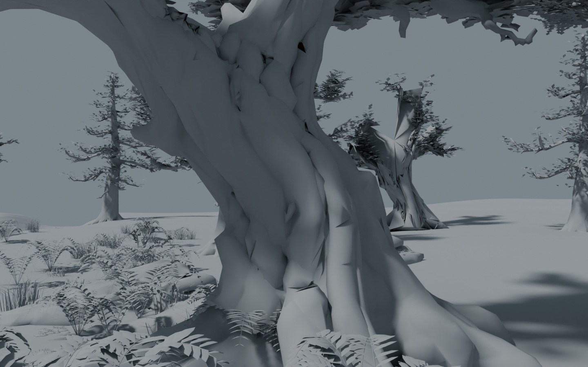
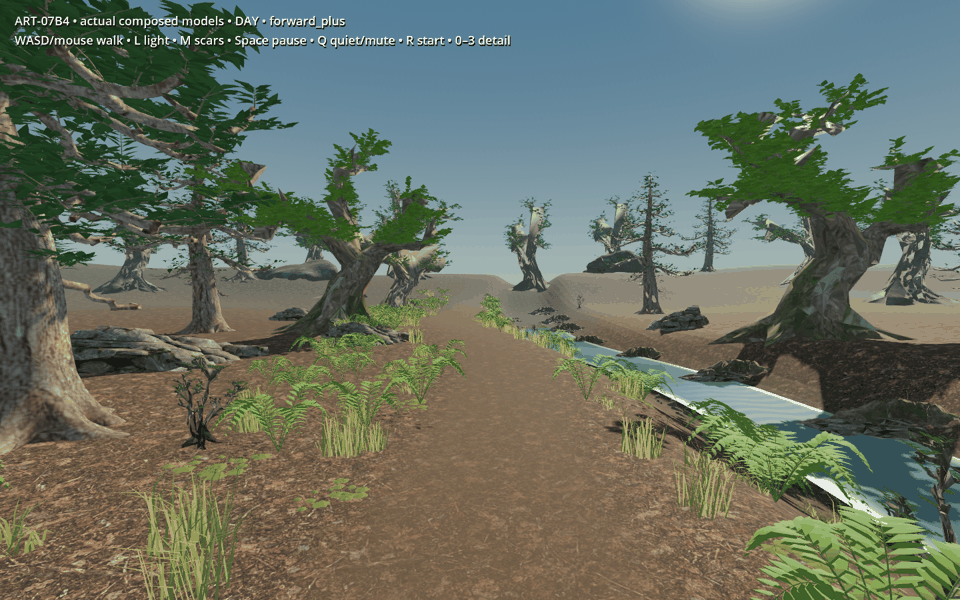
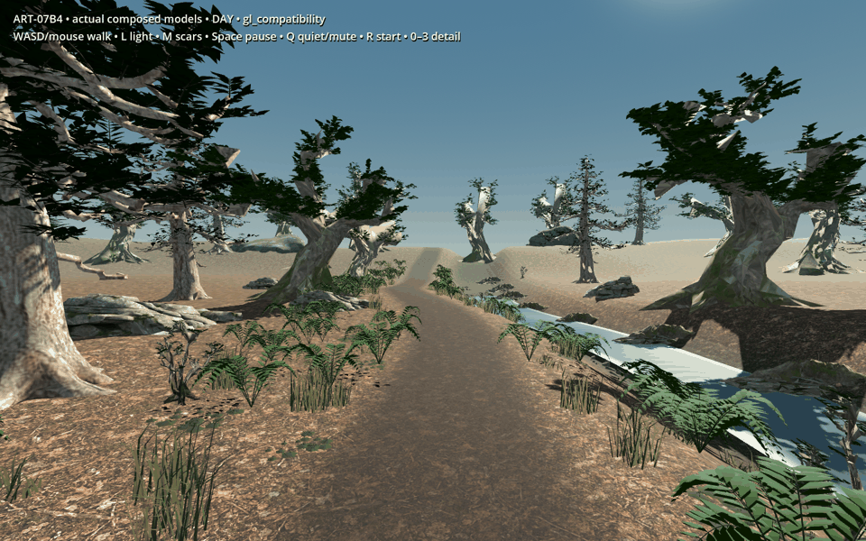
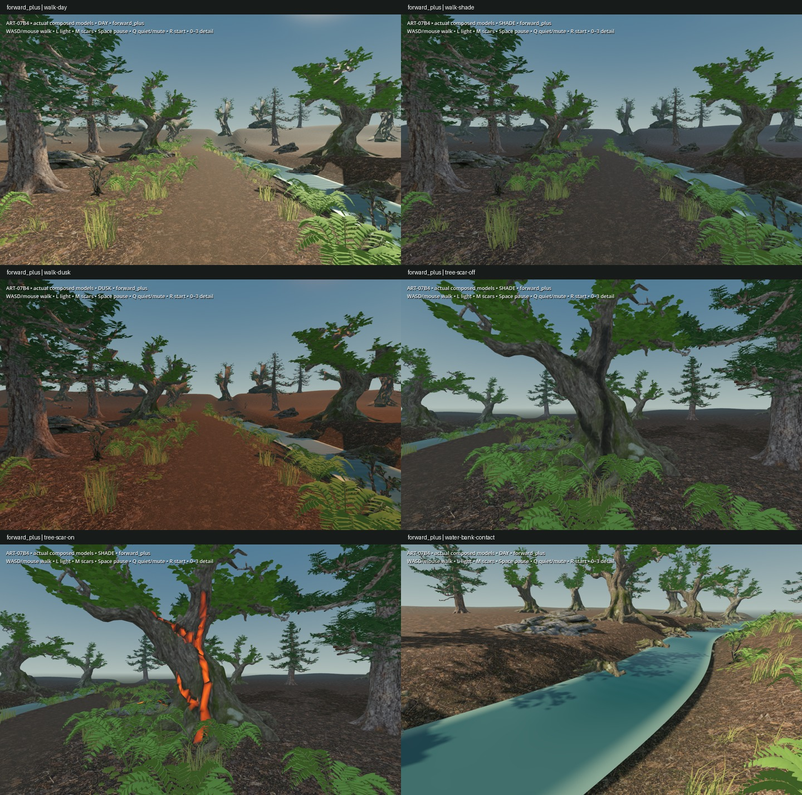
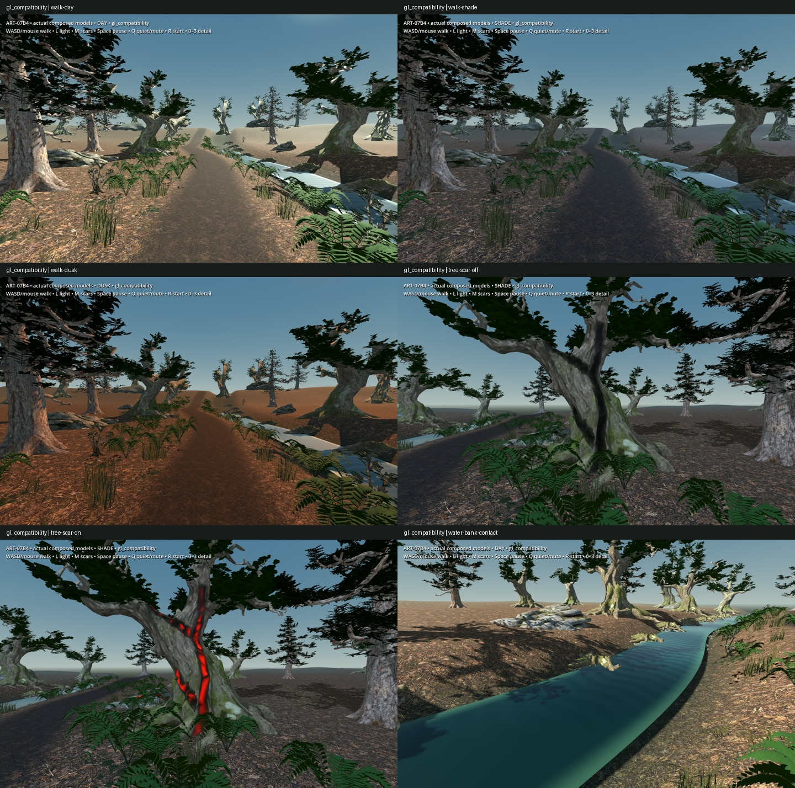

# ART-07B4 — Actual composed-model evidence

Technical candidate only; owner visual acceptance is pending. These are actual
Blender/Godot models and captured frames. No concept illustration substitutes
for the model evidence. GIF/WebP sequences only resize/encode captured PNGs;
there is no generated movement or frame interpolation.

Selected source is `kit-final`; the selected engine scene is `review-budget-v05`.
Both live below
`C:/Users/Matty/Dev/project-wroughtwild/build/art07/b4/worktree/build/art07/b4/v01`.
The immutable `handoff-v01` there contains the packed master, 26 original GLBs,
shared-texture engine cook, complete PNG frame sequences, recipes and logs.
Its manifest SHA-256 is
`60392ada2fd8eedb52ee091cfead2c7afa1da200f47d0994bafaef7404bace71`.
The [receipt](../../../../../prototype/art07-production/receipts/b4.md)
records reconstruction, controls, checks, costs and publication status.

## Actual geometry and walking

The 36.353 m route uses Input.action_press and CharacterBody3D.move_and_slide,
with all 911 recorded samples supported in each renderer. It is not a camera
teleport animation. Walking WebPs retain every captured frame; the smaller
frame count in GIFs accommodates remote preview, with corresponding duration.

## Matched lighting and motion

- [Forward+ pulse](forward_plus-pulse.webp), [Compatibility pulse](gl_compatibility-pulse.webp).
- [Forward+ water/wind](forward_plus-water-wind.webp), [Compatibility water/wind](gl_compatibility-water-wind.webp).
- [Full-frame Forward+ walk](forward_plus-walk.webp), [Compatibility walk](gl_compatibility-walk.webp).
- [Packed Blender composition render](blender-composition.jpg), [lit physical scar](blender-scar-lit.jpg).

Twelve paused frames are byte-identical per renderer; pulse and water/wind
sequences show measured pixel change. Current quiet synthesis uses one voice
and long gaps; automated evidence used the Dummy audio driver, so listening
acceptance is still pending. The interactive launcher uses actual audio.

## Measured conventions and limits

The [control data](controls.json) explains six/twenty-metre tree detail changes,
32-metre ground batches, a short single shadow view, grounded bend, attached leaf
motion and shared texture limits. The [audit](model-audit.json) separates the
99.927 mm tree / 64.496 mm shelf source incision from independent exported-surface
distance measurements. Near/middle petiole attachments stay within 7.61 mm.
Terrain interpolation agrees with actual ground collision within 0.043 mm.

The start-view benchmark uses 1440×900, 4× MSAA, VSync off, RTX 5090 / driver
591.86, 120 warmup frames and 600 samples per case. Candidate day/dusk has
114 draws and 2,965,872 submitted primitives in either renderer. GPU p95 is
at most 0.635 ms Forward+ / 0.700 ms Compatibility. Texture memory is
224,806,912 / 108,050,736 bytes. These meet the original provisional
240 draws / three million primitives / 384 MiB / 3 ms ceilings at this view.
They do not certify every free-camera view, forced near detail, a dense world,
the ordinary streamer or a lower-spec device.

The source's wide walking-band wood still fails the old 0.7×3×0.7 m native
tree body. This scene preserves full crowns and uses full-width review collision;
ordinary adoption needs a separate fit decision. Remaining visual compromises
include faceted bark, repeated fern forms, sparse far crowns, visible LOD
transitions, coarse distant culling, a short shadow view, empty ground beyond
the route and a simple opaque water edge. Rock overhangs and banks are authored
for this site; arbitrary slopes, missing supports, swimming and shore physics
are not provided. No normal saves, inventories, resources or placement rules
are changed.

Earlier local attempts include failed budget checks, a corrected capture-light
flag, corrected Blender yaw/material interpretation and a script type error.
They remain diagnostic versions under the ignored run root. Only the selected
passes are in this curated directory and canonical handoff. An intermittent
ObjectDB shutdown warning in fresh Forward+ runs and Windows certificate-store
messages are recorded in raw logs; exit/check results are stated separately.
