# ART-07C1 actual model evidence

These are actual Blender and Godot renders of the selected C1 kit, not generated concept illustrations. The isolated clay input is retained separately as `clay-input-v01.png`. Owner visual acceptance is pending.

The full receipt is [C1](../../../../../prototype/art07-production/receipts/c1.md). The reproducible recipe is [tools/wroughtwild-art07/c1](../../../../../../tools/wroughtwild-art07/c1/README.md). The immutable local handoff is `C:/Users/Matty/Dev/project-wroughtwild/build/art07/c1/worktree/build/art07/c1/v01/handoff-v01`; its manifest is `e733692b99f61cadf17e7e3d3382834b558aa21c9817597a801eba877104c6f6` (SHA-256).

## Packed Blender source

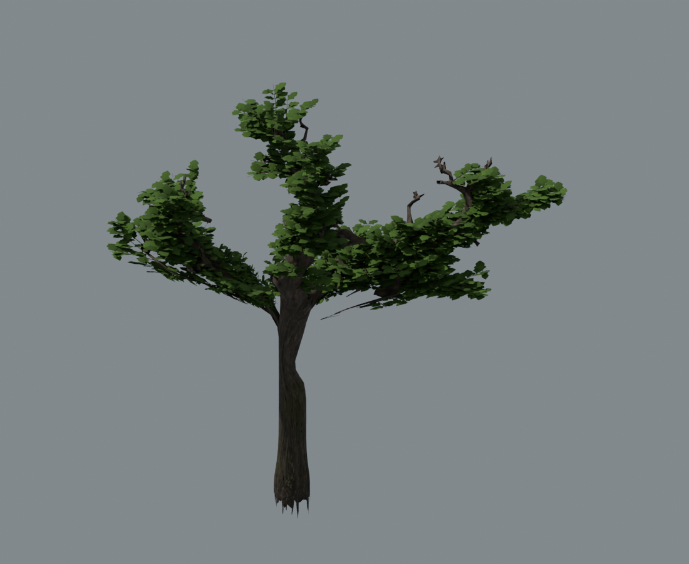
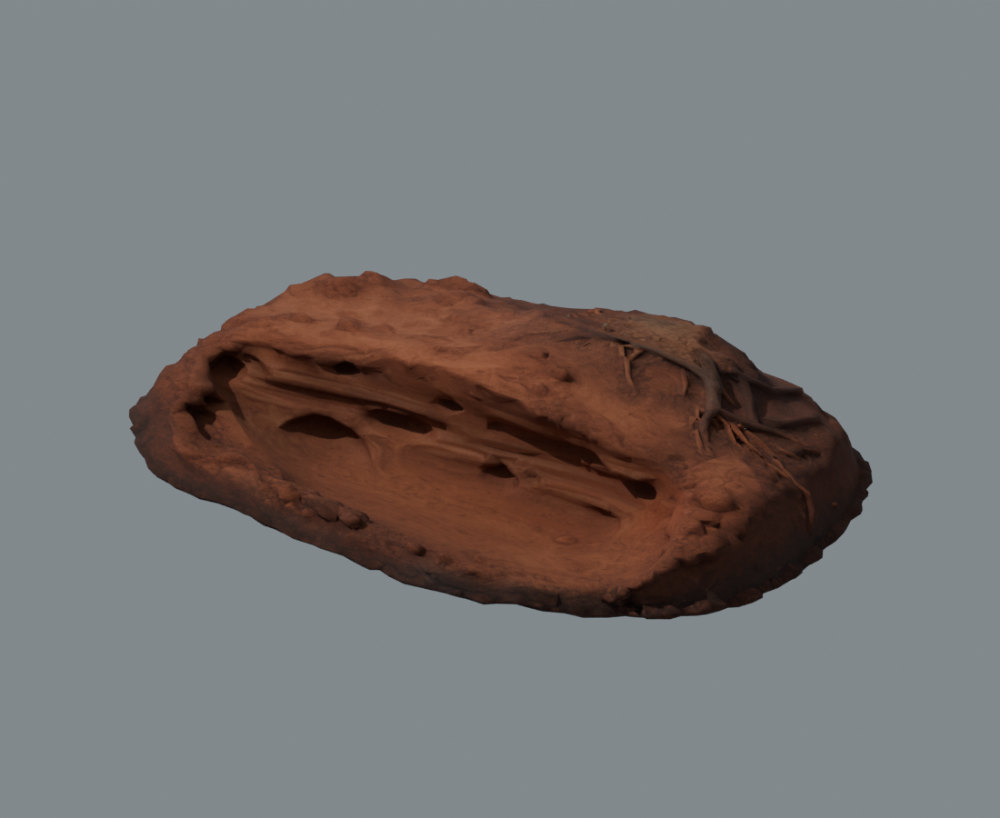
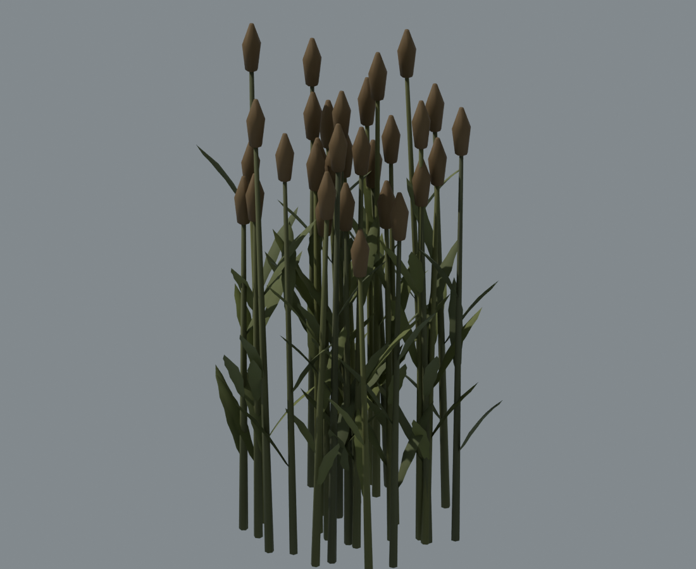
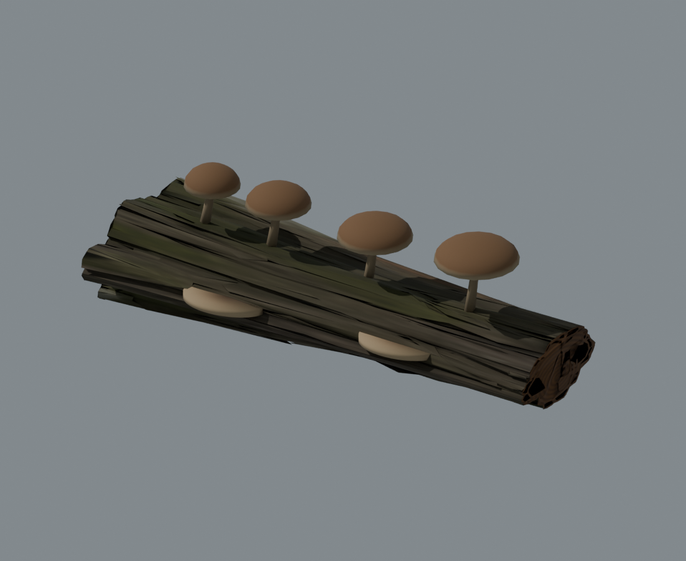
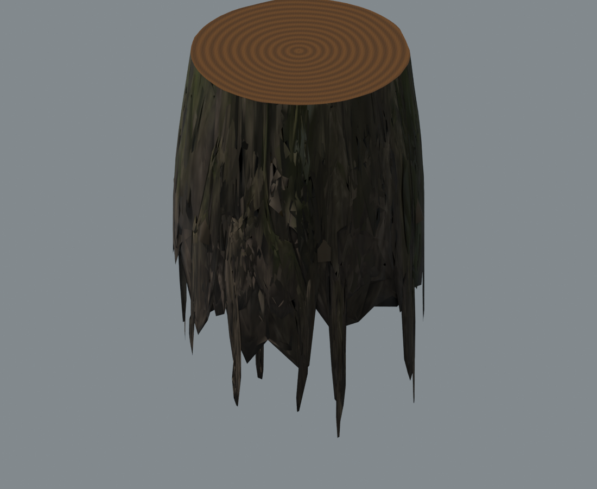

## Actual Godot views

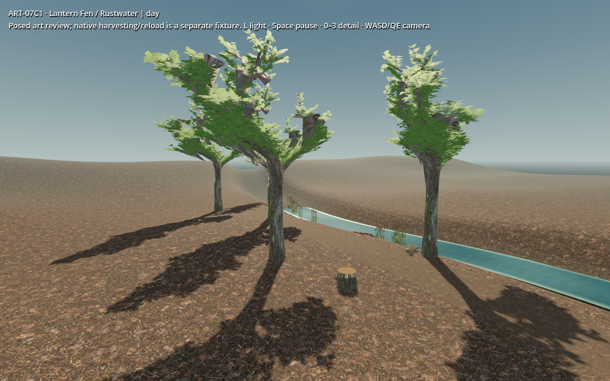
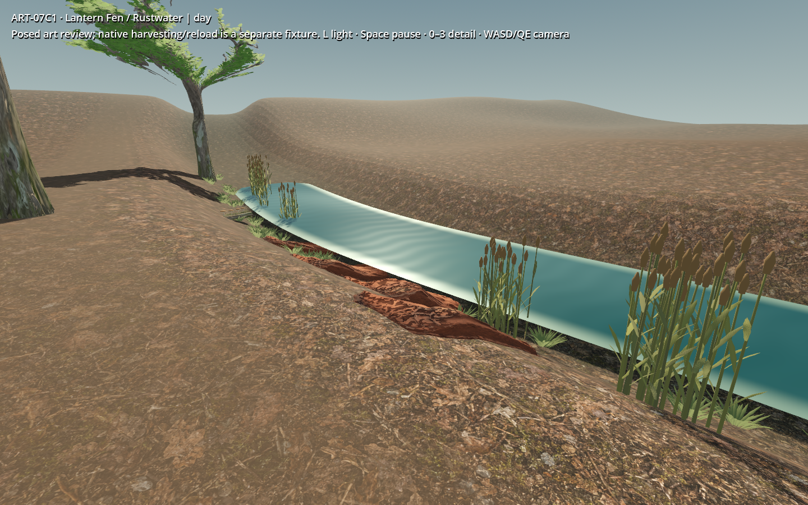
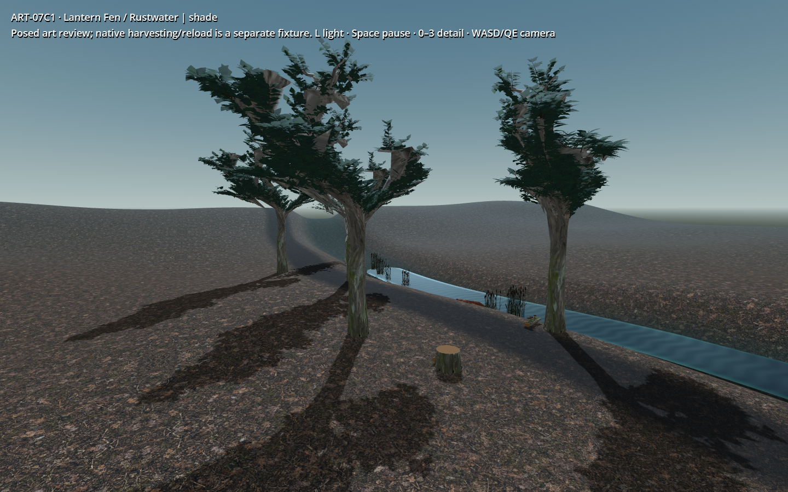
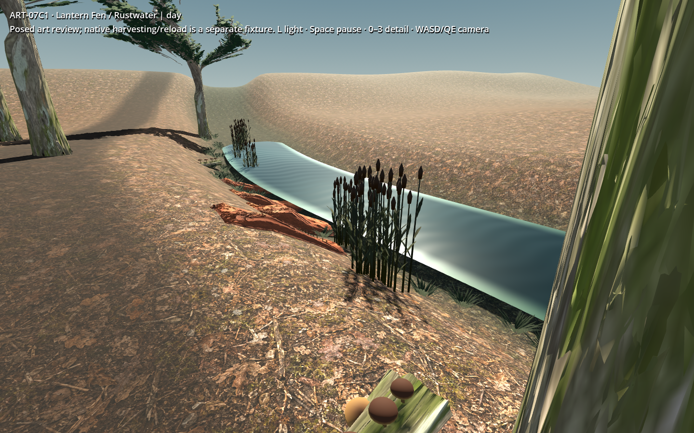

## Motion and native work

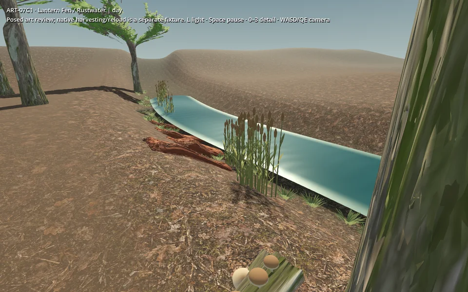
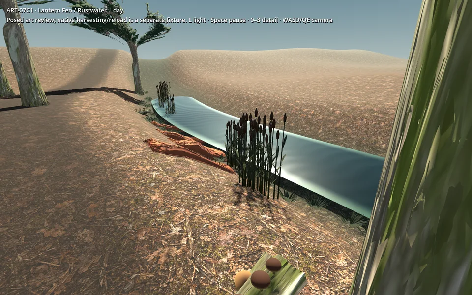
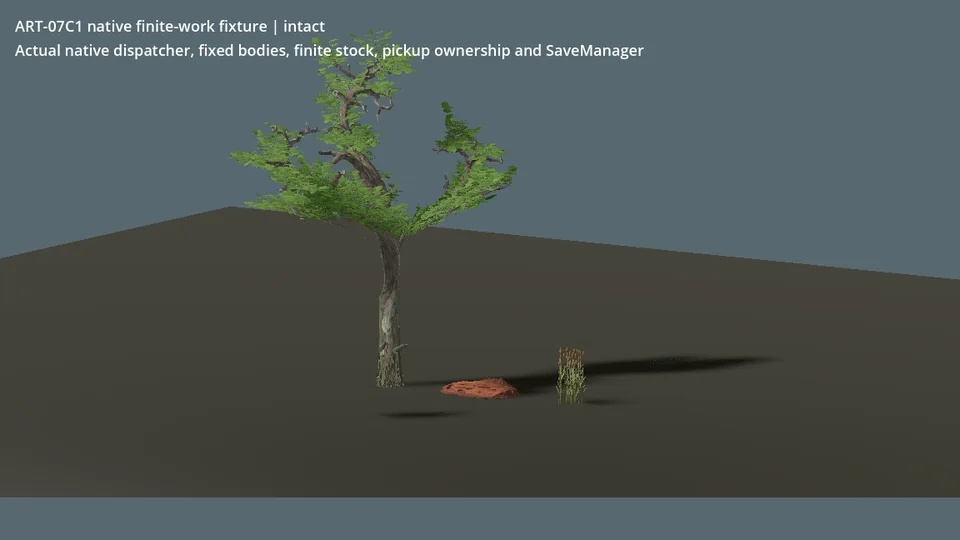
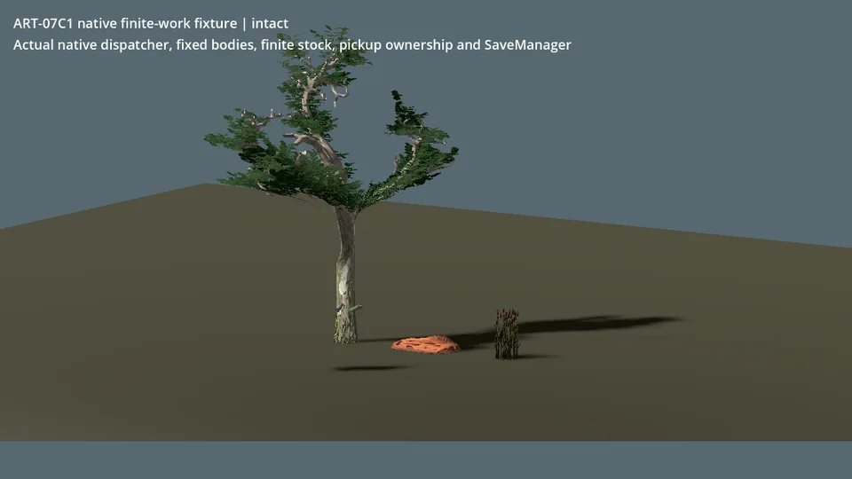

Wind previews cover a 5.5-second period plus pause and resume. All twelve paused source frames are identical; resume changes pixels. Work previews encode actual captured frames at 160 ms/frame; this is a compact timeline, not realtime-duration playback. Original PNGs remain in the local handoff. The native flat fixture has weak depth cues from its plain floor and broad shadows; terrain seating is reviewed in the wet-margin views above.

`audit.json`, `contacts.json`, `motion-checks.json` and both benchmark JSON files preserve the measured evidence. The source remains heavy/faceted in places, and the native adapter verifies near art only. Three LODs and their automatic selection are demonstrated in the standalone review. This kit is not a shipped world-density or lower-device approval.
