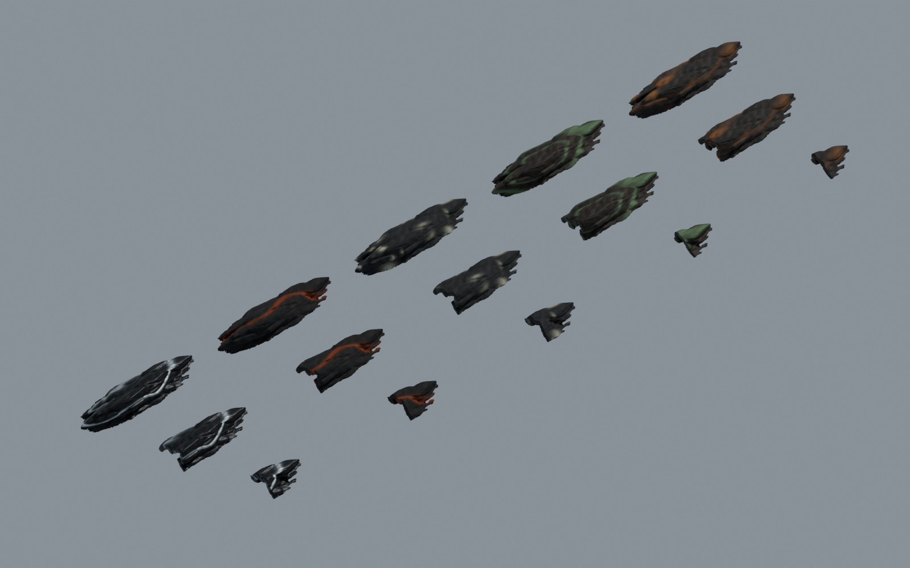
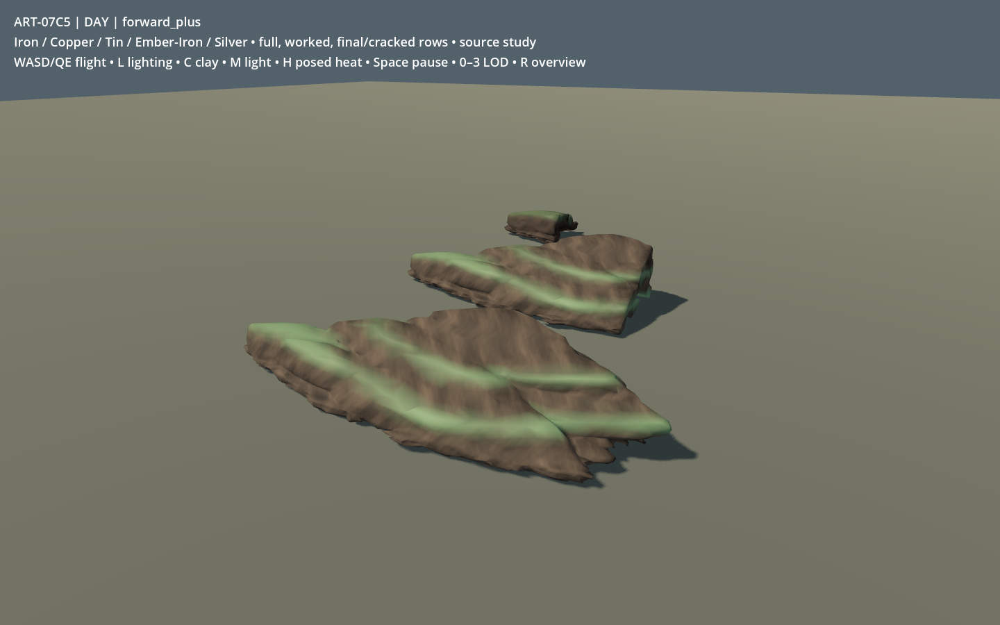
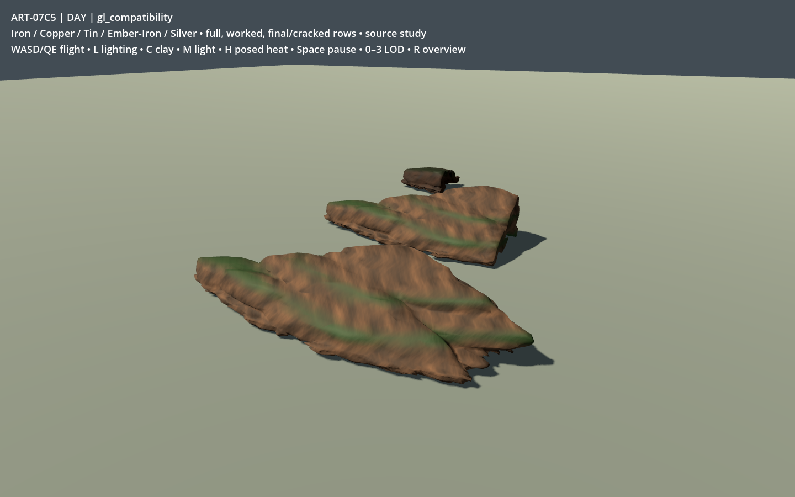
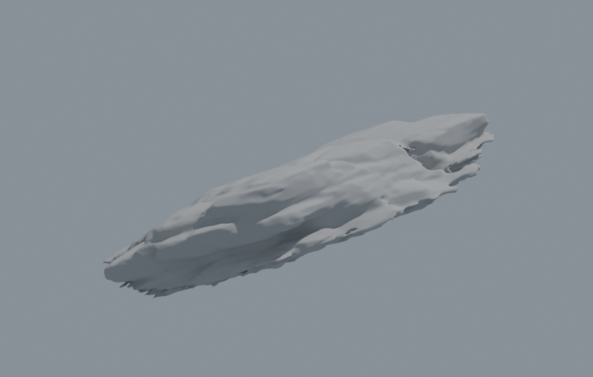
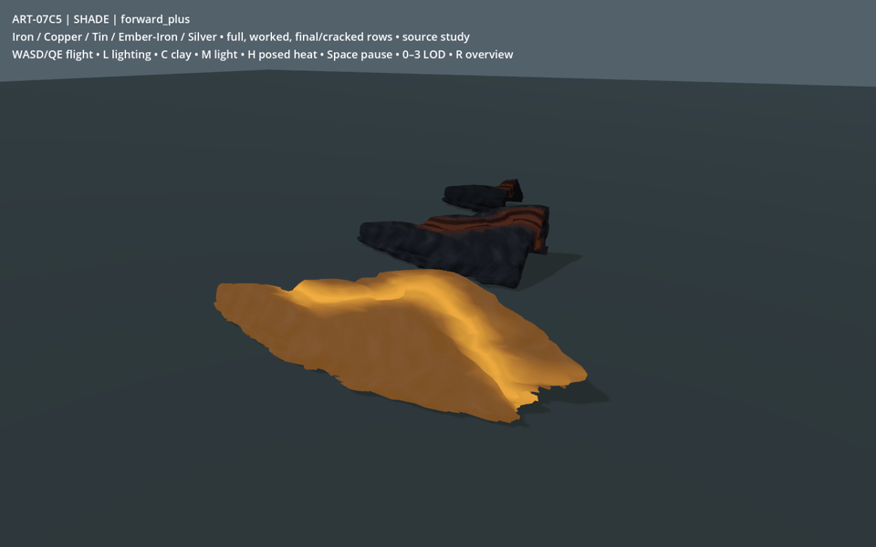
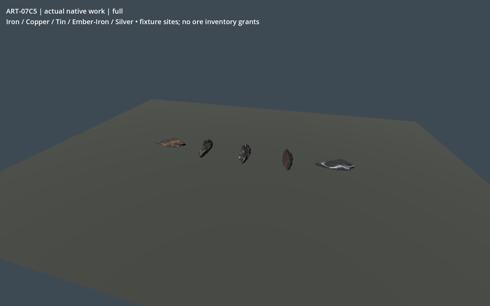

# ART-07C5 — ore source review

Five related ore hosts use the inspected B3 organic rock, with 30 native stock /
crack variants and three authored LODs each. Selected geometry is kit-v07;
kit-v08 adds final shared material detail and packed ORM without changing the
90 exports. The source, worked cuts, native fixture and both renderer views are
actual model evidence. Owner visual acceptance is pending.

The measured fallback body forces a low, elongated profile. Copper's folded
bands and tin's pale pockets remain softer than the concept's granular mineral
detail; several edges retain small topology defects. Silver is intentionally
more reflective. No ordinary cold ore emits. These limits need visual review,
not an assumption of acceptance based on exports or passing checks.

Ordinary faceted-terrain ores use a zero-thickness picking ribbon. C5 preserves
that exact path; the solid candidates are demonstrated only in the copied-game
fallback fixture. Ordinary-world adoption needs a separate contact/body review.
No normal game, catalogue, tuning, world, save or live playtest was changed.

The selected environment board SHA-256 is
`f57c8b3f0b15b23f32e65dcb71606e74c68c0f40858434ffa78374247cea613d`
(`02-habitat-kits.png`); the inspected catalogue version is
`3bec6ec0f947917a466b7c27c64cb350abdbb0da1ecec91af1aefe20ef8a74a4`.
Original rock input/cutout/raw/tool/model lineage is in
[prerequisites.json](v01/prerequisites.json). No new generation was needed.

GIFs encode actual renderer frames at 960 × 600 for review. The heat loop is
42 sampled phases over 3.5 seconds; pause/resume was checked through the actual
input handler with three pixel-identical paused frames. The native GIF is a
timed sequence of native state snapshots and actual depletion frames, not a
continuous first-hour playthrough. Full-resolution PNGs and all angles are in
the immutable handoff. Forward+ and Compatibility capture the same source;
tonemapping/specular response differs visibly between renderers.

[Final verification](v01/final-verification.json) records the fresh packed-source
reopen, all 90 GLB imports, native reloads, unchanged handoff/source hashes and
1,305 runtime source files matching the captured and freshly imported copies.
An additional fresh GPU recapture was not run because the shared slot remained
occupied; the rendered evidence above uses the verified selected runtime.

See the [C5 receipt](../../../../../prototype/art07-production/receipts/c5.md)
for dimensions, native contracts, checks, absolute package path/hash, measured
performance limitations and publication status. Source controls and exact
reconstruction/launch commands are in
[the recipe](../../../../../../tools/wroughtwild-art07/c5/README.md).
