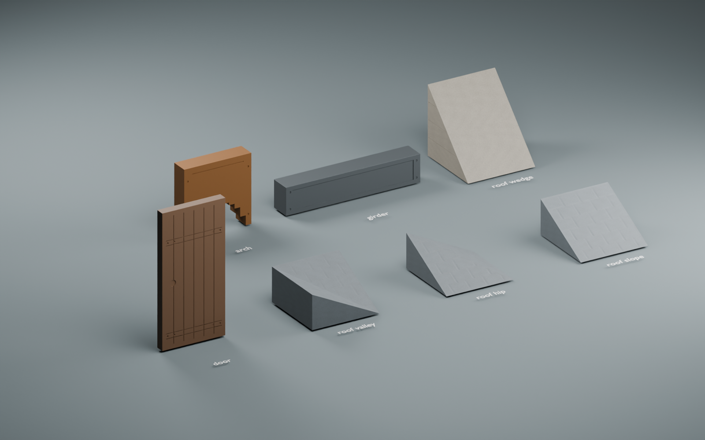
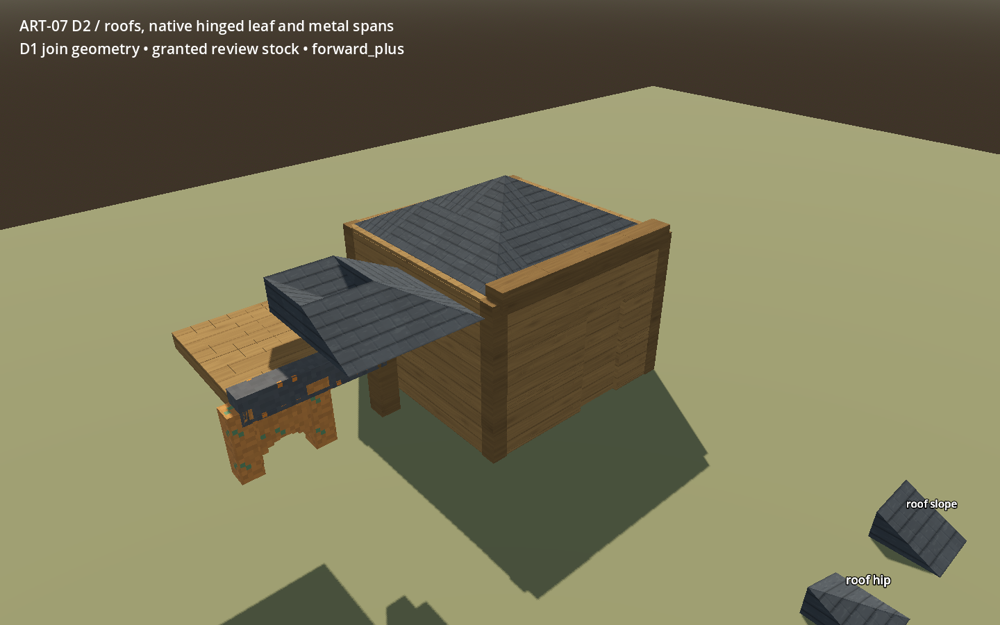
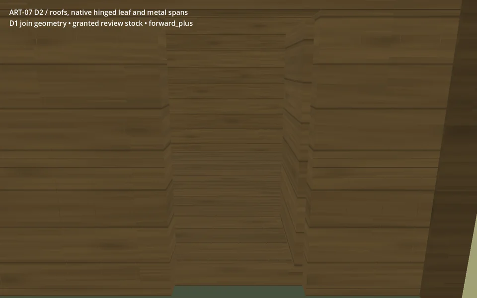

# ART-07D2 — actual source and native review

Seven fitted roof/joinery/span modules, technically checked on an isolated
`codex/art07-d2` branch. Owner visual acceptance and ordinary-world adoption
remain pending. [Receipt and package paths](../../../../../prototype/art07-production/receipts/d2.md)
record the exact native baseline, source hashes, checks, costs and limitations.

These are actual Blender/Godot images, not concept art. The source uses
provisional materials; the native review retains the current family/role
materials and immutable D1 joins. Repeated courses, simple surfaces and coarse
native metal textures remain visible compromises. The exact stepped arch and
solid girder preserve existing native contracts.

The door switches between two native physical poses; no tween was added.
Both 48-frame animations come from original 1440 × 900 PNG sequences, encoded
at 960 × 600 for chat. [Frame/state metadata](media.json) records provenance;
the engine state samples establish matching visible-leaf and collider transforms.
[Compatibility motion](gl_compatibility-door-motion.webp) is also included.

[Fresh-copy audit](handoff-verification.json) repeats the packed-source, import,
placement/restart and both-renderer checks. All 116 final PNGs match the working
review byte for byte. [Performance](performance.json) records two later separate
RTX 5090 measurements; they do not establish lower-spec or whole-world readiness.
These final audit/performance records accompany the immutable source package
and do not modify it.
