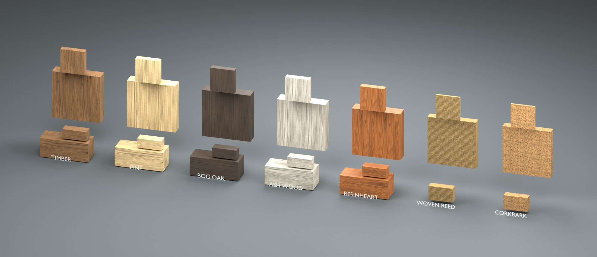
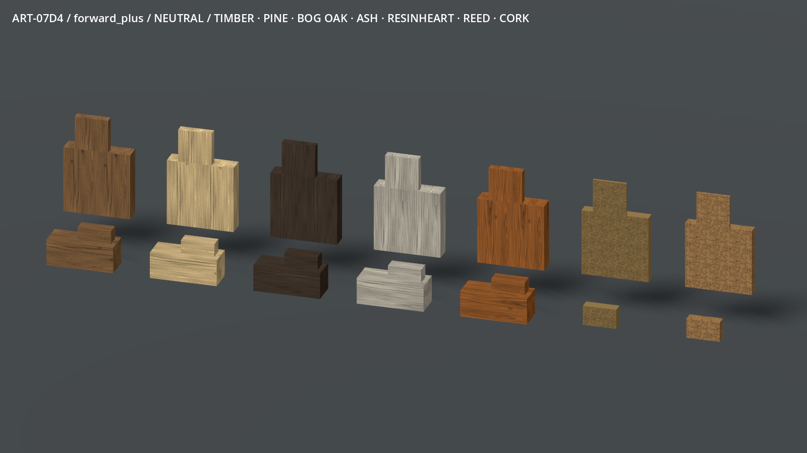
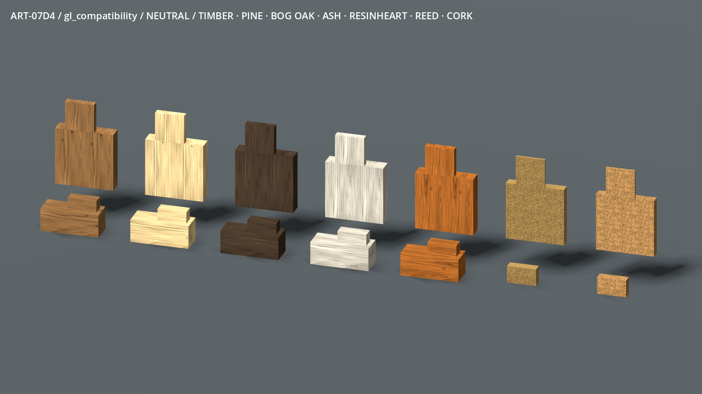
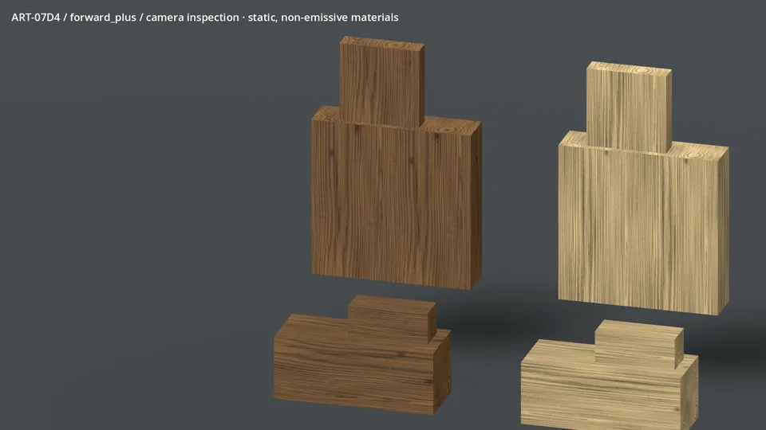
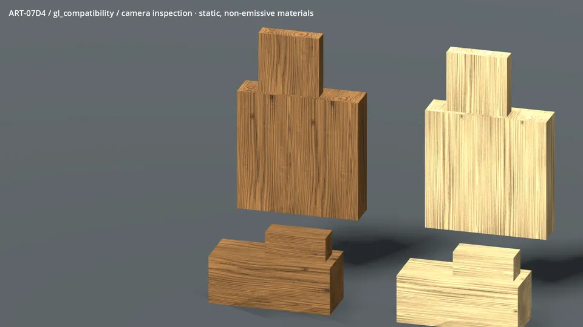

# ART-07D4 — seven material families

Technical material-source handoff, checked 9–10 September 2026. Owner visual
acceptance is pending. This gallery shows actual exported inspection geometry;
it does not show adopted game construction or an assembled cottage.

Timber, pine, bog oak, ash wood, resinheart, woven reed and corkbark share stable
face/end/edge map names and a documented metric UV contract. Timber grain turns
with a beam and ends on its cross section. Fine pieces crop the same density.
Reed and cork remain covering-only; their small review coupons are not new
placeable forms. The [selected concept sheet](../../../../concepts/environment/2026-09-09-frontier/03-building-family.png)
informed their material identities. Frames, pegs and fitted joins belong to the
geometry slices.

The same neutral lighting and maps run in both renderers. Compatibility is
brighter and casts harder shadows. Earlier missing mipmaps were caught in these
actual views and corrected. All 20 final fresh-copy stills match the selected
captures byte-for-byte; emission-off views are black below their captions.

Each sweep contains 96 actual engine frames at about 24 fps. Only the camera
moves; ordinary construction surfaces have no magical pulse. The PNG originals
remain in the ignored review output. No concept illustration is substituted for
rendered motion.

Forty-two PNG maps pass size, colour-space, seam, normal and mapping checks.
The current unmodified native suites pass 595,376 world/material checks and
224,380 core checks. The packed master and all 26 mesh objects in the exported GLB reopen
with their exact native envelopes (312 triangles total). These are static
material samples, not an interactive placement, harvesting or save demo.

| Isolated 1600 × 900 RTX 5090 review | p50 / p95 / worst engine-frame interval | Scene texture memory |
| --- | --- | --- |
| Forward+ | 0.237 / 0.382 / 0.723 ms | 274.74 MiB |
| Compatibility | 0.344 / 0.465 / 0.806 ms | 160.08 MiB |

Benchmarks ran separately from generation, captures, compilation and encoding.
These are engine-loop intervals, not GPU timestamps or normal-world FPS.
The review includes shadows, UI, imported texture copies and render targets.
The reusable PNG set is 21.32 MiB on disk; source RGBA+mipmap estimate is 140 MiB.
No lower-spec or integrated-world performance approval is claimed.

Finite repeats and procedural regularity remain visible in long uninterrupted
walls; vary UV phase between boards. The textures preserve colour/fibre/weave/
pore identity, while irregular physical edge wear, integral frames and pegs
still require the owning geometry work. Ordinary game adoption and owner visual
acceptance remain separate.

- [Receipt and exact commands](../../../../../prototype/art07-production/receipts/d4.md)
- [Stable texture/mapping manifest](../../../../../../tools/wroughtwild-art07/d4/manifest.json)
- [Reconstruction and mapping guide](../../../../../../tools/wroughtwild-art07/d4/README.md)
- [Final verification](final-verification.json) and [media hashes](evidence/evidence-manifest.json)
- Local handoff: `C:/Users/Matty/Dev/project-wroughtwild-art07-d4/build/art07/d4/h04`
- Handoff manifest SHA-256: `aaa0316f108cdb1de0ed27cc3a40fac7a07574497c14486e88b18fa73dfbda59`

Only these D4 sources/evidence and the D4 receipt are committed. Raw builds,
packed masters, exported proxies and caches remain local; other slices and
the owner's saves/playtests are preserved. The publisher integrates and pushes.
