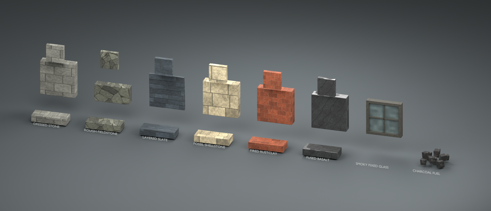
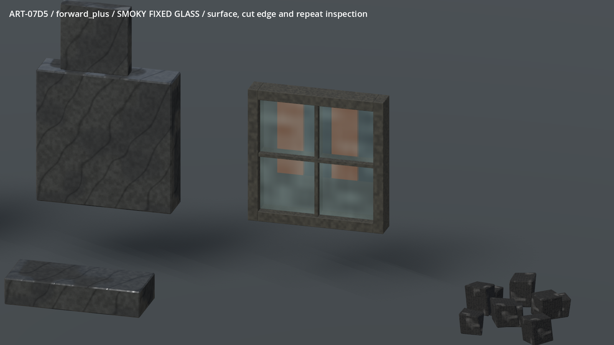
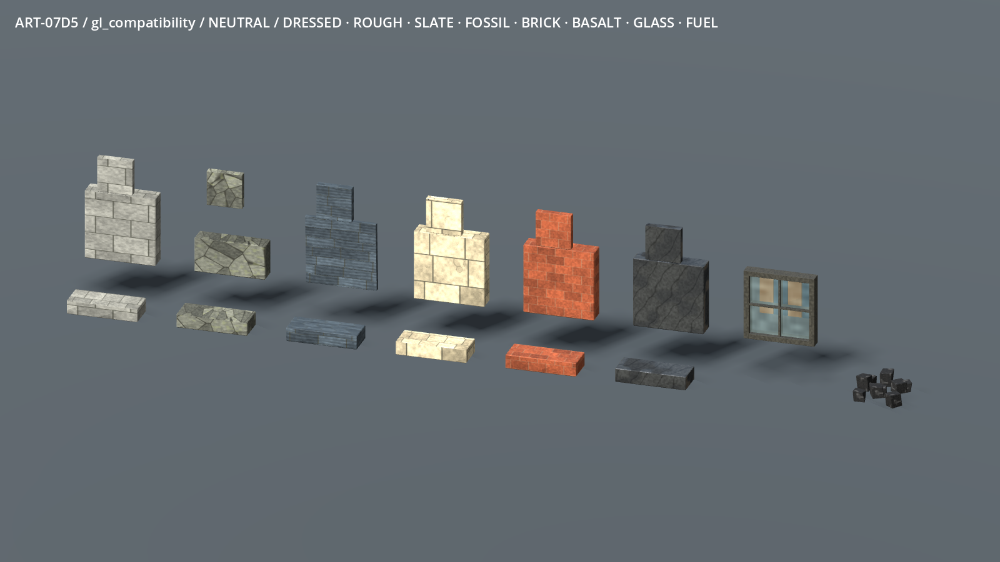
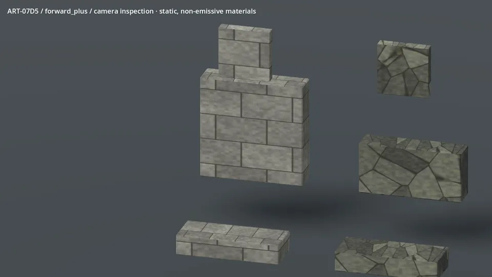
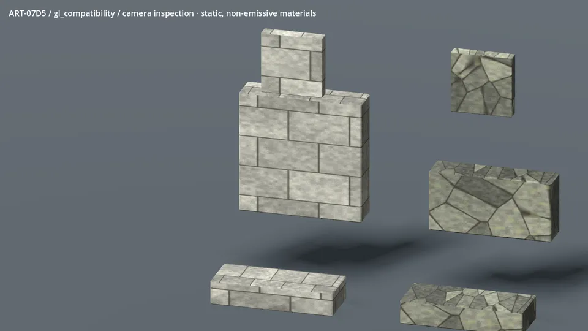

# ART-07D5 — actual mineral, glass and fuel sources

Eight ordinary material finishes, with packed editable Blender sources and a
standalone Godot inspection. The selected `v03` images below are actual renders,
not source illustrations. Owner visual acceptance and game adoption remain open.

The camera moves; these ordinary materials do not pulse or animate. All maps
remain non-emissive. Slate has physical overlapping edges, glass has a full
integral frame, and charcoal appears only as fuel chunks. Neutral, light,
shade, dark, zero-light and distant views accompany individual closeups.

The model board is deliberately an inspection arrangement, with floating
surface/cut/repeat coupons. It is not a new home, source resource, legal building
shape set or a placed native-game scene. Window alpha is tested against a striped
target, with a full blocking collider. The separate current native tests exercise
material gates, payment, refused placement and saved fixture ownership.

Compared with the concept, the samples are cleaner and more regular. Fieldstone
is a reusable surface rather than sculpted individual rubble; fossils remain
shallow, finite-repeat impressions. Compatibility is visibly brighter than
Forward+ under the same review lights. Complex glazed buildings, physical roof
modules and lower-spec hardware still need their own review. RTX timing from
this tiny board is not a world-performance budget.

Map byte hashes and render hashes are in `v03/evidence-manifest.json` and the
task's `tools/wroughtwild-art07/d5/manifest.json`. The full source, reproducible
commands, package identity, costs, checks and handoff limits are recorded in
`docs/prototype/art07-production/receipts/d5.md`.
