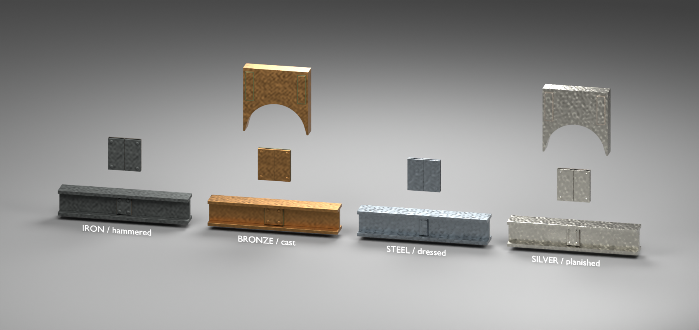
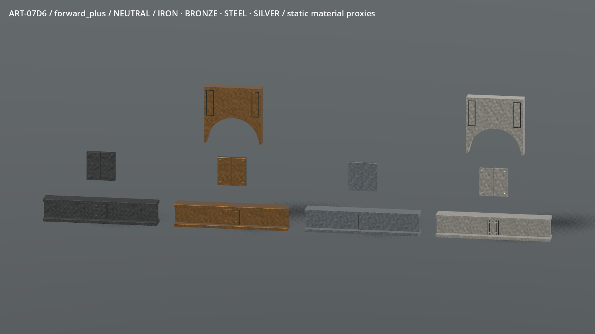
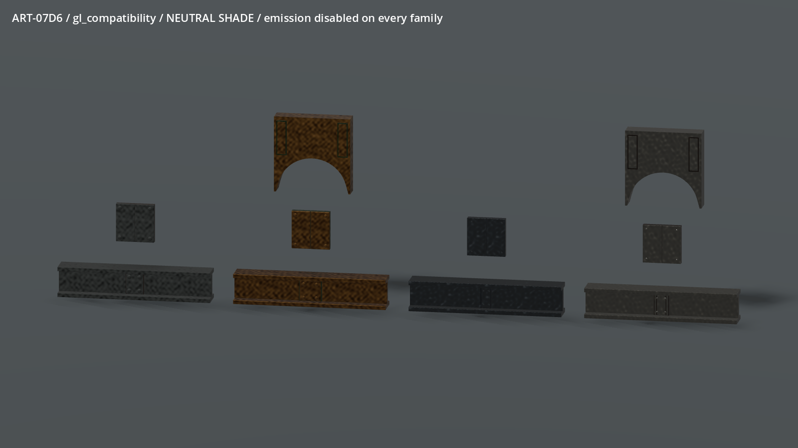
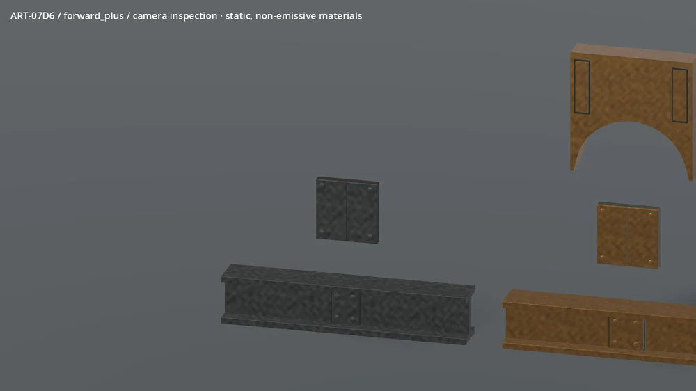
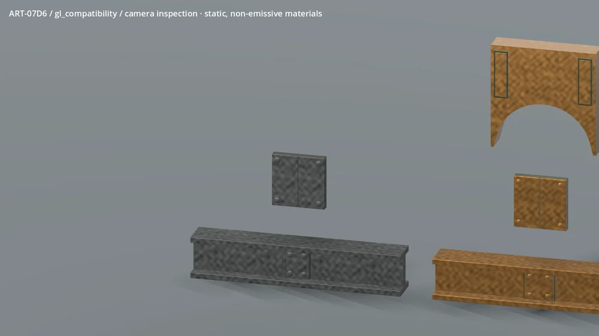

# ART-07D6 — worked metal inspection

Four ordinary metal material sources following the selected ART-07 building
board. These images show actual Blender/Godot geometry, not an illustration or
claimed ordinary-world integration. Owner visual acceptance is pending.

Iron retains the darkest broad finish and generous domed heads. Bronze uses
rounded cast edges and a wider collar with protected green patina. Steel has
narrower joins, smaller hex heads, tighter dressed highlights and cooler
reflectance. Silver is pale and softly planished with small peened pins and
paired dark chased bands. The distinctions use reflection width and physical
details as well as colour; no material emits light.

The measured native-envelope girders, legal bronze/silver arches and half-metre
joint coupons are material proxies. The native girder remains a box and the
native arch uses stepped strips; these study shapes do not change collision,
placement, catalogue eligibility or recipe costs. Coupons are not new pieces.

The loops are 96 actual engine screenshots, downsampled to 1000 × 562 and
encoded as quality-86 animated WebP at 65 ms per frame. They show camera movement
over static material samples, not a pulse, moving mechanism or native work state.
Full-resolution original frames remain in the ignored fresh review directory.

Known visual limits: this is a clean, neutral studio comparison. The broad
hammer field repeats on long spans; final station-specific wear and attachments
belong to their geometry owner. Bronze/silver can read very bright at grazing
light, while shade reduces small fastener readability. The 24 m inspection tests
broad material response, not tiny rivet visibility or a full game's art budget.
There is no organic host or magical structural injury in this assigned slice.

The [receipt](../../../../../prototype/art07-production/receipts/d6.md)
records package hashes, current native regressions, fresh-copy source reopening,
renderer/device measurements and publication status. Source recipes and controls:
[D6 tools](../../../../../../tools/wroughtwild-art07/d6/README.md).
