# ART-07E1 actual model review

Two direct-modelled station candidates, selected v03. Technical evidence does
not imply owner visual acceptance. See the [receipt](../../../../../prototype/art07-production/receipts/e1.md)
for package location, checks, measured costs and limitations.

The packed Blender source has separate editable supports, work surfaces,
clamp/tool components and three detail levels. The stations remain ordinary,
unlit fixtures. Work motion below is the existing native completion effect;
the clamp and tools do not animate or perform automatic work.

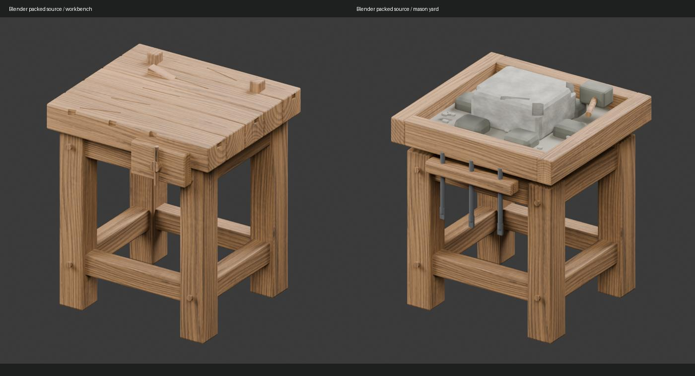

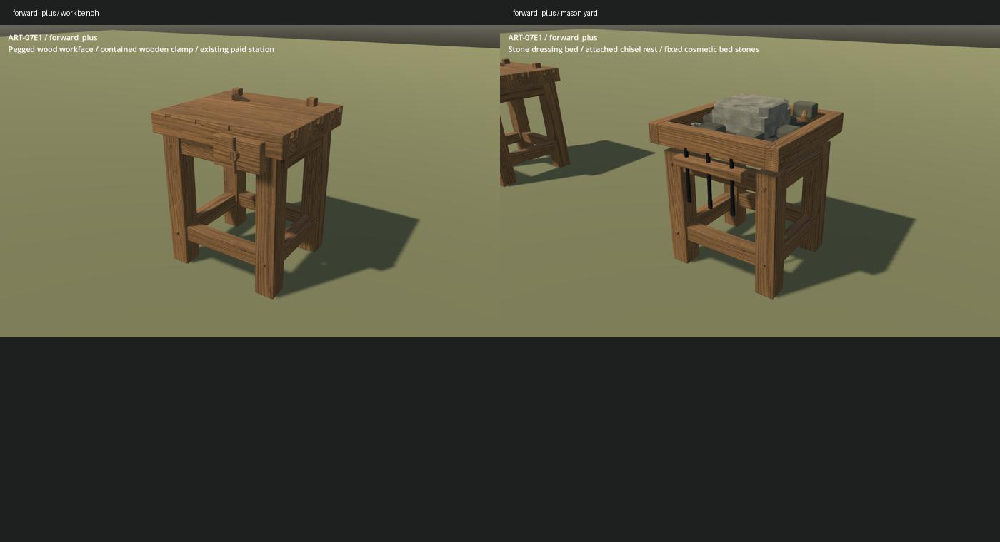

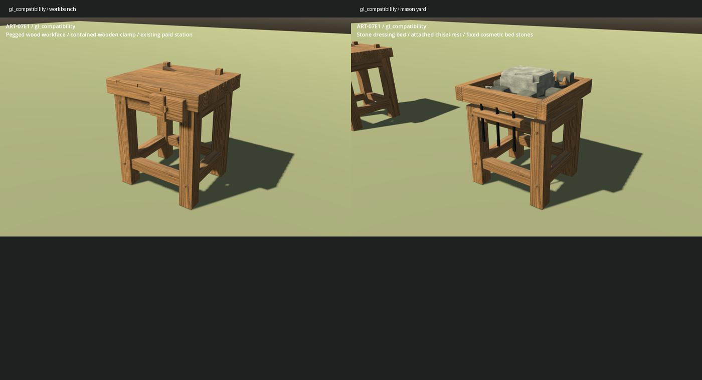

## Motion

Camera orbits: 48 source frames, 3.984 seconds. Work clips: 24 source frames,
1.2 seconds, approximately one-third native speed to inspect the brief flecks.
WebP merges identical idle frames without shortening the clip. Raw frames and
their hashes are retained in the local package and evidence manifest.

| Workbench | Mason's yard |
| --- | --- |
| 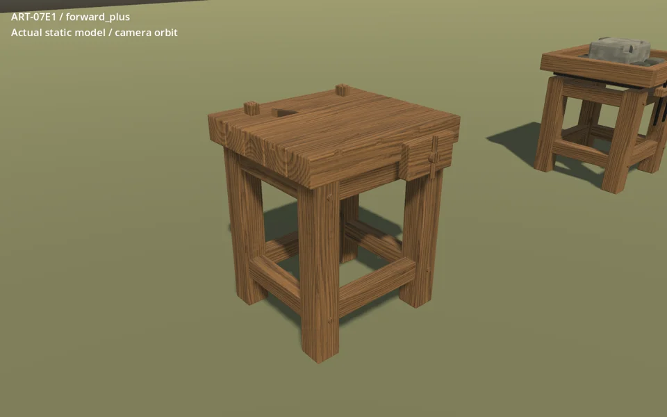 | 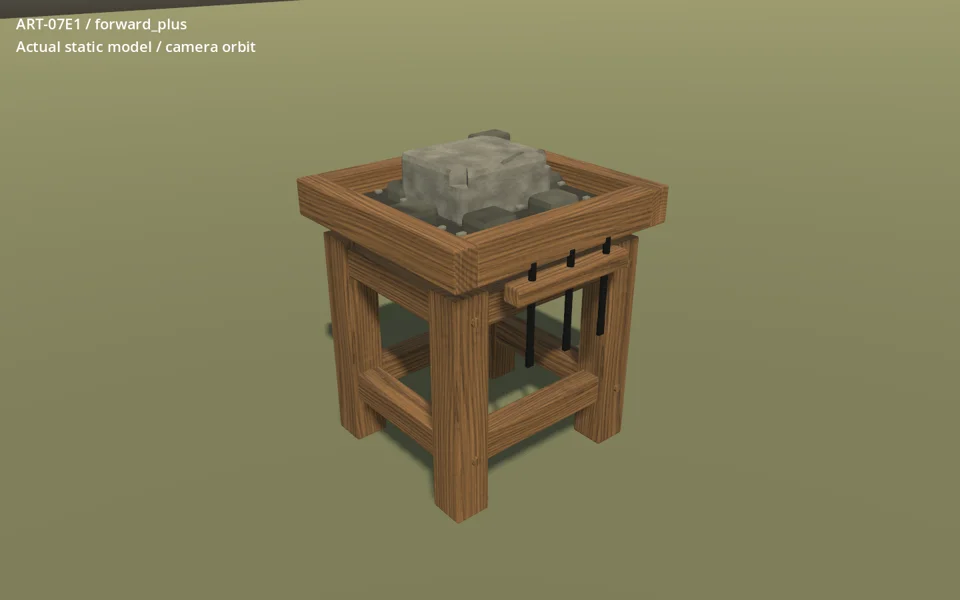 |
| 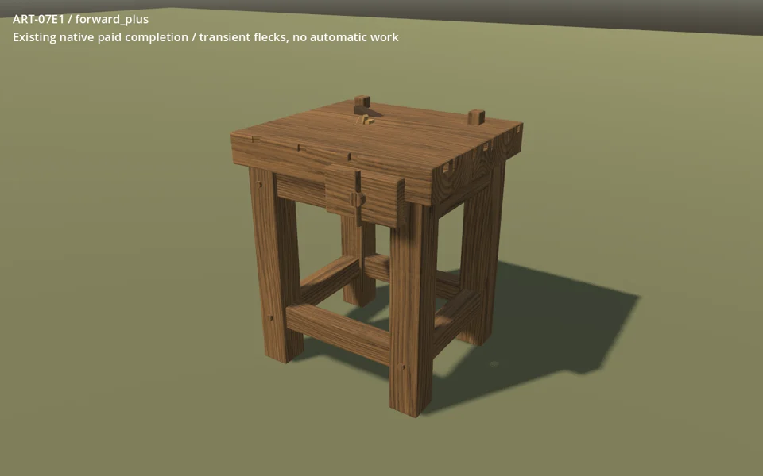 | 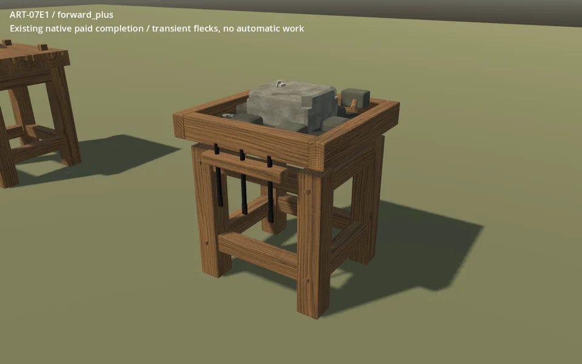 |
| 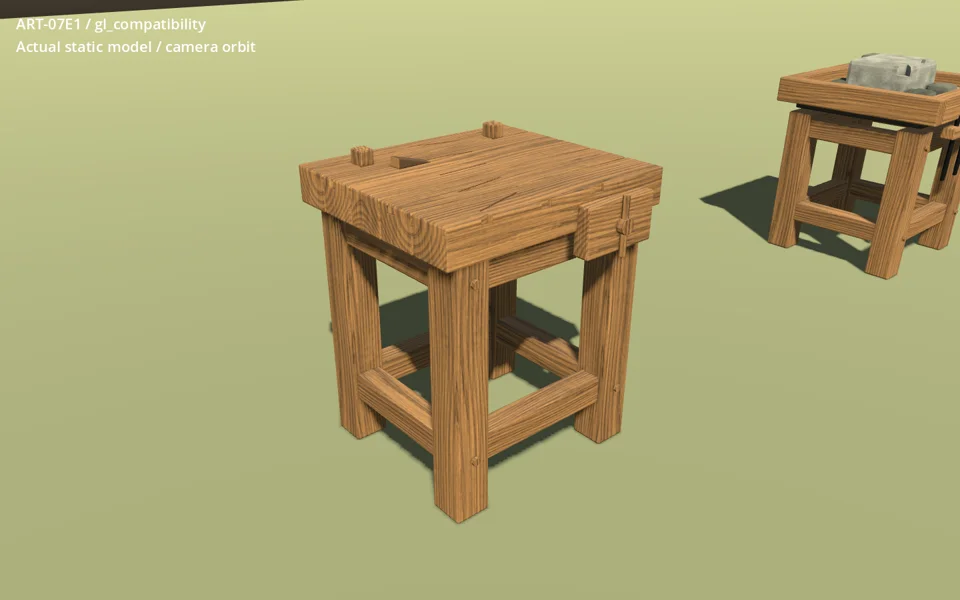 | 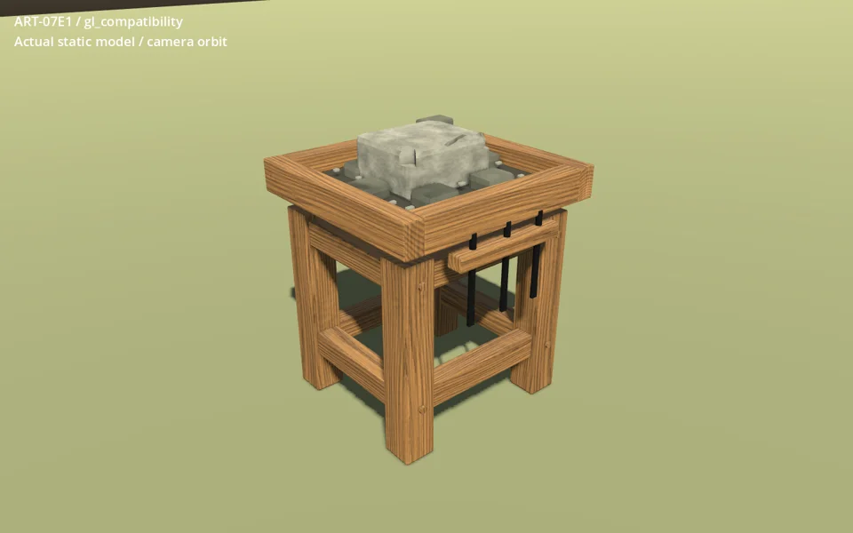 |
| 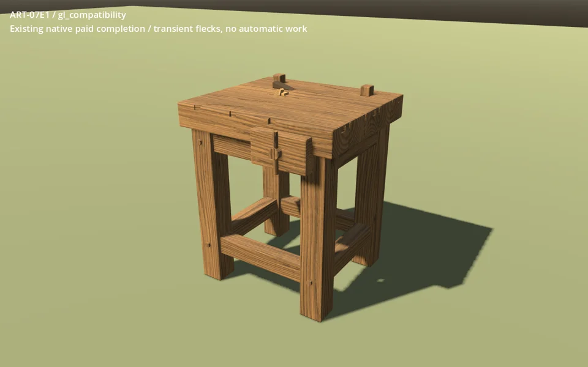 | 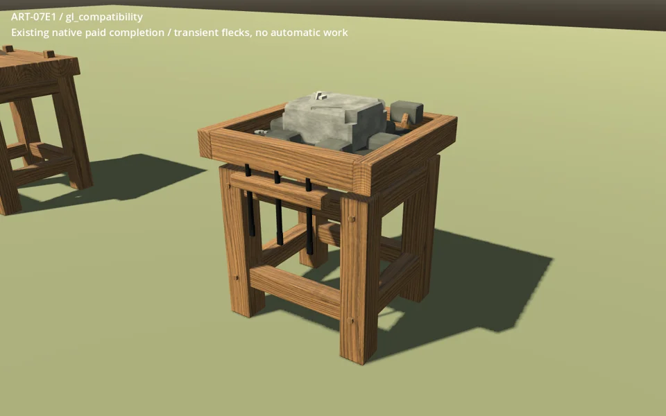 |

## Placement and restoration

The review pays for its first two kits with the original 18 wood and six
fieldstone, including a timber frame made at the bench. Sixteen further corner
kits and wall stock are explicitly granted inspection inventory; actual native
placement consumes them. Both grid anchors, four yaws and both station IDs use
the real floor ray, preview, click and E interaction paths.

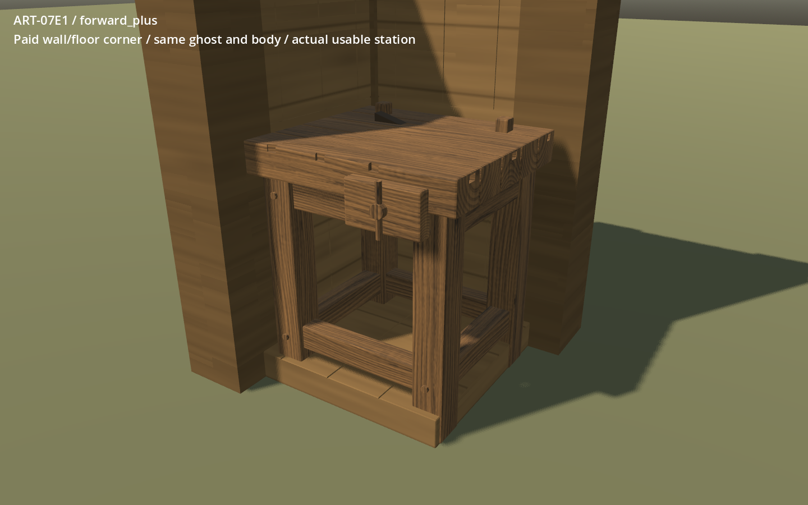

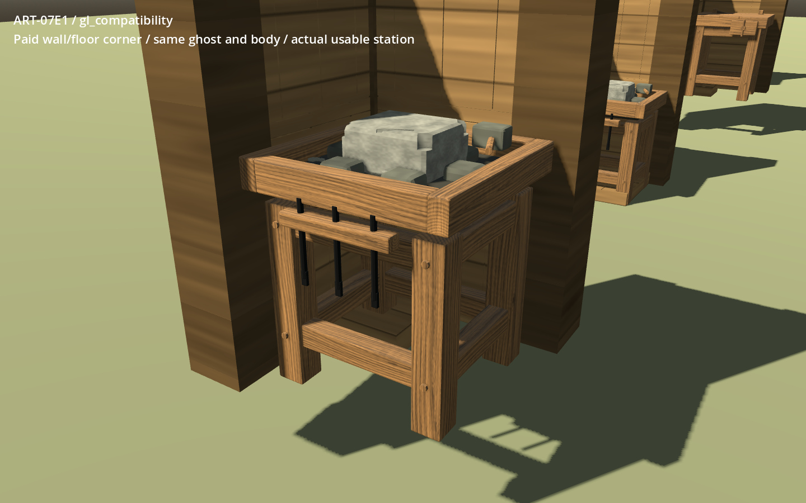

## Limits

The forms distinguish a timber workface from a contained stone dressing bed,
but the finish is cleaner and more regular than the approved weathered board.
D4 grain is periodic in close views. All fine details fit the original body;
the unused air above the low surface remains part of native clearance.

The fixed inspection ground is not a normal-world adoption or a paid gathering
playthrough. No automatic LOD policy, final appearance approval, lower-spec
performance approval or listening review is claimed. Both renderer benchmarks
are short uncontended RTX 5090 runs; their whole-scene memory counters include
all loaded detail levels and cannot measure incremental asset memory.
