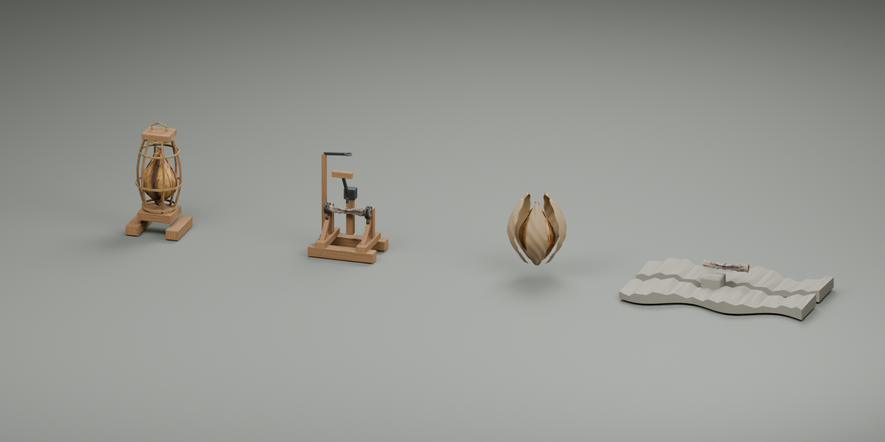
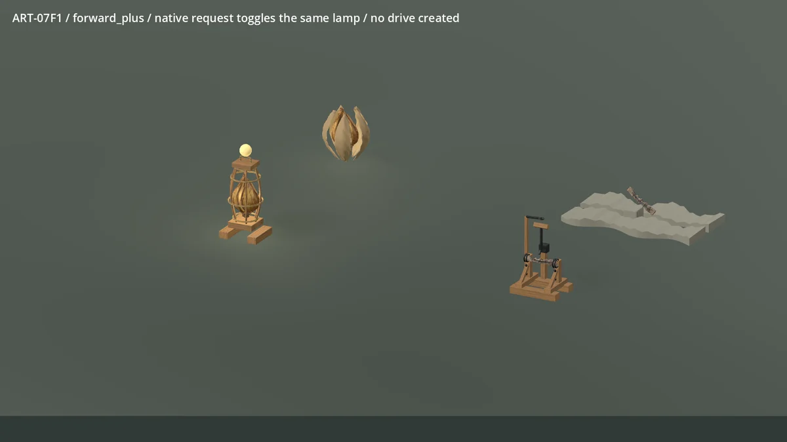
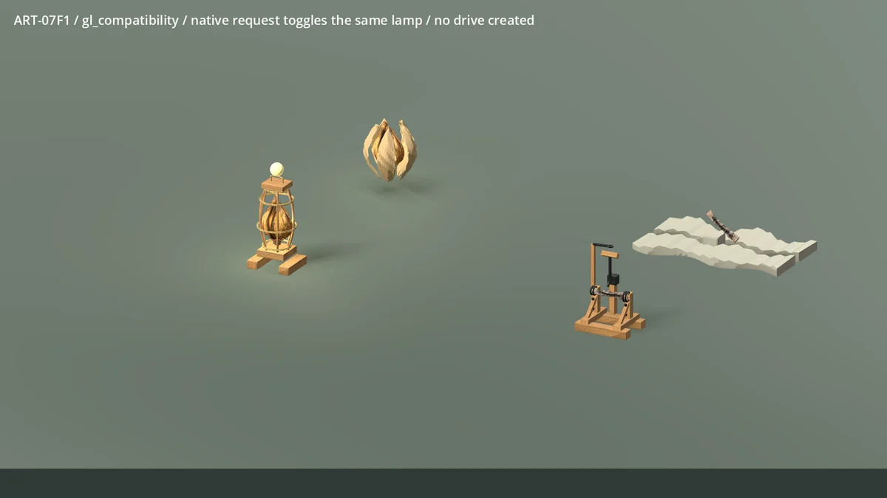
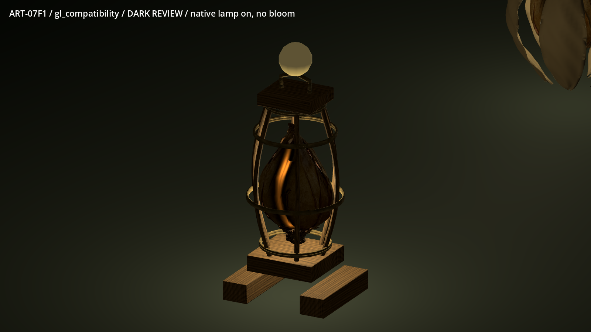
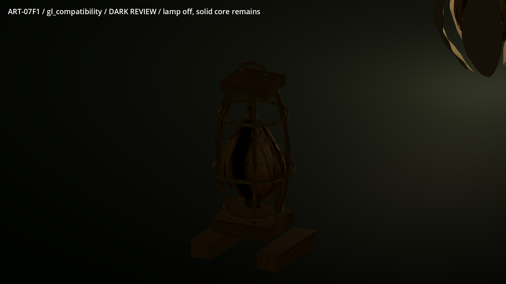
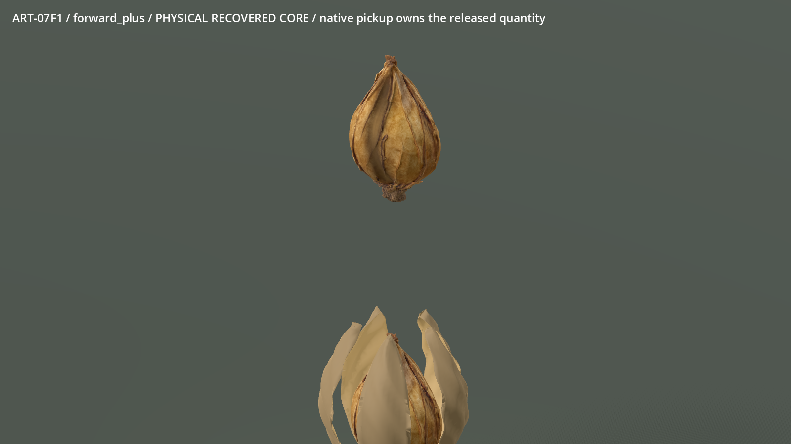
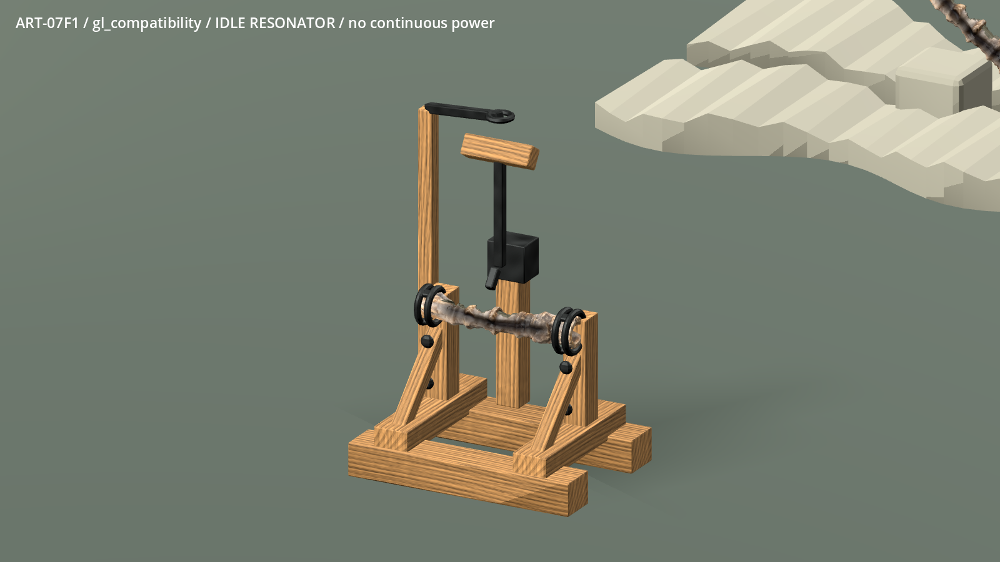

# ART-07F1 actual model review

Technical source candidate; owner visual acceptance and normal-world adoption
remain pending. These are actual Blender 4.5.9 and Godot 4.5 captures of the
selected v07 meshes, with the final g5 native presentation adapter.

Both previews contain 120 actual frames at 30 fps, resized to 1200×675.
No interpolated or generated motion frames. The isolated stage runs the native
work, pickup, paid-kit, placement, request and save pathways. Its finite stock
and common-material grants are inspection setup, not a gathering playthrough.
Native signal-port markers remain visible and are separate from the core light.

The four `*-inspection.webp` sheets show six material and six clay views per
group. Every original angle, both emission settings, packed master, twelve
GLBs and measurements remain in the local handoff. `*-lod-near/middle/far.png`
are explicit detail-level comparisons, not a normal-world streaming policy.
`evidence-manifest.json` hashes curated captures and source motion frames;
`input-manifest.json` records the separate imagegen inputs and raw TRELLIS hashes.

The frame is more regular than the concept and its D4 timber repeats remain
visible. The tube is rougher and thinner than the board; the quiet source bed
and husk still need contextual weathering review. Detailed texture payloads
are comparatively heavy. Both renderers work, but appearance is not identical.
Performance reports are isolated RTX 5090 runs, with and without shadows;
ordinary-world scale and lower-spec devices are untested.

The implementation receipt is
`docs/prototype/art07-production/receipts/f1.md`; reproduction and state contracts
are in `tools/wroughtwild-art07/f1/README.md` and `CONTRACT.md`.
