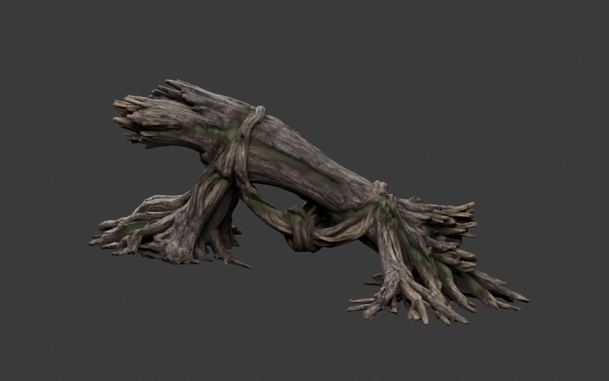
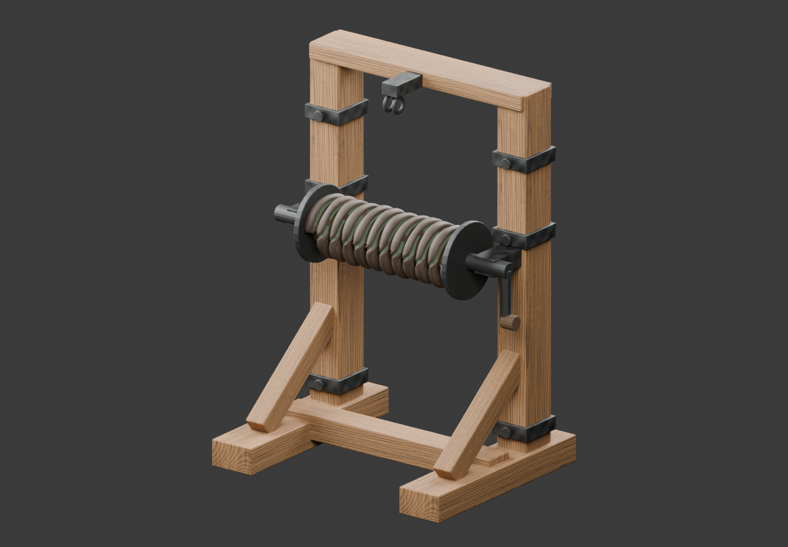
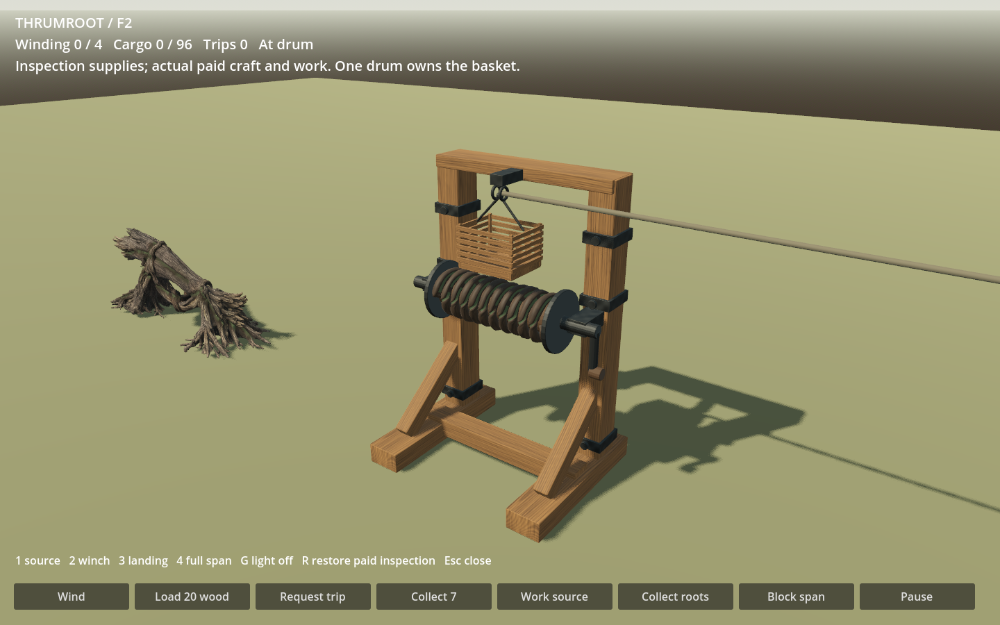
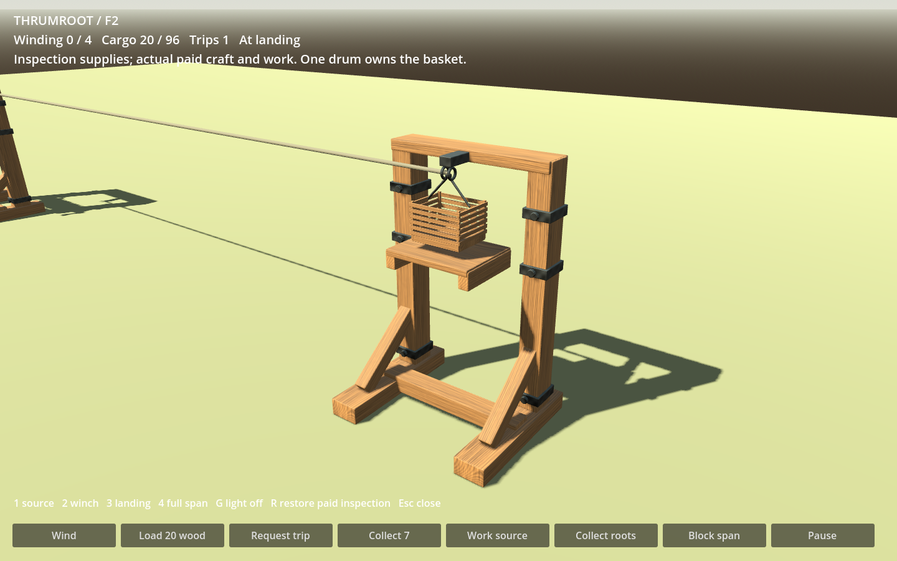
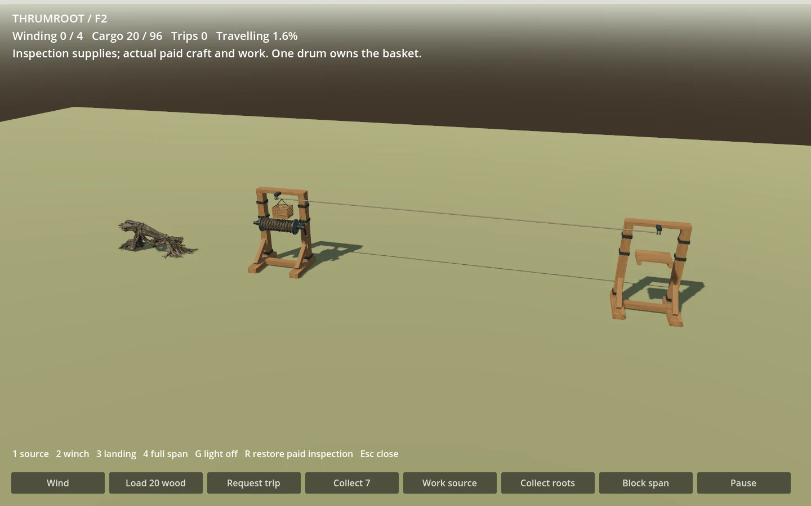
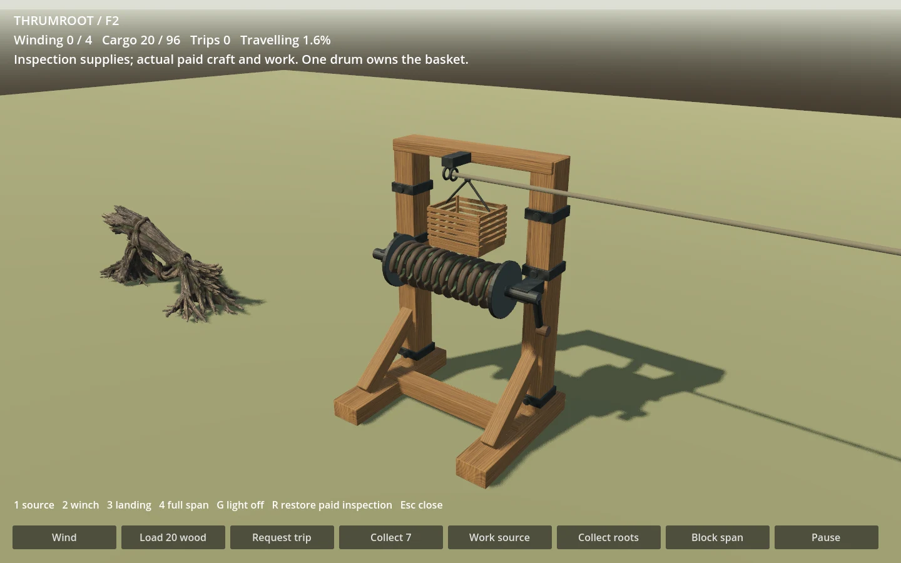

# F2 actual model review

ART-07F2 Thrumroot source, recovered coil, paid cargo drum and ordinary landing.
Owner visual acceptance remains pending. These are actual Blender and Godot
renders of the selected v03 models. `thrumroot-input-v01.png` is the separate
single-object source illustration, not runtime evidence.

Both renderer paths have route and close clips, source/drum/landing views,
recovered sample, emission-off source, obstruction and shade views. The full
unmodified 1440×900 PNG sequences and intermediate work/depletion/winding states
are in the local handoff; tracked WebPs assemble the real frames with no
interpolation. Native sampling is 24 Hz; display duration is 42 ms per frame.

The route and close clips independently replay the same paid native state.
Twenty wood remain with one drum owner, no energy remains after departure,
the physical wall freezes progress at .375 during frames 24–47, and the final
arrival occurs exactly once. Corresponding JSON records state and actual basket
and drum transforms, not only a test's pass count. `evidence.json` includes
per-frame hashes and the independent conservation/pose audit.

The study explicitly grants inspection stock, then uses original paid crafting,
kit placement, source work, winding/travel and cargo collection. It introduces no
economy rule, resource renewal, save schema or second cargo owner. A recovered
coil inspection sample appears when the native pack owns roots; it is static
and cannot be collected again. Full source and integration contracts are in
`tools/wroughtwild-art07/f2/CONTRACTS.md`; the checked receipt is
`docs/prototype/art07-production/receipts/f2.md`.

Known visual tradeoffs: source depth compression to fit the unchanged body,
soft generated bark at extreme close distance, regular recovered-coil winding,
native winding angle snaps, and the brighter Compatibility tonemapping shown
here. Geometry and identity are visible with emission disabled. The scene uses
the near source; middle/far exports are provided for F4. No normal-game adoption
or owner acceptance is inferred from technical checks.
