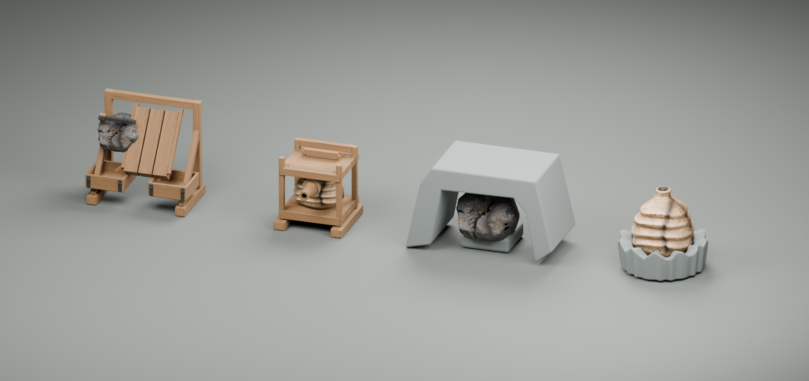
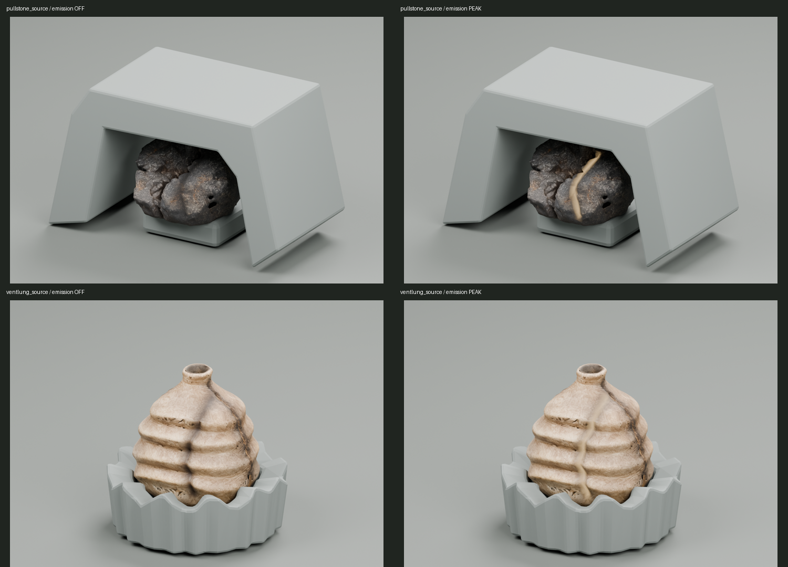
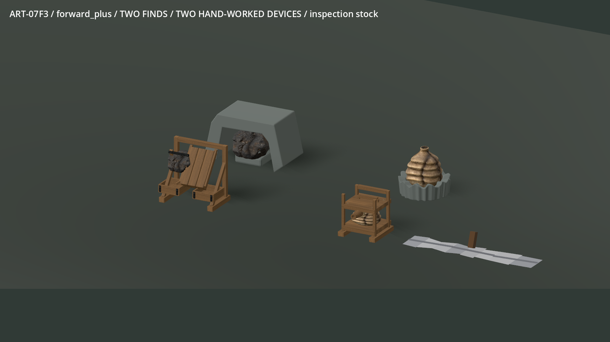
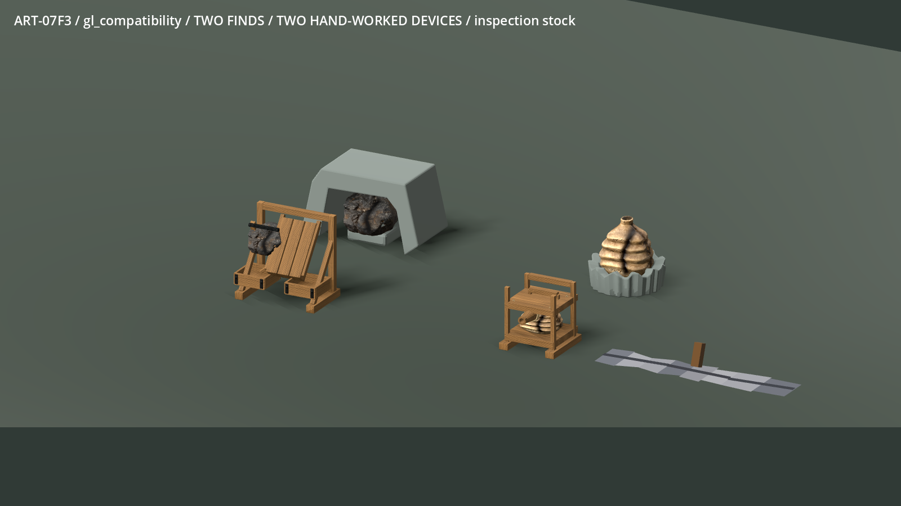
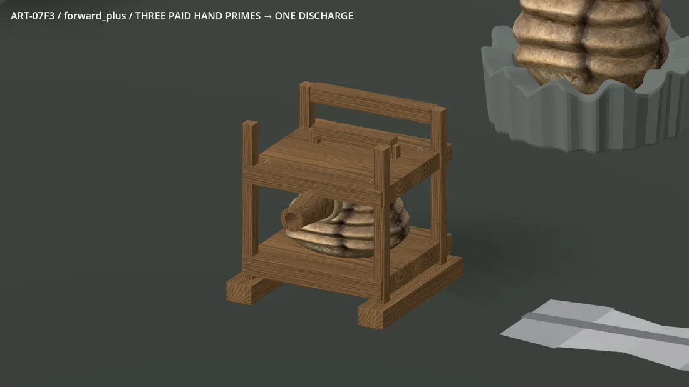
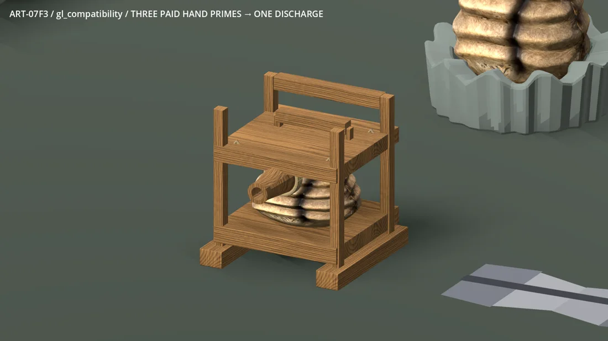

# ART-07F3 — actual source and device study

Two individual image inputs became locally generated Pullstone and Ventlung
sources. The fitted sorting frame, trays, supported bellows/platen and hollow
wooden nozzle were built directly in Blender using the checked D4 wood and D6
iron materials. Input illustrations are not the model evidence.

The selected handoff is an isolated current-native review. Normal recipes,
finite stock, ferrous classification, impact response, ownership, placement
bodies and saves remain authoritative. Owner visual acceptance and ordinary
world adoption are pending. F4 receives the exact unchanged contract after
the dedicated publisher integrates F3.

The motion files are 120 consecutive captured engine frames each, played at
30 fps: three real primes, one paid discharge, then two hand sorts. The pause
check verifies the event phase stops. Contact sheets resize and label actual
Blender/Godot images only. `evidence-manifest.json` records every curated input
and image hash; detailed run logs and full raw evidence stay in the local package.

The safe far Ventlung selection reuses its 8,500-triangle middle mesh after the
aggressive 3,750-triangle collapse lost the folded silhouette. The fitted devices
use 22,040 / 25,284 triangles including every part. The mineral host dressing is
simple, Compatibility responds more brightly to the shared linear lighting,
and the original embedded texture sets remain heavy. Neither RTX 5090 timings
nor passed technical checks imply lower-spec or owner visual approval.

See the [receipt](../../../../../prototype/art07-production/receipts/f3.md) for
the absolute package path, hash, tests, costs and commit; the
[F4 contract](../../../../../../tools/wroughtwild-art07/f3/CONTRACT.md) records
mounts, body bounds, native action endpoints, state and refund behavior.
