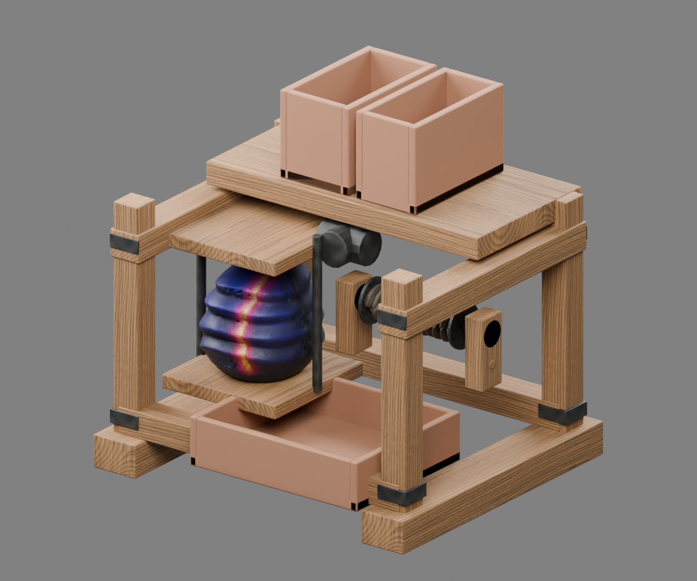
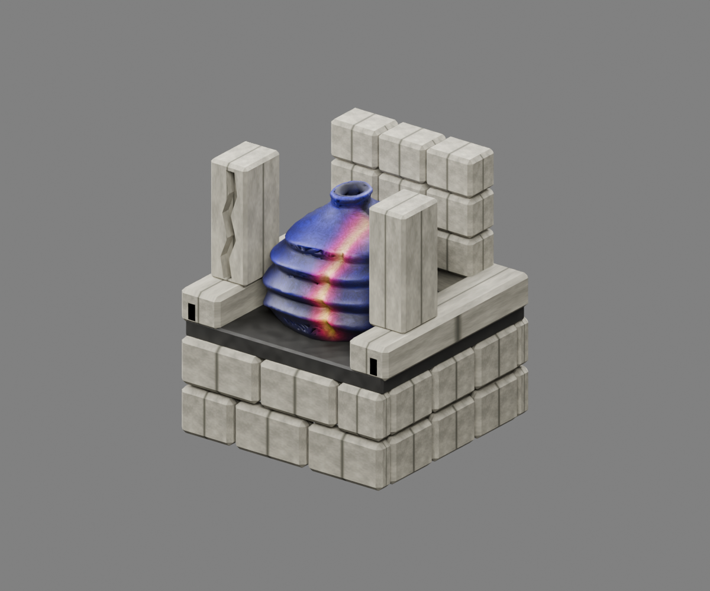
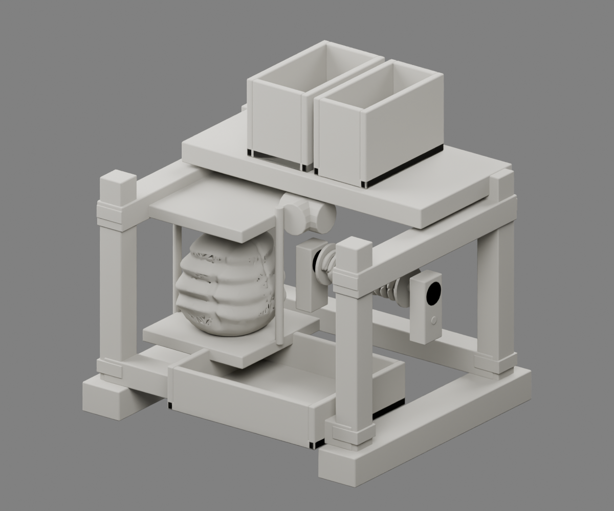
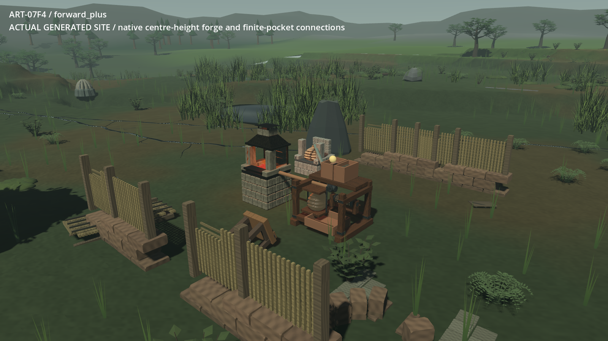
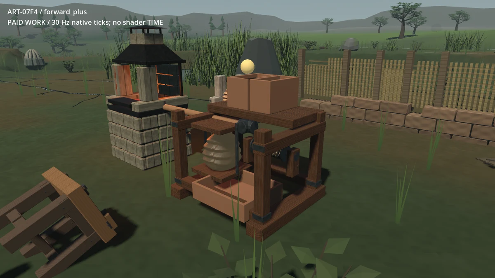
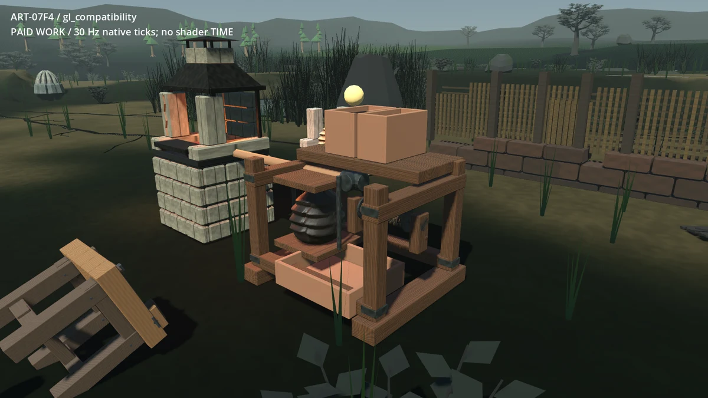

# ART-07F4 — actual pressure pocket and complete feeder

The selected model reuses the published E2 hearth masonry, F2 root drum/shaft/crank,
and F3 folded Ventlung membrane. A metric Blender frame fits the existing feeder
body, separate clay/fuel containers, pressure store and fired-brick tray. This
is a technically checked isolated review; owner visual acceptance is pending.

Each clip encodes 60 actual engine frames: 30 native paid-work ticks, 15 paused,
and 15 blocked by a real physics obstruction. The captured ledgers verify that
paused/blocked ownership and drum transforms stay exact. Review encodes are
1200 × 675 at 33 ms/frame; original 1600 × 900 PNGs remain in the sealed package.
Still images are lossless WebP copies of actual rendered frames. No concept
illustration or generated motion substitutes for the delivered model.

The native scenario tests actual kit placement, loading, escrow, firing,
pause/blockage, output, cancellation, paid construction, recovery, exhausting all
24 pocket strokes, hand winding afterward, and separate-process restoration.
It grants labelled inspection materials; it is not a first-hour gathering run.
The isolated adapter also refreshes a pocket whose depleted ledger is restored
after scene creation, preventing a falsely full reservoir pose.

Limitations: containers and timber are regular, joined panel seams remain,
Compatibility renders the membrane more darkly, and the baseline native pipes
and status sphere remain. Conservative middle/far membranes share the same
8,500-triangle source. Automatic LOD adoption and lower-spec acceptance are not
claimed. All actual costs, checks, source/package hashes and reproduction commands
are in the [receipt](../../../../../prototype/art07-production/receipts/f4.md)
and [contract](../../../../../../tools/wroughtwild-art07/f4/CONTRACT.md).
