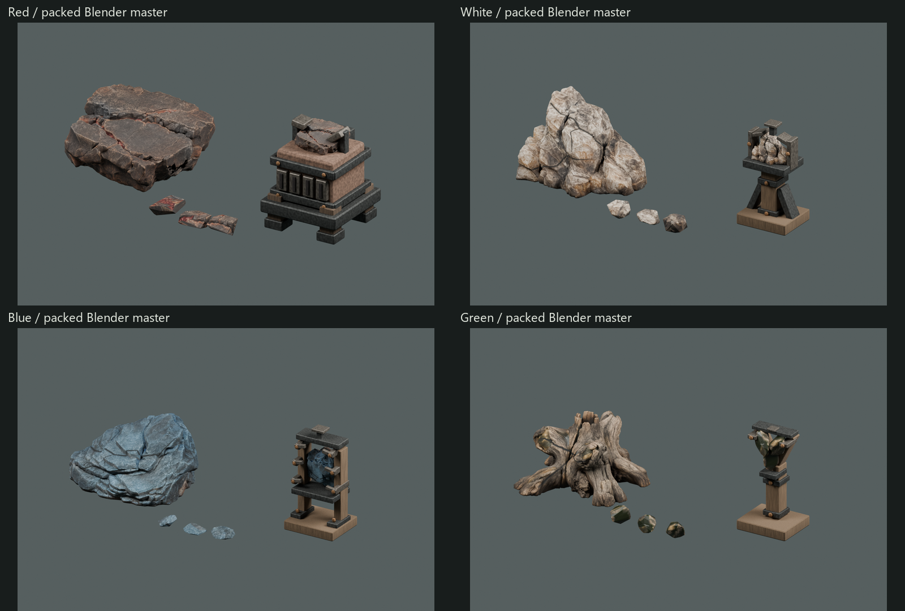
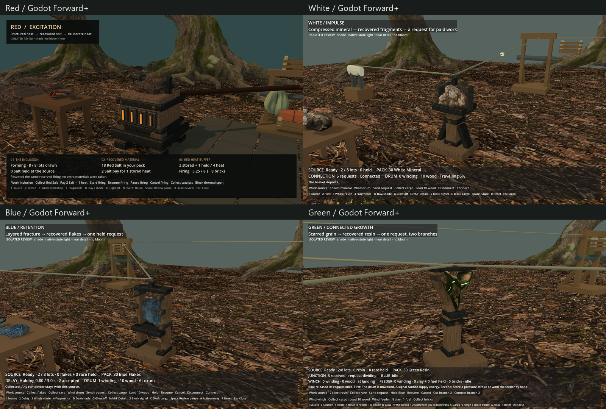
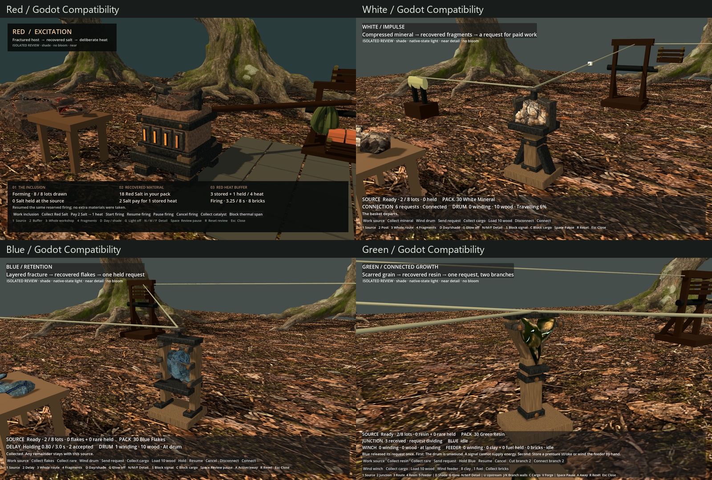
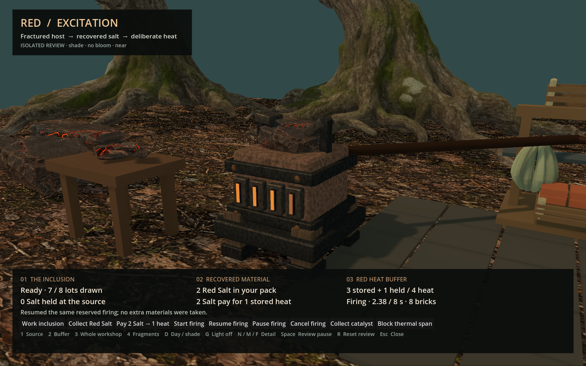
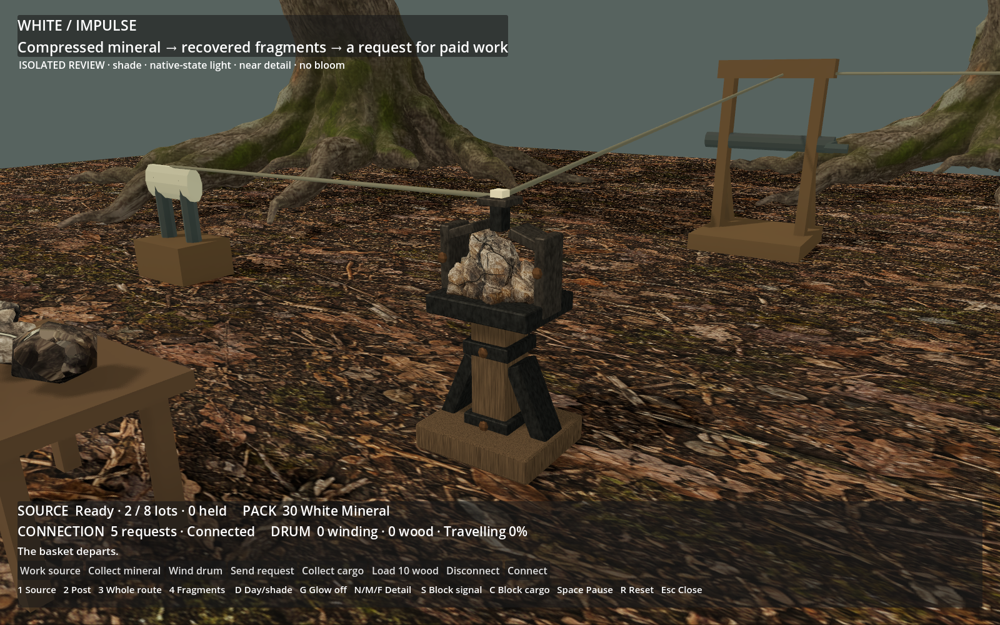
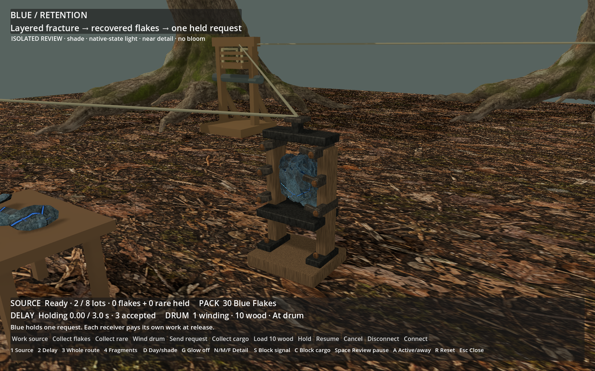
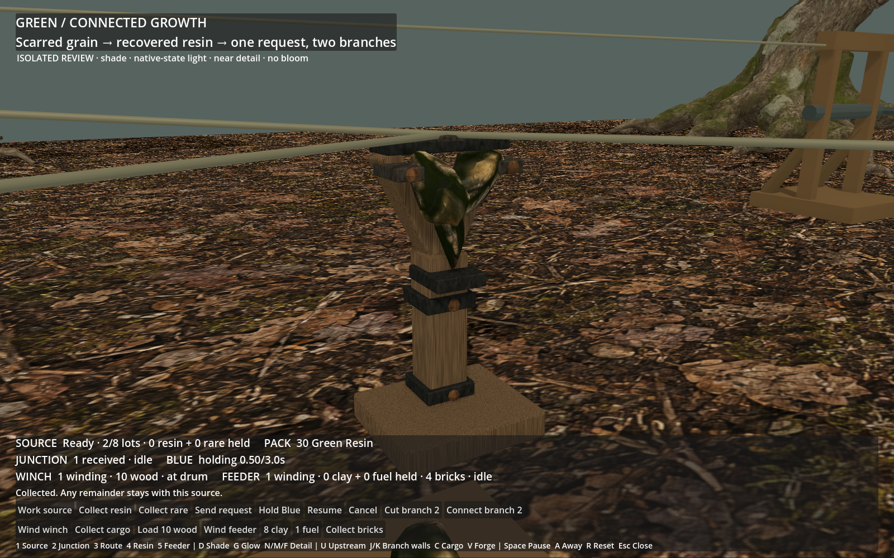

# ART-07F5 — Four colours retained

The approved Red, White, Blue and Green source/material/device families are retained
without regeneration or redesign. This is a dependency, material and attachment audit
plus an isolated current-native comparison. Owner visual acceptance remains pending.

The local handoff is
`C:/Users/Matty/Dev/project-wroughtwild-art07-f5/build/art07/f5/v02/four-colours-handoff`.
Open its `comparison.html` to switch both renderers, source/day/shade/emission-off,
recovered material, device, packed Blender and actual paid-motion views. The package
README has the hash-verifying isolated launcher and reproduction commands.

[Technical receipt](../../../../../prototype/art07-production/receipts/f5.md) ·
[Material/dependency manifest](../../../../../../tools/wroughtwild-art07/f5/manifest.json) ·
[Measured costs](../../../../../../tools/wroughtwild-art07/f5/PERFORMANCE.md)

Actual packed-source Blender reopen:

Actual Godot Forward+:

Actual Godot Compatibility:

Actual recorded native motion. Each file loops the recorded paid sequence; a replay
cannot create more native output. Full-size lossless copies, not concept illustrations:

Source PNG hashes and contact-sheet composition are in `evidence-v01/evidence-lineage.json`.
All 512 source motion frames across both renderers retain exact decoded pixels and
125 ms display intervals. The full package includes both renderer clips and 758 actual
PNG captures. Fresh native and geometry checks, final package hash and branch commit
are recorded in the receipt.

Known limits remain: original source exteriors are not watertight geological solids;
White's far source is 14,989 triangles; all four retain the original approximately
3 mm geometric cuts and 19 authored texture maps each. Whole-review RTX 5090 texture
allocation is roughly 408–770 MiB including backdrop assets. VSync-paced timing does
not certify lower-spec or populated-world performance. Ordinary-world art adoption
and later slices are outside this delivery.
