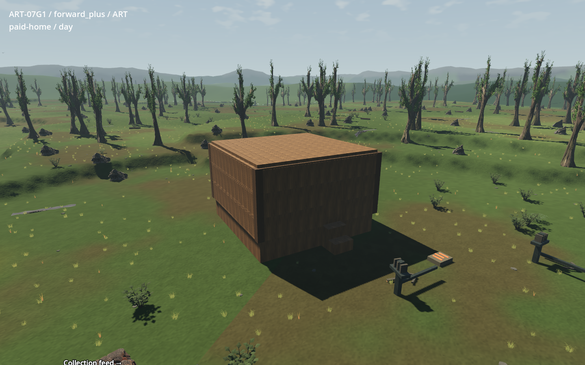
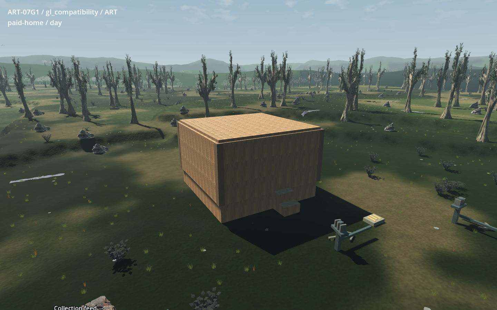
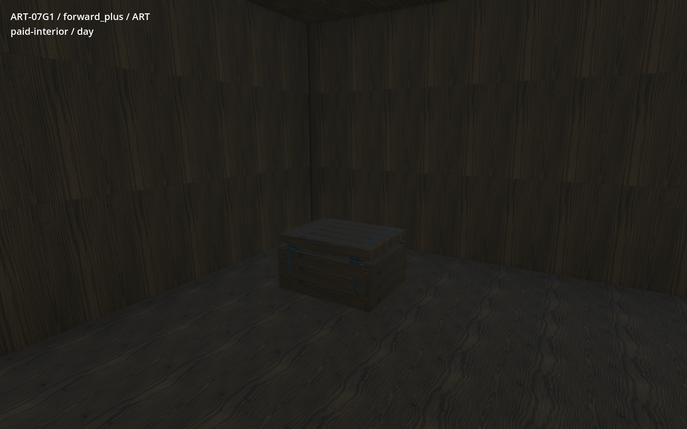
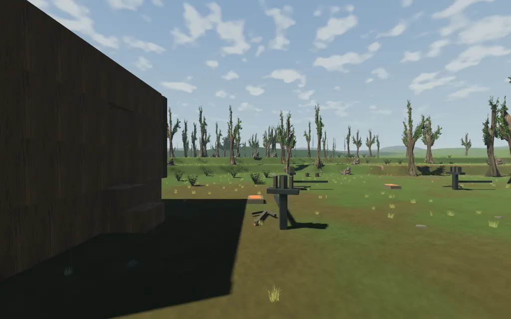
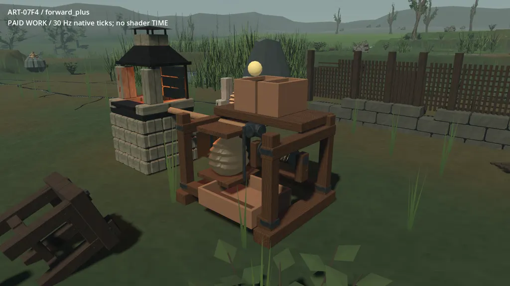
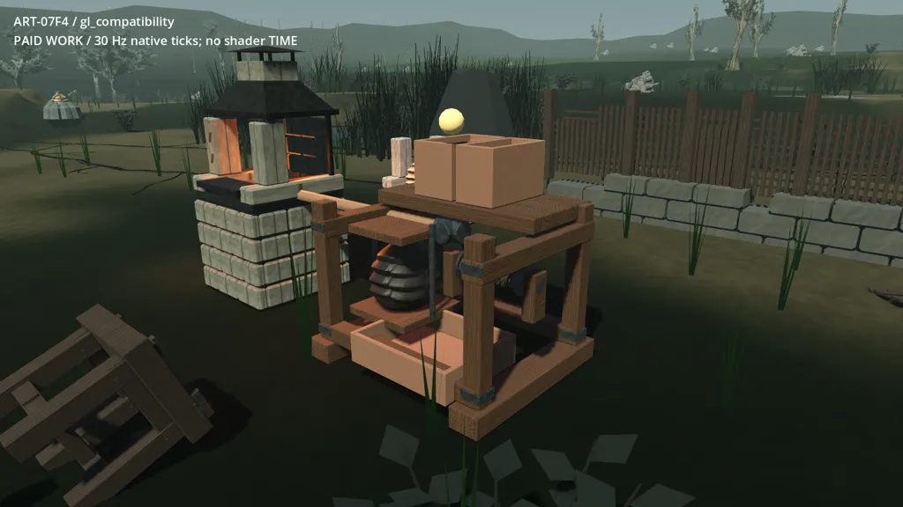
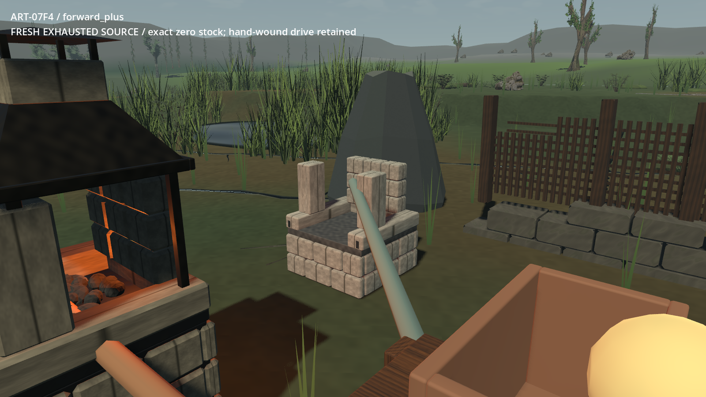
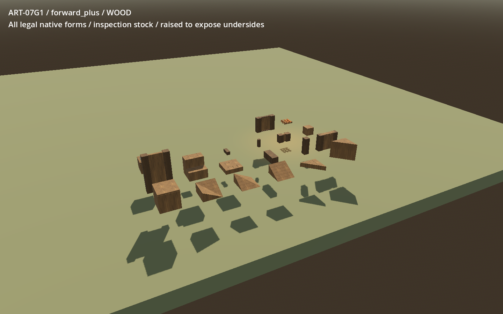
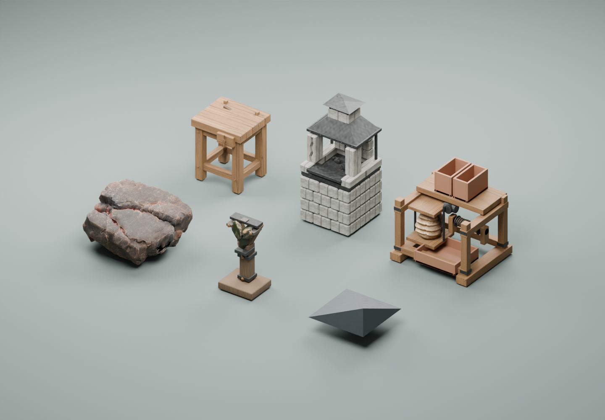
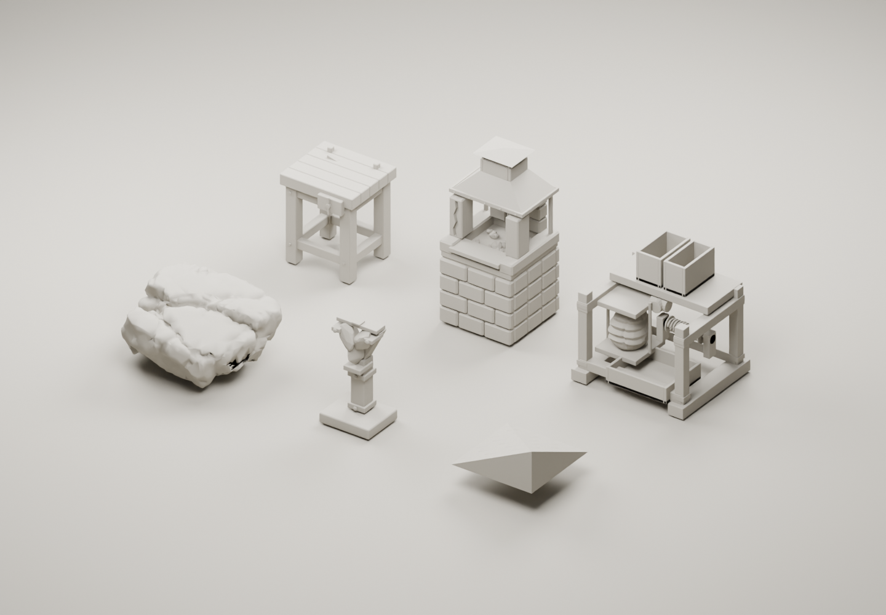

# ART-07G1 — retained route and home integration

G1 combines the checked 24-package index in one copied current game, with an
actual paid LF3 seed-77 home and source route. Owner visual acceptance is pending.
This is the isolated integration gate; G2 and ordinary-world adoption are outside
this delivery. See the [receipt](../../../../../prototype/art07-production/receipts/g1.md)
for the sealed package hash, checked commit and publication status.

Worktree: `C:/Users/Matty/Dev/project-wroughtwild/build/art07/g1/worktree`.
Local package: `build/art07/g1/v06/handoff` relative to that worktree.
Fresh import/launch copy: `build/art07/g1/v06/fresh`.
Game, data and rebuilt native extension share pinned revision
`6bb2e044dcd0bf1788896aa2c19cdf56fee93522`.

The no-grants harness gathered, crafted, worked and paid through native systems.
It built a 6×6 m timber home, paid 188 timber for construction, stored 17 timber
in its chest, and placed three paid stations beside the existing Red-source trail.
The paired art-on/art-off run walked 135.078 m with the native controller and
matched complete snapshots before building, after payment and after the walk.
Gathering travel and target selection are paced by the harness; this is not an
uncut human first-hour playthrough. Separate labelled fixtures use explicit
inspection stock for all 273 legal shape/material pairs and native devices.

## Actual retained home

Forward+, 1440×900, day:

Compatibility, same home/camera/day:

The pinched B1 tree fit and the native chest's 0.15 m floor intersection remain
visible limitations. No body or terrain was enlarged or moved to hide them.
The door, capsule aisle, stairs, shelter, chest ownership and native E panels
passed current checks. Generic building faces use published metric face maps;
full per-face end-grain treatment remains a finishing limitation.

## Actual motion and native workshop state

This ordered route capture starts from the actual paid checkpoint and uses the
native controller. Playback cadence is illustrative, not a frame-time result.

The feeder sequence follows native 30 Hz ticks through working, paused and
physically blocked states. Paused/blocked frames retain the same escrow and pose.

The original source observer could leave the initial full membrane visible until
its next presentation frame after load. G1 now refreshes the pocket directly from
the restored native ledger before world recovery resumes. Both renderer checks
retain exact exhausted stock, fractional firing escrow and ordinary hand winding.
F1 requests create no drive. F5 source/fixture visuals read native counters and
paid progress; loading does not synthesize a delivered request or work pulse.

## Catalogue and packed Blender inspection

The isolated catalogue verifies all 273 legal native pairs, including chamfered,
triangular and octagonal forms, original family gates, exact payment, duplicate
refusal and unchanged collider decomposition. Forms are raised to expose their
undersides. Regional slate/shellstone and F1–F3 source/device cases have separate
labelled native-state captures in both renderers inside the package.

All 30 unchanged copied Blender masters were reopened; all 477 file images were
packed. Six runtime GLBs were imported into this static metric assembly, packed,
reopened, and rendered with Blender 4.5.9 / Cycles CPU / 8 threads / 24 samples.
The F4/F5 externalized runtime maps are explicitly bound for the emission-off
material view. This assembly is an inspection of actual geometry, not a second
gameplay map or native work simulation.

## Costs, detail and evidence

The [full cost comparison](costs.md) records all 16 matched camera/light pairs,
total loaded textures/buffers/video memory, unique geometry, instances and
explicit per-input LOD choices. At 1440×900, 4× MSAA and vsync off, RTX 5090
art-on medians were 2.666–3.835 ms in Forward+ and 4.729–6.154 ms in Compatibility.
Loaded art textures were 1,307.8 / 1,288.5 MiB respectively; unique live-scene
geometry ranged from 2,420,221 to 2,503,669 triangles, including hidden stages/LODs.
These are local hardware measurements, not a broad performance acceptance.

Only matching B2 cover roles and B4 rooted motion are adopted into existing
decorative envelopes/counts. Their other composition assets remain supporting
inspection sources with no invented generated anchors. Native distant canopy,
water and atmosphere remain in use. C5 raised ore is fallback-only; ordinary
faceted ore retains its thin ribbon. Full source receipts/manifests remain
available in the handoff for every consumed package.

`media.json` records actual image/frame provenance, hashes and encoding cadence.
Images are direct copies; WebP motion contains resized original frames with no
interpolation or synthetic frames. The package's `evidence/validation.json`
records successful commands/exit codes, while `diagnostics/` preserves rejected
attempts separately. The strict runner rejected dummy-renderer shutdown errors
for D3/catalogue; the unchanged assertions passed in supported renderers.
Expected unit rejection warnings, some fixture ObjectDB cleanup warnings and
Compatibility's native unsupported-SSAO warning are not hidden.
