# ART-07G2 — independent full-kit review

Completed 13 September 2026. **Bounded technical clearance for the sealed G1
review package; visual completion and the rollout cost gate remain open.**
All 64 independent subprocesses exit 0, both renderers cover all 273 legal
building pairs, and native ownership/geography agree with art disabled.
Eight isolated source fixtures still emit shutdown cleanup warnings. The
selected fuller habitat, material joins and supporting composition need further
work. Owner visual acceptance is pending. This session did not implement G1,
changed no game content, and performs G2 only.

The [executed checks](checks.md), [measured costs](costs.md),
[hashed check receipts](checks.json) and [render/frame provenance](media.json)
separate fresh independent evidence from the earlier publisher checks.

## Scope and verified lineage

Review branch `codex/art07-g2` starts at published main
`8439b5a7745ca491b694406789273a412aec44d2`. G1 implementation and receipt commits
`1d3d3ce29c4afe7e1db970b880953e92035a0b7b` and
`4412781c70ce8cbc7651f9262df6831593b83874` are ancestors of `origin/main`.
The exact G1 package seal is
`fd5c592ef52185cc7d0737840e41af09dbb5bcea36b719539931e156f42865cd`:
5,701 files / 7,430,015,212 bytes. All 24 source packages independently rehash:
35,779 files / 19,093,094,616 bytes. Their published receipts and exact absolute
paths are recorded in the G2 input verification output.

The worktree is `D:/project-wroughtwild-art07-g2`; C: had only about 1.8 GiB free
at entry, so the new copy and evidence use D:. No old worktree, package, build or
cache was deleted. The owner's C: checkout and its unrelated captures, imports,
save fixtures and branch were preserved.

The G2 output root is `D:/project-wroughtwild-art07-g2/build/art07/g2/v01`.
`sealed/` is a complete byte-verified copy; `review/` is a second 4,787-file /
3,438,257,458-byte runtime copy, initially free of inherited engine caches.
Imports, test saves and captures run only in the G2 copy. User, local-app,
temporary and Blender directories live under the G2 output root.

Game/data/native pin: `6bb2e044dcd0bf1788896aa2c19cdf56fee93522`. Native DLL:
`0e7c4956b6c870f5879e78f54c5830509b7ae37913055543cc3a6d451298e0e1`.
The independent audit compares both archives to pinned Git blobs and reconstructs
all 16 changed original runtime files from the recorded presentation hooks and
isolated project settings. Other differences are explicitly recorded line-end
conversion; no simulation/tuning or actor-mesh change is accepted.

The original archives contain Windows CRLF exports: 1,046 of 1,145 game/data
archive entries and 78 of 80 native archive entries match their Git blobs after
only CRLF-to-LF conversion. Sealed bytes are never normalized. Of 805 non-UID
baseline runtime files checked, 700 match their archive bytes, 89 differ only by
line endings and 16 reproduce the recorded semantic hooks/settings. The 340
UID entries excluded by the G1 manifest are generated sidecars, not new source
omissions. Published G1 recipes retain equivalent executable statements; only
`build-native.ps1`, `gpu-slot.ps1` and `paid.gd` have the documented trailing
blank-line difference after line-ending normalization.

## Independent technical evidence

The current catalogue validators pass: 26 shapes, 19 material families, 273
legal pairs, 14 kits, one in-place forge upgrade, 22 finite resource types,
33 supporting environment roles and 16 actor/host IDs. Dispatch validates
26 prompts, 131 exclusive catalogue owners and 60 dependency edges. Six original
concept PNGs/prompts and their edit ancestry remain intact. This is design
coverage; it does not certify every role as visible in the retained pilot.

The actual paid art/baseline runs match complete initial, paid and final
snapshots and the 135.078021510504 m controller walk. The canonicalization parses
native JSON and sorts finite/station records; it removes only ephemeral station
scene-node names, retaining persistent station keys and all saved ownership.
The final-hook probes independently reproduce geography hash
`550b2d742314136a71a8c177920059bd245996e744b8722c8ba8c68afbde4a70`
and canonical snapshot hash
`2fe1ad3fa6b4581996b94b451d7d05c5d135c11281517f76f70bbf4ef1001aba`.

G1 gathering travel and building target selection are harness-paced. Finite
acquisition, native payments, controller travel and saved restoration are real;
this does not certify an uncut human first-hour playthrough, combat balance or
ordinary discovery comfort. Other source/device/catalogue cases explicitly
supply inspection stock and retain their native transactions and assertions.

The fresh import uses Godot 4.5 stable (`876b29033`). Core checks include 398
unit checks, 470 placement transaction checks plus 60 fresh-process restore
checks, 5,254 scenery-placement checks, 1,027 home/workshop checks and 175 save
recovery checks. Each renderer independently runs 1,861 catalogue checks for
273 unique legal pairs. D1/D2/D3 placement and reload cases exercise coarse
forms, native roof gates and fine octagonal/chamfer/triangle uses: respectively
8,169/7,676, 6,563/6,164 and 35,310/40,431 checks.

B1/B3 and C1-C5 native flows replay finite depletion and retained geography;
C1-C5 partial saves are reopened in separate processes. E1-E3 and F1-F3 replay
placement, paid work/storage/device state and fresh-process restore. In each
renderer F4 passes 227 work checks, 32 fractional-reload checks and 29
exhausted-reload checks. The delivered synchronous restores are exercised before
recovery input. Real pause and a physical blocker preserve escrow and drum pose.
Failed placement retains the kit; successful placement creates exactly one
usable object. Neither art toggle mints inventory or alters finite resources.

The paid art and baseline harnesses each pass 865 checks; the correct separate
paid restart passes 8. The 78-frame controller capture is real movement, with
harness-paced targets and illustrative playback cadence. It is not a human
first-hour timing result. F4's two 60-frame sequences contain 30 work ticks,
15 paused ticks and 15 physically blocked ticks at native 30 Hz.

Blender 4.5.9 reopens all 30 copied masters and confirms all 477 file images
packed. Six representative GLBs are freshly imported with finite vertices,
assembled only for static inspection, packed, saved and reopened. CPU Cycles,
24 samples and eight threads produce 1440x1000 material and emission-off clay
views. The staging offsets, including the raised roof sample, are inspection
positions and do not claim native placement or a second gameplay map.

The final preservation pass rehashes the canonical G1 package and all 24
prerequisites unchanged. All 4,787 original runtime files are checked again:
4,786 remain byte-identical; only `game/g1/paid-home.json` changes through the
sealed paid harness's documented checkpoint write. Its `.previous` file and
all other fresh test outputs are inventoried. All scripts, models, textures,
engine binaries, native DLL, data and tuning remain exact copied bytes apart
from the explicitly new `game/g2` inspector directory. Generated caches and
sidecars stay local. The source and companion seals remain unchanged.

## Visual findings and owning slices

These findings are review handbacks, not instructions implemented by G2.

| Finding | Owner | Observation and bounded next review |
| --- | --- | --- |
| G2-V01: canopy/fullness shortfall | B1, C4 and G1 | The live audit measures 289 wood trees at 0.2694963 horizontal scale and 32 pines at 0.1313987, both at vertical scale 1. The whole-tree fit preserves the 0.7 m walk-height body but also compresses upper crowns. Actual trees are thin upright silhouettes with little crown overlap. Refit/re-author the lower trunk inside the native body while preserving attached upper crown mass; compare player-height day/shade/dusk views without changing spawn positions or collision. |
| G2-V02: generic material joins | G1 with D4/D5/D6 | Generic building surfaces choose the same face maps through triplanar projection; the frame role mainly darkens them. Repeated grain and weak end/edge distinction remain visible. Finish face/end/edge roles within existing forms and gates, then inspect coarse/fine joins and rotations. The paid flat-roof home does not demonstrate the illustrated pitched cottage; the existing roof unlock is still required. |
| G2-V03: chest/floor intersection | E3 | The inherited native seating places 0.15 m of the chest through a flat floor. Storage and hinge/body authority remain correct. A bounded visual fit review must retain the existing placement/body contract; any proposal to move the actual seat/body is a separate decision. |
| G2-V04: raised ore coverage remains restricted | C5 with G1 | The adapter immediately returns on faceted terrain. Raised ore is an inspected fallback candidate; the ordinary faceted ore ribbon remains. Resolve its visual envelope against the existing terrain/excavation contract before claiming ordinary adoption. No collider/geography enlargement is authorized by this finding. |
| G2-V05: supporting habitat roles not composed | B2/B4 with G1 | Only meadow grass, edge grass and sparse fern map to existing cover entries; B4 contributes rooted sway. Other supporting roles do not receive invented anchors. Ground remains sparse and repetitive. A bounded retained-anchor composition pass is still needed for the selected full habitat direction. |
| G2-T01: fixture shutdown cleanup | B3/C1/C2/C3/C4/E1/F2/F3 | Eight source-fixture processes exit successfully with `ObjectDB instances leaked at exit`. Retain this reproducible cleanup handback; object attribution and long-session leak behavior are unmeasured. It is not a native payment/reload failure. |
| G2-C01: cost gate remains open | G1 and relevant source owners | Hidden stages/LODs remain resident; exact duplicate PNGs also inflate package size. Use the independently replayed cost table to address residency/detail selection and test a selected target device; an RTX 5090 run is not a general runtime budget. |

Deep geometric host/root/membrane damage is assessed with emission disabled and
packed-source inspection. F4's emission toggle applies to its feeder/pocket;
the adjacent forge's separate heat response is not disabled by that control.
Small recessed drum routes are less conspicuous than the larger host wounds,
and the very regular frame/trays remain visibly simpler than the selected
fixture board. These observations do not change native work, heat or drive.

## Independent cost finding

On Windows 11, Ryzen 9 9950X3D and RTX 5090 (591.86 driver, 32,607 MiB VRAM),
Forward+ art median frame times span **2.762-3.921 ms**, p95 **3.134-5.023 ms**,
and worst sampled frame **6.617 ms**. Compatibility spans **4.798-6.589 ms**
median, **5.544-7.407 ms** p95, and **8.956 ms** worst. Each of 16 matched
camera/light pairs has identical camera, target, active resource IDs and chunks.
These measurements use a 1440x900 viewport, 4x MSAA, disabled vsync, 120 warmup
and 300 sampled frames. Four separate processes run without captures,
generation or competing art/compiler processes. Full baseline/art rows and draw
counts are in [costs.md](costs.md); fewer draws do not imply lower total cost.

Loaded art textures are **1,307.8 MiB Forward+ / 1,288.5 MiB Compatibility**,
compared with 217.1 / 69.5 MiB baseline. Live unique base-mesh triangles,
including hidden stages/LODs, are **2,420,221-2,503,669** versus
786,695-795,113 baseline. These are not visible-triangle counts or multiplied
instance totals. B1/C4 and cover select LOD2; F5 selects middle. Other sources
and retained hidden work stages keep substantial resident geometry/textures.

Engine-clock setup through paid restore and camera setup takes **91.306 s art /
11.808 s baseline** in Forward+, and **87.482 / 11.319 s** in Compatibility.
This is one already-imported process per mode/renderer, including world
construction and restore, excluding subsequent per-view focus/warmup; it is not
a repeated cold-disk startup study. It is a material delay requiring a G1
loading/residency handback, independent of the settled frame rate. The original
fresh import is separately logged at 73.26 s.

The byte audit also finds **823 redundant standalone PNG copies**, totaling
**1,061,048,169 bytes beyond one copy per hash**. This is disk packaging evidence,
not a predicted GPU saving. No memory budget or target minimum device has been
approved by G2. Residency, setup time and representative lower-spec measurement
remain open before ordinary-world rollout. No arbitrary budget was invented.

Compatibility warns that SSAO is unsupported in both art and baseline. The
renders are therefore backend-specific appearances. Expected invalid-input and
corrupt-save warnings remain in the test log; no fatal engine/script error is
accepted. The eight shutdown warnings are tracked separately as G2-T01.

## Retained actor and host identities

All 16 `world.json` IDs, their native definitions, visual redirects, existing
GLB hashes, body definitions and creature/host presentation scripts match the
pinned original runtime. Five LF hosts redirect to the existing stag, moth or
boar. The already adopted boar/wolf/stag/moth retain their existing version-2
rigs; this review does not create another rig.

Six IDs still use older version-1 presentations: `cinder_archer` (approved
porcupine), `stone_husk` (bighorn ram), `shrieker` (crane), `gloom_crawler`
(ground beetle), `bog_lurker` (dragonfly nymph) and `hollow_knight` (tortoise).
Their selected ART-06C ancestry briefs remain unchanged. The G2 lineup labels
both selected ancestry and actual retained presentation. ART-06C rigging,
deformation, later-era augmentation and normal adoption remain their own
unfinished work; this environment review does not claim those animals are
already adopted or visually accepted in-game.

## Fresh actual model evidence

All stills below are unretouched fresh G2 renders. Their in-scene G1/F4 captions
come from the sealed scenes being replayed; provenance identifies the new G2
process and source file. Captured home/catalogue views are 1440x900, F4 views
1600x900, fauna 1600x1200 and Blender 1440x1000. Full native-resolution frames
and both-renderer galleries remain in the local evidence package.

Forward+ and Compatibility retained paid home, followed by dusk and interior:

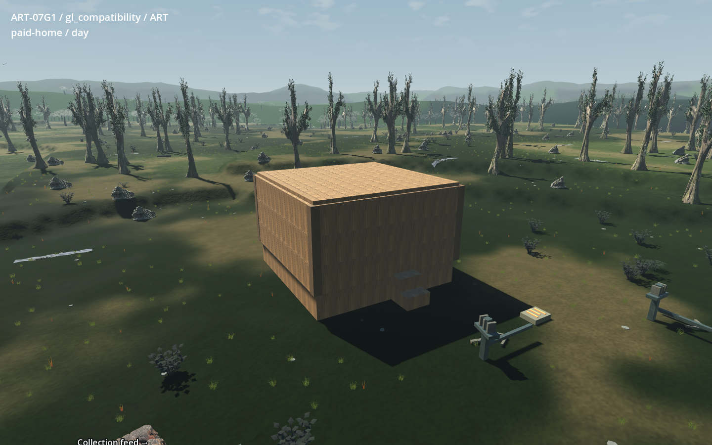
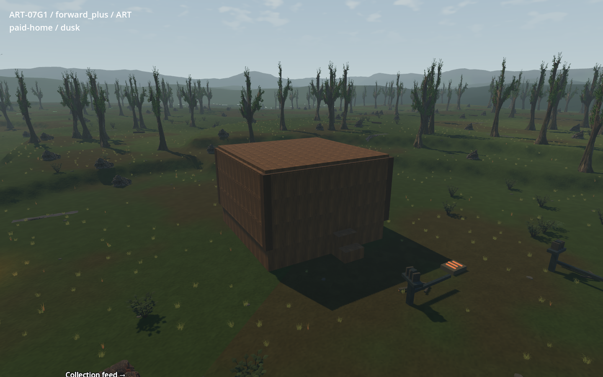

Actual legal wood forms and native F4 work, emission-off rear, shade and
exhausted fresh reload:

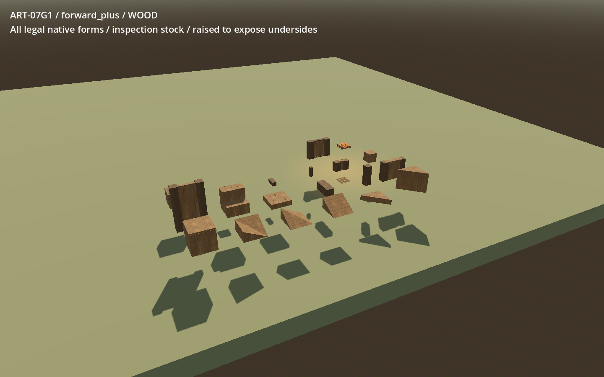

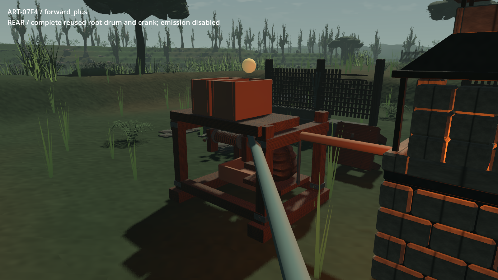
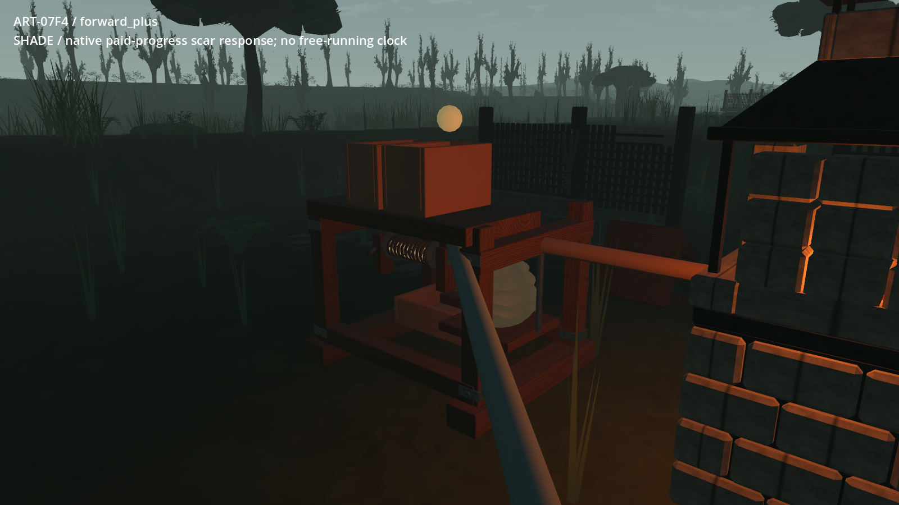
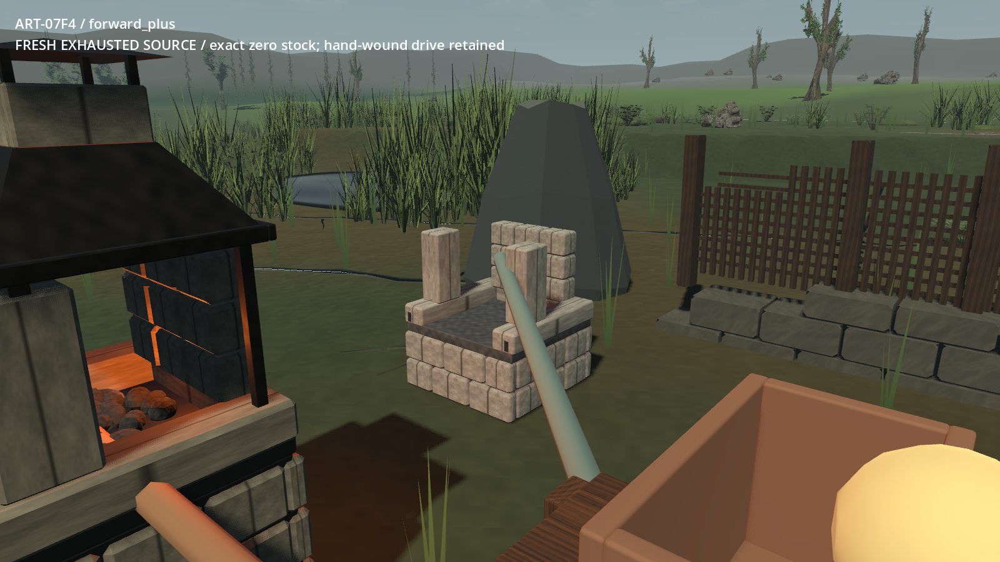

Packed-source material and clay inspection:

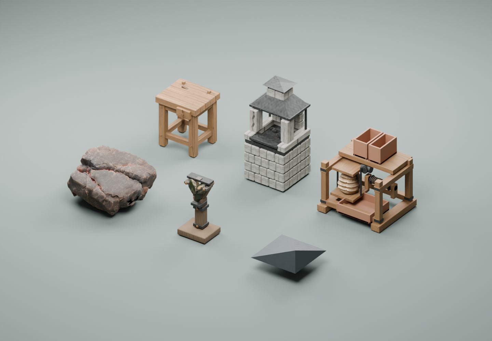
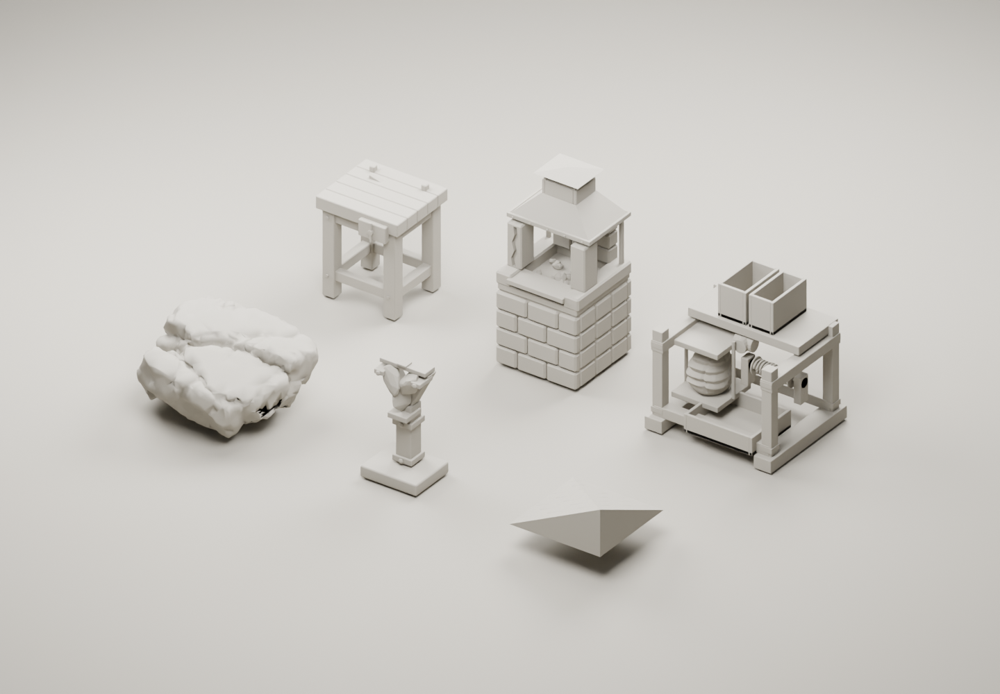

All 16 retained actors, with selected ancestry and current form labelled:

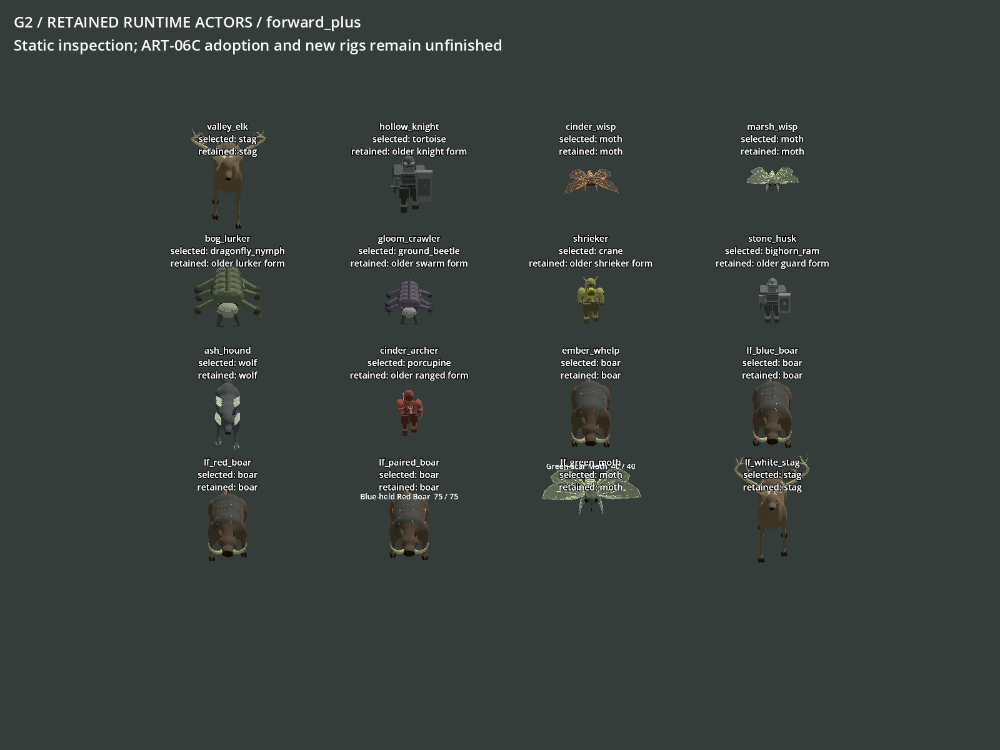
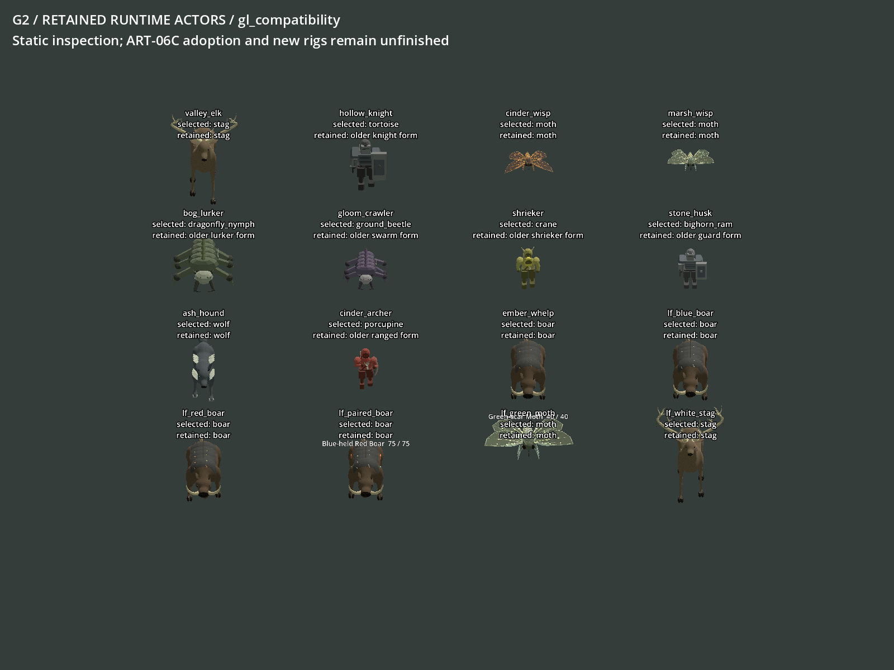

Motion uses only actual ordered screenshots, with resizing/encoding and no
interpolation. Route: 78 frames, 1024x640, 300 ms illustrative cadence. Each
feeder sequence: 60 frames, 1024x576, 33 ms per source tick, including pauses and
blocking. Native-resolution source hashes are in [media.json](media.json).

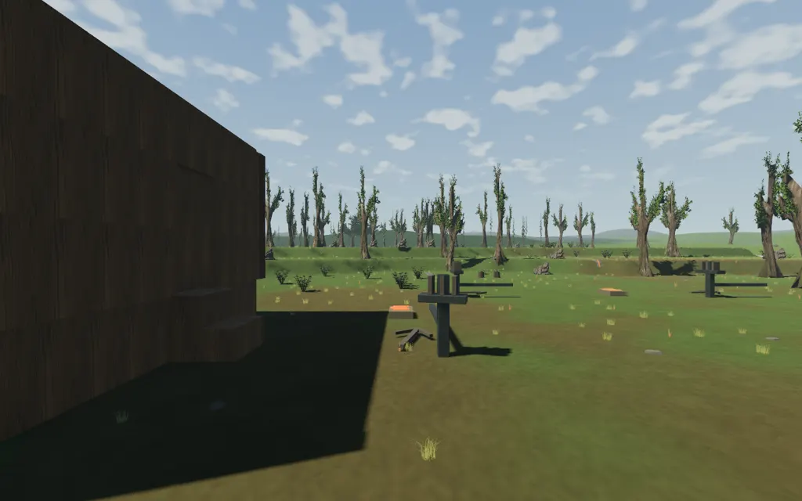
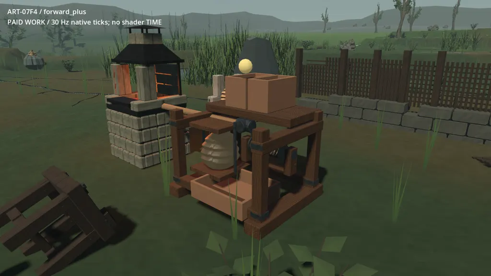
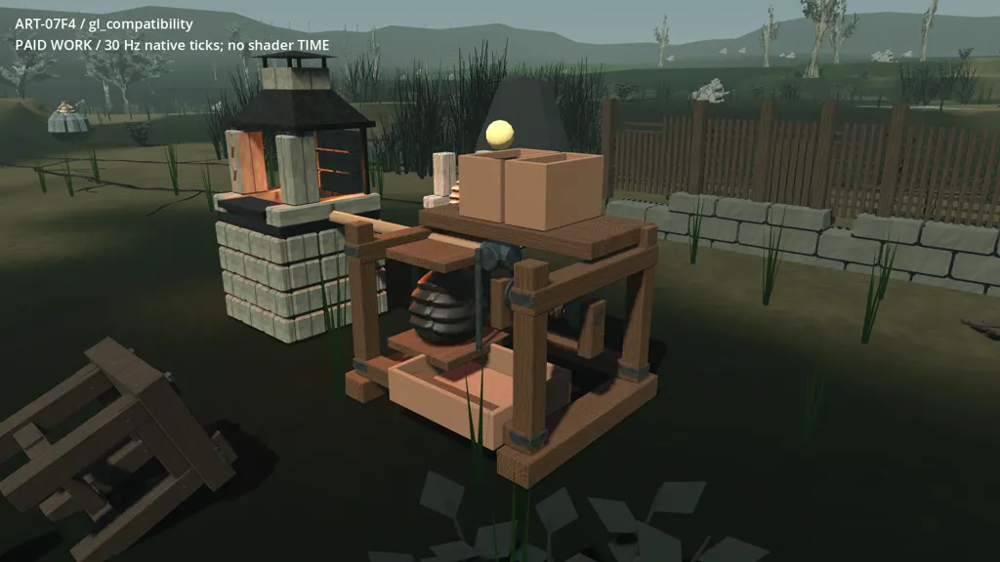

## Execution adaptations and limitations

G1's copy/reconstruction/GPU guards remain unchanged. Small G2 helpers verify
and copy to explicit G2 paths. Every engine job uses hidden owned processes,
the cooperative GPU mutex and read-only process inspection; benchmarks check
for competitors throughout. No session was messaged and no other process was
interrupted. Exact argument arrays, PIDs, state directories, timings, exit codes
and log hashes are in the local evidence.

The initial G2 job named `paid-art-restart` passed `--restore`; that harness
recognizes `--restart`, so the earlier job is a second full paid replay and is
not used as restart proof. A separate `paid-fresh-restart` job uses the correct
flag. The checked reproduction recipe is corrected. The initial direct Git
byte comparison also identified the archive CRLF export; the final verifier
records that exact conversion and rejects every other unexplained difference.
No G1/game assertion was weakened.

The staged whitespace check removed trailing blank lines in four G2 recipes
and the matching G2 fauna inspection copy. No executable statement changed.
The preliminary v01 handoff is retained; the final handoff is a fresh v02 seal
with `preservation-final.json` recording the final audit.

G2 introduces no gameplay tuning. Its actor lineup uses inspection positions,
camera and labels only. The benchmark derivative adds maximum wall/GPU frame
values, engine-clock setup elapsed time and a G2 output prefix; its scenes, settings, warmup/sample loop and
native state remain the sealed G1 definitions. Actual renders and encoded motion
are retained with source hashes; evidence images are not retouched.

## Delivery

The review-only package is `D:/project-wroughtwild-art07-g2/build/art07/g2/v02/handoff`.
Its `companions.json` points to the separately verified complete `v01/sealed/`
and disposable `v01/review/` copies. The committed G2 receipt identifies its manifest
hash, checked branch commit and publication status; it remains outside the
package to avoid a self-referential hash. Only G2 tools, curated evidence
and `receipts/g2.md` are intended for Git. Raw runtime copies, packed masters,
imports, saves, frame sequences and working builds stay local. Main integration
and push belong to the dedicated publisher. G2 stops after its scoped commits.
