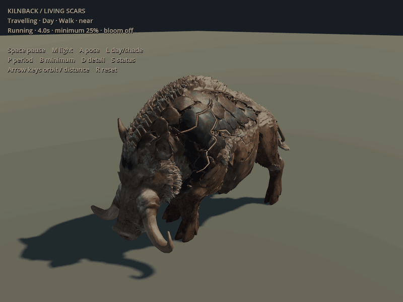

# ART-01 — the boar carrying living scars

Technical handoff, 9 September 2026. **Owner visually approved the result** and
requested continuation with the same process into ART-02.
The [work item](../../../../prototype/boar-living-scars-2026-09-09.md) records scope,
failures, corrections and adoption limits. The
[authoring recipe](../../../../../tools/wroughtwild-boar/README.md) rebuilds the
study from the owner's pinned local source. No ordinary game asset was replaced.

[Shade loop](shade-loop.gif). Each loop is eight seconds, 24 sampled engine frames
per second, with a shared GIF palette to prevent palette flicker. Use the original
PNG captures or the interactive Godot review for full colour/resolution. Bloom is
off. The light progresses through surface-attached scars; it is not an attack tell.

## Compare the material and movement

| View | Light off | Steady | Travelling crest |
| --- | --- | --- | --- |
| Day | [Unlit scar](day-0.png) | [Steady core](day-1.png) | [Passing core](day-3.png) |
| Shade | [Unlit scar](shade-0.png) | [Steady core](shade-1.png) | [Passing core](shade-3.png) |

All three alternatives use the same pose, camera, lighting and exposure within
each row. The interactive study also provides whole-scar breathing, 2.5/4-second
periods, 25/50% minimum light and a static/paused mode. The default is four seconds,
25% minimum. [Two fixed shoulder pixels](pulse-pixel-check.json) change from
118→202 and 136→223 in the red channel, peaking about one second apart in the
daylight captures. This confirms visible local progression; it is not calibrated
photometry.

Pose views: [idle](pose-idle.png), [walk](pose-walk.png), [root](pose-root.png),
[turn](pose-turn.png), [windup](pose-windup.png), [release](pose-release.png).
Additional views: [front](view-front.png), [side](view-side.png),
[rear](view-rear.png), [opposite flank](view-right.png).
[Status priority](status-priority.png) demonstrates the shader adapter only;
it does not install a new influence or verify the game's native status wiring.

## Detail levels and measured cost

| Candidate | Triangles | Exported vertices¹ | 3.2 m | 8 m | 18 m |
| --- | ---: | ---: | --- | --- | --- |
| Near | 109,972 | 147,646 | [Hero](lod-near-3.2.png) | [Encounter](lod-near-8.0.png) | [Distance](lod-near-18.0.png) |
| Mid | 64,983 | 96,421 | [Hero comparison](lod-mid-3.2.png) | [Encounter](lod-mid-8.0.png) | [Distance](lod-mid-18.0.png) |
| Far | 10,000 | 9,212 | [Rejected for close use](lod-far-3.2.png) | [Closer comparison](lod-far-8.0.png) | [Distance](lod-far-18.0.png) |

¹ UV/normal splits increase exported vertices; Blender's welded edit-mesh vertex
count is not the runtime count. [Actual GLB audit](handoff-validation.json).
The first 35,979-triangle mid candidate was rejected for visible tusk/coat loss.
The [source-rig report](rig-report.json) also retains a failed 35k far collapse;
the [separate far report](far-report.json) and actual stream audit describe the
rebaked 10k mesh delivered here. Automatic Godot LOD generation is disabled.

Forward+, Godot 4.5, NVIDIA RTX 5090, 1280×960, 4× MSAA, one shadowed directional
light, no bloom. Sixty warmup frames and 180 measured frames per case. Screenshots
are excluded from timing. [Full measurement record](performance.json).

| Animated, travelling-light case | Median whole-frame ms | Median GPU ms |
| --- | ---: | ---: |
| One near boar | 0.25 | 0.15 |
| 24 near boars | 0.66 | 0.61 |
| 24 mid boars | 0.56 | 0.43 |
| 24 far boars | 0.56 | 0.17 |

The scene draws 2 visible calls with one boar, 25 with 24, including the floor;
the corresponding shadow counts are 5 and 48. Pulse off/on is comparable at this
measurement precision. Static/animated cases retain a bound skin, so their
difference is not a direct unskinned-versus-skinned GPU cost. The 24-actor case
uses the existing trial living-enemy limit; no cap is changed.

Texture memory reported for the whole review is 276,464,640 bytes near/mid and
159,024,128 far. These totals include framebuffers and duplicate embedded fallback
textures. The review retains lossless textures and a 16-bit authoring scar;
production texture compression/layout remains work before adoption. This is a
small isolated render benchmark on the owner's GPU, not world/streaming/native
simulation performance or evidence for lower-spec hardware.

## Handoff checks and preservation

- [Surface provenance and displacement](surface-report.json): unchanged original
  hash, at most 4 mm authored incision, explicit projected paths.
- [Reopened Blender source](source-audit.json): packed images, 68 actual mesh pose
  samples; planted/swing near soles and whole-mesh floor clearance for every LOD.
- [Godot import and movement checks](engine-checks.json): three skins, sixteen
  bones each, finite poses, normalized weights, exact clocks, pause/resume and
  shared material with independent phases.
- [GLB/texture/preservation audit](handoff-validation.json): actual stream counts,
  fallback materials, valid PNG data and unchanged original/wolf/moth/master hashes.
- [Capture setup](capture-setup.json) and [local handoff manifest](local-handoff-manifest.json).
- [Clean-package verification](package-verification.json): all 62 delivery files
  match the verified package input; both loops contain 192 frames/eight seconds.

The delivered rig provides idle/walk/root/turn and **baseline** 0.4-second generic
melee windup / 0.22-second presentation release. Concurrent LF-3 boar behaviour
work is separate. Native integration must use whichever clocks and attack shapes
are actually selected then; decorative scars do not authorize new combat rules.

Local clean delivery: `build/boar-art01/boar-handoff/`. Its editable source is
`editable/boar-candidate.blend`; `review/` is the isolated Godot project, and
`evidence/` contains the views and loops. `build/boar-art01/handoff/` is the
verification copy used for reopening/reimport. The original source remains at
the path pinned by `boar-study.json`. Generated working assets/caches are not
versioned; this directory commits only selected evidence, reports and links to
the repeatable authoring tools.

Visible generated coat layers/gaps and some overly regular scar edges remain.
The far bake is unsuitable for close viewing. Hand topology/animation finishing,
native material adaptation, real travel/terrain/body fit and ordinary game
adoption are not claimed. The preserved boar and moving embedded scars establish
the study handoff. The owner subsequently visually approved this result;
that does not remove the integration limits above.
