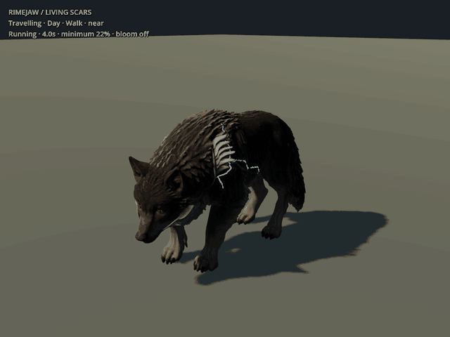
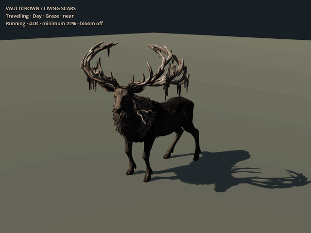
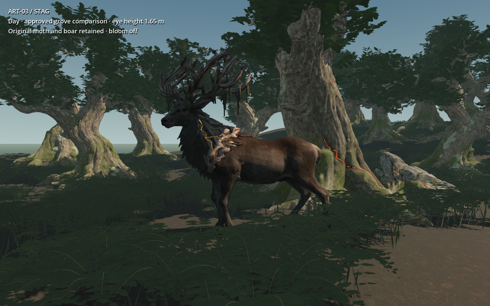

# ART-03 — Rimejaw and Vaultcrown handoff

9 September 2026. The owner's “Let's do it” selected the bounded wolf/stag
slice in the [asset roadmap](../../../../prototype/leyline-asset-roadmap-2026-09-09.md).
The [work item](../../../../prototype/fauna-art-2026-09-09.md) records scope and
remaining limits. These are actual Blender/Godot candidates, awaiting the
owner's visual judgement. They have not replaced ordinary game assets.

## Review the result

| Rimejaw — existing wolf refined | Vaultcrown — one local stag |
| --- | --- |
|  |  |

The GIFs are compact previews of actual engine frames. Full loops retain the
captured resolution/rate: wolf [day walk](wolf/day.webp), [shade walk](wolf/shade.webp)
and [jaw](wolf/jaw.webp); stag [day walk](stag/day.webp), [shade walk](stag/shade.webp)
and [browsing](stag/graze.webp). Walk clips close after eight seconds; jaw and
browsing comparisons close after twelve seconds, including the four-second pulse.
These are deterministic captures, not a real-time frame-rate claim.

Compare matching [wolf unlit](wolf/day-0.png) / [lit](wolf/day-3.png) and
[stag unlit](stag/day-0.png) / [lit](stag/day-3.png), plus shade versions in each
folder. Dark damage and narrow light remain separate. The wolf uses silver-blue
Quicksilver-associated art; it has acquired no Blue/Retention or Frost rule.
The stag's amber presentation does not assign an influence, loot or attack.

The same copied grove supplies [wolf](grove/wolf-day.png), [boar](grove/boar-day.png)
and [unchanged moth](grove/moth-day.png) day/shade/dusk comparisons. All retain
their scale and materials; one animal is shown at a time. Existing ground was
sampled for a level rest-pose patch: maximum four-sole support variation was
1.01 mm for the wolf and 6.79 mm for the stag. This is a visual context study,
not terrain IK or proof of collision/AI in a populated world. Understory partially
obscures the shorter wolf; the plain-floor views expose its full feet and profile.

## What changed

**Wolf:** preserved the original local source and heavy shoulder silhouette;
recessed a narrow raised shoulder channel locally by at most 30 mm, cut a real
lower muzzle with independent jaw attachment, added dark inner backing/small
teeth and shallow eyes fitted to measured surface points. UV-attached fractures
cross coat and plates. The face no longer depends on painted eye marks alone.
Seven fitted clips include idle, in-place walk, sniff, turn, jaw, windup and
release. The windup remains 0.25 seconds and the visual release 0.22 seconds.

**Stag:** generated one source from the selected
[Vaultcrown brief](../../../concepts/creatures/2026-09-07/README.md), with the exact
[original input](stag-input-v01.png) and
[prompt](../../../../../tools/wroughtwild-fauna/stag-prompt.txt) retained.
Kept its open, supported antler silhouette, fitted shallow eyes, added recessed
neck/shoulder scars, and authored idle, in-place walk, turn and low-plant
browsing. The crown and its hanging strips follow the skull rigidly.
The 3 m crown-inclusive comparison height does not enlarge a Valley Elk body.

Both have packed editable Blender sources, 17-bone rigs, three measured detail
levels, tangent normals and original-atlas base/ORM/fracture maps. A shared
Godot shader binds each animal's colours and mask, with independent instance
phase and a pause-aware cosmetic clock. No per-crack lights or bloom are used.
Status override controls are demonstrated in isolation; actual game hit/status
adapter compatibility remains integration work.

| Candidate | Near triangles | Mid triangles | Far triangles | Surfaces |
| --- | ---: | ---: | ---: | ---: |
| Wolf, including jaw/eyes | 115,018 | 62,147 | 23,146 | 9 |
| Stag, including eyes | 128,258 | 68,257 | 27,253 | 4 |

These are measured exports, not nominal decimator targets. The wolf's detailed
mouth/eyes are retained in every level. GLBs are still about 33–40 MiB for the
wolf and 24–31 MiB for the stag, with embedded PBR fallback textures. Texture
sharing/compression and far-face reduction remain worthwhile integration work.

## Evidence and checks

- Actual GLB stream validation: [wolf](wolf/verification.json) **148 passed,
  zero failed**; [stag](stag/verification.json) **85 passed, zero failed**.
  Checks inspect source hashes, UVs, finite coordinates, skin weights, bones,
  clip times, nonzero triangle areas, embedded PNG data and independent masks.
- Blender source reopening: [wolf audit](wolf/source-audit.json), 77 sampled
  deformed poses; [stag audit](stag/source-audit.json), 36. Actual near-mesh skin,
  accessory and all-detail floor clearance are checked, along with rigid soles
  and the stag's crown. Floor tolerance is 1 mm; the wolf's worst result is
  0.71 mm below the study plane. Maximum tested edge extension is 61.62 mm for
  the wolf and 67.70 mm for the stag, below the unchanged 80 mm rejection limit.
  Crown error is below 0.001 mm. These tests do not certify every self-contact.
- Godot 4.5: [wolf](wolf/engine-checks.json) and [stag](stag/engine-checks.json)
  verify all three imported skins, 17 bones, all clip times, finite bone poses,
  planted feet, shared material/independent phase and pause/resume.
- Rendered inspection includes both maximum head turns, both wolf jaw sides,
  full profiles, unlit/lit day and shade, distance/detail comparisons and actual
  movement loops. Rejected revisions are preserved locally, not labelled final.
- [Packaged handoff checks](handoff-checks.json): fresh copies of both complete
  review projects reimported and passed the engine checks. Both packed Blender
  deliverables reopened and passed the same deformation audits. The
  [manifest](handoff-manifest.json) records the clean local deliverables by hash.

The added edge check caught neck/moss spikes and belly vertices assigned to
nearby limbs after initial structural checks had passed. Corrections restrict
limb volumes and diffuse weights over connected skin while keeping rigid
anchors. Tests were not relaxed. Even after numeric checks passed, a grass-level
stag bend folded its plate-like neck coat poorly; the delivered clip uses the
shallower, visually reviewed browsing range. Deep grass grazing needs further
neck/plate authoring.

Measured on RTX 5090, Forward+, 1280×960, 4× MSAA, no bloom: 60 warm-up frames
and 180 samples per case. Full [wolf](wolf/performance.json) and
[stag](stag/performance.json) results compare one/24 actors, three detail levels,
static posed skin/updated animation, and light off/travelling.

| Animated mid detail | GPU median / p95, light on | Light-off GPU median | Sampled frame median / p95 |
| --- | ---: | ---: | ---: |
| 1 wolf | 0.145 / 0.150 ms | 0.145 ms | 0.281 / 0.419 ms |
| 24 wolves | 0.408 / 0.414 ms | 0.407 ms | 0.847 / 0.917 ms |
| 1 stag | 0.144 / 0.147 ms | 0.144 ms | 0.256 / 0.346 ms |
| 24 stags | 0.445 / 0.451 ms | 0.445 ms | 0.621 / 0.687 ms |

Those sub-millisecond measurements cover actors and a floor on this GPU, with
no native simulation or streaming. They are not a minimum-spec or game FPS
promise, nor approval for a higher enemy cap. Whole-review texture memory was
306.3 MiB / 263.7 MiB respectively, including loaded detail variants and fallback
textures; it is not per-animal memory. A static posed skin still uses the skin
pipeline, so the comparison does not isolate an unskinned GPU baseline.

## Provenance and local handoff

Wolf source: `build/trellis-local/output/wolf-1024-seed42-20260908-221914-245/wolf.glb`,
SHA-256 `584b615a050af649602c2b09aeffbb649f4727f4fc8095874ad7c073c70d5e1f`.
No new wolf generation. The preserved normalized source has SHA-256
`0245276461c8562f26a6053a58d8bc831a70ab8238498b22d1568e6e8ea9a9e0`.

Stag source: `build/fauna-art03/stag-source-v01/stag.glb`, SHA-256
`a35be4faca9dfc278834cf353bf56d9891c77af0b323bb4ab32e2b988e04940b`.
Original input SHA-256:
`c1a574788ddd6277740652c6fcbb5ca217c01a55853978d083b311473ad21842`.
The existing local TRELLIS v0.6.0 CUDA pipeline used seed 42, 1024 resolution,
BiRefNet and PNG textures; 102.13 seconds wrapper time. See
[generation record](stag-generation.json), [inspection](stag-inspection.json)
and [recipe](../../../../../tools/wroughtwild-fauna/README.md).
The source contains 281,118 triangles; its generation log reported nine
uncharted faces retained with collapsed UVs. The older wolf log reported two.
No source is claimed to have pristine topology.

Complete local package: `build/fauna-art03/fauna-handoff/`, with `wolf/`, `stag/`,
`grove-gallery/`, `recipe/` and `published-evidence/`. Each animal supplies its
packed `.blend`, GLBs, maps, review project and checks. Build intermediates,
full-resolution frame sequences and untouched raw sources remain under their
original local paths. Generated meshes/blends/caches are not committed.

This remains generated triangle topology with fitted weights, not manual quad
retopology. The wolf retains a hunched shoulder and some raised mineral-root
forms; its mouth interior is simple and has no lip flex or blinking. The stag's
coat is coarser than the input and its moss resembles rigid strips. Deep grazing,
terrain IK, actual locomotion, native actor/body fitting, combat/status adapters
and populated-world performance remain future work. Normal saves, geography,
finite resources, inventory ownership and existing game fauna are untouched.
