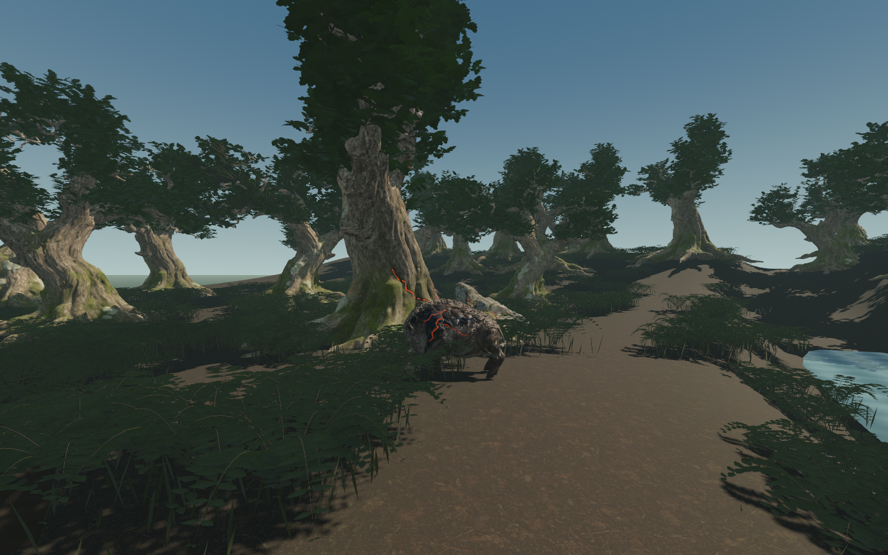
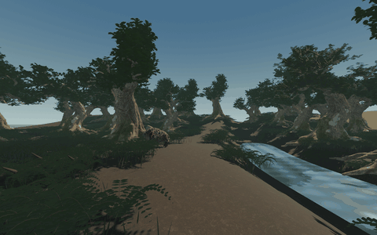

# Emberroot Grove — actual ART-02 evidence

9 September 2026. **Technical handoff; grove visual review pending.**
[Result, checks and limits](../../../../prototype/affected-grove-2026-09-09.md).
These pictures and walks are actual Godot output from the composed isolated
setting. The three labelled source inputs below are generated images, not
engine captures. No ordinary game asset or saved world was replaced.

[Full day walk](day-walk.webp) · [full dusk walk](dusk-walk.webp).
Each has 192 frames at 12 samples/second, downsampled to 720×450 for review.
The full 1440×900 PNG sequences remain local in
`build/grove-art02/review-v06/evidence/walk-day` and `walk-dusk`.

The short GIF is a 480×300 derivative of frames 70–117, using one shared palette.
It illustrates camera/boar/scar movement; it is not a real-time FPS claim.

| View | Day | Shade / dusk |
| --- | --- | --- |
| Ordinary approach | [Day](approach-day.png) | Full dusk walk above |
| Boar and affected tree | [Day](clearing-day.png) | [Shade](clearing-shade.png), [dusk](clearing-dusk.png) |
| Bark/root/mineral connection | [Day](scar-day.png) | [Shade](scar-shade.png), [dusk](scar-dusk.png), [emission off](scar-unlit.png) |
| Stream and background rise | [Day](downstream-day.png) | [Dusk](downstream-dusk.png) |

The scar-off view matches the shade camera and pose. Its dark injury remains
visible. Ordinary trees and most vegetation do not glow. The boar uses the
previously approved ART-01 mid mesh and root animation; it grants no attack,
resource or influence rule in this art project.

## Source record

- Generated [tree input](tree-input-v01.png) and actual reconstructed
  [Blender front view](tree-source-front.png). Raw source: 293,288 triangles;
  [complete generation record](tree-generation.json).
- Generated [rock input](rock-input-v01.png) and actual reconstructed
  [Blender back view](rock-source-back.png). Raw source: 287,700 triangles;
  [complete generation record](rock-generation.json).
- Generated [forest-floor albedo](forest-floor.png). Host textures and masks
  are separate; it is not used to paint the boar or tree.
- [Exact prompts and complete authoring recipe](../../../../../tools/wroughtwild-grove/README.md).
  Built-in image generation supplied these original images; the already
  installed local TRELLIS v0.6.0 pipeline reconstructed tree and rock at seed 42.
  The boar is the unchanged ART-01 handoff.

## Verification and delivery

[69 artifact/evidence checks](verification.json),
[four fresh Blender reopenings](source-reopen.json),
[capsule/route checks](checks.json), [capture cameras](capture-manifest.json),
[walk sampling](walk-manifest.json), and [final rendering benchmark](benchmark.json).
[The full-detail canopy baseline](benchmark-full-canopy.json) provides the
matched cost comparison. Performance is local RTX 5090/Godot 4.5 Forward+ evidence,
not a guarantee for the full game or another machine.

Local handoff: `build/grove-art02/emberroot-handoff/`, with
`editable/emberroot-grove.blend`, three finishing/bake masters, a clean isolated
Godot project, images/loops and [file hashes](local-handoff-manifest.json).
Blender uses steady preview emission; Godot supplies the exact pause-aware pulse.
The clean package is verified through a separate fresh import copy.

Repeated tree forms, geometric understory, close mask stepping, simple water,
high geometry/texture cost and the absence of ordinary-world integration remain
limitations. These checks establish a usable review setting, not final art
acceptance, watertight generated topology or new world-generation behaviour.
