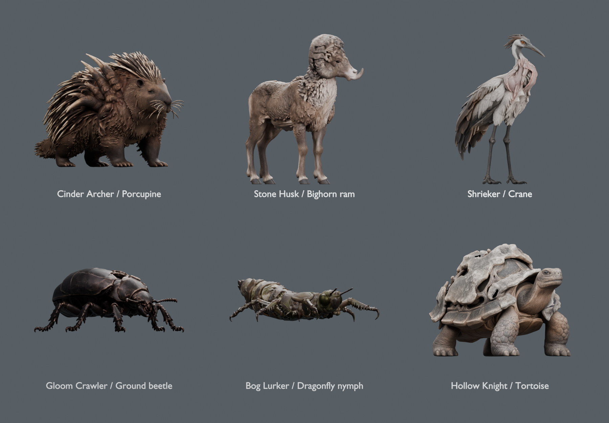

# ART-06 — actual generated animal sources

**Design/source stage delivered; finishing and game adoption remain open.**
The owner selected six animal directions, rejected the armadillo as too close
to the boar, then requested stronger structural augmentation now and additional
physical augments per era. These images are actual imported geometry. Compare
them with the [concept revisions](../../../concepts/creatures/2026-09-09-roster/README.md);
the concept images are not substituted for mesh evidence.

The local handoff is `build/roster-art06/roster-source-handoff/`: six packed
editable Blender inspection sources, untouched earlier/current GLBs, original
concept inputs, provenance, seven Blender views per current source, and a
standalone Godot comparison viewer. Run `Launch source review.ps1` using the
installed Godot 4.5 executable. The viewer has no native game/simulation/save
dependency. Source scale is uniform studio comparison size, not gameplay size.

## Source results and inspection

| Existing mob / animal | Current input | Actual source triangles | Geometry read and remaining finishing work |
| --- | --- | ---: | --- |
| Cinder Archer / porcupine | v02 | 282,612 | Four feet and grown quill roots remain. Whiskers are coarse rigid geometry, coat clumps and shoulder seams need refinement; authored moving scars are absent. |
| Stone Husk / bighorn ram | v03 | 293,246 | Four cloven legs, two open principal horn curls and a supported asymmetric buttress remain. Wool/growth transitions are coarser than the image, and eye/neck/horn clearance must be checked under a fitted rig. |
| Shrieker / crane | v02 | 296,116 | Two legs, folded wings and a real throat recess remain. Generation partly mirrored the intended lobe asymmetry; nested throat folds, feather attachments and foot posing need finishing. |
| Gloom Crawler / beetle | v02 | 293,396 | Six articulated leg forms and physically displaced elytra/inner lamellae remain. Fine recesses were simplified and opposite-side augmentation is less developed; antennae/mandibles and leg weights need individual fitting. |
| Bog Lurker / nymph | v04 | 290,654 | Corrected source has six legs on the thorax, with a legless segmented abdomen. The dorsal input retains ruptured layers but yields a narrower/lower profile than v02; fine fibrous cavities and ventral labium need finishing. |
| Hollow Knight / tortoise | v02 | 295,370 | Four feet, head/neck opening and genuinely layered shell cavities remain. Some small cavities merge; the audit reports one near-zero-area triangle. Cleanup, neck clearance and independently controlled scar materials remain. |

The [summary](summary.json) records exact GLB hashes, sizes, generation times and
counts. The six current GLBs contain **no skin, animation or emission texture**.
TRELLIS's ordinary base/metallic-roughness output does not make the illustrated
currents pulse. Finish core/flow masks separately, retain dark physical damage
without glow, and fit them to the eventual deforming anatomy.

The raw near-300k counts are source detail, not selected runtime LOD budgets.
No watertightness, animation topology, planted locomotion, capsule fit or
full-world performance claim follows from opening these files successfully.
Some tiny UV charts collapse in the exporter; record them instead of calling
the raw source clean. The prior high-quality authoring process is preserved.

## Reproduced failure and correction

The first stronger nymph **v02 generated eight legs**, observed in actual top
and underside geometry. [Failed top view](rejected-nymph-v02/clay-top.png) and
[failed underside](rejected-nymph-v02/clay-underside.png) are retained. It was
rejected despite otherwise successful import/texture checks. A v03 image edit
still left the far-side roots ambiguous and was not sent to TRELLIS.

The v04 source instead uses a near-dorsal image with exactly three visible pairs
attached to a short thorax. Its regenerated [top](bog_lurker/clay-top.png) and
[underside](bog_lurker/clay-underside.png) were inspected and show six legs and
no abdominal pair. This is a source-anatomy correction, not a new enemy rule or
a test changed to accept eight legs. Earlier sources remain comparison history.

## Verification and scope

- All six generation exits succeeded; input and raw GLB hashes remained exact
  through import, inspection and collection. Resolution 1024, seed 42, installed
  TRELLIS v0.6.0, pinned model revision, required CUDA, BiRefNet and PNG export.
- **42 packed-source reopening checks** compare actual geometry streams, source
  identity, finite coordinates, packed texture dimensions and absence of a rig.
- **102 checks in Compatibility and 102 in Forward+** import the twelve earlier/
  current GLBs, check finite geometry, source materials and unrigged state, and
  restore the original material after a clay comparison. These verify the static
  viewer; they do not test gameplay, animation or performance.
- Six actual Godot captures, 42 individual Blender views and the actual-source
  group render are retained. Final ordinary game files, DLL, tuning and saves
  are untouched. Final package verification is recorded in `handoff-checks.json`.

The isolated Windows renderer runs retain only the known root-certificate-store
startup diagnostic. No script, shader or other engine errors were accepted.

Source folders below hold the detailed reports and all views:
[porcupine](cinder_archer/inspection.json), [ram](stone_husk/inspection.json),
[crane](shrieker/inspection.json), [beetle](gloom_crawler/inspection.json),
[nymph](bog_lurker/inspection.json), [tortoise](hollow_knight/inspection.json).

Next production work is anatomical finishing, attached scar masks, rigs/poses
and measured detail levels for these selected candidates. Extra era anatomy,
the Tyrant/Warden and human Conservator still need their own design/finishing
passes. Normal adoption requires native attack/status/tell and unchanged-owner
checks; this source handoff does not mark the entire roster remake complete.
