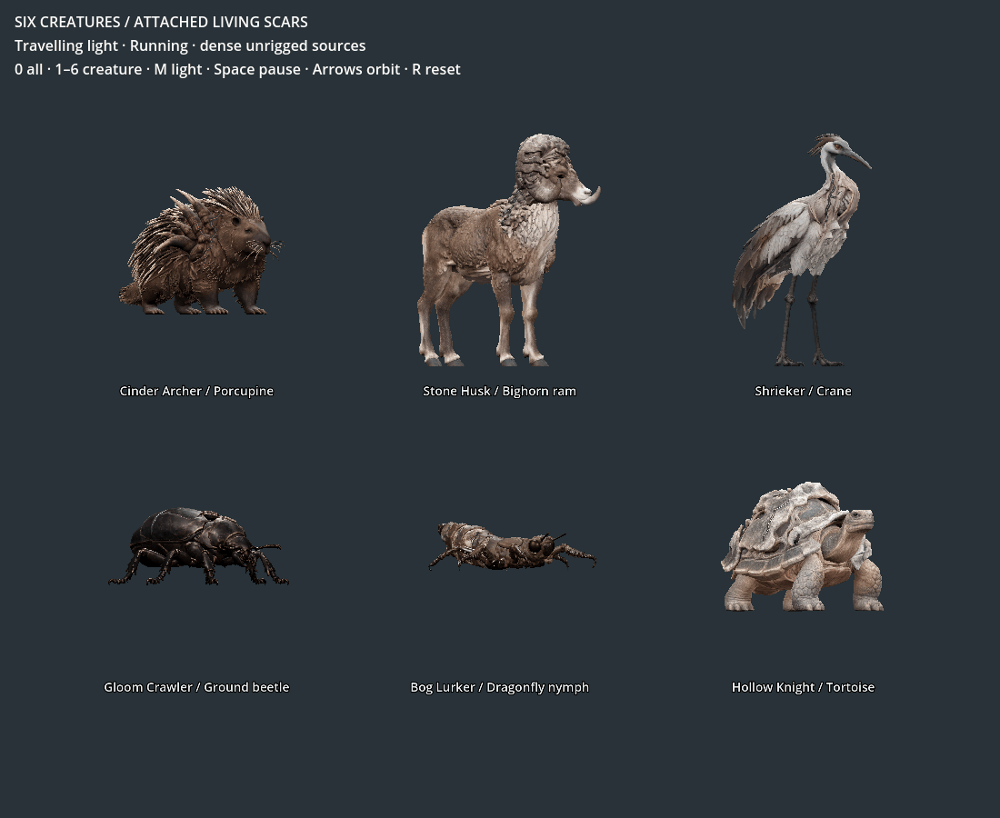

# ART-06B — living scars on the remaining animals

**Isolated surface handoff delivered; rigging and game adoption remain open.**
The owner selected continuation from the actual stronger source gallery. This
pass keeps those six forms and adds individually placed damage and travelling
light. These are actual Godot frames of the finished surface exports:

[Lossless animated WebP](pulse.webp) retains the full captured colours. The GIF
uses a fixed palette; both encode the same 48 actual frames over four seconds.
They are deterministic material previews, not animation/performance benchmarks.
The [steady-light gallery](gallery-lit.png) and [dark gallery](gallery-dark.png)
use matching geometry, lighting and camera.

The [work item](../../../../prototype/roster-scar-materials-2026-09-09.md) records
scope, controls and remaining work; the [rebuild recipe](../../../../../tools/wroughtwild-roster/SURFACES.md)
reproduces the local Blender/Godot handoff. Run `Launch scar review.ps1` from
`build/roster-art06b/scar-handoff/`. Select an animal with 1–6, orbit with arrows,
switch light with M and pause with Space. The package has its own APPDATA and
contains no normal-game autoloads, native rules, tuning or saves.

## What changed

Each flank's paths follow actual projected growth surfaces. UV channels contain
narrow core, wider dark damage and travel distance. Local width variation and
the retained base texture break even scar margins; light remains concentrated
at the host's altered structures. Incisions are shallow and limited by local
triangle geometry. Source triangles are preserved except the tortoise's one
confirmed degenerate face. The six raw GLB and original base/ORM hashes remain
exact; there was no new image-to-3D generation or whole-body remesh.

| Animal | Scar placement | Specific remaining work |
| --- | --- | --- |
| Porcupine | Swollen shoulder and quill roots; ember light | Coarse whiskers and coat/root transitions, fitted quill attachment and face rig |
| Ram | Fractured horns and uneven neck growth; pale mineral light | Wool joins and horn/head clearance through posed movement |
| Crane | Expanded throat and keel; cool restrained light | Throat asymmetry, supported organ deformation and long-legged gait |
| Beetle | Displaced inner plates and outer shell fractures | Independent six-leg motion, mandibles and opposite-side cavity refinement |
| Nymph | Three ruptured abdominal regions; muted green light | Fine cavities, folded labium and separate thoracic leg weights |
| Tortoise | Irregular mantle and shoulder scute | Neck/shell clearance, four-leg gait and later shell layers |

The palette is art presentation, not a new LF influence/Kind assignment. Small
breaks over wool and overlapping plates remain visible. No floating line bridges
an empty cavity. The scars are still an authored surface pass; finer tissue
wear, articulated material stretching and native tell priority remain open.

## Reproduction and verification

A beetle path starting in empty space and a tortoise path jumping 0.559 studio
units into its shell cavity were rejected. Their points were moved onto real
host surfaces; the 0.24-unit jump limit was not relaxed. The first tortoise
incision also failed the face-orientation check. A minimum-altitude displacement
limit corrected the thin-face inversion, with final checks using the exact
float32 positions retained by Blender/export. No orientation test was removed.

- **48 reopening checks:** exact surface geometry, source identity, finite
  positions, UVs, packed data map, contained core, variable travel and no rig.
- **59 checks in each renderer:** actual imports/counts/materials, rendered
  light changes on every creature, pause/resume, independent phase/colour and
  dark-mode stability. [Compatibility](compatibility-checks.json),
  [Forward+](forward-checks.json).
- **67 collection checks:** preserved raw/textures, final recipe hashes,
  bounded incisions, no hidden decimation, every core texel contained in damage,
  both rendered result sets and 48 actual frames. [Results](verification.json).
- Six packed Blender sources, 24 Blender off/lit flank renders and 14 Godot
  stills accompany the animation. [Counts and hashes](summary.json).
- Fresh packaged import, repeat checks and final file hashes are recorded in
  [package verification](package-checks.json). Engine caches are excluded.

The renderer logs retain only the known Windows root-certificate-store startup
diagnostic. The exporter reports its known shared texture-sampler warning;
original base/ORM image bytes and the actual engine material are checked.
No script or shader error is accepted. Detailed anatomy repair, fitted rigs,
native attack/status adapters, LODs, extra era forms and populated-world cost
are not certified by this static surface handoff.

Each folder below includes paired real dark/lit Blender and Godot images:
[porcupine](cinder_archer/lit-az0.png), [ram](stone_husk/lit-az0.png),
[crane](shrieker/lit-az0.png), [beetle](gloom_crawler/lit-az180.png),
[nymph](bog_lurker/lit-az0.png), [tortoise](hollow_knight/lit-az0.png).
