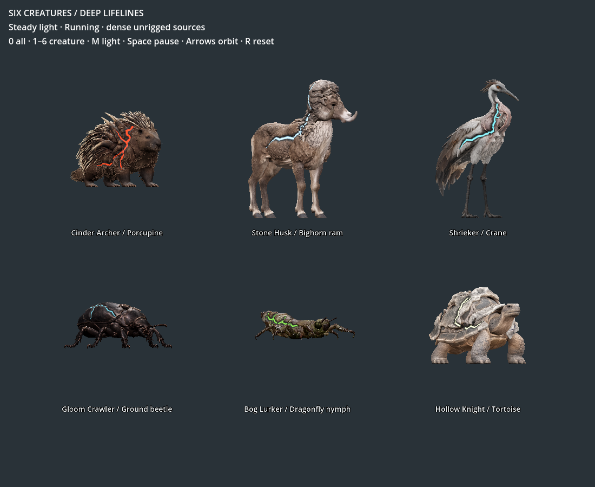
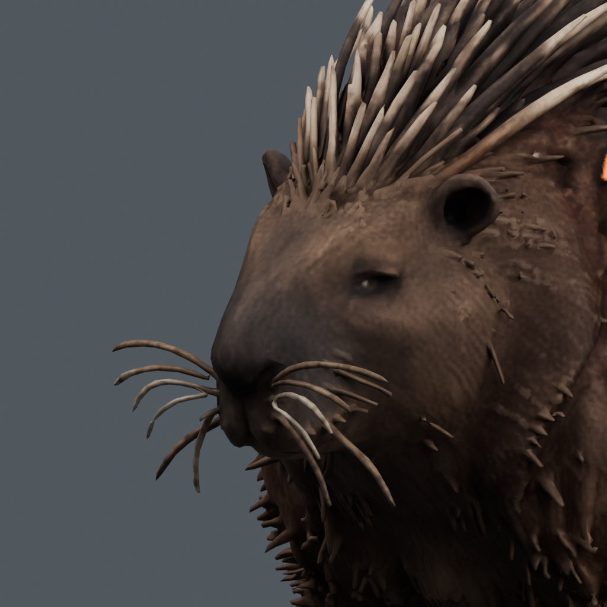
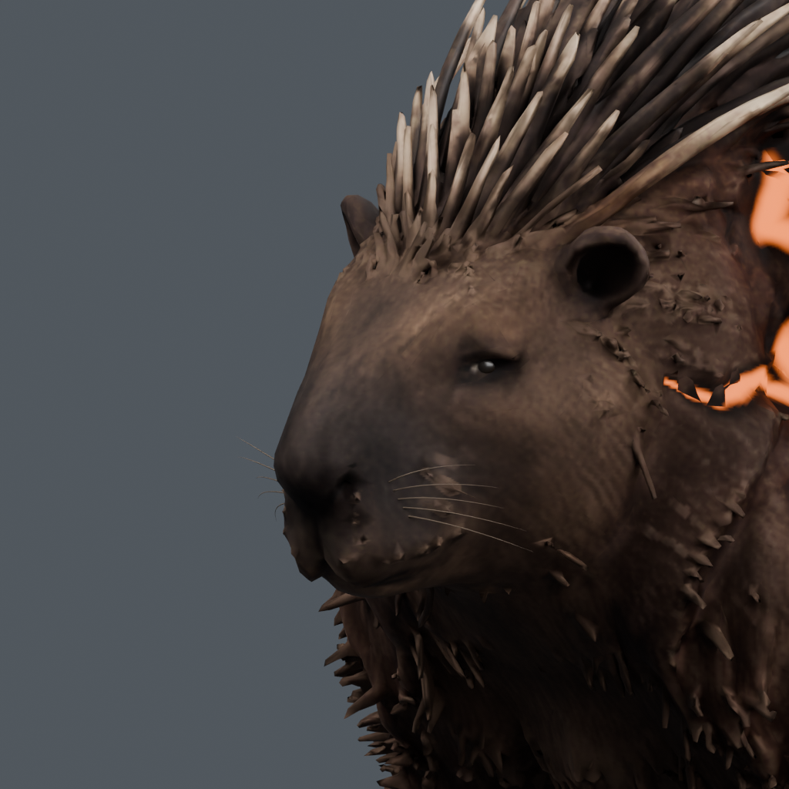
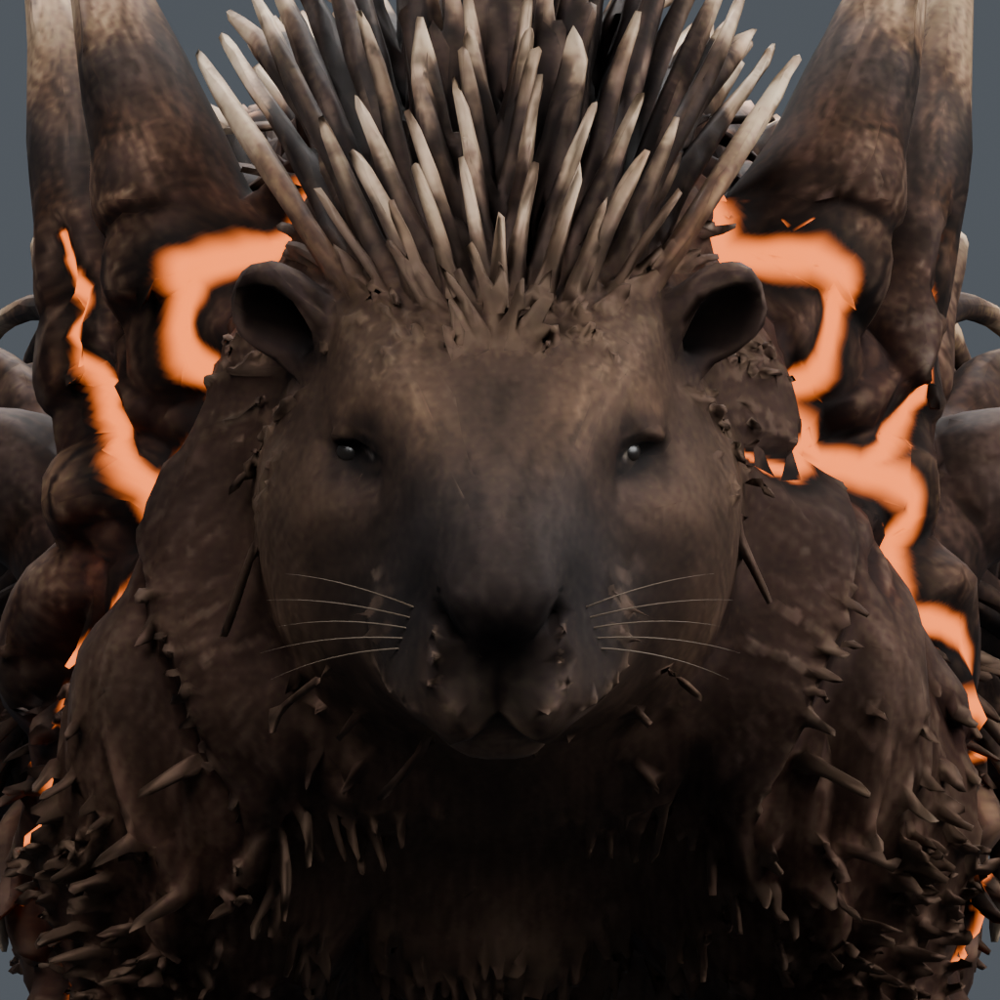
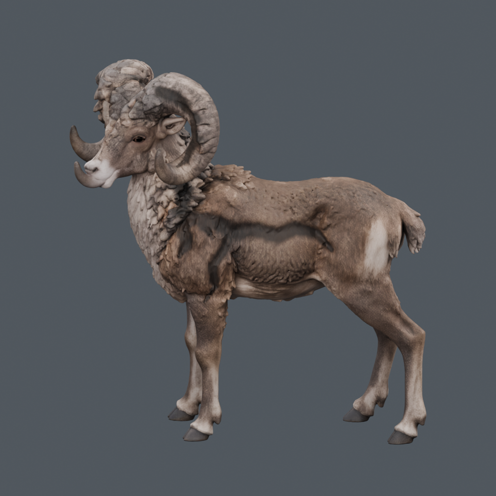
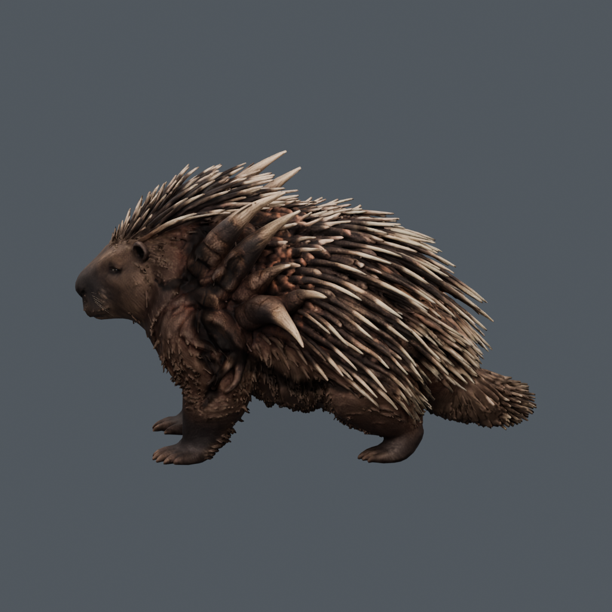

# ART-06C — deep lifelines and porcupine face

Actual Blender and Godot views of the six retained sources. No image
regeneration or retouching is used for this evidence. The pulse animations
encode 48 actual Godot frames at 12 fps; meshes remain static and unrigged.

## Porcupine face

Matched Blender framing of the earlier surface and repaired face:

## Physical damage with light disabled

Every creature folder retains both flanks with emission disabled/enabled,
the reopening result, the source/depth report and actual Godot close views.
`summary.json` compares current measured depth with the previous shallow pass;
`verification.json`, both renderer reports and `art06b-regression.json` retain
the checks. The full report includes per-route before/after BVH depth samples.

[Scope, implementation and limits](../../../../prototype/roster-lifelines-2026-09-09.md).
Editable local package: `build/roster-art06c/lifeline-handoff/`.

The sources retain close-range fur/follicle imperfections and still need rigs,
deformation tests, runtime detail levels, era additions and game adoption.
Neither geometric checks nor rendered light constitute gameplay performance
certification or final human visual approval.
