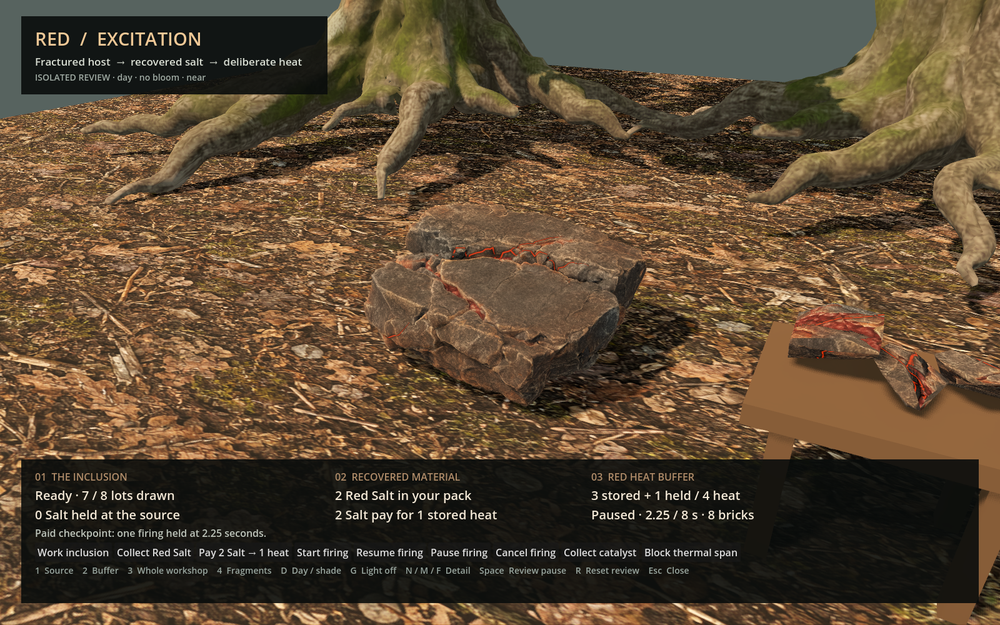
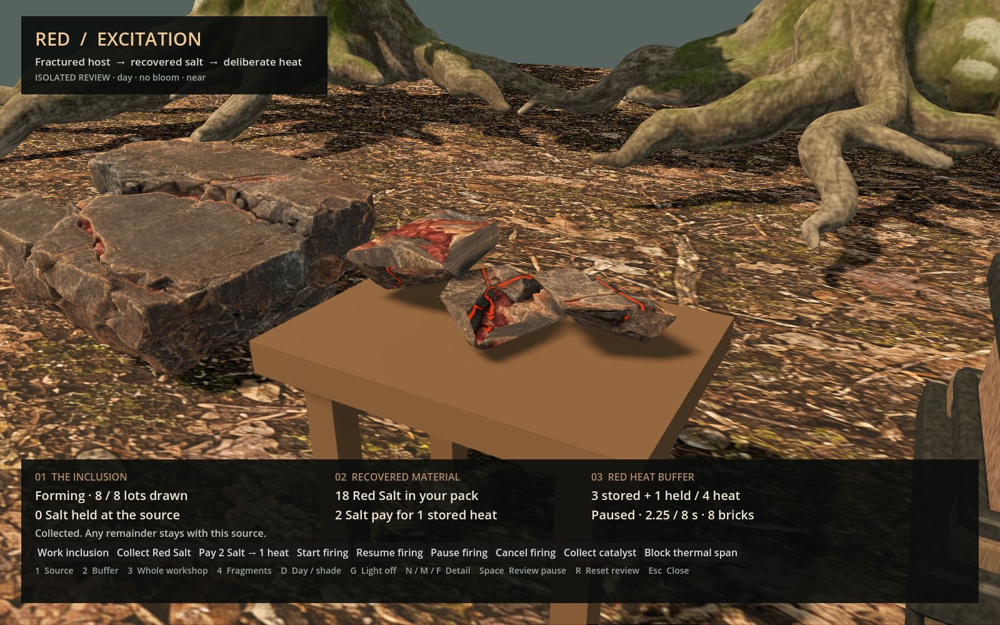
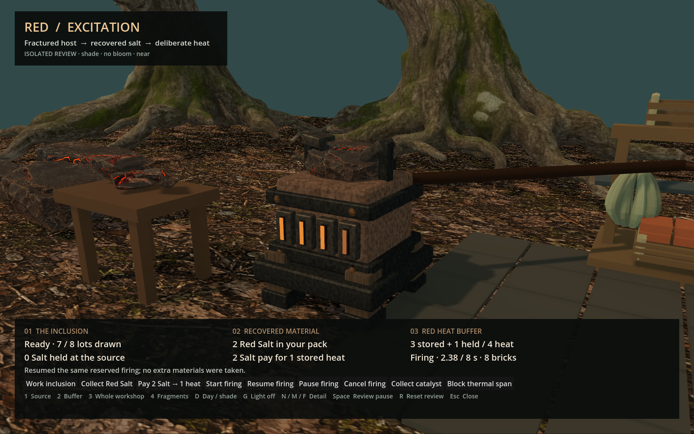

# Red — from source to workshop

First ART-04 family, delivered for owner visual review. These are actual Blender
or Godot renders of the local handoff, not design images presented as finished
gameplay. [Work item and limitations](../../../../prototype/source-workshop-art-2026-09-09.md).

The replay starts from the copied paid checkpoint. It spends already reserved
clay, winding and heat, finishes once and stops working. Stored heat stays steady
when idle or paused. The loop in this preview file restarts its recorded frames;
it does not represent repeated native production.

Additional actual views: [released claim](source-claim.png),
[exhausted source](source-spent.png), [paused buffer](buffer-paused.png),
[whole chain](workshop-overview.png), and
[packed editable Blender source, emission off](editable-preview.png).

The original generated [input reference](red-inclusion-input-v01.png) is kept
unchanged; it is the design input, not an engine screenshot. Exact prompt and
source-generation recipe: [`tools/wroughtwild-workshop`](../../../../../tools/wroughtwild-workshop/README.md).
TRELLIS v0.6.0, CUDA, 1024, seed 42, BiRefNet, PNG textures. Raw source SHA-256:
`605ba13c594a0173243c1f8145958cd3c1cc6234ba74ca5358aeffd8165fe70e`.

[Checks](checks.json), [native/source/context provenance](provenance.json) and
[isolated performance measurements](performance.json) accompany the evidence.
Both renderers have full frame/state captures in the local package. No bloom is
required; SSAO is enabled only in Forward+. No normal save, gameplay rules,
generation profile or ordinary game asset was changed.

Local package: `build/workshop-art04/red-handoff/`. It contains the packed Blender
file, nine GLBs, source and fragment atlases, the standalone native review,
checked recipes, original raw source and a per-file SHA-256 manifest. Full game
route integration and lower-spec performance remain later work.
