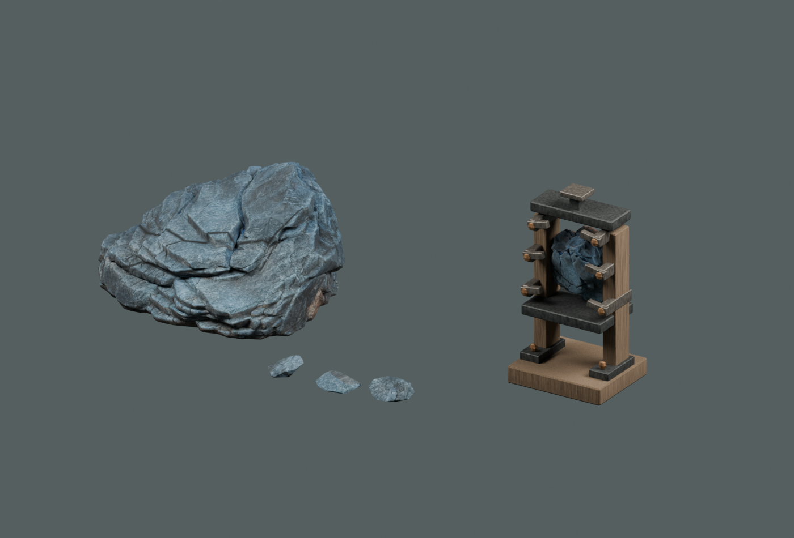
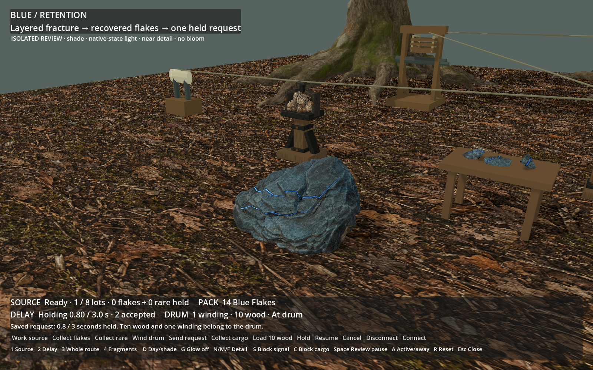
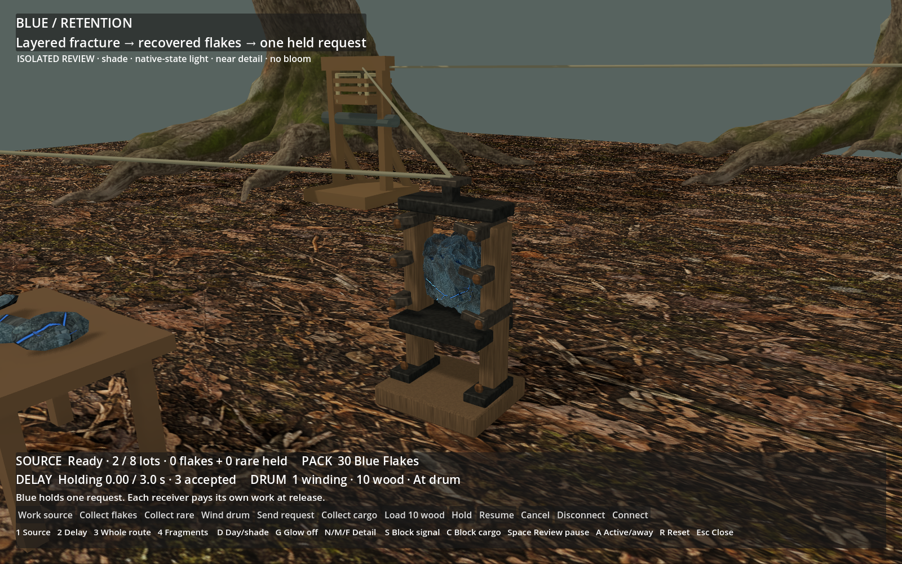

# Blue Retention — finished review

**Technical delivery; owner visual review pending.** Built-in ImageGen → local
TRELLIS → Blender → native-state Godot. These are actual finished renders;
`blue-fracture-input-v01.png` is the earlier generation reference only.

The source has opaque nested slate layers, dark recessed fractures and narrow
living light. Three solid flakes carry the same material. The crafted delay
holds it vertically between timber supports and forged retaining lips.
The eight-second clip follows one real request: the held crest advances with
native elapsed time, releases once and spends the drum's existing winding.
An unwound receiver can receive the release while staying still.

[Source without emission](source-no-glow.png), [recovered flakes](blue-flakes.png),
[paused request](delay-paused.png), [unwound release](delay-unwound-release.png),
[spent source](source-spent.png), [rare-only claim](source-rare-held.png).
The rare case explicitly consumes test-carried flakes for capacity while
advancing actual fixed outcomes; it is ownership coverage, not pacing evidence.

White's owner approval is recorded. Blue visual approval is separate from
the automated checks in `checks.json`; `performance.json` describes only this
isolated scene. [Result and limits](../../../../prototype/blue-workshop-art-2026-09-09.md)
and [recipe](../../../../../tools/wroughtwild-blue/README.md).
Local package: `build/workshop-blue/blue-handoff/Launch review.ps1`.
Normal-world adoption, Green and ART-05 remain later slices.
