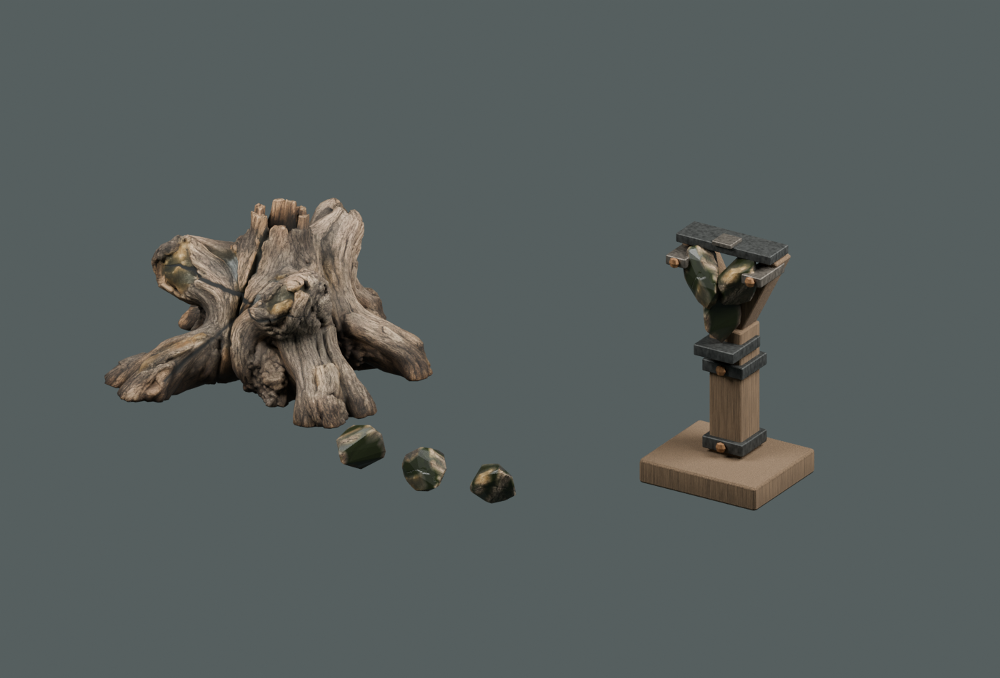
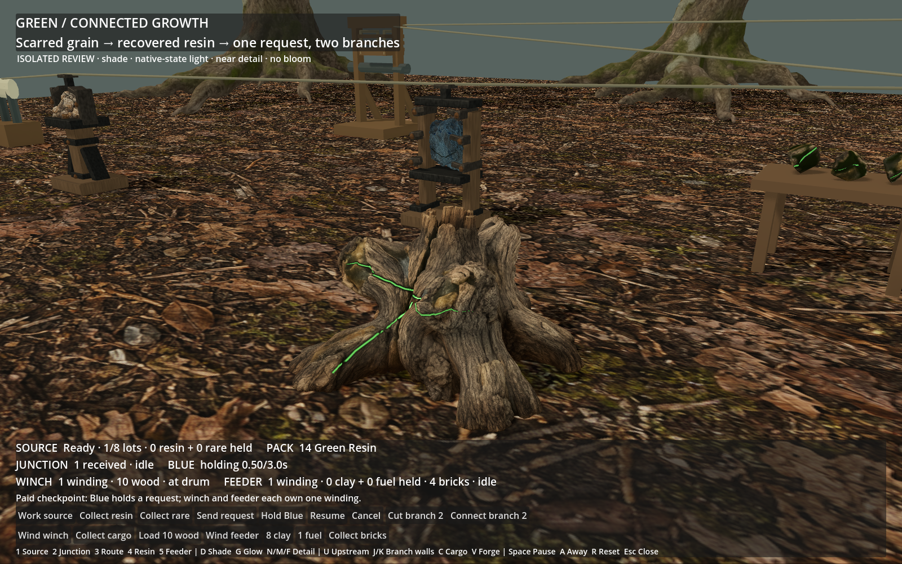
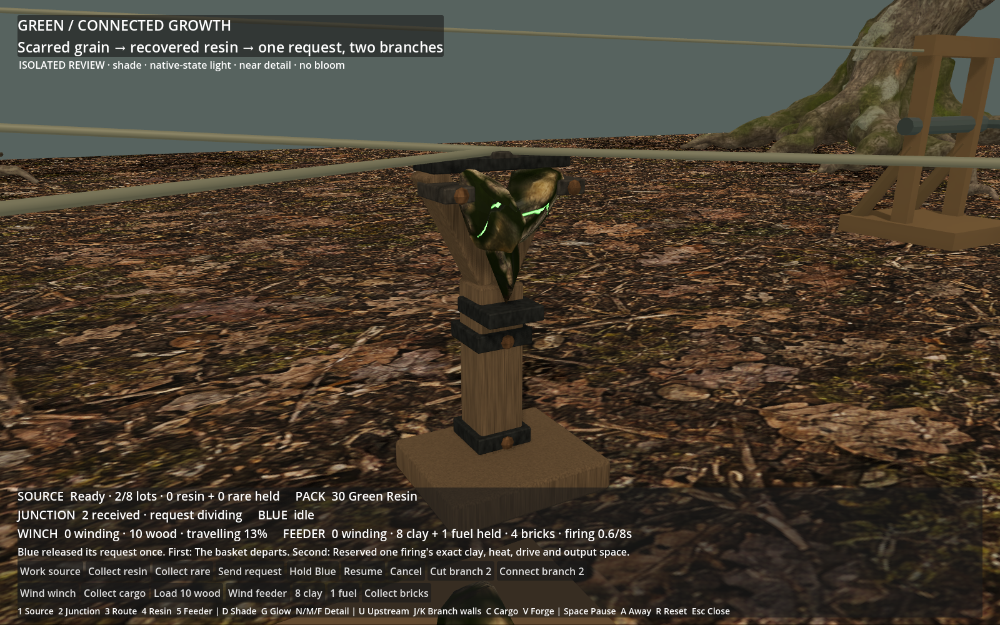
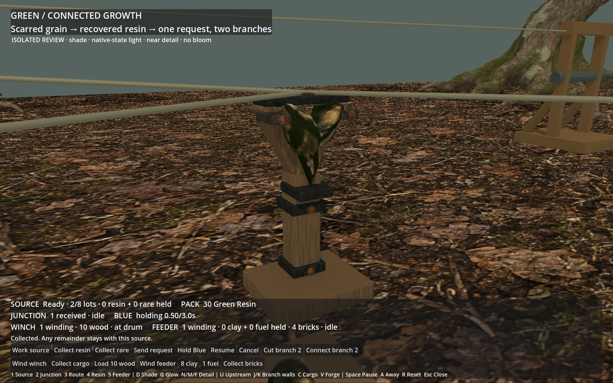

# Green connected growth — finished review

**Technical handoff; owner visual review pending.** Built-in ImageGen → local
TRELLIS → Blender → native-state Godot. These are actual finished renders;
`green-root-input-v01.png` is the preserved generation reference only.

The root crown retains weathered grain around cloudy resin inclusions. Narrow
scars follow its surface and divide into fading branches. Three solid recovered
pieces carry that material into a supported Y with timber and forged clamps.

The 12-second clip follows the copied paid state: Blue holds its remaining
delay; Green sends one request to both outputs; the winch and feeder each spend
their own winding. Ten wood travels to the landing. Eight clay and one fuel
remain held until the feeder adds four bricks to its four existing output.
Camera cuts show each stage. The loop is playback of one native sequence.

[Source without emission](source-no-glow.png), [recovered resin](green-resin.png),
[first branch blocked](junction-first-blocked.png),
[second branch blocked](junction-second-blocked.png),
[requests to unwound receivers](junction-unwound.png),
[finished firing](feeder-complete.png), [spent source](source-spent.png),
[rare-only claim](source-rare-held.png).

Blue's visual approval is recorded. Green's technical checks are in `checks.json`;
`performance.json` covers this isolated scene only. The rare claim is from the
original remaining fixed lots, without grants or outcome edits.
[Result and limits](../../../../prototype/green-workshop-art-2026-09-09.md) and
[recipe](../../../../../tools/wroughtwild-green/README.md).
Local package: `build/workshop-green/green-handoff/Launch review.ps1`.
ART-05 actual-world route remains a separate next slice after Green visual review.
