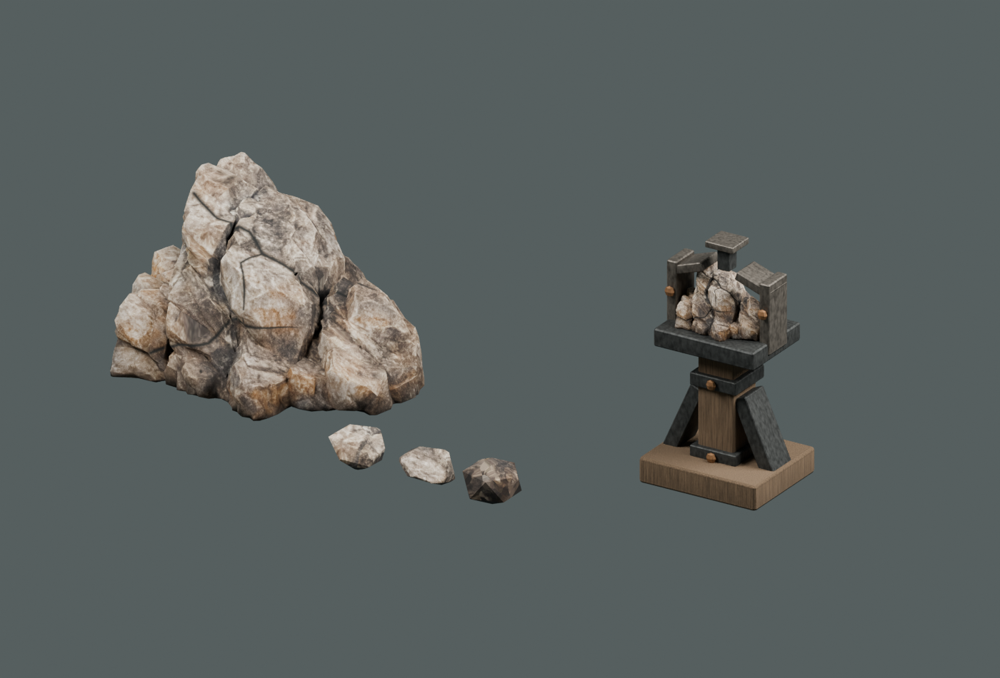
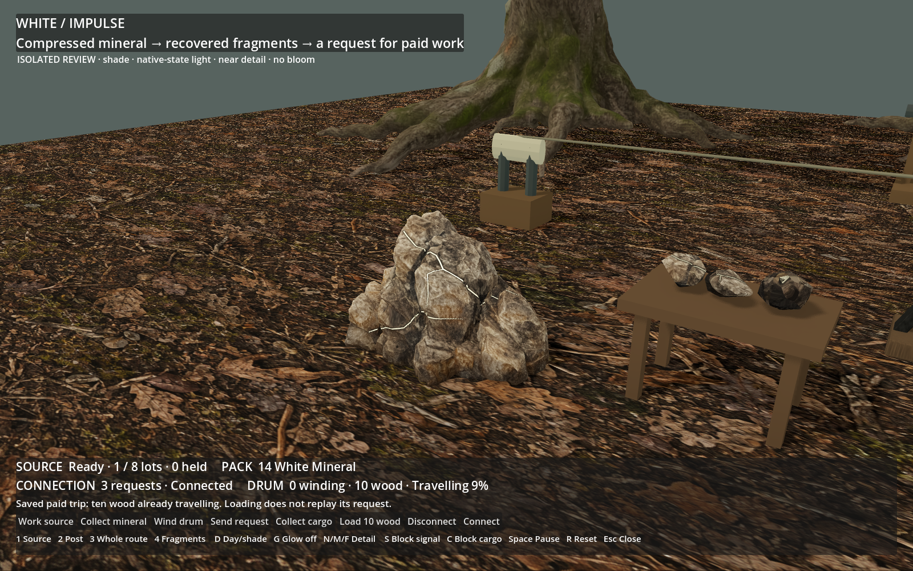
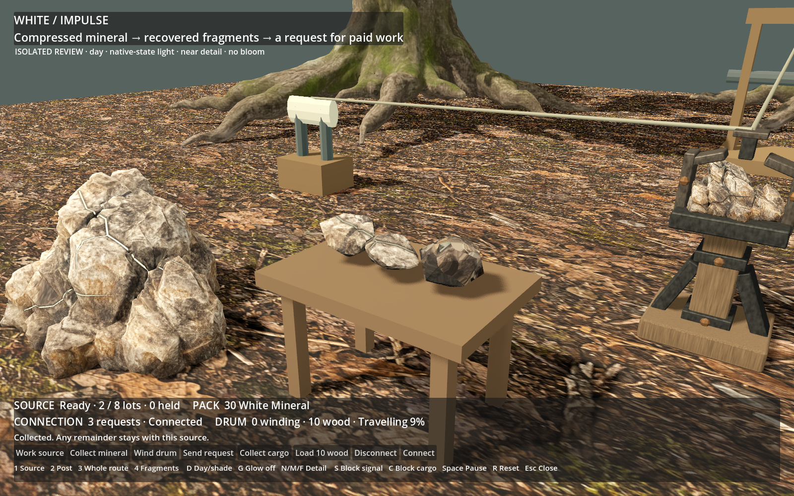
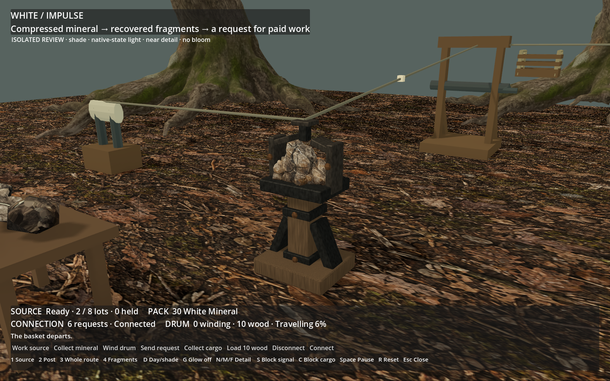
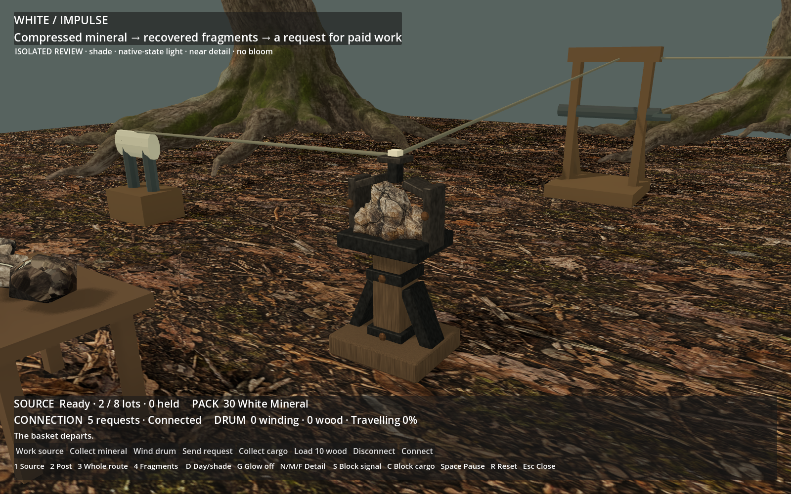

# ART-04B — White source, recovered mineral and connection

Technical handoff delivered and **visually approved in chat**: “Yep approved, next!”.
Blue is the next separate family. These are actual finished assets,
with one Blender studio view and Godot Forward+ captures; `white-inclusion-input-v01.png`
is the original ImageGen input, not a finished engine asset.

## Approval views

The complete set with emission off:

The source's ivory scar in shade, with no bloom:

Recovered material retains the same host texture and selected scars:

The fitted post during an actual paid request:

Six-second replay of an actual paid empty return. White's one-shot passage ends;
the separately wound drum continues its trip. This is a replay, not a free-work
loop, and the saved historical request is not replayed on scene load:

The existing lever/winch/landing and grove are context. Approval covers the
new White source, fragments and connection post. Their normal-world adoption
remains ART-05, with first-person placement, route, streaming and crowded cost
still to verify. The source's far mesh is heavier than Red's and needs a later
topology pass for a substantially lower budget.

## Evidence and local use

- `checks.json`: 73 native + 6 restart checks, 118 asset checks, 454 state/visual
  checks in each renderer and 231 recorded-state/pixel/timeline checks.
- `performance.json`: six isolated Forward+ day/shade view measurements on the
  RTX 5090. These do not establish normal-world or lower-spec performance.
- `provenance.json`: frozen native build, copied paid checkpoint and reused
  context hashes. The local package additionally retains raw generation logs,
  model/runtime revision, unchanged GLB, image and exact prompt.
- The extra stills show ready/no-glow, held claim, spent source, idle post,
  unwound request, paused request and complete route.

Local package: `build/workshop-white/white-handoff/`. Run `Launch review.ps1` or
open `editable/white-workshop.blend`. Its own project and APPDATA preserve normal
play. The recipe and complete limits are in
[tools/wroughtwild-white](../../../../../tools/wroughtwild-white/README.md) and the
[work item](../../../../prototype/white-workshop-art-2026-09-09.md).
