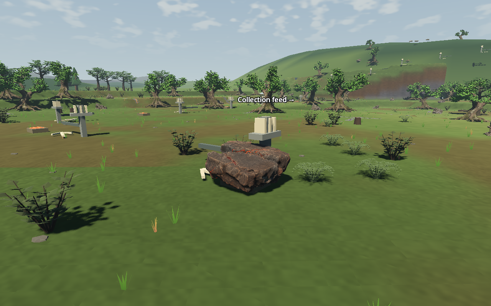
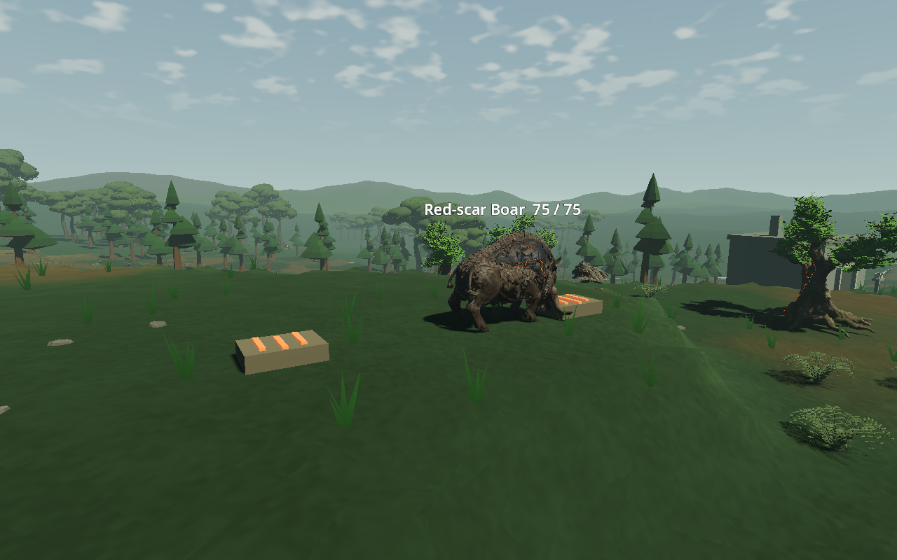
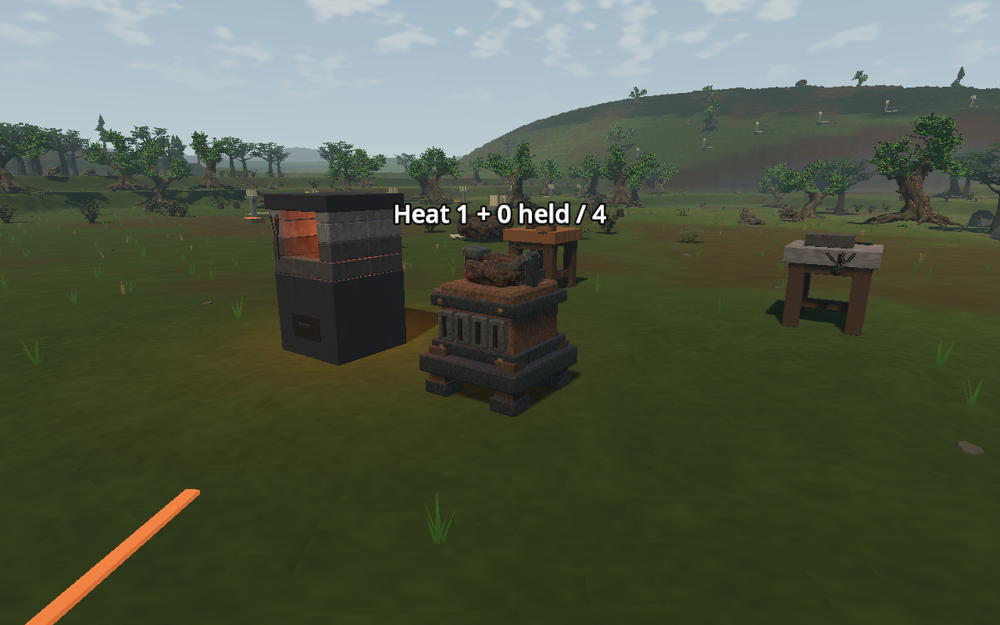
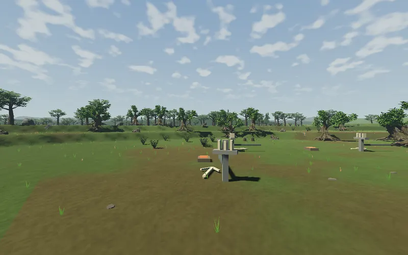

# ART-05 — actual Red world route

**Technical pilot delivered; owner visual review pending.** These are actual game
captures from the isolated LF-3 seed-77 world. The source, boar, resource stock,
terrain and paid workshop belong to the existing game; this is not the composed
ART-02 grove transplanted into generation.

[Original source view](before-source-day.png), [original boar](before-boar-day.png),
[original buffer](before-buffer-day.png), [source at dusk](source-dusk.png),
[trail](trail-day.png), [boar at dusk](boar-dusk.png).

The walk clip samples the actual 135.18 m controller traversal at 300 ms per
captured frame. [Combat](combat.webp) samples the actual casting phase at 200 ms
per frame. Playback repeats those recorded sequences; capture sampling is not
runtime frame rate or a second native hunt. The route test separately observed
and dodged a complete native warning/release before casting.

The current landscape still contains older ground cover, distant canopies,
scenery, fixtures and terrain shading. Their contrast with the new assets is
visible here and is the next focused visual gap. No extra resource/plant density
or taller-tree collision rule was introduced to hide it.

- [249 integrated checks](route-checks.json),
  [245 original-presentation checks](baseline-route-checks.json),
  [8 fresh-process checks](restart-checks.json).
- [926 exact asset checks](asset-checks.json),
  [12 paid native work-clock checks](native-component.json),
  [source/import provenance](asset-provenance.json).
- [Matched Forward+ measurements](performance.json), including the explicitly
  labelled [24-boar stress fixture](24-boar-stress.png), not a spawn-density change.
- [Fresh package verification](handoff-checks.json) and
  [pinned native build](native-provenance.json).

The playable package is `build/art05/red-route-handoff/Launch route.ps1`. It opens
its own game/data and APPDATA, starting from the paid workshop before the finite
hunt. F5/F9 and subsequent launches use only that isolated save.

[Implementation, measured cost and limits](../../../../prototype/world-route-art-2026-09-09.md)
and [reproduction recipe](../../../../../tools/wroughtwild-route/README.md).
Broader reuse follows review of this actual world presentation.
