# ART-07R5 chest seating evidence

Status: ready_for_integration. Owner visual acceptance: pending. Ordinary-world
rollout: outside scope. G2-V03 has a measured authored visual candidate; no native
seat/body change or new placement rule was needed.

The inherited chest base extends 0.15 m below its nominal support plane. Slabs
also straddle that plane, producing deeper intersections at their actual tops.
R5 raises the cabinet underside and adds four small feet. The cabinet now meets
the ordinary slab and clears a fine slab. Feet reach flat ground. Full slabs
conceal 0.125 m of feet; fine slabs conceal 0.0625 m. Those submerged portions
remain in the mesh and are explicitly measured, not hidden from the record.

| Support case | Original lowest mesh gap | Candidate lowest foot gap | Candidate cabinet gap |
|---|---:|---:|---:|
| Flat fixture, all eight families | -0.150 m | 0.000 m | +0.125 m |
| Ordinary slab | -0.275 m | -0.125 m | 0.000 m |
| Fine slab | -0.2125 m | -0.0625 m | +0.0625 m |
| Retained paid home floor | -0.150 m | ~0.000 m | +0.125 m |
| Three retained terrain locations | -0.150 m | ~0.000 m | +0.125 m |

The 24 paired fixture cases and eight paired retained-world cases agree between
Forward+ and Compatibility. Each retained case has nine identical before/after
support-ray samples. The terrain probes are flat portions of LF3 seed 77 near
the home; this does not establish arbitrary slope, ledge or unsupported-seat fit.
The complete terrain hash is unchanged, as are native source/work/machine ledgers.

## Actual source and runtime views

These are original full frames, without crop, resize, retouch or generated pixels.
Source PNGs are 1200 x 900; runtime PNGs and GIFs are 1440 x 900. `provenance.json`
records exact source paths and SHA-256 values. `results.json` records commands,
private user paths, process IDs, exit codes, log hashes, assertions and measurements.

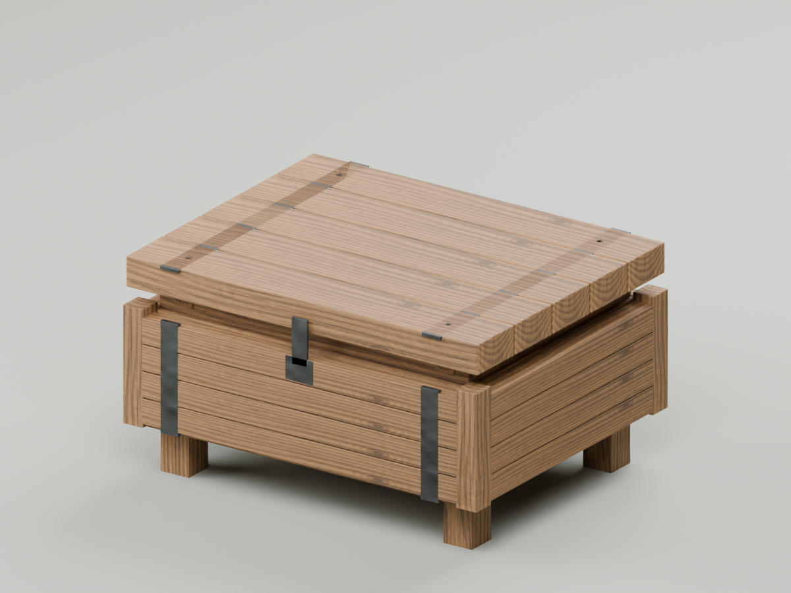
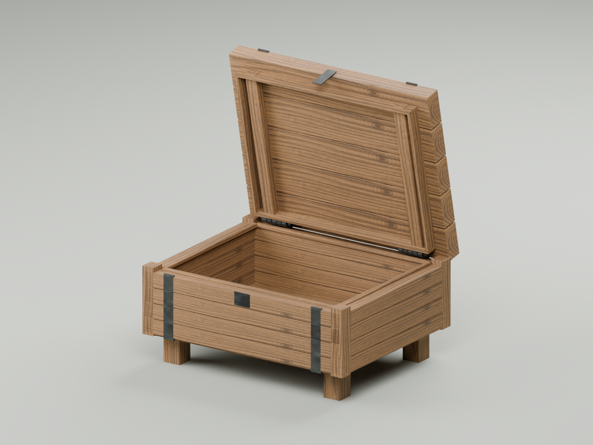

| Ordinary slab before | Ordinary slab candidate |
|---|---|
| 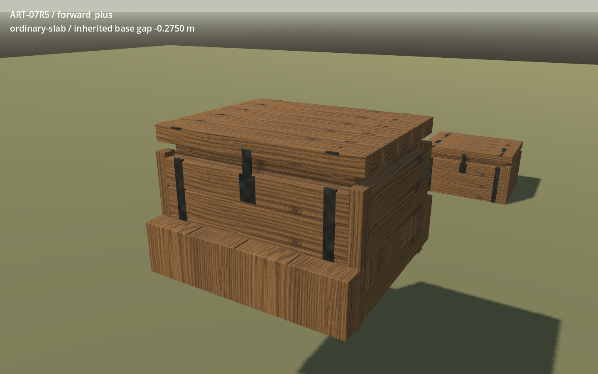 | 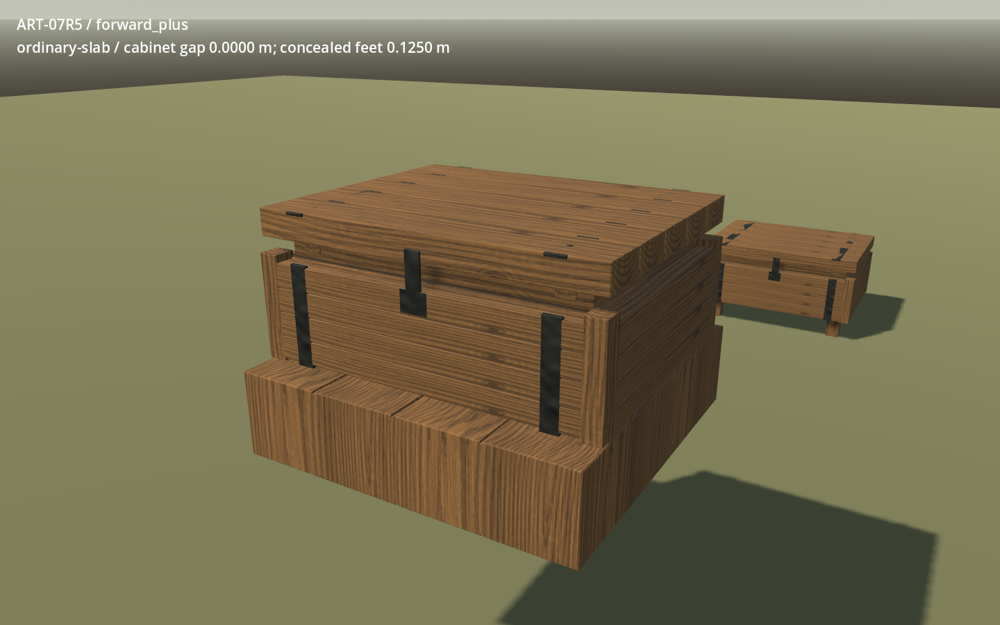 |

| Fine slab before | Fine slab candidate |
|---|---|
| 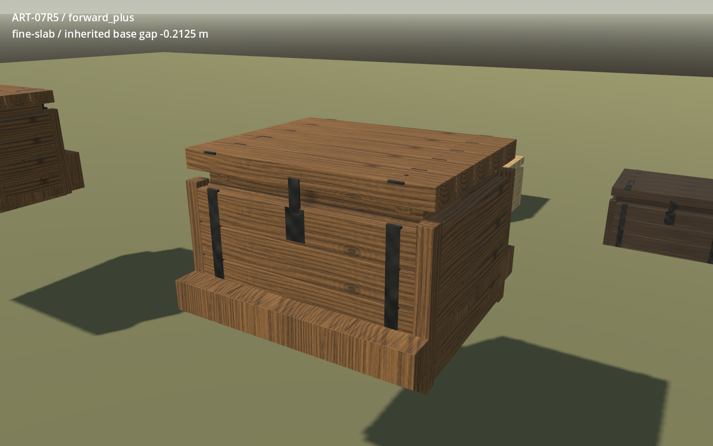 | 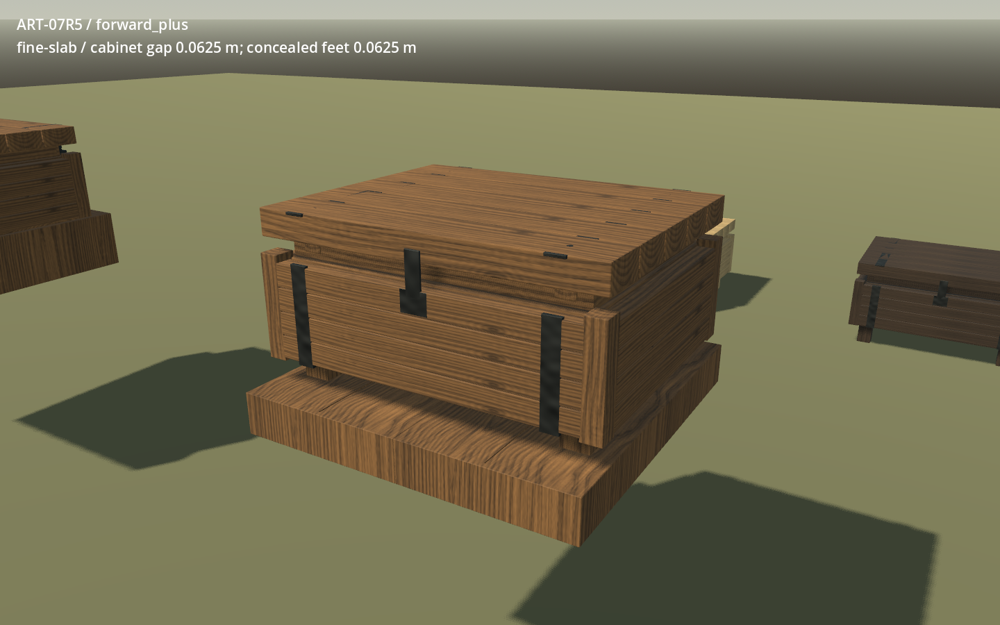 |

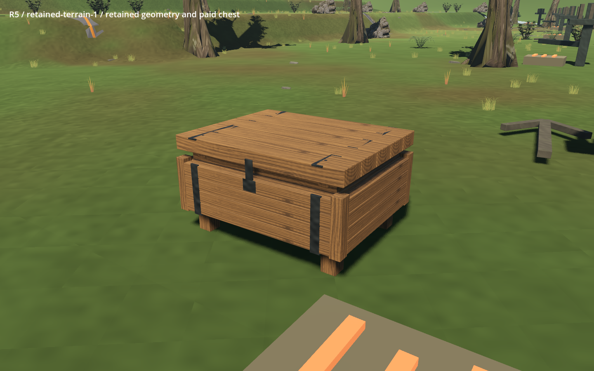
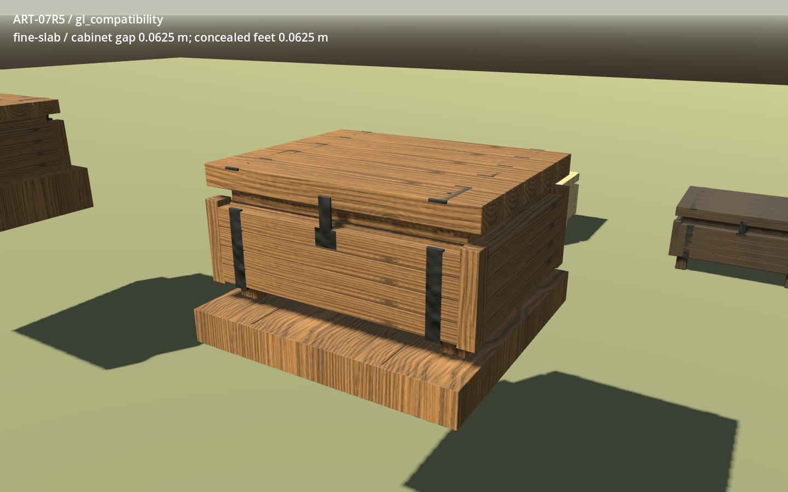

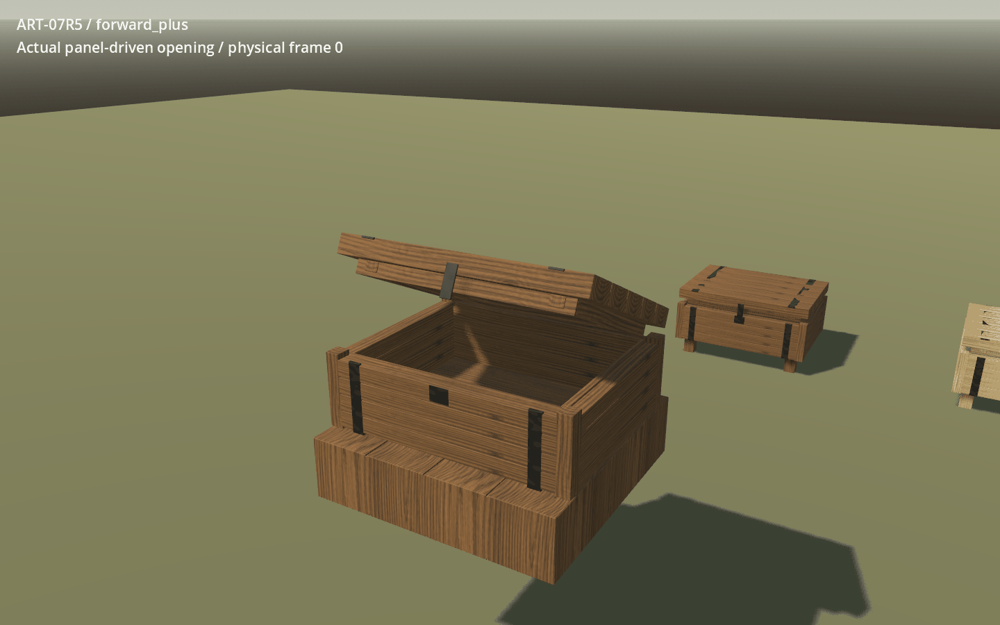

Motion consists of 20 real panel-driven samples per renderer. The first sample
is already partway open. Opening and closing are independently asserted through
native engine ticks; the GIF contains opening samples only and loops back to its
first sample. It is a capture-paced inspection, not an uninterrupted real-time
recording or an authored substitute for interaction. Timestamp intervals are
rounded to GIF's 10 ms units: Forward+ 1.590 s, Compatibility 1.920 s. All 40 raw
PNG frames, angles, native transforms and timestamps remain in the seal.

## Checks and remaining clearance limits

Fresh candidate import and both packaged launch checks pass. The separate Blender
reopen finds all 42 packed images, measures all eight closed/open variants, and
independently imports all 16 GLBs with matching bounds and triangles. All source
solids are manifold, outward and nondegenerate. The eight original lid GLBs and
all embedded chest-body image bytes remain exact. The selected master hash is
`55392f9725c07e8005facdefbc22f4534bd8fb4df78de6a67a22a06347a84382`.

Per renderer, the candidate passes 294 capture assertions, 32 fresh-process
restore assertions, 249 checks preceding the separate benchmark, and 65 retained
world assertions: 1,280 in total. The selected baseline passes 1,080. Failures are
zero in all 24 selected source/import/runtime jobs. Earlier failed attempts are
retained separately and are not included in these pass counts.

Unpaid and duplicate placements refuse without spending or adding ownership.
Successful placement pays the exact native recipe and creates one store. Actual
E targeting opens that store; deposit 17 wood + 23 stone and withdrawal 3 stone
leave 37 of 960 shared units used. Two repeated loads in a fresh process preserve
all 12 paid chest owners, contents and saved block/native records. Before/after
records are equal. Full 273-pair catalogue preservation is established by exact
game/data/native bytes outside the visual delta; this slice freshly exercises the
eight chest families, not the full unrelated catalogue journey.

The native box remains 1.0 x 0.7 x 0.8 m at local centre Y=-0.15. Placement origin
remains +0.35 m above the nominal support plane. Visible height is now 0.55 m.
The under-cabinet void is cosmetic; the original solid collider still occupies it.
Storage capacity is not inferred from the smaller visual cavity.

Godot hinge (0, 0.09, -0.354), opening -78 degrees and 3.8 rad/s authority remain
unchanged. Closed top is +0.550 m and open top +1.200394 m above the nominal plane.
Rear-wall AABB overlap remains 0.025 m closed / 0.095433 m open in depth. A ceiling
at underside +0.875 m still intersects the open lid (AABB overlap height 0.25 m).
These existing D-017 legal overlaps remain visible below; AABB overlap measures
are not exact intersecting triangle volume. R5 introduces no lid-sweep refusal.

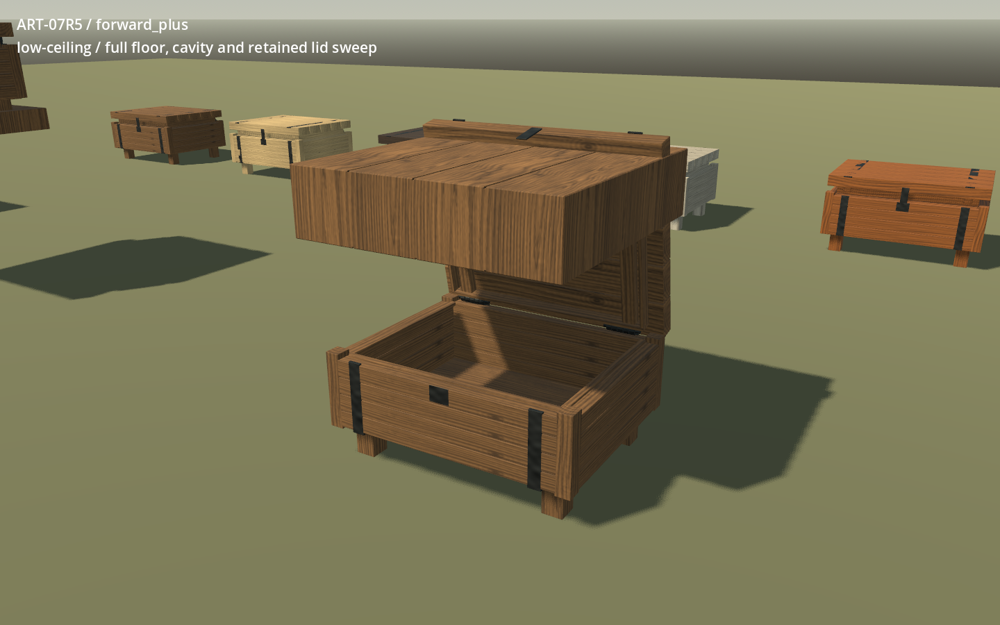
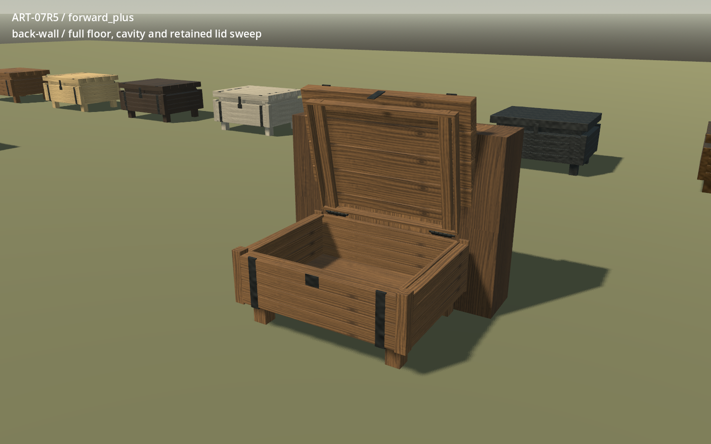

## Current-machine costs

Measured on Ryzen 9 9950X3D (16 cores / 32 logical), 33,446,744,064 bytes system
memory, RTX 5090, NVIDIA 591.86, Windows 11 build 26200, Godot 4.5. Separate
benchmark processes settle 120 frames and sample 300 process-frame intervals,
1440 x 900, 4x MSAA, vsync off. Runner records no benchmark competitors. These
are current-machine intervals, not minimum-hardware or GPU-time acceptance.

| Renderer / variant | p50 ms | p95 ms | Worst ms | Draws | Frame primitives | Texture bytes |
|---|---:|---:|---:|---:|---:|---:|
| Forward+ baseline | 0.464 | 0.834 | 1.232 | 170 | 231458 | 459915776 |
| Forward+ candidate | 0.467 | 0.831 | 1.230 | 170 | 247010 | 459915776 |
| Compatibility baseline | 0.876 | 1.264 | 1.770 | 234 | 231458 | 272763190 |
| Compatibility candidate | 0.867 | 1.353 | 1.752 | 234 | 247010 | 272763190 |

One run per variant/backend is recorded. The +0.089 ms Compatibility p95 change
is reported without a statistical performance claim. Source triangles per closed
chest rise 6,336 -> 6,768 (+432 / 6.82%); runtime primitive counts include renderer
passes. Draws and texture memory are unchanged. No load-time improvement or target
budget is claimed. Candidate import took 87.925 s; source fit 5.109 s and selected
packed reopen/render/import 97.590 s; these wall times include their whole jobs.

## Diagnostics, controls and handoff

The inherited SSAO-only-in-Forward+ warning appears in both original/candidate
Compatibility packaged smoke and retained-world runs. No other warning, error,
leak or orphan diagnostic occurs in the selected logs. Diagnostics were not muted.
Earlier failures were harness setup errors: a front wall blocking the intended
rear-wall interaction, String/Dictionary mismatch for native ledger snapshots,
a terrain scene missing its sandpit parent, and an outside-house interaction ray.
They were corrected without changing native rules or weakening assertions. An
initial packed reopen and earlier capture set cropped the open lid; the selected
`reopen-v02` and `baseline06` / `candidate` captures correct the camera. All earlier
logs and frames are retained. GPU deferrals launched no child; the unchanged runner
also produced a missing-log hash error on empty deferred output. No peer was stopped.

All fit values, derived dimensions, map scales, render controls and purposes are
in the owned [tool README](../../../../../../tools/wroughtwild-art07-repairs/r5/README.md)
and `fit.json`. The runtime delta contains eight body GLBs and eight semantic body
rows in `game/e3/geometry.json` (the JSON is reserialized with a final newline).
R5 harness additions are separately marked fixture-only. All other 4,778 original
runtime entries match the prepared G1 baseline. Original packages are rehashed
before consumption and again at completion.

The receipt under `docs/prototype/art07-repairs/2026-09-14/receipts/r5.md` gives the
sealed path, exact manifest hash and reconstruction commands. No predecessor delta
is consumed; published R1-R4 are verified wave gates. R8 must reconcile the eight
replacement GLBs with R2 texture-storage work. Whole-runtime overwrite is unsuitable
for combining independent repairs. Owner review, R8/R9 and ordinary-world rollout
remain separate; this worker does not integrate or push main.
