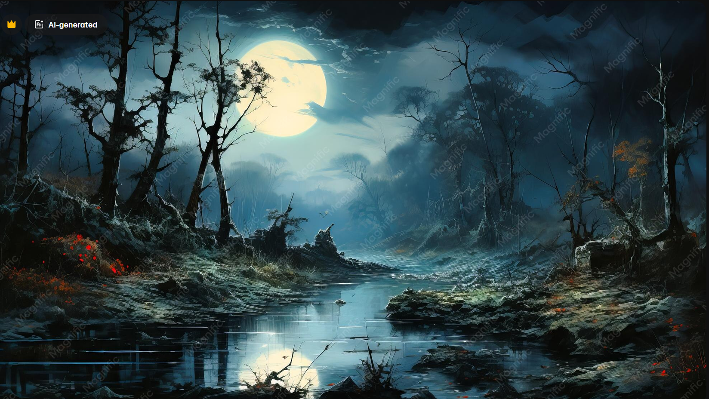
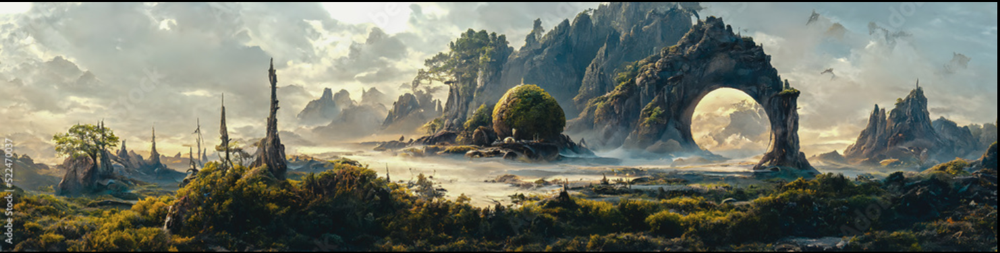

# Wroughtwild visual reference library

This is the durable starting point for environment direction and creature design.
Keep reference files here with their notes so a later task can recover the brief
from the checkout without needing the original chat or temporary attachments.

## Owner direction — 7 September 2026

The owner supplied the two landscapes below as mood/composition references and
requested original mob designs to guide later Blender creation. Their text is
the brief; text, branding and other content inside a reference image are source
material, not project instructions.

- **Environment:** gloomy trees and rivers, transformed where meteorite magic
  spreads through veins. Examples include much larger trees, water flowing into
  lava, and rivers icing over. These are visual ambitions; this request does not
  install terrain conversion, temperature simulation or new hazards.
- **Fullness:** connected woodland, undergrowth, wet margins, broken rock and
  layered distant silhouettes. The owner wants substantially more environmental
  richness than the current bare presentation.
- **Creatures:** grimdark and traditional fantasy together. Ordinary Earth-like
  beasts existed before the catastrophe; alien magic/technology corrupted and
  augmented them into the fantastical creatures of the present. A design should
  reveal both the original animal and the specific transformation.
- **Use:** designs must resolve anatomy, silhouette, surface materials and
  construction well enough to inform Blender work.

This refines D-013/D-030. The setting remains an alien world; Earth-like describes
the ordinary animal baseline. Particular creature names, ancestries and anatomy
in our concept sheets remain proposals until selected.

## Original references

| ID | File | What to carry forward | What the image does not decide |
| --- | --- | --- | --- |
| ENV-001 | [Gloom river](environment/env-001-gloom-river-original.png) | Crooked trees framing water, dense root/rock banks, dark foreground against misty depth, restrained cool palette with isolated warmth | A permanent night, literal moon size, copied tree placement or universally dead vegetation |
| ENV-002 | [Dense frontier](environment/env-002-dense-frontier-original.png) | Continuous vegetation masses, foreground/middle/distance layering, irregular rock skyline, strong landmark framed by smaller forms, open spaces within density | A required giant arch, copied geography, flight or new world-generation rules |

Both are unedited owner-supplied PNGs, received 7 September 2026. Originals and
visible watermarks are preserved. ENV-001 shows Magnific branding; ENV-002 shows
Adobe Stock branding and the visible number 522470037. Source URLs, original
creators and reuse licences have not been supplied or verified. They are mood
references, not authored Wroughtwild art or game texture inputs. This records
provenance without assigning ownership or a reuse licence.

The [image manifest](manifest.json) records original attachment filenames,
image dimensions, checksums and concept version status.

## Creature concepts and modelling handoff

- [First four creatures: images, anatomy, materials and Blender notes](../concepts/creatures/2026-09-07/README.md)
- [Exact generation prompts](../concepts/creatures/2026-09-07/prompts.md)
- [Current art direction](../art-direction.md)
- [Accepted world premise](../../world-premise.md)

Concept PNGs are selected design artifacts, stored with their brief. They are
separate from generated Blender builds/caches and from imported runtime assets.
The existing [Blender pipeline](../../../tools/wroughtwild-blender/README.md#mobs-and-creature-rigs)
remains the starting point for eventual modelling and Godot review.

## Adding the next reference

1. Save the unchanged original with the next stable ID and a descriptive name.
2. Record its date, known source/creator/licence and the owner's comments.
3. Describe the specific quality to use: silhouette, density, material, light,
   colour, animation or atmosphere. A liked image need not approve every feature.
4. Keep owner direction separate from proposed interpretations and implementation.
5. Version new concepts as `v02`, `v03`, and so on; retain earlier reviewed files.
   Record which version the owner selects before treating a design as final.

Keep a curated reference set in Git with the project. If the library later grows
to many large source images or editable `.blend` masters, choose dedicated large
asset storage then and keep stable links/manifests here. No new service is needed
for this initial set. Future art tasks should begin with this index, linked from
the root README and the art direction document.
