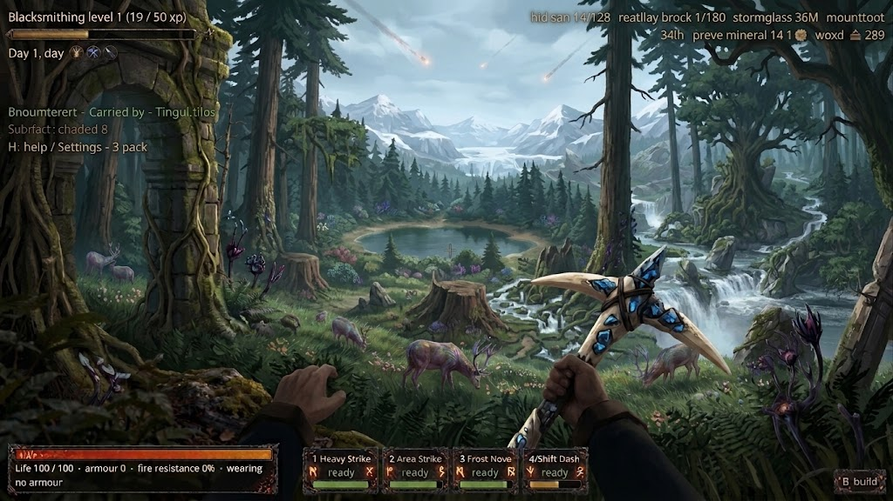
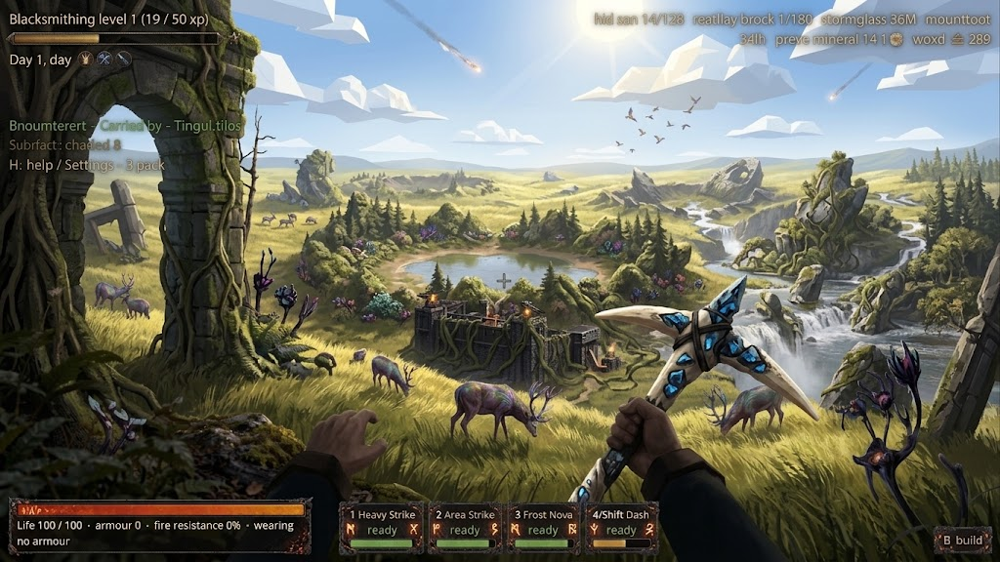
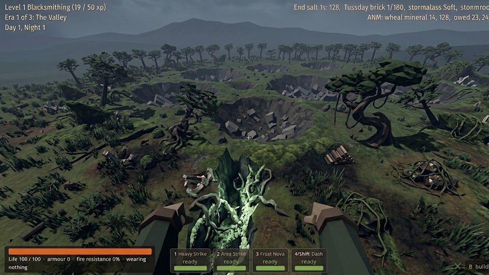
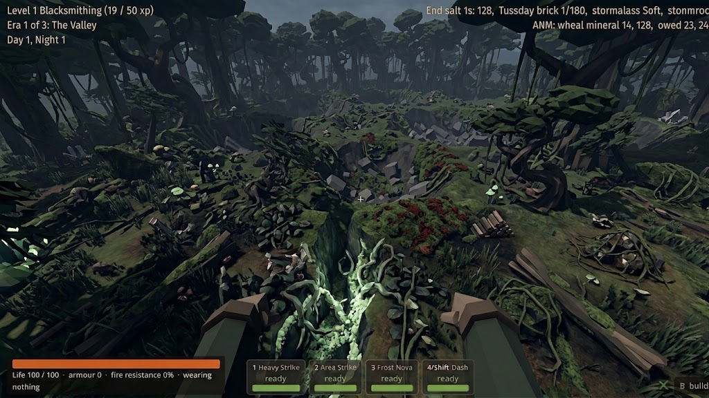
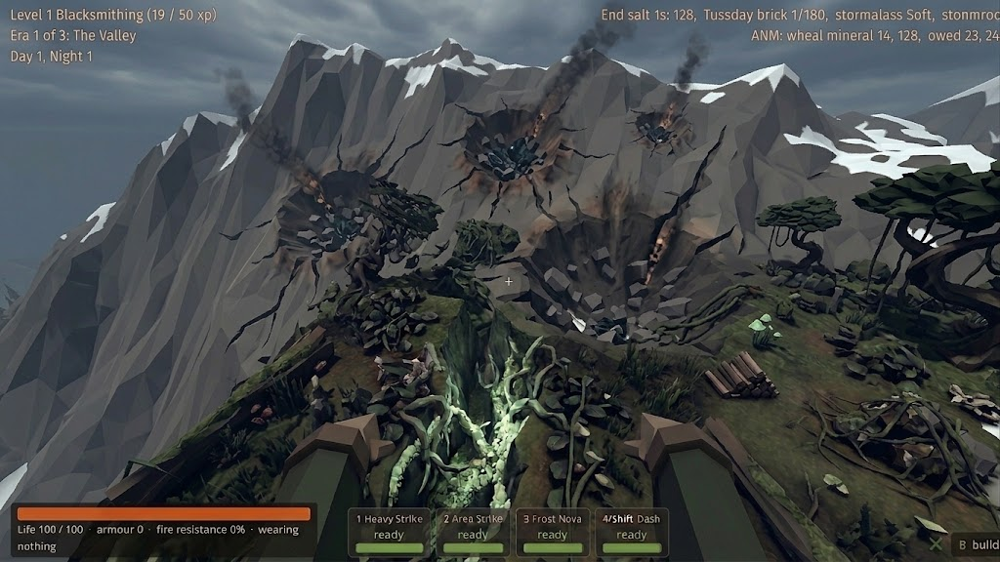
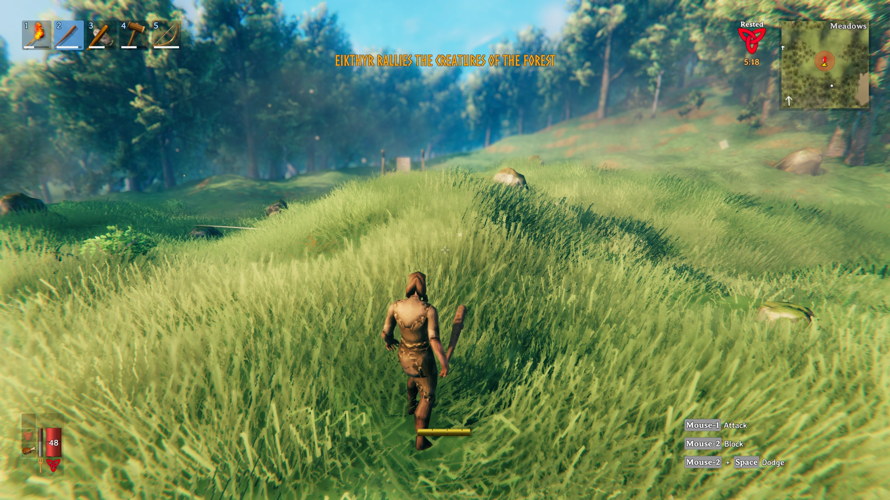

# Reclaimed frontier — owner references, 14 September 2026

**Accepted visual direction and future planning context.** The owner requested
durable preservation of all six images, their influence and the sentiment below:
“I didnt want it exactly like those images, just the influence and my sentiment
related to them”. This is not approval of every feature in an image, a replacement
art style, an exact map blueprint or permission to implement generation changes now.

The central direction is **years of recovery over impact-shaped terrain**:
undulating living landscapes, established vegetation and wildlife, with large old
impacts shaping memorable places and surviving pulsing veins/cracks revealing the
augmentation beneath. Green growth should cover much of the old chaos. The exact
number of years is unspecified. Different biomes retain their own character.

Read [the owner's wording](owner-intent.md) alongside this gallery before planning
or authoring from these references. [The future intensive](../../../../prototype/reclaimed-frontier-intensive-2026-09-14.md)
records scope, sequencing and unresolved implementation choices. Its planning
sequence follows R9 and accepted ART-07 main-game integration; it does not expand
the active repair/review tasks or add a gate to that integration.

## How to use the set

Use the owner's descriptions to select qualities, then make original Wroughtwild
compositions. Carry forward rolling ground at walking height, connected vegetation,
clearings and open routes, biome-specific recovery, and old scars within living
terrain. Damage should affect surrounding landforms rather than appear only as
repeated circular holes. Most vegetation remains unlit; selected exposed scars
carry the living light. Quiet places and useful building ground remain valuable.

Avoid treating the set as a vote for identical layouts, crater counts, mountain
heights, canopy density, palettes or polygon styles. The first two are especially
styled; image three is closer to the game in the owner's judgement, but still has
too much exposed crater emphasis. The mountain image undersells the desired result.
No meteor shower happening now, constant smoke, universal barrenness or extra
biome/creature/resource is selected by the imagery. Valheim supplies a feeling of
undulation and life; its UI, camera, game rules and exact assets are not targets.

Visible UI/text in any image is reference content, not project instructions.
The supplied files are unchanged originals; [the manifest](manifest.json) records
attachment order, dimensions, hashes and known provenance. The final image is
retained at 2560 × 1440 even though the conversation preview was reduced.

## ENV-003 / image 1 — styled forest

Owner: the first two images are “really styled”. Carry forward the sense of a
full living forest, layered foreground/middle/distance, rooted trees and openings
around water. These are interpreted compositional qualities, not approval of this
exact rendering style, oversized tree, weapon, animals, watercourse or falling meteors.

## ENV-004 / image 2 — styled open country

Carry forward broad grassy undulation, scattered wooded masses and room between
landmarks. The owner's style caveat applies here too. The exact sky treatment,
rock formations, building arrangement, colour and water layout are not selected.

## ENV-005 / image 3 — impact-shaped grassland, with a correction

Owner: closer to the game and to how generation could relate to meteors, but
“too focused on the impact craters”. The surrounding generation should have more
green grass grown over the chaos over time. Retain the relationship between impact
and terrain; do not reproduce this density of repeated bare bowls and exposed debris.
The image is a reference, not verified evidence of the current Wroughtwild runtime.

## ENV-006 / image 4 — forest-biome interpretation

Owner: a similar feeling in another biome. Interpret the forest as established
life growing through altered ground, with undergrowth and varied canopy openings.
The years-after correction also applies here: the repeated crater layout and dark
lighting are not mandatory, and richer woodland does not mean filling every route.

## ENV-007 / image 5 — mountain potential, later in its history

Owner: the mountain setting could be amazing, but this image does not do it justice
and feels too close to the original event. It should feel years later, with life
growing over it. A proposed translation is weathered broken ridges, settled debris,
grassy benches, shrubs and trees in suitable sheltered pockets, and selected exposed
veins. That translation is a design starting point, not a settled terrain algorithm.
Do not copy fresh smoke, raw repeated punctures, sheer walls everywhere or the
specific snow line. Mountain life need not mean blanket meadow grass on every cliff.

## ENV-008 / image 6 — Valheim ground-level life

Owner identifies this image as Valheim and highlights how “undulating and alive”
it looks. Carry forward local rises and dips, continuous grassy ground, varied tree
spacing and the feeling of life between focal points. It is an influence on ground
and habitat composition, not selection of Valheim's exact style, third-person view,
UI, fog, combat, construction rules or screenshot composition.

## Provenance and acceptance

All six files were supplied by the owner in this coordinator conversation. Original
creators/source URLs/creation methods for images 1–5 are unverified; do not label
them as authored Wroughtwild assets or infer their origin from the visible HUD.
The owner identifies image 6 as Valheim; its screenshot author/source URL is not
known. No ownership or reuse licence is inferred. These are preserved references,
not textures/meshes for a playable export. No new reference images were generated.

This set clarifies D-013/D-030 under D-032's existing finite-world and save boundaries.
It complements the [ART-07A world keyframe](../../../concepts/environment/2026-09-09-frontier/01-world-keyframe.png).
Owner visual direction is accepted; future runtime choices and completed-result
acceptance remain separate. No clarification is needed to retain this brief.
