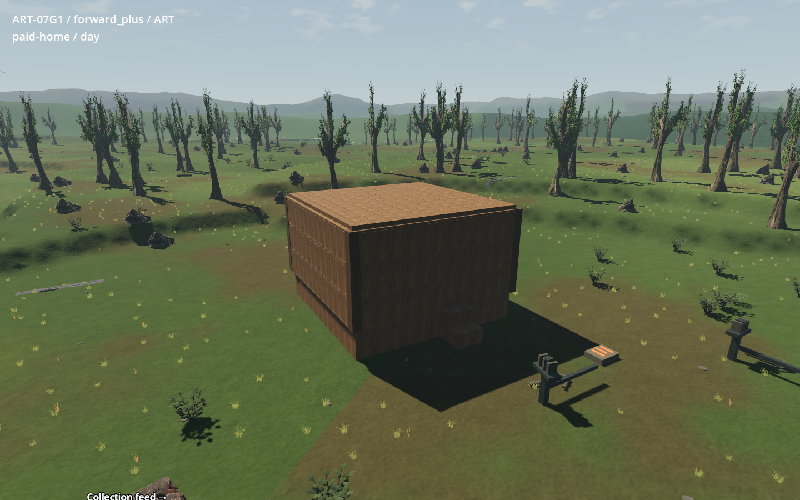

# ART-07 G2 publication — 14 September 2026

All **26 original ART-07 dispatch slices are delivered**: 24 B–F source handoffs,
G1 isolated integration and G2 independent review. G2 gives **bounded technical
clearance**, with visual completion and the rollout cost gate still open. This
publication implements no repairs and records no owner visual acceptance or
ordinary-world adoption.

The [G2 report](../../art/leyline-studies/2026-09-09/art07/g2/README.md),
[costs](../../art/leyline-studies/2026-09-09/art07/g2/costs.md),
[receipt](receipts/g2.md) and [machine-readable publication](publication-2026-09-14.json)
contain the findings and exact evidence. The [G1 publication](publication-2026-09-13.md)
links all six preceding source batches.

## Checked integration and publication

- Base: `8439b5a7745ca491b694406789273a412aec44d2`.
- Independent findings: `a40ff0997517a4d4688546e7553cd3e6603612d8`.
- Worker receipt / exact integration tip: `70a7c4f9144e9a7ebdbd47c39334cc19e5e7ee64`.
- Fast-forward integration and ordinary push to the owner-approved
  `https://github.com/Jattymoels/project-wroughtwild.git` / `origin/main` succeeded.
  The later publication-notes commit is separate and identified in Git history.
- All 33 added worker files belong to G2 tools, curated evidence and its receipt.
  No normal `game/`, `sim/`, `data/`, source asset or other worker file changes.

Original review seal:
`D:/project-wroughtwild-art07-g2/build/art07/g2/v02/handoff`.
Manifest SHA-256: `49827ac3fe3522a92cb74eecdf60cd857e1157b08f5d57f2d273c617606e93a1`.
All **772 files / 594,208,921 bytes** and the exact file set verify, including a
fresh copied evidence package run through the unchanged G2 manifest verifier.
G2's unmodified full source companion remains at
`D:/project-wroughtwild-art07-g2/build/art07/g2/v01/sealed`; its separate mutable
review companion remains at `D:/project-wroughtwild-art07-g2/build/art07/g2/v01/review`.
These local-only packages are accessible here; a Git clone alone does not include them.

## Publication verification

All 24 prerequisite packages rehash: **35,779 files / 19,093,094,616 bytes**.
The original G1 package and G2 source companion each verify all
**5,701 files / 7,430,015,212 bytes**, retaining the G1 seal
`fd5c592ef52185cc7d0737840e41af09dbb5bcea36b719539931e156f42865cd`.
The game/data/native pin stays `6bb2e044dcd0bf1788896aa2c19cdf56fee93522`.

The publisher rehashed all **64 independent G2 job receipts/logs**, checked their
exact executed arguments and zero exits, and rejected fatal script/engine errors.
All 16 benchmark camera/light comparisons, the paid initial/paid/final equality,
135.078021510504 m route and complete final-hook geography/snapshot comparison
recompute from sealed reports. The G2 source audit also recomputes exactly,
including its 16 retained actor IDs and recorded line-ending distinctions.
The correctly flagged eight-check paid restart is separate from the initial
misnamed full replay. The eight shutdown warnings stay open below.

All 13 curated stills, three animations and **198 original motion frames** match
their source hashes and decode. Packed-source evidence records 30 masters,
477 packed/available images and six fresh GLB imports. This is verification of
G2's independent render/reopen evidence; publication claims no additional Blender
render or repeated benchmark.

Seven fresh publisher engine jobs passed using a cache-free 4,787-file runtime
copy plus the unchanged G2 inspection additions: import, paid-home smoke in each
renderer, complete catalogue in each renderer and retained-actor inspection in
each renderer. Each catalogue gives **1,861 checks over all 273 legal pairs**;
each actor inspection gives **50 checks for all 16 IDs**. Existing octagonal,
chamfer and triangle combinations remain intact. All original copied runtime
files remain byte-identical after these checks. Worker runtime preservation is
also checked: only its explicitly disposable paid-home checkpoint differs from
the original seal.

Fresh publisher evidence lives under `C:/Users/Matty/Dev/project-wroughtwild/build/art07-publication-2026-09-14`. The publisher derivative
of G2's runner changes only its output root and noninteractive owned-process
failure stop. Jobs retain their engine arguments with the copied runtime path,
the shared GPU mutex, read-only process checks and isolated APPDATA/local/temp/
Blender directories. Canonical wrappers and peer worktrees remain read-only.
Current dispatch, catalogue and original-art validators pass; publication scope,
links, encoding and whitespace are checked before the notes commit.

## Remaining handbacks

| Finding | Owning slices | Bounded follow-up |
| --- | --- | --- |
| G2-V01 | B1/C4/G1 | Whole-tree horizontal fit compresses crowns to 0.2694963 for 289 wood instances and 0.1313987 for 32 pines. Refit lower trunks inside existing native bodies while retaining upper crown mass; compare player-height daylight, shade and dusk without moving spawns or collision. |
| G2-V02 | G1/D4/D5/D6 | Generic repeated face maps and weak end/edge distinction at building joins. Finish face/end/edge roles across existing forms, rotations and legal material gates; preserve roof unlocks and octagonal/chamfer/triangle uses. |
| G2-V03 | E3 | Native seating intersects a flat floor by 0.15 m. Review visual fit inside the existing body/seat contract; moving the actual seat or body would require a separate decision. |
| G2-V04 | C5/G1 | Raised ore only applies to fallback bodies; ordinary faceted terrain retains its thin ribbon. Resolve the visual envelope against existing excavation/terrain authority; do not enlarge colliders or change geography. |
| G2-V05 | B2/B4/G1 | Only three supporting cover roles map to retained anchors; habitat composition remains sparse. Compose suitable sources at retained anchors; leave new anchors/geography as an explicit proposal if current rules cannot support the selected direction. |
| G2-T01 | B3/C1/C2/C3/C4/E1/F2/F3 | Eight isolated fixtures report ObjectDB instances leaked at exit. Attribute and correct cleanup in owned fixture lifecycles, then replay affected cases. Exit warnings alone do not establish long-session leak behavior. |
| G2-C01 | G1 and source owners | About 1.3 GiB loaded textures, resident hidden stages/LODs and 87–91 s already-imported setup. Measure and reduce setup/residency, distinguish duplicate disk bytes from GPU savings, and test an owner-selected target device before cost clearance. |

The actual paid home uses a flat roof under existing unlocks; it does not prove
the selected pitched-cottage composition. F4's small recessed drum routes and
regular frame remain simpler than the concept, and its emission switch does not
disable the adjacent forge's heat. Six approved ART-06C animal directions still
use older runtime forms; G2 neither completes their rigs nor adopts them.

G2 measured Forward+ medians **2.762–3.921 ms** and Compatibility
**4.798–6.589 ms** on RTX 5090 at 1440×900, 4× MSAA and vsync off. Loaded art
textures are **1,307.8 / 1,288.5 MiB**, and unique geometry including hidden meshes
is **2,420,221–2,503,669 triangles**. Already-imported setup through paid restore
is **91.306 / 87.482 seconds**, versus **11.808 / 11.319 seconds** baseline.
Those are one process per mode/backend, not repeated cold-disk measurements.
The **823 redundant PNG copies / 1,061,048,169 bytes** are disk evidence,
not predicted GPU savings. No minimum device or arbitrary budget is invented.
The sealed G2 cost-table range separators have a cosmetic encoding defect;
the numbers and JSON recompute correctly. The checked source evidence is retained.

## Next dispatch

**No original ART-07 slice remains.** Recommended next work is a bounded repair
round, starting with canopy fit (G2-V01) and setup/residency (G2-C01), followed by
the remaining visual finishing and independent re-review. The table supplies
owners, concrete defects and constraints for follow-up briefs. These repairs
are proposals, not work launched or completed by this publication. Owner visual
acceptance and selected target-device clearance remain necessary before a
separately reviewed ordinary-world rollout. No worker was messaged or restarted.

Actual G2 paid-home capture, showing the current canopy and building finish:

