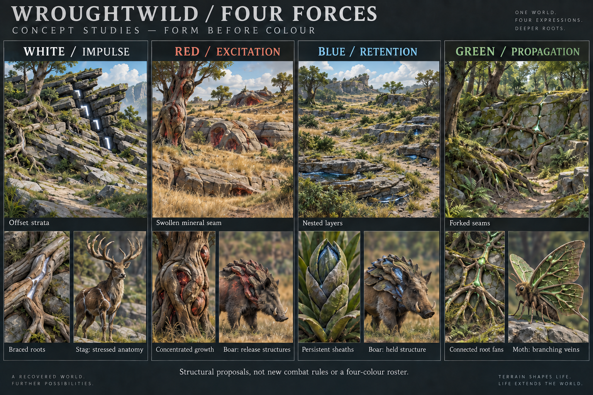
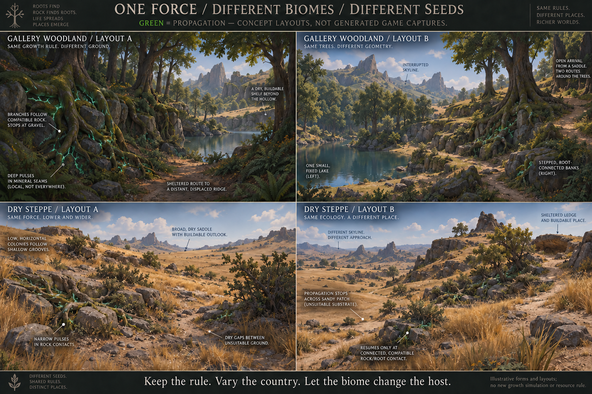

# LAND-00 reference: seeded worlds shaped by four forces

**Production follow-through:** the owner subsequently agreed with the recommendations
and rules. The [selected implementation plan](landscape-biomes-influences-plan-2026-09-16.md)
and [first worker brief](land02-landscape-foundation-worker-2026-09-16.md) now carry
this reference into production. Exact illustrated anatomy remains illustrative.

**Owner-approved direction, 16 September 2026:** random seeded terrain remains central. White/Impulse, Red/Excitation, Blue/Retention and Green/Propagation influence biome generation through their effects on physical and living hosts. The owner endorsed the clarification with “Yes, love all of that” and requested that it be folded into the creative record with references for subsequent implementation sessions.

**Status of the examples:** the effect families are endorsed creative direction. The particular landforms, anatomy, pulse animations and arrangements shown here are design proposals. These are not new damage, resource, growth or campaign rules, nor approval to replace adopted creature models.

## The rule to carry into every session

> Generate different country from the seed. Apply consistent lore-defined forces to suitable hosts. Derive the present terrain, habitat and opportunities from those relationships.

The same seed **and saved generation version** reproduce the same geography. Different seeds vary terrain, biome arrangement, impacts, influence reach, host distribution and discovery routes within selected guarantees. “Authored” means deliberately designed rules, reusable forms and relationships, not a fixed map. Scarwater is a proposed **family of generated basin compositions**, not a coordinate blueprint every world must copy.

Influence must participate before the landscape is finished:

1. Seed the underlying country: substrate, relief, habitat potential and old craft sites.
2. Select impact/influence identities, directions, reach and eligible hosts.
3. Let the chosen effects shape landform and host structure; resolve present water, soil, exposure and recovery together.
4. Compose connected habitats, suitable fauna, useful discoveries, routes and home ground from that shared result.
5. Fit authored forms, materials, motion and local coloured light to the resulting structure.

This is a dependency order, not a demand to simulate centuries of geology or ecology. A bounded deterministic generator can directly construct the outcome. Do not finish an ordinary map and then fulfil the requirement by assigning tints and unrelated props.

## Board 03 — four forces, shared hosts

The large panels link terrain to plant and selected animal hosts. Read structure first and colour second. The final selected board corrects an earlier waterfall-like White streak and artificial-looking Blue rings. Its exact anatomy remains illustrative; consult adopted creature masters before any future model changes.

| Force and physical effect family | Proposed expression in one biome | Contrasting proposed expression | Recognition without colour; proposed local timing |
| --- | --- | --- | --- |
| **White / Impulse:** force, motion, displacement | **Gallery Woodland:** offset bank layers, a directional fracture, roots bracing exposed joints; a stag's reinforced load-bearing anatomy echoes the stress | **Dry Steppe:** long displaced stone ribs across shallow slopes, low shrubs buttressing around joints; existing animal anatomy can express directional reinforcement where selected | Offset, compressed and asymmetrically braced forms. A short inset pulse travels and stops; the terrain need not move during play |
| **Red / Excitation:** intensified activity, accumulation and release | **Dry Steppe:** swollen mineral inclusions within living cut banks, tough growth with concentrated release structures, the selected Red boar as the existing LF host anchor | **Gallery Woodland:** local conductive root swellings and exaggerated shoots around one seam; surrounding moist forest remains recognisable | Swelling and concentrated active structures, with irregular release recesses. A local pulse gathers and releases; no universal fire/lava or new passive damage |
| **Blue / Retention:** holding, preserving, accumulation | **Fen:** physically supported nested bank pockets, successive plant sheaths and retained deposits; selected Blue boar as existing LF host anchor | **Rocky Hills:** irregular retained mineral laminations create sheltered niches; persistent bracts and compact perennial growth replace reeds | Nested, protected, layered forms. Light lingers inside a bounded structure; no universal ice, time-stop, floating water or ancient built wells |
| **Green / Propagation:** spreading, branching, connection | **Gallery Woodland:** tall connected root fans and repeated junctions along susceptible rock and moist ground; selected LF Green moth anchors the anatomical vocabulary | **Dry Steppe:** low horizontal shrub-root colonies follow shallow cuts and compatible mineral contacts; dry gaps interrupt the network | Forks, repeated nodes and connected structures at different scales. A pulse divides at actual junctions and stops at breaks; no free material or live growth simulation implied |

The fauna references deliberately use a few already established LF hosts: White stag, Red boar, Blue boar and Green moth. They illustrate cross-host readability, not a requirement for four versions of every animal. Habitat, ancestry and influence stay separate dimensions. Existing body, combat, drop and era rules remain until a scoped implementation changes them.

## Board 04 — the same force across biomes and seeds

All four panels use Green propagation. Tall root-connected woodland banks and low steppe colonies express the same branching relationship through different hosts. Within each biome, the second layout changes skyline, approach, enclosure and home outlook.

These are imagined examples of possible outcomes, not actual seeded game captures or four terrain stamps to paste into maps. A/B labels do not designate working seed IDs. The different-seeds caption means different seed inputs; **the same seed/profile must remain deterministic**. Distant ridges are compositional targets, not permission to enlarge the current world or exceed its height envelope.

What later sessions should preserve:

- **Across colours:** the causal verb remains recognisable through geometry, anatomy and local behavior/presentation.
- **Across biomes:** the host changes the result. Green does not automatically convert steppe into wet forest; Blue does not turn every habitat into a snow biome.
- **Across seeds:** shared rules produce different landforms, paths, exposures and buildable outlooks. Reusing assets must not make every place the same arrangement.
- **Across quiet/affected ground:** changes have coherent extents and transitions. Quiet land has a purpose—meadow, shore, passage or home ground—rather than appearing as an unexplained bare clearance.

## Recommendations refined by the clarification

**Keep The Inherited Landscape as the recommended production direction.** Describe it first as a seeded world transformed by four forces; composed places are the player-visible result of those rules.

**Keep Scarwater as the first complete playable example, with White as its lead influence.** It joins landform, fixed water, deep scar, Gallery Woodland, ordinary finite pressure use and a home view. Its opening task must establish a reusable rule for how the influence changes the host, not merely assemble the concept picture.

**Use Dry Steppe to demonstrate genuine contrast next.** Red is the recommended lead there; the second board also shows that Green could affect steppe without erasing its biome identity. Gallery=White and Steppe=Red are initial production pairings, not permanent colour-to-biome assignments.

**Define all four influence contracts in LAND-01.** Implement selected cases incrementally. Each contract needs a small host-eligibility list, physical form/generation effect, growth expression, existing fauna anchor, presentation cue, player opportunity and explicit non-effects. This is a bounded design table, not a new general engine framework.

**Separate world expression from acquisition adoption.** The owner has endorsed generation affected by magic/tech. That does not automatically adopt LF's source renewal and device economy into ordinary play. The first pressure loop already offers real interaction; the proposed later source/device adoption still needs its specific scope resolved.

The recommended sequence remains LAND-01 contract → LAND-02 complete White-led basin → LAND-03 contrasting steppe/Red use → LAND-04 useful four-force connections → bounded closeout. New boards refine those outcomes; they do not add a new art wave, biome catalogue or worker.

## Handoff card for a future agent

Include this short block in the next selected brief:

> Preserve random/chosen-seed worlds. Read the four-force reference and canonical world premise before selecting forms. For each place, name the base biome and host, the influence's physical effect, resulting terrain/growth/fauna relationship, useful player choice and seed-varying parameters. Carry influence into generation before final terrain/cover placement. Use the concept boards for visual grammar, not fixed coordinates, literal dimensions or unimplemented mechanics. Preserve old saved profiles and current gameplay ownership. Deliver an ordinary playable place that remains convincing with coloured emission disabled.

“Emission disabled” is a design/readability question, not a demand for another renderer matrix. A future brief can assess it during its existing short visual check.

A proposed place-record sketch, for design discussion only:

| Field | Why it exists |
| --- | --- |
| Saved profile/version + seed | Repeatable world identity |
| Base biome, substrate, moisture/exposure | Host conditions that make the place coherent |
| Impact history, channel and affected reach | Lore cause with spatial extent |
| Eligible hosts + selected structural response | Effects beyond tinting |
| Recovery pattern and quiet transitions | Years-after character and useful contrast |
| Source/encounter ownership references | Honest connection to actual usable systems |
| Route, reveal and home relationships | Exploration, discovery and building opportunities |
| Variation parameters + bounded fallback | Seed variety while retaining the intended experience |

This does not prescribe a serialized schema or add a new owner of source stock.

## Existing semantics to preserve

Ordinary V8 has its finite pressure workshop and existing acquisition/campaign. The four typed sources, selected teaching hosts and request/delay/branch/paid-heat functions exist in LF. Ordinary V8 does not yet implement this proposed typed world generation.

White requests an action; it is not free power. Red heat/material use is paid. Blue delays; Green branches requests without duplicating matter. Ordinary pressure and LF White material remain separate ledgers. A glowing seam alone does not promise loot, remaining stock, damage, a new attack or a functional device.

The source-backed implementation notes and research remain in the [main discovery record](land00-creative-discovery-result-2026-09-16.md). The [updated LAND-01 brief](land00-land01-recommended-brief-2026-09-16.md) carries this reference into the next planning session.

## Provenance and scope

Boards 03 and 04 were created and selectively corrected with built-in imagegen during this owner-requested continuation. Their [exact prompts and corrections](land00-visuals-2026-09-16/influence-image-prompts.md) are retained. They are concepts, not runtime assets, approved model replacements, simulations or performance evidence. Their material richness and long vistas require interpretation within actual game scale and style.

This continuation changes planning/reference documents only. No game imports, builds, benchmarks, runtime changes or follow-on implementation task launches.
