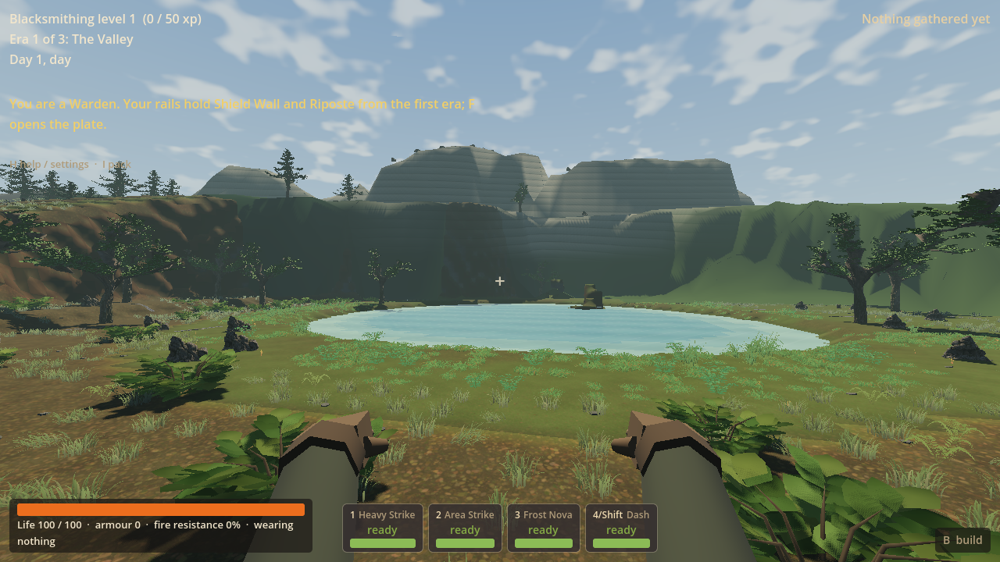
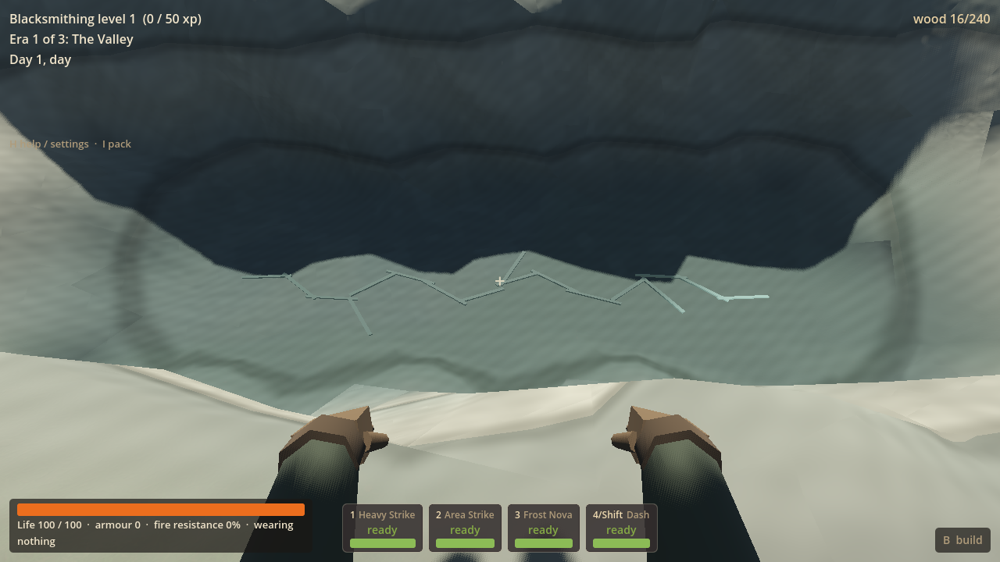
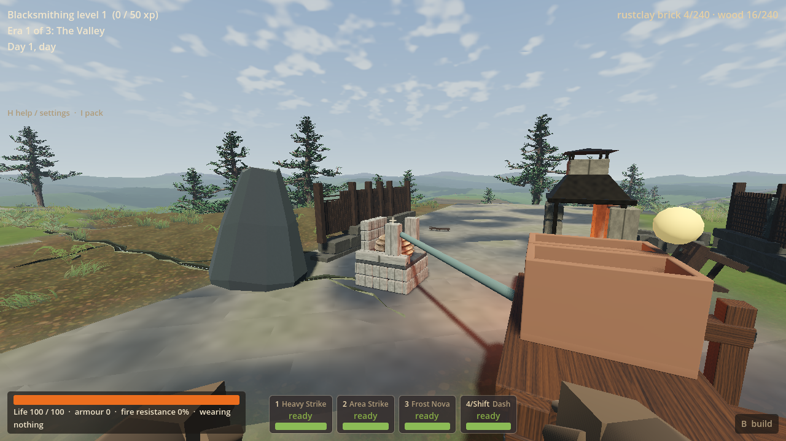
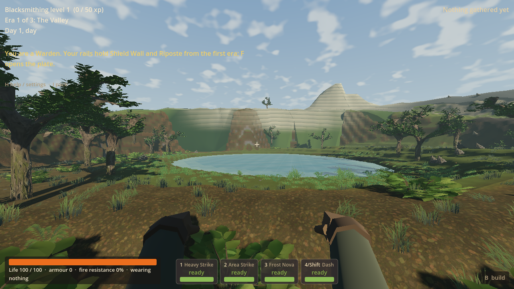

# LAND-02 — Scarwater Basin

Scarwater Basin brings a displaced ridge, fixed lake, recovered Gallery Woodland,
a real dry fissure and useful old smithy into ordinary fresh `frontier_v9`
worlds. It connects exploration and existing finite pressure work to two of the
four paid home settings. Existing saves retain their own profiles and owners.
This worker stops at LAND-02; coordinator adoption and push are separate.

## Coordinator adoption, 16 September

Implementation `1f03247` and handoff `4113c8b` are now integrated on main with the
matching DLL below. The coordinator matched its build record and eight changed
native/tuning inputs, reused the focused worker evidence and ran one isolated
hidden headless import on main: 5.90 s, exit 0, zero reported errors. No game
matrix or new renderer run was performed. All owned checking is finished.

Four actual pictures were inspected. The linked basin, usable home setting and
real scar depth are useful progress. The broad mesa-like ridge, regular bands,
repeated canopy/root forms and thin light seam still fall short of the intended
visual ambition. Record this as partial aesthetic delivery, not full concept
achievement or owner visual acceptance. The owner subsequently questioned this
large gap; the [pipeline diagnosis](land02-visual-pipeline-diagnosis-2026-09-16.md)
records the actual production method and recommended correction. LAND-03 remains
the planned next slice, with its draft unstarted pending that discussion. Owner
playtesting remains deferred. Historical worker results and failures below remain
unchanged; adoption does not turn the original Continue run into 24/24.

## Appearance and play

The lake reveal is dominated by an offset, bedded ridge rather than isolated
scatter. The shaded bank has braced tree forms, connected low/middle growth and
root/ground joins; the opposite approach is open to the ridge and lake. The native
seven-metre-wide, four-metre-deep, 24-metre-long dry slot has visible walls, floor
and walkout ends. A restrained broken branching pulse lies inside it. The old
smithy retains its accidental history and existing finite pressure opportunity.
The lake outlook and sheltered grove retain ordinary buildable home cores.

The substantial original kit contains two Gallery tree silhouettes, three strata
forms, two root banks and two underwood forms, with shared terrain bedding and
a recessed floor pulse. Existing ordinary wood and grazer rules are reused.
Trees are finite harvestable resources; dressing and light introduce no stock,
loot, damage or new powers. LF coloured materials/devices and White host behavior
remain outside this slice.

The early ordinary seed-77 pictures exposed smooth featureless hill forms,
obscured scar depth and near/far terrain gaps. Revisions created offset shoulders,
shared bedding, a reserved lake sightline, readable mineral depth and streaming
skirts. Actual walking also exposed steep voxel risers and point-only route
clearance. V9 now uses shared heightfield corners on unbroken shallow roofs and
plans the bank routes with the same roof slope plus capsule clearance. The higher
fallback host gains elevation gradually along the bank. Cave/edit stencils keep
native voxel geometry and exact cell picking; old profiles keep their old path.

## Remaining limits

This is a complete bounded prototype place, not the full concept's visual finish.
Large ridge surfaces still have regular bands and simple shoulders; some bank
transitions and repeated canopy/root forms remain visible. The scar seam is
restrained and legible, but its close material treatment could become richer.
These are LAND closeout notes, not a new worker or another art wave.

Owner playtesting remains deferred. Discovery pacing, broader campaign replay,
loading-time optimization and performance on other hardware are unmeasured.
World entry is still synchronous and takes substantial preparation time. This
slice makes no claim to close the existing general loading/lag backlog. The check
stages arrival and supplies workshop recipe inputs; it does not claim a full
resource-acquisition or balance playthrough.

## Focused evidence

| Focused check | Actual result |
| --- | --- |
| Final generation, seeds 77/78 | 39 passed, zero failures; 12.60 s. Determinism, native dry depth, both approaches/home cores, preserved ordinary stock and bounded fallback. |
| Ordinary seed-77 use, Forward+ | 57 passed, zero failures; 278.15 s. 993.93 m of actual controller movement, both approaches and scar ramps, finite wood gathering, paid floors at both homes, paid workbench/forge/feeder, charge/work/withdraw and digging. |
| Fresh-process Continue | 23 engine assertions passed; one station-record assertion failed only because Godot changed autogenerated `@` node-name characters to `_`. Exact saved/restored records subsequently pass one focused offline comparison normalising only that name. The original run remains 23/24, not relabelled clean. |
| Final seed-78 ordinary capture | Three checks passed; 55.96 s, zero reported errors. Uses the actual fallback host and final narrower lake. |
| Final headless import | Passed in 3.84 s, exit 0, zero reported errors. |

The ordinary-use fixture paid nine wood for each home's 3-by-3 floor. It charged
four strokes from the existing source (24 to 20), rejected a duplicate full charge,
paid eight clay and one wood for four Rustclay Bricks, withdrew once and rejected
a duplicate withdrawal. Continue retained the native dig, exact simulation and
ownership, finite stock, resource depletion and paid fixtures. Missing/wrong-world
pressure ledgers were rejected atomically. An independent V8 payload restored its
old profile, geography and ledger without migration.

Final native output adds even-seed lake-aspect variation after the complete primary
use/restore run. The final seed-77 block hash `2464639526`, height hash `2471001676`
and place hash `1445706956` are unchanged; interaction/restore code is unchanged.
That primary evidence is reused rather than replayed. Final generation and seed-78
pictures use the final DLL. The prior use/restore DLL was
`d0a6c39a4cbe40c2405aa8ccba33658e25492e24459c78aa63a4104b08c54302`.
Selected machine-readable results are [checks.json](land02-evidence-2026-09-16/checks.json).

The representative seeds are 77 and 78. Seed 77 has a roughly 179 m ridge with a
37.9 m width; seed 78 has a roughly 138 m ridge, 46.3 m width and opposite arc,
and exercises the actual bounded fallback. Lake aspect varies from 0.82 to 0.72.
Location, proportions, host and bank
relationships vary; this is not a rotated map stamp. Both retain one lake, four
level radius-14 m cores, three discovery regions and the existing fourteen
placements across five rare families. No LF coloured source is installed.

Private fixtures and detailed logs are in
`D:/Wroughtwild/work/land02-scarwater-basin/build/land02/`.
The launcher uses one Forward+ renderer, a BOM-free no-focus override, the verified
mouse-capture opt-out and retained process/exit handling. Headless checks cover
generation and restoration. Failed development checks were kept in the local
logs; only completed passing results are counted above. No benchmark matrix,
parent-package copy, R9 review or later slice was run.

## Actual game pictures

These are ordinary V9 game viewport captures at player height, with scripted
arrival/input. They are not concept images, Blender renders or fixed showcase
scenery. The source/art and gameplay records are the normal production paths.

The selected evidence directory also retains `home.png` showing the paid home
floor and workbench in their landscape setting.

## Native output, editable source and publication

Worker: `D:/Wroughtwild/work/land02-scarwater-basin` on
`codex/land02-scarwater-basin`, prepared from
`05972bc281370538df085e5cf05fd995578785c9`.

- Matching DLL: `D:/Wroughtwild/work/land02-scarwater-basin/build/land02/native/bin/libwroughtwild_sim.windows.x86_64.dll`.
- Installed same DLL: `D:/Wroughtwild/work/land02-scarwater-basin/game/bin/libwroughtwild_sim.windows.x86_64.dll`.
- Native input hashes/build record: `D:/Wroughtwild/work/land02-scarwater-basin/build/land02/native/provenance.json`.
- Editable master: `D:/Wroughtwild/work/land02-scarwater-basin/build/land02/source-art/scarwater-kit.blend`.
- Reproducible recipe: [build_kit.py](../../tools/wroughtwild-land02/build_kit.py).
- Selected exports/provenance: [game/land02/SOURCE.md](../../game/land02/SOURCE.md) and `game/land02/source.json`.

Final matching DLL SHA-256:
`f47813e2e9e20b5be2979944a3886661eda70e1baf3f553c9970ea6a38907a76`.

Checked implementation commit: `1f03247b132f27f1aada4f6c5f9780f7f153b4a8`.
The following documentation-only handoff records that identity; native inputs
and the checked runtime are unchanged. Native binaries, editable master,
private saves and import caches remain local; the original GLBs and recipe are committed.

The coordinator handles main integration and ordinary push. No main merge or
push was performed here. Next planned work remains LAND-03 Dry Steppe/Red and
coherent existing LF acquisition/device reuse; it was not started. Future terrain
changes must preserve published V9 saves through a successor profile.
