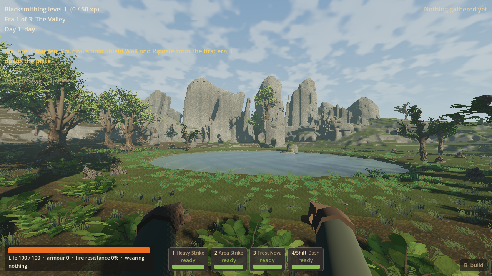
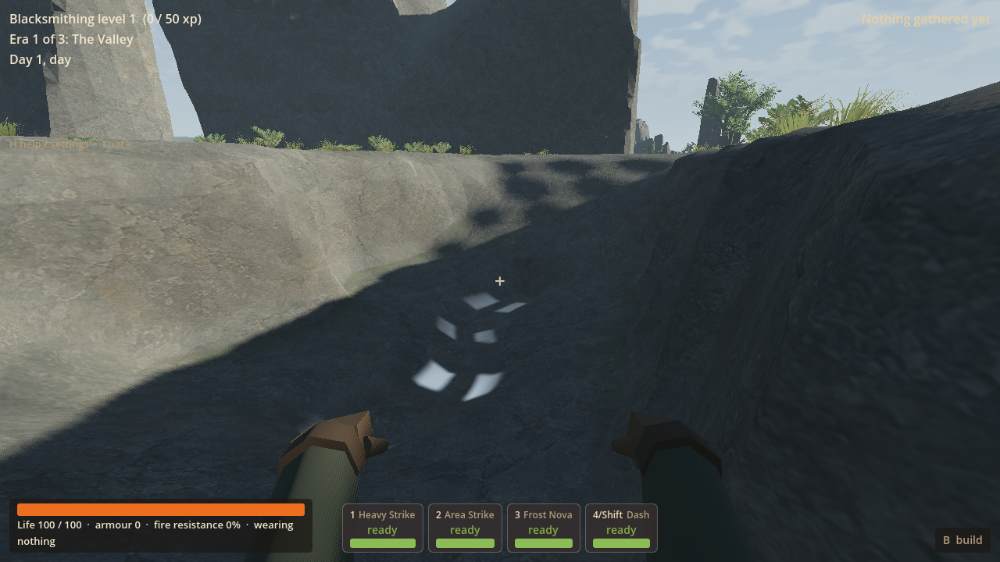
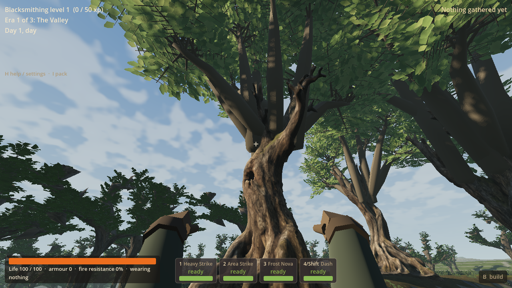
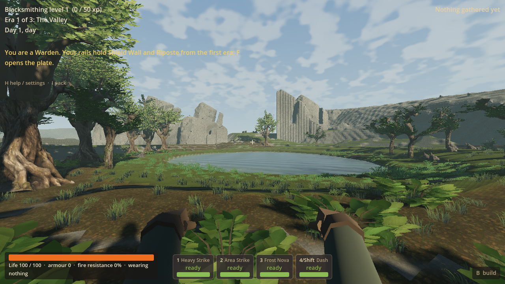
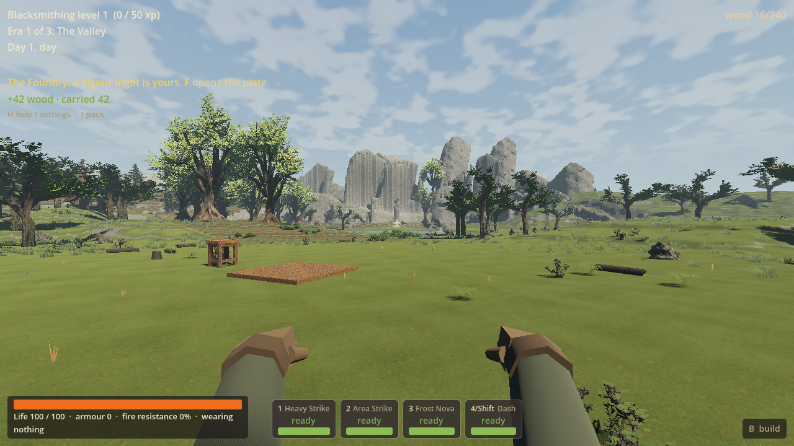

# LAND-02B: environment foundation and Scarwater production

LAND-02B delivers a playable fresh V10 Scarwater with separated, leaning rock
masses, substantial rooted trees, a deep stepped fissure and coherent mineral,
water and lighting treatment. It changes the shared terrain foundation as well
as the art. The visible surface, collision, surface queries and editable cell
owners come from the same native geometry. Paid homes, finite pressure work,
digging and Continue remain usable in the checked ordinary generated scene.

Worktree: `D:/Wroughtwild/work/land02b-scarwater-art`; branch
`codex/land02b-scarwater-art`; base `cc60bf748662272283b10d4b087f41f8db0aa019`.
Checked implementation: `37597824f73b8600504c8b6f294f0d0c0a1f329f`.
Coordinator adopted implementation and handoff `5c41ed253e5b6b0c31ebecb8dea046552a4ac43a`
on main on 17 September. The matching DLL is installed in the owner checkout.
Publication is recorded by the coordinator's subsequent adoption commit.
No subsequent worker or LAND-03 was started. Owner playtesting remains deferred.

## Owner approval and limited playtest, 17 September

After adoption the owner said "I love how it looks", specifically liked the odd
cliff generation and was happy for it to be "a bit campy". This approves the
delivered visual direction and supersedes the coordinator's proposed further
Scarwater art continuation below. Preserve the current character; proceed to
LAND-03, then LAND-04 and LAND-05. The unused continuation prompt is superseded.

The owner also reported significant lag: many small stutters with some large
hitches, enough to curtail their playtest. They separately requested fewer elk,
while saying they did not think elk abundance explained the lag. Both were
explicitly notes to fix/figure out later. The cause and exact population tuning
remain undetermined; no performance investigation or spawn change has been run.
The coordination sheet records high-impact stuttering and elk/stag abundance for
LAND-05. Aesthetic approval is not smoothness or broad gameplay acceptance.

## Earlier coordinator assessment and adoption, 17 September

The following assessment preceded owner feedback above. Its extra production
recommendation is superseded; observations are retained as history.

The playable foundation is integrated; the central visual outcome is **partially
delivered and remains open**. The coordinator inspected reveal, contrasting-basin,
fissure and rooted-canopy at their original player-height framing. These show
better separated skyline masses, substantial textured lower trunks and a more
coherent basin. They do not yet establish the convincing recovered landscape
requested in the production brief.

The dominant remaining problems are visible, not speculative: broad flat cliff
faces and regular vertical cuts still read as cut slabs; the fissure reads as a
smooth trench with bright isolated patches; the new textured boles meet simple
straight branch forks and repetitive crowns; open bank/ground transitions still
feel sparsely dressed. The seed-78 scene makes the regular cliff ribbing especially
clear. These are central form/composition shortcomings, not merely a demand for
concept-image fidelity or more polygons. The worker's narrower achievement table
below is retained as its report, with this assessment governing coordination.

The source changes substantiate early project implementation constraints: the
previous extraction, far geometry and resource-tree override restricted the
selected shapes. Their correction is useful reusable progress. Neither these
screenshots nor the code establish a Godot or image-to-3D model ceiling. The
remaining diagnosis is an inference from the visible result: geological shape
hierarchy and finished asset/composition work need further production. Replacing
the engine or redoing the foundation audit is not the recommended next action.

Recommended next action: finish those three connected scene outcomes within the
existing Scarwater correction before expanding biome breadth. A
[copyable continuation prompt](land02b-visual-continuation-prompt-2026-09-17.md)
is prepared for the owner-started worker; it has not been sent or launched.
LAND-03 remains an unprepared draft. This recommendation introduces no new biome,
mechanic or separate architecture programme. V10 is now published geography;
any continuation that changes generated physical shape needs a new profile and
must preserve V10 Continue. Recalculate LAND-03's expected profile at dispatch.

Adoption verification addressed mismatched native/runtime inputs and main import
failures. All nine changed native/tuning files matched the worker's source
provenance, and installed DLL SHA-256 is
`fc1b1bb1a467c38794a40a92aa05085e24538d0500beb9e4b11bca01ec6c3749`.
Main's isolated hidden headless import passed in **12.80 s**, exit 0, zero reported
errors. The worker's focused gameplay/Continue evidence below was reused; no
renderer, benchmark or full campaign replay was added. No owned test remains
running. Local adoption record and the retained previous V9 DLL are under
`D:/Wroughtwild/work/land02b-scarwater-art/build/land02b/coordinator-adoption/`.
Unrelated local captures/import metadata were preserved. Broader loading/lag,
hardware performance and owner playtesting remain unverified.

## Appearance compared with the selected direction

The [production brief](land02b-scarwater-production-worker-2026-09-16.md) and its
linked concepts set the target. The pictures below are ordinary generated game
areas at player height, using the normal player and terrain; no showcase-only
scenery, fly camera or image post-processing supplies their landforms.

| Reference quality | Actual achievement | Remaining limit |
| --- | --- | --- |
| Broken, angled landmark-scale geology rather than broad mesa walls | Seeded tilted volumes, diagonal crown cuts, separated clefts and eroded toes create a readable skyline across the lake | Some faces still show regular vertical ribs and planar geometry; small broken fragments and detailed weathering are less rich than the concepts |
| Living woodland with convincing roots and canopy framing | Actual image-to-3D bark/buttresses, cleaned and finished in Blender, support authored asymmetric living crowns; roots and lower bole have matching reduced contact | Two crown assemblies repeat, upper forks remain visibly authored at close range, and distant legacy trees retain their earlier style |
| A structured scar whose force is deep inside the ground | Four-metre dry cut with stepped sides, a deeper narrow centre channel, tapered exits and restrained White pulses within recesses | Fine fracture branching, loose debris and pulse definition are simpler than the reference; some near faces remain faceted |
| Inviting recovered basin, water, shelter and useful homes | Lake-facing clearing, bank routes, connected underwood/ground accents, cool shade and warm sun reveal the scale without filling home cores | Some clearances and outer slopes remain broad; coarse outer-country horizon and water edges are inherited limitations |
| A varied generated landscape | Seed 77 has a long multi-mass skyline; seed 78 has a shorter, more open split enclosure, different lake and outlook | Two inspected seeds establish specific variation, not universal composition quality |

This is a substantial visual and foundation correction, not a claim of complete
reference parity or owner aesthetic acceptance. The dominant broad retaining
wall, generic trunk approximation and flat luminous-line scar were reworked.
The residual limitations above remain visible and are not hidden by test counts.

The paid-home picture is retained from the final paid-use check, before the last
branch attachment/material finish. Reveal, fissure and seed-78 pictures show the
finished art. Captures stage the player at generated locations; the dedicated
composition capture quiets combat but does not add or relocate scenery.

## Implemented foundation and art method

The [source-backed foundation record](land02b-environment-foundation-2026-09-16.md)
identifies the actual constraints: broad height functions, midpoint crossings,
averaged cliff normals and a height-only distant mesh. They were project choices,
not an evidenced Godot or local-model ceiling. The world remains a full 3D block
field with one-metre gameplay cells; it was not replaced by a heightmap.

V10 stores bounded generated continuous density near Scarwater. A regularised
QEF preserves planes, separates disconnected local solid components, and keeps
each emitted triangle's editable owner. Gentle intact roofs use continuous top
crossings to preserve the existing controller's slope behavior. Native triangles
feed rendering, contact and surface queries. Broken cells override density and
use existing local rebuild/neighbor invalidation. Exact distant landmark meshes
use owning-chunk masks, including edited chunks, instead of an incompatible
height-only silhouette. Density regenerates from seed/profile, not a second save
ledger. Lake beds, cave air and four 14 m home cores remain protected.

The independent V10 generator uses rotated/leaning chamfered rock volumes,
cut crowns and joints. Bank routes stay low until the actual workshop ascent.
Selected tuning: 30 m reference ridge relief, 18 m fracture spacing, 2.6 m joints,
0.29 reference lean, and a 24 m long, 9 m wide, 4 m deep fissure with a further
1.25 m central recess and tapered exits. These are seed-varied controls, not
universal scene dimensions. Their purposes are recorded in
`data/tuning/worldgen-frontier-v10.json`.

Actual asset production used the installed TRELLIS 0.6.0 at 1024 resolution,
seed 42, GPU 0, on a generated isolated root/trunk input. The 136-second conversion
yielded useful textured wood plus a detached branch. Blender 4.5.9 inspection and
authoring removed that component, reduced the bole/contact, and built living
branches and layered crowns. Player-height revisions deepened canopy mass and
corrected actual branch attachment, exposed caps and vertex-colour darkening.
Mesh validation removes duplicate faces before export. The final assemblies are
146,640 and 122,088 triangles before imported LODs; polygon count is not the
quality criterion. Full provenance and source hashes are in
[`game/land02b/SOURCE.md`](../../game/land02b/SOURCE.md).

Generated neutral limestone and bark maps, world-space mineral projection,
restrained relief/roughness, actual shallow/deep water treatment and basin-aware
daylight complete the scene. Existing suitable underwood/ground accents are
reused. Resource meshes, materials and contact shapes prepare at actual world
entry. The old R1 tree override now preserves the selected V10 assembly; stock,
harvest, fall and save ownership remain native. Upper branches/foliage are visual,
while reduced root/bole meshes supply contact.

## Focused verification and actual limits

Three risk categories were used: new geometry/ownership; ordinary movement/use
and appearance; edit/Continue. Production captures and focused continuations
addressed observed failures within those categories. One renderer, Forward+;
isolated user/save/temp paths; hidden owned processes; verified no-focus and
visible mouse; BOM-free temporary overrides removed on exit. No owner save was
used. No package rebuild, hardware matrix, broad campaign or performance wave.

| Evidence | Actual outcome |
| --- | --- |
| Final native generation, `generation-20260916-203206` | 53 checks, zero failures: seeds 77/78 deterministic; lake beds, four home cores, finite pressure and route constraints; render/contact equality and actual solid edit owners. 962 and 1,472 shared-boundary edges had zero unmatched edges |
| Full ordinary use, `use-20260916-201946` | Both bank routes passed, 1,218.275 m combined; 1,261.654 m total movement. 60 assertions with **one failed opposite fissure exit** on the earlier 7 m width. This run is not presented as clean |
| Specific exit correction, `contact-20260916-203221` | Widened to 9 m and tapered ends. Six checks passed, including all four out/back controller legs and grounded/dry exits; 54.548 m |
| Final paid use/edit, `use-20260916-203440` | 58 checks, zero failures. Explicitly reused unchanged passed bank-route evidence, repeated corrected fissure legs; two paid home floors at nine wood each, bench, finite pressure 24 to 20, four-charge feeder, paid recipe producing four bricks, duplicate payment/output rejection, real picked-cell excavation and changed contact |
| Fresh-process Continue, `continue-20260916-203611` | 25 checks, zero failures: exact geography, economy/owners, dug cell, paid builds, consumed source, valid resource contact/picking; missing/wrong ledgers atomically rejected. V9 fixture retains its recorded geography and source identity |
| Final tree close-up/contrasting seed, `second-20260916-205107` | Six checks, zero failures; ordinary V10 New World, grounded reveal, real Gallery bole collision and one exact finite harvest. Final art images inspected after branch/cap/material corrections |
| Final native build and import | Matching DLL built successfully. Final art import `import-20260916-205101`: 6.26 seconds, exit 0, zero engine errors. Final seed-77 composition capture `early-20260916-205612`: three checks, zero failures |

The use harness stages arrival, accelerates finite gathering and supplies recipe
inputs. It exercises normal payments and owners, not discovery/balance or an
owner exploration session. Continue compares all persisted fields, normalising
only Godot's incidental autogenerated station names. V9 hashes remain
blocks `2464639526`, height `2471001676`; unchanged older/LF evidence is reused.
No claim of an exhaustive old-save replay is made.

Observed intermediate defects were fixed: density topology joined disconnected
solid components; cliff extraction made gentle routes too steep; an overly broad
gentle-roof exception reintroduced non-manifold edges; the narrow exit snagged;
fragment-position far masks opened cracks in slanted triangles; the old tree
subclass replaced the new art. The final passed evidence follows those relevant
corrections. Failed logs remain local. The last asset finish does not change
native geography or paid/save behavior, so those checks were reused.

The exact distant-landmark preparation component measured 1,738.36 ms in the
recorded entry. This is additional retained geometry/entry work, not a total
load-time or smooth-play benchmark. Wider performance, long entry, other known
lag and hardware coverage remain open. No owned testing is left running.

## Retained outputs and handoff

- Matching DLL: `D:/Wroughtwild/work/land02b-scarwater-art/build/land02b/native/bin/libwroughtwild_sim.windows.x86_64.dll`.
- Installed worker runtime: `D:/Wroughtwild/work/land02b-scarwater-art/game/bin/libwroughtwild_sim.windows.x86_64.dll`.
- DLL SHA-256: `fc1b1bb1a467c38794a40a92aa05085e24538d0500beb9e4b11bca01ec6c3749`.
- Build source hashes/compiler: `build/land02b/native/provenance.json` (also retained with the small evidence set).
- Packed editable master: `D:/Wroughtwild/work/land02b-scarwater-art/build/land02b/source-art/gallery-production.blend`.
- Inspected candidate: `D:/Wroughtwild/work/land02b-scarwater-art/build/land02b/source-art/root-candidate.blend`.
- Original input/raw GLB: `build/land02b/input/root-trunk.png` and `build/land02b/trellis-root-v1/source.glb`, with generation record and logs.
- Reproducible art/native/check recipes: `tools/wroughtwild-land02b/`; editable terrain mathematics: `sim/src/worldgen_frontier_v10.inc` and `game/extensions/wroughtwild_sim/src/terrain_density_vertex.inc`.
- Selected runtime art/materials: `game/land02b/`; selected pictures/check records: `docs/prototype/land02b-evidence-2026-09-16/`.
- Local detailed logs, private fixtures and intermediate production pictures: `build/land02b/`; private saves, DLLs, caches and masters are not committed.

Unrelated Godot-generated import metadata/extracted textures from opening the
existing project remain local and are excluded from the implementation commit.
They are reproducible from the retained original assets, not new selected art.

This advances the selected Inherited Landscape outcome and stops at LAND-02B.
LAND-03's later Steppe/acquisition work uses the next unpublished profile,
expected V11, after coordinator adoption; LAND-04/05 remain queued. Recorded
residual visuals and loading limits do not silently dispatch another worker.
