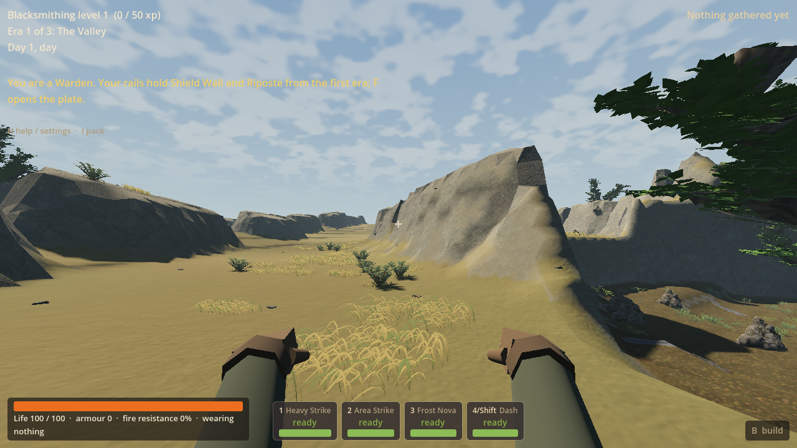
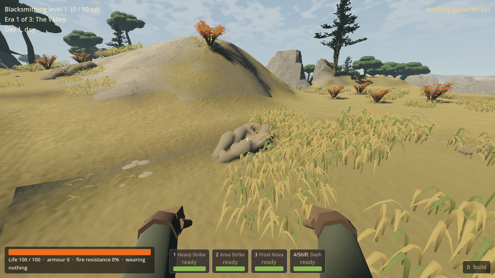
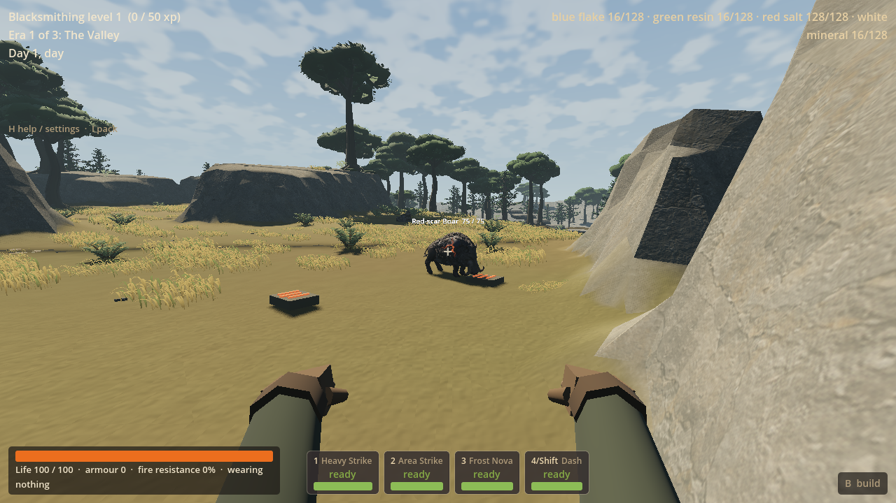
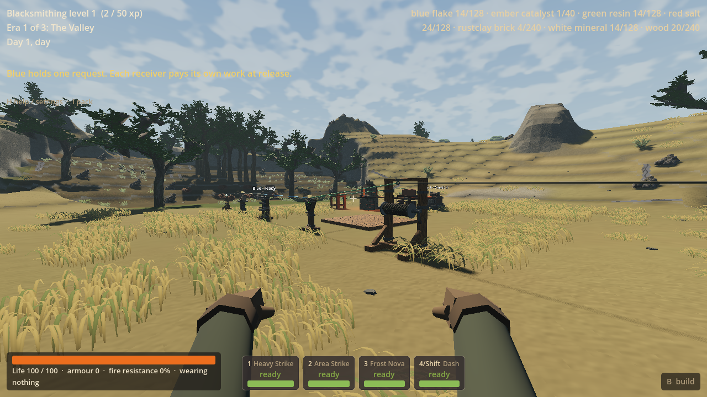

# LAND-03 — living Dry Steppe and useful four-force acquisition

Worker result, 17 September 2026. Branch `codex/land03-dry-steppe` in
`D:/Wroughtwild/work/land03-dry-steppe`. Coordinator integration/push pending.
All focused changed-behavior checks are complete. Checked source revision is
recorded in the final handoff commit.

## Playable result and original-plan progress

Normal random/chosen-seed New World now selects **frontier_v11**. The new dry
country contrasts with the owner-approved Scarwater: broken exposed mineral
ribs, shallow cuts, long views, connected low grass/sage, a sheltered work hollow
and an open outlook. Scarwater's campy cliffs, rooted Gallery Woodland and lake
retain the approved foundation. The existing four radius-14 m home cores remain;
Steppe uses the two that were not Scarwater's home settings.

Seed/substrate/exposure place the country before local Red mineral swelling and
tough growth. Its two approaches reach a real Red source. The existing finite
Red-scar boar has a separate observation route beyond the quiet start, retaining
its original habits, combat, reward and death ownership. Only this existing
selected host is adapted; no new attacks or four-colour creature redesign.

All four existing sources and devices are usable in an ordinary `legacy`
campaign. White requests, Blue delays and Green branches independently paid
work; Red stores paid heat. No laboratories, Conservator progression, LF terrain
events, new recipes or economy were enabled. The remaining White/Blue/Green
journeys stay LAND-04, then one bounded LAND-05 closeout. No later worker started.

## Appearance and production

The first ordinary scene exposed smooth sandy banks and isolated grass patches.
Those were revised before completing the slice: native ribs became short rotated,
chamfered mineral sections with irregular gaps and clefts; the Steppe material
stopped washing out their mineral detail; low grass gained broader connected
bands and seeded root offsets with full support/build suppression retained.

Six original procedural Blender forms provide swept grass, broken growing
islands, low sage, tough Red brush, erosion joins and recessed release nodules.
They follow the actual seeded biome and mineral hosts. Broad physical landforms
remain native terrain; decorative joins add no invisible walls or resource stock.
Shared meshes/materials prepare at world entry and are reused during arrival and
editing. This uses directly authored procedural Blender geometry, not image-to-3D.
The [source record](../../game/land03/SOURCE.md) explains forms, tunables and limits.

Actual Forward+ game pictures are retained below. They are
ordinary generated world views with the player controller/HUD, not concept art
or hardcoded showcase scenery. Staged arrival positions are disclosed.

The revised views read as distinct low dry living country with mineral gaps and
long sightlines. Broad exposed slopes, repeated grass/fringe forms and scalloped
outer terrain remain visible. This is a substantial playable iteration, not a
claim of reference parity or owner aesthetic acceptance of unplayed Steppe.

## Rules and compatibility

The unchanged source IDs retain eight lots of sixteen units, four manual stages,
fixed rare outcomes and 600 seconds of eligible active-overworld renewal after
depletion and outstanding claims. Paused, trial and offline time earns nothing.
White/Blue/Green kits cost two matching raw units and two wood. The Red buffer
costs four salt, four wood and two iron ingots; each heat charge costs two salt.
Red brick manufacture uses eight clay and two salt for four bricks. Faint Ember
uses 96 salt, four iron ingots and eight charcoal. Signals supply no free matter
or mechanical drive. The smithy's 24 pressure strokes remain a separate owner.

V11 uses frozen separate tuning and deliberate successor gates for V10's native
surface extraction, equal render/contact triangles, picking/edit ownership,
distant landmark, tree and material paths. Old V1–V10/LF profiles retain their
identities. V11 restore requires complete source/device payloads with exact
profile/seed; missing, extra and wrong-world owners reject before live mutation.
LF's historical internal ledger tag and migration support remain intact.

## Focused evidence

Three changed-risk jobs cover generation/ownership, ordinary use/appearance, and
fresh-process restore/rejection. Development captures and concrete failure
corrections remain part of those jobs; no campaign/renderer/performance matrix.
Only Forward+ was used for rendered evidence. Saves, APPDATA and temporary output
are private to `build/land03`; hidden no-focus windows and visible mouse opt-out
were checked. The wrappers ended every owned process; final process inventory
found none remaining.

| Focused evidence | Result | Retained run |
| --- | --- | --- |
| Native rules, identity and forced fallback | **63/63 passed** | Final native executable output; [build record](land03-evidence-2026-09-16/build-checks.json) |
| Engine generation, seeds 77/78 | **34/34 passed**, 26.55 s, exit 0, zero errors | `generation-20260917-092037`; [counts/seed records](land03-evidence-2026-09-16/generation-checks.json) |
| Full ordinary paid use | **198/200 passed**, 188.28 s, zero engine errors; only the two interior-of-source endpoint assertions failed | `use-20260917-092126`; [unaltered result](land03-evidence-2026-09-16/use-checks.json) |
| Corrected endpoint interaction and local art | **8/8 passed**, 160.71 s, exit 0, zero errors; **485.12 m walked** | `routes-20260917-092913`; [counts](land03-evidence-2026-09-16/routes-checks.json). Reuses passed paid work |
| Fresh-process Continue/rejection | **27/27 passed**, 166.39 s, exit 0, zero errors | `continue-20260917-092607`; [counts](land03-evidence-2026-09-16/continue-checks.json) |

The full-use run walked **485.59 m**, completed all source, paid workshop, finite
host and local art checks, and saved the checkpoint used by Continue. Its only
failures attempted to stand at the source anchor inside the actual solid source.
The final endpoint check passed by walking into real interaction reach and
requiring an independent camera ray to the source. Both actual supported release
nodules and twelve Red brush forms were present; the close image shows recessed
local light and concentrated tough growth. No failed full run is relabelled
clean. All log prefixes above are under `build/land03/logs/`.

The initial headless import passed in 37.17 s with zero errors. Final code loaded
in the actual rendered use and headless Continue processes; no redundant import
or old-profile campaign replay was run. These whole-job durations include setup
and checks, and are not startup or frame-performance measurements.

The first generation run passed 32/34 and exposed Steppe home
cores outside its ecology; connected dry shoulders corrected both. Initial
capture fixtures had indentation/type errors, then queried an unloaded sampler
and passed a non-finite position; those harness errors were corrected. The revised
early scene passed 6/6. The first full use run passed 197/199: all source, paid
manufacture/device, host, build and save assertions passed, but both controller
routes caught steep rib-side shortcuts. Native physical route eligibility was
corrected; the height-map-only check had not proved ordinary walking.

Non-source recipe materials and arrival positions are staged. Source work,
collection, UI crafting, physical kit placement and payment are real. The finite
boar death is forced to test ownership, not a combat victory. These checks do not
establish acquisition pacing, combat balance, a full player journey or smoothness.

## Selected actual game pictures

Seed 77, normal V11, Forward+, ordinary player-height positions. Arrival is staged;
the paths themselves use the actual controller. The workshop has paid ownership
and staged non-source recipe inputs, as disclosed above.

## Handoff files

- Matching native DLL: `build/land03/native/bin/libwroughtwild_sim.windows.x86_64.dll`,
  also installed at `game/bin/libwroughtwild_sim.windows.x86_64.dll`.
- DLL SHA-256: `101d4a26f0e1d8272cf0d8d85f77316c1e8138bdd3a2cf082a2f63b97361bc3d`. Both installed/build copies and 14 changed native build inputs match provenance.
- Native provenance: `build/land03/native/provenance.json`; build recipe:
  `tools/wroughtwild-land03/build-native.ps1` and `CMakeLists.txt`.
- Editable art: `build/land03/source-art/steppe-production.blend`; reproducible
  recipe `tools/wroughtwild-land03/build_steppe.py`; selected runtime hashes:
  `game/land03/source.json`. No parent package or master recopy required.
- Focused checks: `tools/wroughtwild-land03/run_checks.ps1`, `game/tests/land03/`,
  and `tests/sim/test_land03_acquisition.cpp`.

The owner's high-impact stutters/hitches and separate excessive elk/stag report
remain deferred LAND-05 items. No cause or population adjustment is claimed here.
Loading time, residual broad gameplay and hardware coverage remain unmeasured.
The local Red brush is visible, but the release nodules are subdued at a distance;
the close view establishes their small-scale form, not a strong distant Red beacon.
Coordinator adopts the checked worker changes and matching DLL; this session
stops after LAND-03 without pushing main or launching LAND-04.
