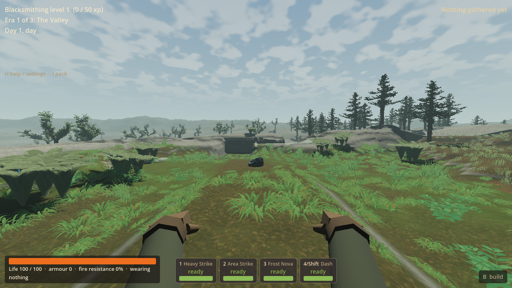
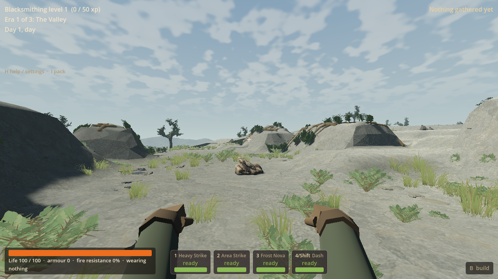
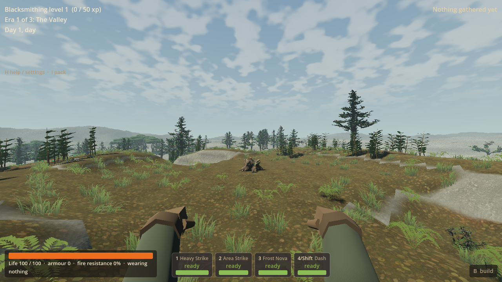
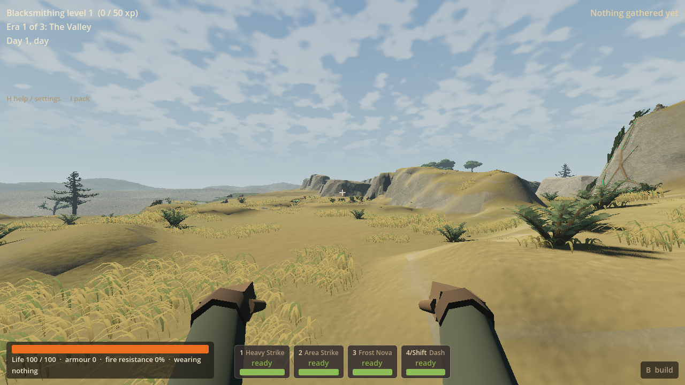
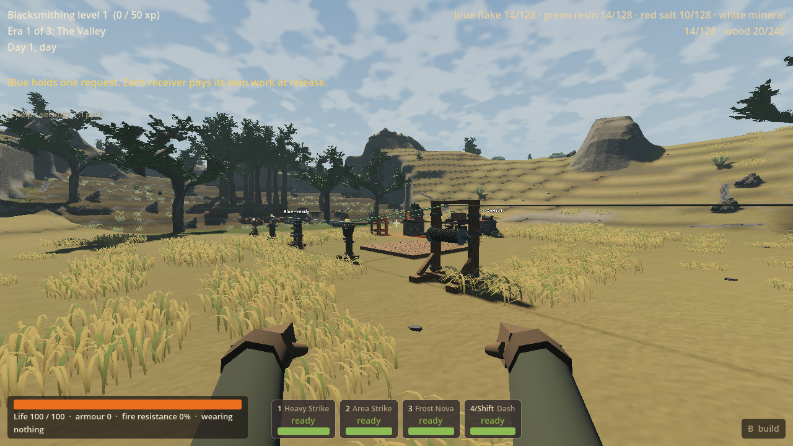

# LAND-04 — White, Blue and Green force journeys

Worker result, 17 September 2026, branch `codex/land04-force-journeys` in
`D:/Wroughtwild/work/land04-force-journeys`. Coordinator integration and push are
separate from this worker delivery. No LAND-05 work is included.

## Original-plan outcome

Ordinary fresh worlds select **frontier_v12**. Seeded physical hosts now connect
the existing White, Blue and Green workplaces to their terrain, living forms
and selected existing finite creatures. Blue has supported retained shelves and
overlapping fen sheaths, with a dry Rocky Hills/bract fallback. White has
directionally offset mineral banks and braced roots. Green has branching woodland
root fans and a structurally lower, small-leaved Steppe colony whose geometry
stops at two actual dry interruptions. The second Green patch has no source or
finite-creature owner.

The approved Scarwater character, Dry Steppe/Red, four home cores, lake, caves,
discoveries and ordinary `legacy` campaign remain. Published V11 and older/LF
profiles are not relabelled or regenerated as V12. The three added encounters
reuse White stag, Blue boar and Green moth bodies, habits, combat and once-only
death ownership. Red remains separate. No new biome, roster, laboratory campaign,
combat rule or economy was introduced.

Exactly four existing source owners retain their eight lots of sixteen, four
manual stages, fixed rare outcomes and 600 eligible active-overworld seconds
for renewal. V12 source and device payloads require their exact profile/seed and
complete owners; V11 and historical LF tags remain supported. White requests
work, Blue delays a request, and Green branches to independently paid receivers.
Finite pressure remains a separate owner. These are existing device rules, not
new powers inferred from the scenery.

## Appearance and production

The first ordinary Blue pictures showed too little host art and a single flat
barrier. Production corrected chunk-edge anchor placement, added near-source
sheaths and replaced equal-height hidden banks with uneven cumulative shelves.
Native terrain owns the substantial solids; the six authored forms supply close
roots, leaves and mineral skins on the current editable surface. Actual final
pictures and the specific remaining visual limits are recorded with the checked
evidence below. Passing placement assertions is not owner aesthetic acceptance.

In the selected final pictures, Blue's broad open retained pocket, fleshy sheaths
and smaller held plates frame the real mineral source. White reads as staggered
rock shoulders with roots bracing their edges. Woodland Green has taller upright
fronds over branching root groups; its Steppe counterpart stays close to the dry
ground. This is visible host/form differentiation with usable workplaces. The
shapes remain stylised and repeated: broad work clearances, simple shoulder cuts,
thin straight roots/stems and sparse middle-height woodland growth are visible.
Inset pulses are subtle at approach distance. These are bounded LAND-05 refinement
notes, not owner aesthetic acceptance or a promise that the full reference
atmosphere has been reached. The approved campy Scarwater cliffs remain intact.

Actual final V12 seed-77 pictures (staged ordinary approach positions, unchanged
game scenery; the transient class notice is dismissed for clarity):

The art is original directly authored Blender geometry, **not image-to-3D**.
Editable master:
`D:/Wroughtwild/work/land04-force-journeys/build/land04/source-art/force-hosts.blend`.
Recipe: `tools/wroughtwild-land04/build_hosts.py`; runtime manifest and exact GLB
hashes: `game/land04/source.json`; production/support notes: `game/land04/SOURCE.md`.
The master is about 0.8 MB and remains in the worker; the recipe and selected GLBs
are checked source. No parent package or old master was recopied.

Shared original meshes/materials prepare during actual world entry and validated
Continue. Each thin skin/root patch conforms to its current native triangles and
uses existing paid-building suppression and dig refresh. Tall foliage and thin
skins have no separate collision shell. Native banks own contact and picking.
New geography and presentation values carry plain-language purposes in the V12
tuning and `game/land04/settings.json`.

## Focused evidence and corrections

Verification uses one Forward+ renderer and the brief's generation/ownership,
ordinary use and Continue risks. Early Blue production captures are separate
from final behavioral evidence. Captures use private saves, a BOM-free no-focus
override, verified visible mouse and the existing renderer mutex.

Generation/ownership evidence: **42/42 engine assertions**, exit 0, no reported
errors, 33.24 s; **12/12 native forced-wide-fallback assertions**, exit 0.
Ordinary seeds 77 and 78 each reconstruct deterministically with three primary
journeys and one Green secondary. Both select fen Blue, rocky-hill White,
woodland Green and low Steppe Green. Native fallback retains exact lake beds,
inherited cave air, all four complete home cores, Red and separate finite owners.
The engine fixture also checks unchanged V11 geography fingerprints, targeted LF
ledger identity, and matching visible/contact triangles with real edit owners.
The forced test exhausts the primary search and takes the wider habitat search;
it is not a rendered proof of every dry Rocky Hills fallback arrangement.
That evidence is reused after the last correction, which changes derived route
metadata only. The focused correction checks every terrain block and every
non-route source/host/reveal/art-anchor field against that generation record.

Retained intermediate evidence is not relabelled as passing:

- Initial headless import passed in 46.83 s with no reported errors.
- Early Blue captures passed 10/10 then 11/11 functional assertions; their
  appearance prompted the production correction described above.
- The initial native fallback fixture failed one of twelve assertions because
  earlier routes retained heights from before later local terrain composition.
  Publishing routes against final physical terrain resolved that failure; the
  bounded native fixture then passed 12/12.
- The stronger Blue terrain exposed an ordinary seed-77 generation failure:
  a flat Green work floor had become disconnected from the physical approach.
  This was a real generation failure. The correction selects a flat supported
  native core, preserves its incoming corridor and derives the reveal from the
  actual approach. Source and finite-host eligibility are considered together.
- The first two-seed engine job passed 25 of 26 assertions and failed seed 78's
  Blue finite-host route. Preflight had found a host but discarded the supporting
  route before physical composition. The correction retains that corridor and
  protects existing journey paths from later local compositions. Neither failed
  generation attempt is evidence of a usable world.
- Full ordinary use passed **183/184 assertions** in **145.92 s**, exit 1 with
  no engine errors, walking **84.17 m**. White's shortest local route crossed
  the solid source centre even though its endpoint was safe. The other source
  approaches, all four source claims, three existing finite-host habits and
  once-only deaths, paid workshop, support/edit lifecycle and checkpoint passed.
  The final routing pass masks all four source collision footprints, refloods
  the reachable graph and republishes routes without moving terrain or owners.
  This original run remains recorded as 183/184.

The paid workshop used actual recipes, station construction, UI ports and
receiver payments: White issued the request, Blue held it through a pause, and
Green branched to a wound cargo winch and separately wound/paid heated feeder.
Four clay bricks and the collected cargo completed; an unwound request produced
no free work. Red heat spent two acquired salt and the separate finite smithy
pressure remained untouched. The save contains partial Blue work, an outstanding
Green claim, finite deaths, paid heat and a paused fractional request.

One actual low Green patch at `(404.5, 38.70412, 423.5)` was hidden by a real paid
floor, restored by ordinary removal, then removed when its original support
block `(404,38,423)` was dug. Both that edit and the separate picked terrain edit
remain in the paid checkpoint. The Steppe mesh and its footprint are unchanged
after this evidence; the later woodland asset revision raises flexible fronds
only, from roughly one to two metres, for clearer tall/low host contrast.

Final extension/asset import passed in **4.40 s**, exit 0, no reported errors.

The final focused correction run passed **33/34 checks** in **88.24 s**. Its
actual White controller walk passed over **29.66 m**; all **380 tested route/source
box segments** cleared the real source bounds expanded by the player's capsule.
Every terrain block, height and non-route journey field matched the earlier
generation evidence exactly. All four final images contain emitted authored
geometry (12 Blue, 15 White, 15 woodland Green and 13 low Green instances).
The only failure was the last report-writing equality: parsed JSON numbers are
floating point, while the newly assigned route hash was an integer. The game
checks and paid-checkpoint byte comparison had already passed. That reporting
comparison is normalized and checked separately; the 33/34 run is not relabelled.
The standalone artifact correction passed **6/6** checks: exact decoded field
sets and values, the sole old/new route-hash change, unchanged paid-save SHA and
unchanged input files through verification. No game or renderer was restarted
for that reporting correction.

Only the expected derived journey-route hash changes after that proof; the full
previous expectation is retained. The paid save itself stays byte-for-byte
unchanged, SHA-256
`8b35dfb69332385447cf317bdfd7e2ebd4637e1bbc7c188b873e3b4f8adcdccb`.
This permits the completed paid-use evidence to be reused while Continue checks
the exact corrected route metadata as well as the original persistent owners.

Fresh-process **Continue/rejection passed 33/33** in **191.17 s**, exit 0 and no
reported errors, on the final DLL and selected art. Exact native economy,
source/device ledgers, paid blocks/stations, both digs, depleted resources and
world drops restore. Partial work, uncollected resin, three finite deaths and
paused paid device state remain owned; restart grants no offline work. Eight
wrong/missing/extra profile/seed/ownership payloads reject before live mutation.
The targeted V11 and LF restores retain their exact saved identities and owners.
No broad campaign replay or old-profile renderer run was performed.

Arrivals and non-source recipe inputs are explicitly staged. Controller walks,
source work/claims, crafting buttons, paid placement and receiver payments use
ordinary game paths. Forced finite-host death verifies ownership and drops; it
is not a combat win. No acquisition pacing, balance, full campaign or smoothness
claim follows from these fixtures.

## Integration boundary and remaining work

Matching worker DLL:
`D:/Wroughtwild/work/land04-force-journeys/build/land04/native/bin/libwroughtwild_sim.windows.x86_64.dll`.
The worker's `game/bin/libwroughtwild_sim.windows.x86_64.dll` is identical.
SHA-256: `2c9916bfc0ae30a6ad04b8f13da5546b95045bfd360087285b763d8979836561`.
All **12 changed native build inputs** match the retained provenance; all **six
selected GLBs** match their art manifest. `matching-inputs.json` and
`native-provenance.json` are retained in the evidence directory. The build reuses
the owner depot's existing Godot 4.5 ABI and compiler. No binary is committed;
the coordinator copies this exact DLL alongside the checked source.

Selected evidence is under `docs/prototype/land04-evidence-2026-09-17/`; original
logs, private checkpoints, build outputs and the small native diagnostic probes
remain under the worker's `build/land04/`. The final source-route probe and actual
controller check resolve the use-run blocker. The six artifact checks resolve
its reporting-only follow-up failure. No known LAND-04 load/use/save failure
remains from these checks; untested coverage is not a pass. All owned checks have
ended and the temporary no-focus override was removed.

LAND-04 ends here. The owner-reported frequent stutters/large hitches and excessive
elk remain separate high-impact LAND-05 items, with no causal claim between them.
No performance or population correction was attempted. Owner playtesting of this
slice, broader gameplay coverage, other hardware and exhaustive seed coverage
remain unmeasured. The coordinator handles ordinary main integration/push and
the later bounded LAND-05 closeout; no later worker was started.
