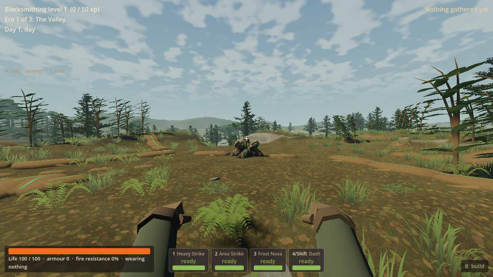
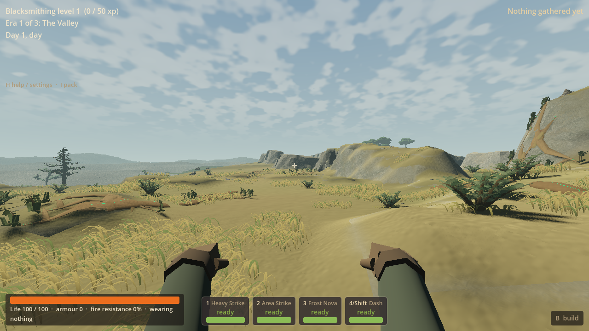
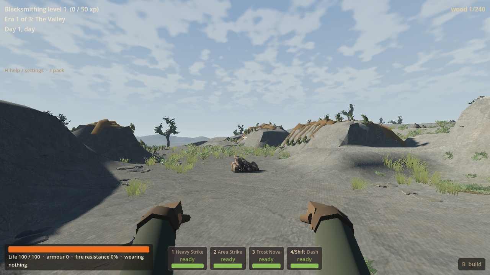
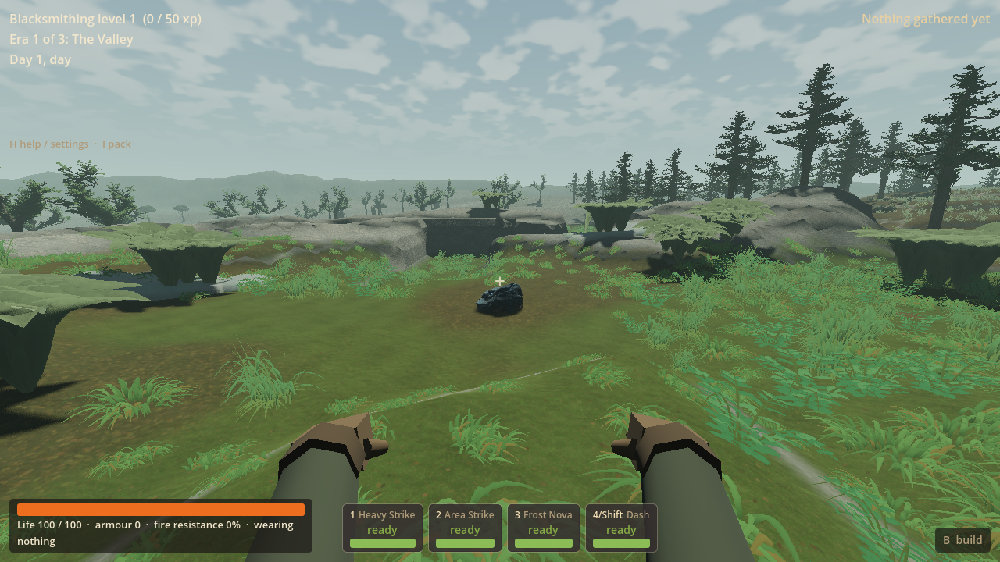

# LAND-05 — playable LAND closeout

LAND-05 reduces the smaller lakeside stutters reproduced in this session,
reduces ambient elk in fresh V13 worlds, and connects the existing Green resin
workplace to stronger branching woodland roots and low Steppe colonies. White
bracing and Blue retained sheaths are more pronounced. The approved campy
Scarwater country, digging, paid ownership and existing four-force rules remain.
This closes the selected LAND wave on the worker branch, not final-game quality.

The owner's large freeze was **not reproduced**. Long entry and broader smoothness
remain open. The source approaches are usable and visibly differentiated, but
new-player comprehension and owner aesthetic acceptance are untested. Repeated
forms and broad quiet clearances remain visible. Red's existing swelling/release
composition is retained, not claimed as a newly finished art outcome.

Workspace: `D:/Wroughtwild/work/land05-closeout`, branch
`codex/land05-closeout`, base `0240b5a5561c46084848f152c0ab464b71b2723d`.
Coordinator handles main integration and push. No later worker was started.

## Priority results

| Priority | Result | Limit |
| --- | --- | --- |
| First/lakeside stutters | **Partial:** measured repeated cover work repaired; first walk 38.022 → 24.755 ms worst frame, revisit 31.919 → 26.199 ms | Unknown owner's large freeze unreproduced; no universal smoothness claim |
| Ambient elk | **Achieved:** fresh V13 retains 50% of whole ambient herds; chosen seed 77 has 552 → 307 elk, 310 → 171 herds | Deterministic probability, not exactly half in each seed; older worlds retain population |
| Augmented places/discovery | **Achieved scoped refinement:** connected Green roots/workplace, tall/low habitat contrast, stronger White/Blue physical grammar and actual source approaches | Stylised/repeated forms, understated distant sources and owner discovery feedback remain open |

## Measured cause and runtime change

One fresh-process **V12 seed 77** ordinary Scarwater outlook path was walked
48.828 m each way, with normal controller, creatures, rendering and collision.
Initial relocation is staged and timed separately. The owner did not supply a
seed or route; this is not an exact reproduction. Forward+, 1280×720, RTX 5090,
Ryzen 9 9950X3D, VSync off and 120 fps cap. Existing OS/driver caches were retained.
No screenshot or disk write occurs within the walking timing windows.

The worst original walking frame spent **25.407 ms constructing ground cover**
inside a 27.285 ms cover phase. Comparable cost recurred on revisit. First-use
pipeline counters did not advance at those worst frames; no blocking resource
load was attributed there. This supports repeated construction as the selected
cause, not the hypothesis that an asset load caused the owner's larger freeze.
Timing spans overlap and are not summed. Other costs remain in the trace.

First, filter non-top wall/cave blocks once before repeated ground-cover queries.
That alone only brought the first-walk maximum to **34.367 ms**, so work continued
on the observed dominant cost. Streamed construction now collects four strips
into the same final per-family MultiMeshes. Complete cover and authoritative
collision still publish together; the synchronous restore/edit/safety path is
retained. Cancellation releases the hidden partial chunk and its batches.
Nothing removes forest, reduces quality, enlarges a no-collision window or
reduces visual distance. The selected original and staged output match **all
44 cover instances' poses, meshes and tints exactly**.

| Window | Before median / p95 / worst (ms) | Final median / p95 / worst (ms) | Frames >33.3 ms before → final |
| --- | --- | --- | --- |
| First walk | 12.227 / 22.243 / 38.022 | 10.893 / 16.520 / 24.755 | 2 → 0 |
| Same-path revisit | 11.509 / 22.680 / 31.919 | 12.581 / 18.267 / 26.199 | 0 → 0 |
| Stationary after return | 8.573 / 11.382 / 16.522 | 8.238 / 12.707 / 15.734 | 0 → 0 |

The final maximum measured ground-cover slice is **8.826 ms**. The remaining
largest walking frames are collision/scenery publication and native payload
work, not a newly attributed asset load. Both route checks pass, with **zero
safety refills**. Different frame counts reflect live scheduling, not dropped
samples. Revisit median and stationary p95 did not improve; this is a targeted
worst-stall reduction, not a blanket speedup.

Tradeoff: a streamed chunk takes three extra preparation turns and retains at
most one partial chunk's cover batches until publication. Shared assets still
prepare at real entry. The ordinary entry observation was **51.605 s before /
46.166 s final**; no added-entry-time/memory benchmark was run, and this variation
is not claimed as a loading-time fix. Long entry remains a limitation.

[Reproducible summary and slow frames](land05-evidence-2026-09-17/timing-summary.json)
records hardware, windows, phase maxima, original trace paths and SHA-256s.
Full raw traces remain in `build/land05/traces/`. Existing opt-in recording stays
available in normal play with `--play03-trace=D:/Wroughtwild/work/land05-closeout/build/land05/player-traces`
after `--`; close normally to write it. The new hooks separate terrain phases
and cover families without changing normal controls or quality.

## Population and compatibility

Inspection found deterministic one-/two-elk herd generation plus two Scarwater
ambient placements; no duplicate activation was found. `ambient_elk_keep_fraction`
is **0.5**, applied after composition to whole ambient Valley Elk packs only,
using a stable seed/coordinate roll (salt 950517). The `lf_white_stag` pack's
finite owner excludes it from thinning, and all other packs remain exact.
No global cap, per-creature combat/loot adjustment, saved-entity erasure or lag
claim follows from the reduction. Seed 77 retains 55.6% of animals because whole
herds are selected probabilistically; this is starting tuning, not an optimum.

V13 is necessary because population is seeded. Its `worldgen-frontier-v13.json`
inherits V12 inputs. Whole-map comparison confirms identical blocks, heights,
biomes, resource records, homes, lake, Scarwater, Steppe, journeys, sources and
finite hosts. V12's published terrain and corrected journey fingerprints remain
exact. All V1–V12/LF profile branches and their original tuning files remain;
V13 receives deliberately extended surface/material/entry/save capabilities,
not an old-surface fallback. The ordinary campaign remains `legacy`. No biome,
roster, campaign, economy or new force power was introduced.

## Actual appearance

The early Green walk exposed a source still isolated within its clearance.
Production added broad branching root skins meeting the stump's outer roots and
connecting to bank/approach junctions. Tall attached woodland fronds rise from
those junctions; the same branching principle stays low and small-leaved in
Steppe. Secondary triangles stop at both actual dry breaks. White's final
shorter growth exposes its directional bracing and offset mineral shoulders,
instead of repeating Green's tall fans. Blue uses enlarged overlapping cupped
sheaths and nested mineral skins around its retained workplace.

The pictures below are **actual ordinary V13 seed-77 game views**. Arrival at each
native approach is staged; the Green, White and Blue local walks and final source
interaction use the actual controller/camera. Final White foliage is pictured
after fresh-process Continue; its already-passed walk/contact evidence is reused.
The Steppe image stages the ordinary nearer approach. HUD notices are dismissed;
no showcase-only scenery, model render or concept image is substituted.

The authored kit is original direct Blender geometry, **not image-to-3D**.
Editable master: `D:/Wroughtwild/work/land05-closeout/build/land05/source-art/force-hosts.blend`.
Recipe: `tools/wroughtwild-land05/build_hosts.py`. Runtime manifest and explained
controls: `game/land05/source.json`, `settings.json` and `SOURCE.md`. Prior LAND04
masters remain intact. Thin grounded root/mineral skins remain roughly 0.2 m
or less; tall fronds are flexible foliage. Substantial banks remain native,
editable solids with matching picking/contact, rather than new invisible shells.
Geometry, connections, offset/layered structures and habitat contrast carry the
meaning; narrow inherited seams are supporting colour, not new powers.

## Focused checks and honest failures

Three risks were checked on one Forward+ renderer: selected lakeside arrival /
revisit; population and appearance/use; changed save/contact/rejection paths.
There was no roster/seed/renderer matrix, full campaign, hardware clearance or
package rebuild. Previous LAND04 full device-chain and unchanged generation
checks are reused.

- Diagnostic: **4/4** checks before, intermediate and final; original modest
  saving remains explicit. Final completed route run **69.96 s**, zero errors.
- Early art production: **6/6**, 28.923 m actual Green approach. Pictures prompted
  the root-to-source revision; these are not the final aesthetic verdict.
- Final population/use: **222/222**, **116.34 s**, zero errors, **88.595 m** actual
  Green/White/Blue walking. Of these, the bulk are exact retained-herd membership
  checks for this one seed, not a seed matrix. Exact cover equivalence, source UI,
  paid home floor, floor suppression/restoration and digging pass.
- Actual low Green patch `(404.5,38.70412,423.5)` was hidden by a paid floor,
  restored by its ordinary removal, then removed when its original supporting
  cell `(404,38,423)` was dug. A separately ray-picked terrain owner also digs.
- Fresh-process Continue/rejection: **29/29**, **195.65 s**, zero errors. Exact
  economy, sources, device ledger, paid blocks/stations, digs, finite depletion
  and world drops restore. Partial Blue work and uncollected Green resin remain
  distinct owners; finite White death cannot pay/respawn twice. Eight missing,
  extra or wrong-profile/seed payloads reject before live mutation. Targeted V12
  and LF snapshots load with exact identities and owners, without migration.
- Final matching-extension/White asset import: **4.18 s**, exit 0, zero errors.
  Seven selected GLBs match their manifest; changed native inputs and DLL match
  [retained provenance](land05-evidence-2026-09-17/matching-inputs.json).

Failed development attempts are retained and not relabelled: one import failed
on mixed indentation in the new journey functions; it was corrected. The first
use run stopped because its comparison helper asked for instance colours on
MultiMeshes that do not enable them. The helper now checks that property and
compares the actual applicable tint. The completed use run above is separate.
The final native rebuild changed source line-ending preservation only; semantic
native generation/use evidence was reused, and final Continue/import use the
matching rebuilt DLL. Final White revision changes flexible foliage only;
no walking/contact or native state changed after the passed use job.

All tests use private saves and the verified no-mouse-capture/non-focusing launch.
Staged non-source ingredients, accelerated manual work and forced finite-host
death are disclosed fixtures, not acquisition pacing or a combat victory. No
owner save was opened or rewritten. All owned processes ended and the temporary
window override was removed.

## Coordinator integration

Matching DLL (also installed identically in worker `game/bin/`):
`D:/Wroughtwild/work/land05-closeout/build/land05/native/bin/libwroughtwild_sim.windows.x86_64.dll`.
SHA-256: **01dc846192c5358f65b012a867a15c852373e94226b2a162dc78045140a9fc10**.
Provenance: `build/land05/native/provenance.json`, with a retained copy in
[the evidence directory](land05-evidence-2026-09-17/native-provenance.json).
The builder reuses the owner depot's existing Godot 4.5 ABI/compiler; no new
dependency, source archive or full parent package is required. The DLL itself
is intentionally not committed.

Selected source, runtime art, recipes, tuning, pictures and reports are committed
on `codex/land05-closeout`. The subsequent handoff records the checked implementation
SHA. Main integration and push are not performed by this worker.

Remaining notes are consolidated in the coordination sheet: unreproduced large
hitches, long entry, residual smaller frame costs, unknown underground connection,
owner elk tuning/discovery feedback, repeated forms and understated distant
sources. Older saves deliberately retain their original elk counts. These notes
do not automatically schedule LAND-06 or another art/performance wave.
