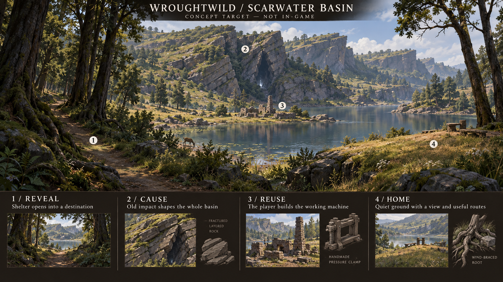
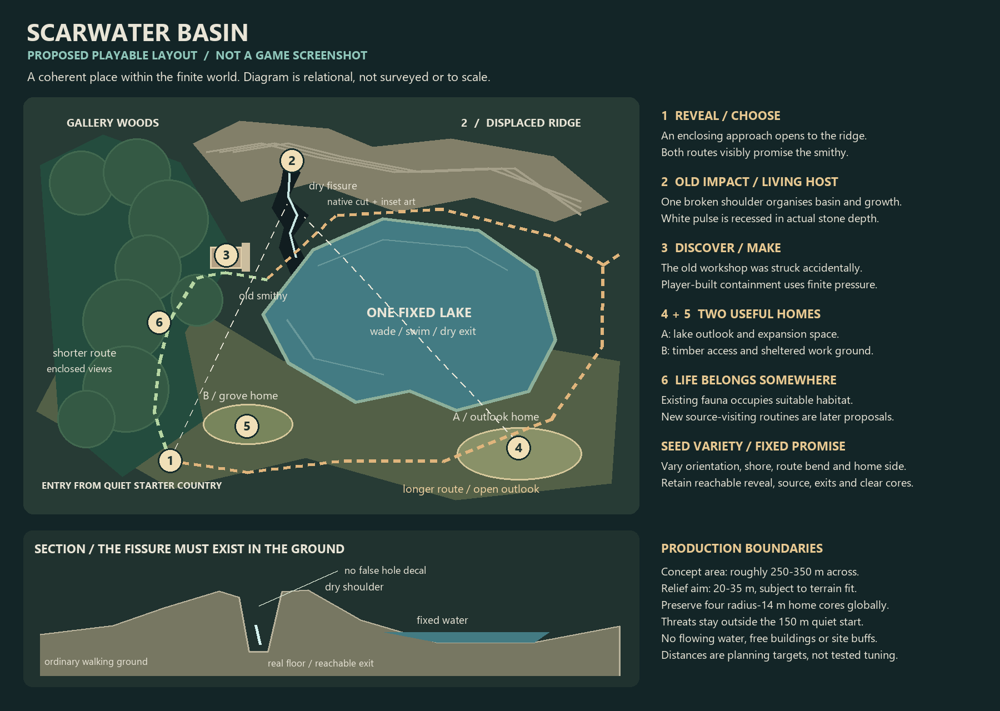

# LAND-01: selected implementation plan

**Owner selected, 16 September 2026.** After LAND-00 and its seeded-generation clarification, the owner said: “Okay agree with the recommendations and the rules”, requested an implementation plan and first separate-session prompt, and appointed this session coordinator. This document completes LAND-01's planning here. Do not send another worker to repeat LAND-01. The first implementation is [LAND-02: Scarwater Basin](land02-landscape-foundation-worker-2026-09-16.md); the owner starts it.

The selected direction is **The Inherited Landscape**: a random world whose geology, habitats, surviving craft sites and useful discoveries visibly follow the effects of the meteor-borne forces. It should feel like a place with history that the player can explore and inhabit. A dramatic silhouette, a coherent habitat and a useful destination must arrive together. More scattered props cannot substitute for that result.

Selection authorises the direction, two-biome wave and later reuse of existing LF acquisition/devices independently of its campaign. It does not certify the concepts as game screenshots, approve every illustrated animal redesign, establish new resource/combat rules or claim implementation is finished. Numerical art/composition defaults below are starting choices for the worker to tune, not measured results.

## The delivery sequence

**17 September owner approval:** LAND-02B's V10 foundation and art are integrated
(`3759782` / `5c41ed2`, adoption `a02ddbf`). The owner loves the current look and
likes the odd/campy cliffs. This supersedes the coordinator's suggested extra art
continuation. Proceed to LAND-03 fresh V11, preserving approved Scarwater and old
saves, then LAND-04 and LAND-05. Significant stuttering curtailed the owner's short
playtest; that and excessive elk/stag abundance are explicitly deferred fixes in
the coordination sheet. Do not infer a cause or turn this into a new art/performance
tangent before the selected next slice.

**Owner-approved sequence correction after LAND-02:** the first playable basin
did not achieve the requested visual ambition. The owner has now authorised
substantial art and mathematical/terrain/collision work to get it right.
[LAND-02B](land02b-scarwater-production-worker-2026-09-16.md) precedes LAND-03;
this is no longer a suggestion or minor cleanup. Its changed geography takes
fresh V10, leaving V9/older saves intact. Later LAND-03 uses the next unpublished
profile, expected V11. The original effort estimates below are historical planning
allowances, not a cutoff for this authorised corrective production.

| Slice | Playable result and original outcome advanced | Scope and exit |
| --- | --- | --- |
| **LAND-01 — this plan, complete** | Makes the approved lore, seed rules and first place actionable | This contract, reference boards, first implementation prompt and prepared workspace. Documentation only. |
| **LAND-02 — Scarwater Basin, next** | A memorable recovered ridge/lake, Gallery Woodland, a genuinely deep living scar, two approaches, two home settings and the existing finite pressure workshop | New `frontier_v9` geography for ordinary New World. Terrain, authored forms, habitat and useful play together. Current ordinary acquisition/campaign. First representative ordinary scene early, then varied seeded composition. |
| **LAND-02B — environment foundations and Scarwater production** | Close the major reference-to-game gap: fractured landmark, rooted canopy, deep structured scar, materials and composed lighting | Diagnose and fix required shared world/rendering/contact limitations, then prove one convincing ordinary scene and seeded variation. Substantial focused production is authorised. Fresh V10; no new biome or LF adoption. |
| **LAND-03 — Dry Steppe and Red** | A second country with different ground, visibility, plants and building choices; Red's activity and accumulation become understandable and useful | Fresh successor geography. Dry Steppe kit and Red place/selected LF boar. Adopt the existing four-source/recipe/device ownership system coherently into normal fresh worlds, with useful reachable existing source presentation for the other channels. Preserve existing LF semantics and campaign separation. |
| **LAND-04 — complete the four-force journeys** | Blue, Green and White places connect distinctive physical hosts to materials and devices useful in the player's own workshop | Develop the remaining selected host forms, source approaches and existing LF teaching hosts within existing habitats. No third new biome. New geography identity if anchors/terrain change; retain LAND-03 worlds. |
| **LAND-05 — one bounded closeout** | These places feel connected on an ordinary expedition and home return | Consolidate actual seam, readability, access and composition problems recorded during this wave. No automatic new biome, optimisation wave, campaign replay or catalogue of separate fixes. |

**Production order is fixed unless the owner changes it.** Finish one compelling Scarwater before spreading effort across the other forces. Wind Heath, Sinkwood, live ecosystem simulation, terrain-diversion machinery, additional creature rosters and world expansion stay outside this wave. Compass remains parked; historical ART R9 stays stopped.

LAND-00's rough effort allowances remain useful: 8–15 focused days for the first complete place, 6–10 for each subsequent place/system slice and 2–4 for closeout. They are uncertain production estimates, not promises or quotas. If the first place needs more investment, narrow breadth later rather than deliver four weak places. No extra planning worker is needed now.

## World rules that every worker must carry

1. **Random terrain stays central.** Seed plus immutable saved generation identity determines the world. Different seeds change country, orientation, landform proportions, habitat extent, source approaches and home outlooks. Authored rules and reusable forms do not mean a fixed map.
2. **Influence is a cause in generation.** Choose eligible host and force before final landform/habitat composition; derive structure, recovery and opportunities from their relationship. A tint/scatter pass over a finished map fails this contract.
3. **Biome and force are separate.** Gallery/White and Steppe/Red are the initial demonstrations, not permanent colour-to-biome assignments. Green must remain recognisable in both tall woodland and low dry scrub, with different host forms.
4. **The world has recovered.** Old damage, established vegetation, quiet ground and concentrated surviving augmentation belong together. Most vegetation is unlit. Empty space should read as meadow, shore, passage or home ground.
5. **A visible promise has a payoff.** Interesting destinations lead to existing source work, equipment/crafting opportunities, a meaningful route choice or an attractive build setting. A decorative pulse alone promises none of stock, damage or a new power.
6. **Buildable ground is part of the composition.** Preserve current costs, ownership, four radius-14 m home cores and ordinary freedom to build elsewhere. No compulsory plots, site buffs or free finished stations.

## Four-force generation and play contract

These are selected effect families and implementation design rules. Source/device actions in the final column already exist in LF; their ordinary-world adoption begins in LAND-03. No live geological simulation is requested.

| Force | Suitable physical hosts and terrain response | Growth/fauna relationship and recognition without colour | Useful play and explicit boundary |
| --- | --- | --- | --- |
| **White — Impulse: force, motion, displacement** | Gallery Woodland: directional separation of bank/rock layers and a displaced ridge. Dry Steppe: exposed offset ribs through shallow slopes | Roots brace loaded/exposed joints; selected LF stag later provides reinforced anatomy and existing source-linked behavior. Short travelling inset pulse stops at a break; geometry reads without it | LAND-02 uses the separate ordinary finite pressure opportunity. Later White mineral/request devices request an action; they do not supply free power. No automatic push attack or moving terrain |
| **Red — Excitation: intensified activity, accumulation and release** | Dry Steppe: concentrated swollen mineral inclusions and irregular release recesses. Woodland: local root/mineral swellings remain within moist habitat | Tough concentrated growth, active tips/nodes; selected existing Red boar. Pulse gathers and releases locally | Existing salt/rare-outcome rules and paid heat buffer. Heat remains paid; no universal lava, fire, free fuel or passive damage |
| **Blue — Retention: holding and preserving** | Fen: supported nested bank pockets and retained deposits. Rocky Hills: irregular sheltered laminations | Persistent sheaths/bracts and layered host surfaces; selected existing Blue boar. Local light lingers inside supported structure | Existing flakes and delay device. Delays a request; does not freeze time, float water or turn every biome to ice |
| **Green — Propagation: spreading, branching and connection** | Woodland: branching susceptible contacts beneath tall root fans. Steppe: low horizontal colonies following shallow cuts with real dry interruptions | Connected repeated junctions in roots/shrubs; selected existing Green moth. Pulse splits only at visible junctions and stops at breaks | Existing resin and junction device. Branches requests without duplicating matter; no free growing resources or new ecosystem simulation |

Use the [four-force guide](land00-influence-generation-reference-2026-09-16.md) and boards for shape interpretation. New anatomy is not needed in LAND-02: use appropriate adopted ordinary fauna, with existing behavior and rewards, in coherent woodland/shore/clearing habitats. Later slices adapt the selected LF hosts. Do not multiply the entire roster by four colours.

| Habitat | Distinct physical identity and player experience | Wave use |
| --- | --- | --- |
| **Gallery Woodland** | Tall connected canopy bands along recovered banks/swales; braced roots, shaded middle growth and intentional sight openings. Dry floor passages connect meadow and lake edge. More linear, open beneath and bank-related than generic Deep Forest | LAND-02. Two substantial tree silhouettes, joined root/bank forms and one middle-growth family. Reuse suitable existing litter/ferns/ground materials |
| **Dry Steppe** | Low horizontal grass/shrub masses, shallow cuts, exposed mineral ribs and long views. Sheltered hollows versus exposed outlooks create different base choices. It remains living dry country, not a renamed Ember Wastes | LAND-03. Small low-growth/erosion kit; Red lead, other forces allowed through suitable hosts |
| Existing fen/forest/hills | Keep their identity; Blue and Green change selected host structures instead of replacing the whole habitat | LAND-04; no extra full biome production |

New ecological biome IDs are not additional discovery regions or rare resource categories. Preserve the current three discovery regions, five rare sites and progression guarantees unless a later explicit brief changes them.

## LAND-02 place contract: Scarwater is a family, not a map stamp

An old valley and craft site predate the catastrophe. A glancing impact displaces a long ridge and exposes a pressure-bearing fracture through part of an ordinary smithy. The interrupted valley now contains a fixed lake. Gallery Woodland has established on suitable banks and swales. Surviving force is concentrated inside the dry scar, with offset strata and braced roots repeating its direction. This is accidental overlap, not an ancient purpose-built alien power station. The meteor sender, exact age and origin remain unresolved lore.

**First encounter:** from safe starter country, a partly enclosed approach reveals the broken skyline across water. The player can see the old work site and a dry shelf. One route passes through sheltered woodland with a closer view of roots and displaced banks; another follows a more open outlook and reveals the wider basin. Both genuinely reach the work site. Their exposure, enclosure, views and length differ; no new stamina/combat gate is needed.

**At the scar:** a recessed, walkable cut shows real walls, floor and a usable exit, with restrained White light well below the lip. Damaged smithy masonry follows the same displacement. Current source interaction explains the available finite pressure. The player brings clay/fuel/materials, a forge and the paid feeder under existing recipes and transactions. The pulse may remain after stock is spent; UI stock remains authoritative.

**Returning/building:** the source view makes two home options legible: an open dry expansion shelf with a lake/skyline view, and a sheltered grove work area near the useful route. These consume two of the existing four home cores; the remaining two keep wider-world choice. Neither is prebuilt. Ground around cores forms believable meadow/understorey margins instead of giant bare circles.

The skyline has one dominant displaced silhouette, supported by smaller forms. Ground, bank and middle-growth joins connect foreground to canopy and ridge. Reserve sight openings before planting. Bank material/value separation must reveal form in shade; do not solve dark scenes by glowing vegetation or uniformly bright ambient light.

Read both with [production caveats](land00-visuals-2026-09-16/README.md). The concept's small clamp sketch is not a new recipe, and pictured furniture is imagined player construction.

## Generation and compatibility choices

**Entry and identity.** Implement `frontier_v9` with separate `worldgen-frontier-v9.json` inputs and isolated composition. Adopt it as the ordinary random/chosen-seed New World default in LAND-02; no experimental-only launch is the final delivery. Continue must select its saved profile before rebuilding terrain or restoring ownership/digs. V1–V8 and LF retain their published inputs, geography, stock and campaigns. Never replace an existing save to demonstrate new art. Changes to published geography in LAND-03/04 need new immutable identities, not edits to V9 inputs. Art-only fixes that do not move saved physical geography can remain compatible.

**Minimum shared place description.** Reuse existing impacts, leylines, ruins, pressure pockets, lake and home records. Add only successor-scoped typed channel/host and relationship data needed by this place: stable place/impact IDs; direction and bounded affected footprint; substrate/base habitat; chosen structural response; linked lake, ruin/source and home IDs; two route polylines and reveal/view reservations; recovery/planting zones. Derive these from seed/profile. Do not serialize a second stock owner or build a global four-field ecology simulator. Geometry, vegetation and presentation consume the same description rather than rolling unrelated locations.

**Composition order:**

1. Generate seed-dependent underlying country with current finite extent, cave/bedrock protection and starter/progression reservations. Select old valley/substrate/craft-site candidates before imposing the final place shape.
2. Pick White direction/reach and eligible rock/root hosts. Reserve the linked ridge, dry fracture, lake, work area, routes and home candidates together.
3. Shape the actual native terrain from these choices: displaced ridge/banks, basin and real dry fracture. Resolve lake original beds and cave conflicts before final planting or resource placement.
4. Ground the existing smithy/pressure owner and required resources on usable final surfaces. Preserve stable IDs, costs and stock; guarantee both approaches and buildable cores.
5. Derive moisture/exposure/substrate masks and recovery margins. Place Gallery Woodland bands, quiet gaps and ordinary fauna through these shared habitat relationships.
6. Fit substantial authored rock/tree/root forms and supporting growth to real terrain. Apply restrained local pulse last. Regenerate deterministically at entry/Continue; refresh supported presentation after edits and paid placements.

Reuse the current bounded candidate-search pattern. Search deterministic candidates in stable order and score usable routes, cave/lake separation and reveal/home relationships. Vary orientation, ridge arc/offset, lake aspect, sheltered-bank side, route length and canopy openings. A fallback reduces height/arc and uses a wider open valley in another valid candidate; it must retain one recognisable displacement, a real dry cut, a usable source, two routes and two attractive home choices. Protect caves/start/stock before art. Do not silently “succeed” with unrelated props when composition fails; fix that observed case within the slice and report any unresolved generation failure.

**Dry fissure feasibility choice.** Carve a shallow open native slot/ravine, not an overhang system or separate collision shell. Start around 4–8 m wide, 2–4 m deep and 14–26 m long, with a visible floor and sloped walkout ends matched to existing traversal. Keep it outside original lake contact and cave openings; maintain bedrock clearance. Fit irregular wall/lip art without bridging the visible void. The existing mesh/collision/sampling/picking/edit path remains authoritative. After digging, rebuild or remove unsupported dressing; a paid structure occludes/clears decoration under current rules. No invisible barriers or no-dig zone. Resolve this contact in the first ordinary scene before multiplying the kit.

| Initial tunable family | Starting choice and player purpose |
| --- | --- |
| Composition span/relief | About 280 m span and 24 m relief; allowed starting ranges 250–350 m / 20–35 m within the 96 m height envelope. Enough scale for a destination while retaining useful travel |
| Directional offset/affected reach | Seeded within a bounded footprint; controls how consistently strata, scar and roots show the same cause. Avoid a map-wide White wash |
| Fissure width/depth/length and exits | Ranges above; close-range depth that the player can actually traverse and understand |
| Woodland band width, canopy openings, understorey clusters | Tune by representative scene: connected habitat, readable routes and framed views; no density quota |
| Recovery transition and bank material contrast | Avoid abrupt vegetation circles and unreadable black banks while keeping quiet earthy ground |
| Candidate count and fallback relief | Bounded deterministic work and a useful fallback; choose exact cap from existing composer, document it |

All numeric knobs belong in successor tuning or shared art resources with plain-language purposes. Choose remaining routine values during production; no new owner approval is needed for these details.

## Authored kit and actual-game iteration

Create approximately three modular displaced strata/fracture forms, two irregular lip/bank joins, one recessed pulse treatment, two tree silhouettes with varied crowns/root bases, and one middle-growth family plus ground/root joins. Combine forms deliberately; this is a kit target, not a mesh-count requirement. Reuse adopted fauna, existing smithy/stations, appropriate RF-06B/07/09 ground/plant materials and actual fixed lake behavior. A purpose-made kit is authorised where reuse cannot meet the silhouette and atmosphere.

Use direct Blender/established local generation tools as appropriate; no new service/dependency. Archive editable masters or reproducible recipes with selected runtime exports and scale/material notes. Prepare shared scenes/materials at real entry and reuse them through spawning/chunk refresh. Do not add blocking first-use loading in movement callbacks. Reuse existing native build/ABI tooling, adapted to the worker's own D: outputs; a source-changing worker needs a matching DLL, not a stale copied binary.

Build one representative **ordinary generated** scene early and inspect at player height. Revise the dominant visible shortfall before expanding the rules. Check a second seed for a meaningfully different arrangement, not a camera/seed matrix. Final images must show the arrival/reveal, fissure/work area and home outlook. Assess achieved appearance separately from functional checks; concept resemblance alone is not evidence.

## Later LF adoption: concrete dependency, separate campaign

The scoped source check found that `leyline::supports` currently names LF profiles, source restore expects the complete declared source set, and contraption placement/restore separately gates coloured components. Therefore LAND-03 adopts the existing coherent four-source set rather than dropping Red into an incompatible half-ledger. All four must be reachable and usable with existing suitable source assets; Red receives that slice's authored environment and teaching-host emphasis. LAND-04 develops the remaining journeys and host expressions. This sequencing refinement avoids a new partial-source save system and does not add another slice.

Carry forward existing material/recipe costs, eight lots of sixteen units, four work stages, ten minutes of eligible active-overworld renewal, deterministic rare outcomes, uncollected claims and existing device caps/semantics. Ordinary finite resources, rare sites and finite pressure remain separate. No offline/trial renewal, free outputs or ownership recreation at scene load. Confirm the current tuning when that worker starts rather than duplicating its numbers in new rules.

Trace `leyline.h/.cpp`, `contraptions.cpp`, bridge bind/validate/load, `leyline_source.gd`, `frontier_sites.gd`, crafting and selected LF host records. Make geography/acquisition support explicit for the new profile and retain `legacy` ordinary campaign policy. Do not enable `living_frontier_wave4` merely to expose devices, import laboratories/Conservator progression or activate terrain events. Preserve old LF saves. This is a future implementation dependency, not a LAND-02 assignment.

## Source basis and checks

The [LAND-00 research and source record](land00-creative-discovery-result-2026-09-16.md#source-backed-implementation-boundaries) provides the citations, tradeoffs and inspected source leads. This plan additionally checked profile dispatch, WorldMap records, actual entry/default, save allowlists, LF source restore and contraption profile guards. Important LAND-02 touchpoints include `sim/src/worldgen_profiles.cpp`, `sim/include/wroughtwild/{worldgen,tuning}.h`, `sim/src/tuning.cpp`, `sim/src/contraptions.cpp`, native bridge surface/profile paths, `game/scripts/{sandpit,terrain,save_manager}.gd`, existing V8 composer/lake/pressure patterns and cosmetic fissure builders. Read only concrete dependencies; this is not permission for a whole-project audit.

Implementation verification defaults to three focused jobs: changed generation/ownership assertions; one ordinary Forward+ entry/use route including first-use and visual inspection; targeted Continue/digging/paid-state restoration. Reuse old-profile evidence and add only checks justified by changed dispatch/state. No benchmark gate, renderer matrix, package reconstruction or exhaustive campaign replay. Setup and checking should stay proportionate to a solo prototype.

The coordinator adopts checked commits and matching native output, performs a short main load/use check when runtime changes require it, and makes the ordinary push. Report visual achievement, remaining weaknesses, actual checks and publication separately. Non-blocking additions go into the wave cleanup list. The owner launches each worker after receiving its prompt; preparing a workspace does not start it.

This planning delivery changes documentation only. No game import, build, renderer, benchmark, migration or implementation worker is run here.
