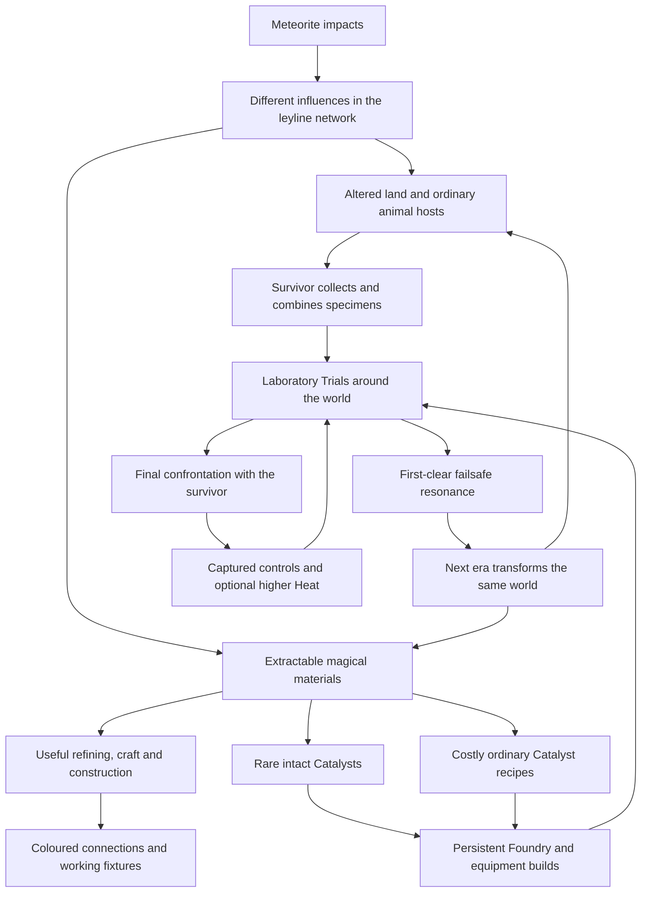

# Living Frontier — extraction, resonance and the laboratory campaign

**Status: Waves 1–6 implemented as opt-in work. Wave 4 independently closes the Wave-3 route defect. Wave 6 repairs LF5-R1 first, then delivers the dedicated human and saved control handoff; author evidence awaits orchestrator review. Optional Heat and configured rewards remain Wave 7.**
See the [Wave 1 contract](living-frontier-wave1-2026-09-08.md) and
[Wave 2 implementation and paid walkthrough](living-frontier-wave2-2026-09-08.md)
for selected tuning, compatibility, evidence and remaining owner playtests.
The [Wave 2 review](living-frontier-wave2-review-2026-09-09.md) cleared its foundation.
The [Wave 3 handoff](living-frontier-wave3-handoff-2026-09-09.md) records the
inhabitants, paid rewards and laboratory trail; the
[Wave 3 review](living-frontier-wave3-review-2026-09-09.md) identified LF3-R1's
physical route defect. The
[Wave 4 review](living-frontier-wave4-review-2026-09-09.md) independently closes
that repair, clears LF-4 and records the next bounded LF-5 work and remaining
playtest/performance limits.
The [bounded Wave 5 record](living-frontier-wave5-2026-09-09.md) covers the ordered
hybrid, physical Pairing laboratory and protected second event; it separates
actual baseline combat from forced route/settlement fixtures and records the
remaining publication pause. No finale or captured-control work is included.
The [Wave 5 review](living-frontier-wave5-review-2026-09-09.md) records the
ordinary-control recovery defect and the repair-first LF-6 handoff.
The [Wave 6 contract and evidence](living-frontier-wave6-2026-09-09.md) records
the actual-input repair, dedicated Central battle and persistent apparatus
control. It preserves both published changes, three eras and all owned work;
human acceptance of full-Trial difficulty/readability remains separate.
Owner direction and clarification: 8 September 2026. Author: Codex.
Audited implementation baseline: `49edab9`.

The owner supports White/Impulse, Red/Excitation, Blue/Retention and
Green/Propagation as foundations to tune. They ask for intensives and waves
before the moth variant, then clarify the core progression:

- Extract useful magical **material**, with a rare chance of an intact Catalyst.
  Manufacture Catalysts through ordinary forge/bench recipes at substantial
  material cost. The latest clarification removes the proposed special
  learning/perfection ladder; longer processing is an alternative to consider.
- Use those same materials in placeable connections and working devices,
  similar in purpose to redstone, with different jobs for each influence.
- A corrupted human survivor establishes laboratories around the world,
  experimenting on animals and combining influences.
- Defeating a major Trial triggers a laboratory failsafe and massive leyline
  resonance. Each resulting era makes the actual world, biomes and fauna more
  extreme.
- Eventually defeat the antagonist in an uber-boss battle, gain control of the
  apparatus and choose higher difficulty for greater rewards.

This supersedes the moth-first sequence in [INT-09](meteorite-leyline-intensive-2026-09-08.md).
It also supersedes this planning pass's initial direct-Catalyst extraction
assumption: **the normal yield is material; the Catalyst is the exceptional find
or costly crafted product**. These are owner-directed design goals. Exact materials,
recipes, odds, lab count, era transforms and Heat rules below remain proposals
to select in bounded implementation work items.

## 1. One campaign, expressed through every system

The protagonist learns to work the world. The antagonist forces the same
technology through living things. Defeating their experiments changes the
conditions under which the player explores, fights and builds.

Keep animal ancestry, influence, raw material, Catalyst identity, potency and
campaign state distinct. They connect through authored rules. A colour is not
an automatic damage type, rarity, grade or aggression level. A mixture need
not introduce another inventory currency.

## 2. One material, practical uses and exceptional results

| Level | Player gain | Purpose |
| --- | --- | --- |
| **Work the influence** | Reliable raw material from a readable source | An expedition can improve craft, a workshop or a building without a lucky drop |
| **Find an intact pattern** | A rare Catalyst during extraction | An exciting shortcut into a powerful mechanical interaction |
| **Invest in a Catalyst** | A normal forge/bench recipe consuming substantial raw material | A dependable alternative to luck, competing with useful construction spending |

The raw material needs an immediate practical consumer before its first source
ships. A rare find cannot be required to make the first extractor, unlock its
own recipe or survive the only encounter guarding its source. Starting skills,
direct ingots, ordinary equipment and existing non-Catalyst Kinds must support
those journeys. Catalyst rarity is separate from Faint/Stable/Potent quality.

The [companion extraction proposal](leyline-catalyst-extraction-2026-09-08.md)
details physical work, primary media, rare opportunities, ordinary recipes, supply and
replacement of current acquisition paths.

Recommend **cost first**: a large raw-material input produces one existing
Faint Catalyst through the ordinary recipe catalogue. Keep ordinary facility,
craft-skill and era requirements where selected; add no research tree, special
lesson, perfection state or mandatory multi-stage ingredient chain. Existing
grade refinement stays separate. A long-running recipe can be added if play
shows a need, but is not necessary for the first result. Today's ordinary
crafts are immediate transactions; a real timer would also need saved work,
reserved inputs, output capacity and cancellation.

## 3. Four useful materials beneath the Catalysts

These describe candidate material roles, not approved item names or recipes.
Recommend one main harvested material per influence, used directly by practical
recipes and costly Catalyst manufacture. Avoid a compulsory ladder of dust,
essence, charge and purified essence.

| Influence | Host and work | Candidate medium property | Practical consumer to choose first |
| --- | --- | --- | --- |
| **White — Impulse** | Compressed nodule; brace and release a stressed shell | Carries bounded stored strain | A measured mechanical work input or controlled-release handling fitting |
| **Red — Excitation** | Heat-bearing salts/inclusions; expose and vent before drawing | Alters controlled delivery of heat | A firing additive or material process with a glass/ceramic building destination |
| **Blue — Retention** | Bound flakes around a held fracture; separate the layers | Holds a material/process in a controlled state | A selected setting/refining operation or retaining fixture |
| **Green — Propagation** | Pattern-bearing resin in connected growth; free branches and draw | Carries a repeatable binding/growth pattern | Useful wood/fibre processing or a bounded propagation/control component |

Choose one actual process per medium before broadening. Ordinary materials
still provide bulk: magical resin helps work wood rather than conjuring it.
Red medium needs a defined heat/material job; it does not also power motion.
Existing rare fixture cores retain their roles, and D-031's pressure pocket
remains finite and supplies motion rather than heat.

Buildings keep material traits and lattice placement. Magical processing can
eventually add selected forms, material character or useful fixtures while a
timber home remains worthwhile. Avoid four reskinned complete catalogues or a
new per-block upgrade system. A treated family or functional piece needs its
own concrete effect, recipe and save/placement scope.

### Coloured construction: connect, trigger and observe

The owner's redstone comparison calls for **buildable working connections**.
Make the first circuit physical: place a connection between a known input and
an existing fixture, activate it and see useful work. Use the building interface
and declared attachment ports, with a visible route and readable disconnected
state. Exact part names and connection geometry are proposed, not settled.

| Influence | First proposed component | Small complete demonstration |
| --- | --- | --- |
| **White — Impulse** | Carries one action pulse to an actuator | Stormglass Lever → placed White connection → already wound Cargo Winch, with linked Landing and cargo; one request, one paid trip |
| **Blue — Retention** | Holds one pending pulse for a visible delay | Trigger the same winch, move into position, then receive the delayed trip |
| **Green — Propagation** | Branches one pulse into two requests | One lever activates two independently powered fixtures; no extra energy or materials appear |
| **Red — Excitation** | Stores and releases a bounded amount of paid heat | One fuel/input → small Red buffer → existing brick firing, still paying clay and mechanical work |

Stormglass remains an input, Thrumroot/winding stores mechanical work, and
Ventlung/pressure retains its existing motion role. Connections do not replace
those cores. Keep signal, mechanical work and heat distinct: a White request
cannot move an uncharged winch; Blue cannot create work; Green copies a request,
not fuel; Red does not also pay the machine's movement or material bill.

Start with one input/receiver, one pending delay and two branches. Bound pulse
propagation, reject unsupported loops and prevent duplicate execution after
save/reload or reconnection. A broken or dismantled connection must leave
recoverable state. No conveyor system, automated mining, remote chest crafting,
offline factory work or general-purpose logic computer is needed for this proof.
Cheap utility parts should be affordable well before a costly Catalyst.

## 4. Extraction and the living habitat

Recommended first interaction: **read → expose → settle → draw → collect → work**.
Follow scars into a visibly concentrated host. Ordinary contextual work opens
its shell, layers or branches. Settle/brace the exposed flow, then draw a
measured lot. A rare intact pattern may emerge with its useful material. The
first station process shows the property's value even with zero Catalysts.

The safe default action works for every class. Later tools improve control or
reduce repeated preparation. Compatible skill properties may supply D-021
shortcuts; no Frost spell is required to harvest Red and no Catalyst is needed
for its own precursor. Rare opportunities belong to completed fixed source
lots, never clicks, partial batches or menu visits. Interruptions retain their
identity and result.

Start with a few observable relationships, not a simulated food web:

| Relationship | What it teaches | First bounded proof |
| --- | --- | --- |
| A source rhythm passes through rock, roots and a nearby host | One cause explains a place | One catchment with ready/worked/spent cues |
| Animals retain recognisable ordinary habits | Strange bodies have an ancestry | A passive source interaction or familiar locomotion before an augmented attack |
| One animal expresses a second influence differently | Augmentation changes capability | One same-animal comparison after individual tells work |
| Artificial splices interrupt natural branching | Somebody is directing the process | One field trail of clamps, straight feed paths and repeated marks |
| An era exaggerates a known place | Campaign progress changed the player's world | Before/after traversal past a familiar river, grove, source and home |

Each hostile expression should require a new decision: leave a release area,
break a sequence, use cover, separate a group or exploit recovery. Spend its
existing attack budget; do not add another full kit plus life. Retain calm
places, passive creatures and beneficial augmentation. Ambient currents,
extractable hosts and immediate danger need distinct cues as well as colour.

## 5. The survivor and laboratories around the world

A useful working antagonist is **the Conservator**: a human survivor who first
tried to keep life alive, then decided anything unable to survive the changed
world must be forcibly altered. Exact name, motive, origin and fate remain
proposals. Human inhabitants need not establish Earth, space travel or the
player's ancestry; the setting remains alien.

Blue holds unstable specimens; Green carries successful patterns; White
imposes motion/pressure; Red drives transformation. The player uses the same
forces deliberately in craft, giving the antagonist a personal connection to
the maker fantasy without a morality meter or compulsory cruelty mechanic.

Keep two periods legible. Ordinary ruins and the existing D-031 blacksmith's
smithy predate the accidental strike. The new laboratories are **later
interventions** at selected sites: mismatched clamps, new channels through old
walls, collection equipment and paired scars. This extends the history without
reinterpreting that smithy as an old purposeful extraction facility.

A bounded first campaign can use **three distinct reachable laboratory
entrances** in one successor world and reuse the existing Forge module kit
inside. Each needs a physical site, approach and purpose. Three choices at the
old gate can be an interim fixture, but do not complete “labs around the world”.
Generate distant facilities from the outset so ambition can precede capability.

### Candidate first campaign

Three labs, two resonance transitions and one finale are a prototype proposal,
not a permanent campaign ceiling or a settled playtime target.

| Step | Laboratory purpose / experience | Proposed first-clear result |
| --- | --- | --- |
| **Era 1: foothold** | Learn useful raw extraction, single influences and ordinary processing; find collection evidence | No era change from simply discovering a lab |
| Outer lab, reusing `forge_tyrant` | Acquisition and containment | Failsafe A records a pending resonance; era 2 on safe return |
| **Era 2: the land strains** | Familiar places change physically; improved processes and a mixed specimen become relevant | Existing era-two capabilities follow the revised campaign trigger |
| Pairing lab, reusing `deep_forge` / Warden | Forced combinations reveal the operation's purpose | Failsafe B records a second resonance; era 3 on safe return |
| **Era 3: maximum uncontrolled augmentation** | Prepare materials, build and knowledge for the central installation | No compulsory Catalyst-luck gate |
| Central lab, developing `forge_capstone` | Confront the human antagonist in the eventual uber-boss encounter | Resolve the story once, capture controls and open the selected endgame settings |
| **Controlled endgame** | Choose harder experimental configurations | Per-run Heat/Inferno; campaign era stays stable by default |

A human uber-boss needs its own mechanics, art, animation and encounter
intensive. Reusing the current apparatus can test context/phases earlier; it
does **not** fulfil the requested personal confrontation. Record that production
dependency explicitly rather than labelling a reused Warden as the completed
new finale.

### Why a failsafe affects the whole world

Recommended fiction: a lab's containment interlock sends stored/redirected
influence back into the connected network when its controller falls, denying
capture and protecting the central operation. Foreshadow it through emergency
conduits, repeated interlocks and prior overload damage. Its exact engineering
remains fictional design; it does not establish the meteorite sender or grant
an infinite-energy gameplay rule.

Victories still pay real capabilities, rewards and access. Resonance exposes
new opportunities as well as threats. It should feel consequential, not like
punishment for progressing. Before the decisive Trial, communicate that the
installation is unstable so preparation is possible. Do not require a new
confirmation ritual after winning. An alternative route preventing a failsafe
would be a separate branching-campaign proposal.

## 6. Eras physically transform the same world

The requested outcome exceeds colour grading, scaled mobs and larger decorative
trees. Recommend **an immutable base seed plus deterministic, versioned era
transforms**, planned alongside growth envelopes, waterways and critical sites.
The player recognises the more extreme version of a place they knew, rather
than receiving a new random map.

| Influence | Candidate era-two change | Candidate era-three extreme | Required gameplay evidence |
| --- | --- | --- | --- |
| White | Buckled ridges and exposed stress seams | Uplifted shelves, compression cavities and changed approaches | Real terrain/collision and readable force behaviour |
| Red | Expanded vitrified banks and heated fissures | A selected watercourse becomes a hot/molten reach | Actual hazard/support rules and alternative traversable routes |
| Blue | Frozen river margins and layered growth | A held cascade or ice structure changes a crossing | Matching physical support; melting/sliding are separately selected rules |
| Green | Larger canopy, roots and dense banks | Root arches/overgrowth reshape a route and its opportunities | Real cover/navigation and resource/creature associations |

Implement one landmark-scale physical transformation first, then a contrasting
influence. Broaden only after a real before/after walk, source ownership and
performance pass. Fauna gains selected new capabilities or populations through
the transformed habitat; do not give every animal every era bonus. Resolve
population replacement at a safe world boundary, not during a loaded fight.

### Preserve the player's work as a constraint

- Keep occupied/support space of paid buildings, stations, stored items,
  source attachments, the return position and excavations exact. Blend terrain
  displacement around those footprints rather than raising the whole house or
  filling its cellar.
- Preserve usable doors/workplaces and at least one ordinary approach. A safe
  house surrounded by an unavoidable lava ring is still a failed transition.
  Death packs and other owned recoverables must remain reachable.
- Reserve major transformation corridors at generation. If construction there
  is restricted, communicate unstable ground clearly; no invisible surprise
  no-build zones. Decide the rule in the work item before implementation.
- Preserve old stock, depletion and partial work. New era-only deposits need
  distinct declared identities. Do not regrow a mined node because its biome
  was rebuilt. Protect critical/attached sources locally; any relocation or
  conversion needs an explicit ownership and access rule.
- Source renewal, permanent animal augmentation and era state are distinct.
  Emptying a node does not cure its surrounding creatures.

Boundary cases include long fences, scattered cheap foundations, bridges over
future river changes and extensive mines. Select a bounded protection policy
that respects real construction without letting one cheap block silently freeze
an entire biome. Envelope removal/lifetime must also be defined; repeated
place/remove actions must not leave free permanent immunity zones.

### Apply resonance once, at a safe transition

First qualifying story victory records a specific pending resonance event.
Rewards, story completion and event scheduling each commit once. At safe
overworld return, prepare and validate the complete next-era candidate, apply
saved player constraints and source ledgers, then publish its matching checkpoint
and show the resonance. Do not rebuild geology beneath an active Trial or during
a half-restored save.

If preparation fails, preserve the valid prior world and pending event with an
explicit recovery path. Never grant the reward twice or leave half the world
in each era. Repeated wins, death, load and postgame Heat cannot replay a
campaign event. Already formed extraction lots keep their yield and rare result;
a new era may change future formations only through its selected tuning.

This **revises the current accepted trigger contract**. Today the Tyrant's Heart
at the hill cairn grants `stonecut_blocks`/era 2 and Deep Forge access; the
Warden's Eye at the drowned altar grants `ash_tide`/era 3 and capstone access.
Under the new direction victory/failsafe owns the era. Curios can remain tangible
evidence and optional landmark uses, but cannot secretly remain a second
mandatory switch. Record the replacement unlock mapping and legacy policy as
an explicit D-019/D-028 revision before code.

## 7. Forced combinations and the final battle

First proposed pairing: **Blue retains a marked charge; Red releases it**.
A familiar host prepares a held area, an exposed feed path charges it, then
a vent releases at the warned position. Leave the area or interrupt the
appropriate apparatus. Ordinary movement remains a full answer. Teach both
component patterns first, with one new ordered decision rather than two full
simultaneous kits.

Natural confluences may later exist. Labs remain distinctive by imposing
sequence, duration or combinations the host would not sustain naturally.
Show clamps, graft boundaries, unnatural feed geometry and disrupted habits
through the existing bloodless presentation. Dynamic exposure simulation and
the full colour-pair product remain outside the first hybrid proof.

The uber-boss should examine learned capabilities: read a channel, handle a
pairing, force a release and exploit recovery. Builds change the solution;
one rare Catalyst or element is not the only answer. Design a dedicated kit
after individual mechanics work. Preserve committed aim, cover, cancellation
and recovery, and the current 24-living/two-major-hazard limits until explicitly
revised. Four unfamiliar full kits at once do not constitute a good final test.

## 8. Captured controls and optional Heat

**Campaign era** is permanent world state from specific story events.
**Heat** is a player-selected challenge configuration after control is earned.
It is also distinct from Red crafting heat/fuel. Keep the three meanings clear
in data and player-facing terms; the final difficulty label remains open.

Build one combined system on existing tiers/offers: preview selected pressures,
target rewards and payout changes; accept a bounded configuration; commit at
entry. Preserve stable saved offers, incompatibility rules and once-only reward
settlement. Decide how player-selected conditions replace or supplement rolled
conditions, rather than adding a competing second difficulty menu.

Recommend the first setting affect the **selected laboratory run**. It can
change known constraints, a pairing or declared material/rare opportunities.
It does not automatically promote Faint to Potent, guarantee a Catalyst or
multiply every reward axis. Rarity, grade, throughput and challenge remain
separate and previews must identify what changes.

The human story resolves once. Surviving apparatus supplies repeatable
configured experiments; the antagonist is not resurrected every run. The
specimen/reconstruction fiction remains a later lore choice and does not itself
grant infinite resources. Optional postgame world-wide amplification, if wanted,
requires a separate preview, home-protection and reversibility contract. Raising
run difficulty must not unexpectedly transform the home valley again.

## 9. Intensives: complete jobs with dependencies

All new entries are **planned**, not blanket implementation approval.

| ID | Intensive and complete outcome | Dependencies / limits |
| --- | --- | --- |
| **INT-10** | **Influence, material and campaign contract:** primary materials/consumers, Catalyst map, supply, era event graph and old-world policy | Decide the rules needed by each slice; not a separate design-only delivery wave |
| **INT-11** | **Extraction and ordinary recipes:** useful raw yields, rare finds, expensive Catalyst conversion and practical material uses | INT-10; all-class bootstrap, saved lots, no special mastery ladder |
| **INT-12** | **Living hosts and capabilities:** sources, animals and scenery share a cause; one same-animal comparison | INT-10/11; small authored roster; moth is a candidate, not a prerequisite |
| **INT-13** | **Coloured connections and useful outposts:** placed pulse, delay, branch and heat components operate existing fixtures; later select a field aid if useful | INT-11 supply; distinct signal/energy ledgers, bounded circuits, no broad autonomous factory |
| **INT-14** | **Laboratories and campaign trail:** distinct world entrances and the existing three-run arc show the survivor's intervention | INT-10 history; reused rooms with distinct purpose; old smithy stays accidental |
| **INT-15** | **Resonance and the evolving world:** first-clear event physically transforms a known region with safe ownership/routes/restart, then extends to both transitions | Substantive generation/save work, not merely an art pass |
| **INT-16** | **Forced combinations and uber-boss:** one ordered hybrid, then the designed human finale built on learned mechanics | INT-12/14 and era context; dedicated boss production required for completion |
| **INT-17** | **Captured apparatus and Heat:** voluntary challenge and targetable rewards extend replay after story resolution | INT-16; one system built on current offers/tiers |
| **INT-18** | **Economy, continuity and whole-campaign proof:** raw usefulness, rarity, manufacture, world evolution and saved work coexist | Starts with INT-10 and gates every wave, not a final cleanup phase |

## 10. Proposed execution: seven waves, playable slices

This replaces the earlier LF-0–LF-6 sequence following the simpler-recipe and
coloured-construction clarification. **LF** is local to this roadmap, not a
renumbering of the historical [development waves](roadmap-waves.md). INT IDs
above identify affected systems; the slices below give the actual work order.
Each slice contains its necessary decisions, implementation and checks, so a
separate planning wave does not postpone the first playable result.

### LF-1 — Extract, craft and make something work

| Slice | Complete player-facing result | Required proof |
| --- | --- | --- |
| **1A: Red source to useful material** | Find and manually work one Red node, collect reliable material with a rare intact Ember chance, then fire existing bricks through one ordinary alternative recipe consuming Red | Preserve the original recipe and its clay/output amounts; explicitly replace its fuel cost in this variant, without adding Red to the global fuel table; zero-Catalyst work is useful and saved lots/renewal/claims remain exact |
| **1B: Ordinary Catalyst recipe** | Spend a substantial amount of that material at the ordinary forge to make one Faint Ember, then use its existing persistent Foundry effect | Recipe appears in the ordinary catalogue with selected normal requirements; no research/lesson gate; a full recipe fits permitted carried stock; existing grade refinement still works |
| **1C: First constructed connection** | Add a White source and inexpensive connection recipe; place Stormglass Lever → White connection → an already wound Cargo Winch, link its Landing and transport actual cargo | Every part is actually acquired, placed and connected, with a clear linked span; the winch spends its existing work; missing connection, empty drive and reload behave clearly |

**First playable checkpoint:** a useful harvest, a deliberate Catalyst purchase
with materials, and one working construction. Stop for playtesting here before
expanding every influence or building a new creature. Red's heat role and
White's impulse role remain distinct even in this small demonstration.

### LF-2 — Give all four materials a construction purpose

| Slice | Complete player-facing result | Required proof |
| --- | --- | --- |
| **2A: Blue source and delay** | Harvest Blue, craft/place a delay, trigger the winch and move into position before it runs | One visible pending request survives pause/restart; disconnect/dismantle cannot duplicate the trip |
| **2B: Green source and junction** | Harvest Green and branch a lever request to two independently powered fixtures | Both consumers pay their own costs; unsupported loops/reconvergence cannot multiply work |
| **2C: Red heat buffer** | Build one small buffer, charge it with the selected paid heat input and feed the existing brick-firing process | Finite capacity, preserved clay/output costs, separate mechanical work, exact cancellation and dismantle returns |
| **2D: Complete recipes and a useful workshop** | All four sources support inexpensive utility recipes and the five existing offensive Catalyst identities; combine the selected parts into one useful workshop | White supports the proposed Impact/Piercing recipes, Blue Frost and Green Preserving subject to identity review; recipes work without lucky finds; carrying limits, source renewal and everyday building demand fit together |

This is the bounded redstone-like foundation. Timed Catalyst processing is an
optional later addition to INT-11 if material cost alone feels unsatisfying;
it is not required to finish this wave. Do not add automation infrastructure
merely to make Catalyst crafting appear more elaborate.

### LF-3 — Make the inhabitants and rewards share those rules

| Slice | Complete player-facing result | Required proof |
| --- | --- | --- |
| **3A: One animal, two influences** | Meet two recognisably related hosts with different tells, capabilities and counterplay | A new colour changes a combat decision; ordinary movement/equipment remains a sufficient answer |
| **3B: Small living habitat** | Establish a minimum four-influence sample with matching scars, source cues, passive habits and useful host drops | Teach Red and Blue individually before their later hybrid; keep calm places and avoid a full colour variant of every animal |
| **3C: Connect the economy and campaign trail** | Complete replacement rewards, all five manufacture routes and one artificial trace leading toward a laboratory | No-Catalyst opening and unlucky progression work; new acquisition becomes default only after all paths pass; legacy worlds keep their selected policy |

Before the successor becomes a normal saved-world choice, generate all three
physical laboratory sites and define both later transformation regions. Visible
site geometry and approaches establish their space from the beginning; later
waves complete interiors and encounters. Do not insert a future entrance under
a paid home or introduce invisible blanket building exclusions.

### LF-4 — First laboratory, first changing era

| Slice | Complete player-facing result | Required proof |
| --- | --- | --- |
| **4A: A real changing landmark** | In an isolated test world, amplify one familiar river/grove/source route with changed physical terrain and collision | Homes, supports, excavations, fixtures, stored materials and recovery routes survive; pending-event restart succeeds before live progression is enabled |
| **4B: Outer laboratory Trial** | Enter the first distinct laboratory and discover containment equipment, altered specimens and the survivor's intervention | Existing Forge content gains a coherent purpose; environmental evidence foreshadows the failsafe |
| **4C: Victory to era two** | First victory queues resonance; safe return changes the actual world and opens a useful new material/traversal opportunity | Revised campaign unlocks replace the old curio gate coherently; one event/one reward; repeated victories do not rerun the transformation |

**Campaign checkpoint:** return from a meaningful victory, recognise home
country, see and traverse what changed, and find a reason to explore it again.
Physical evolution and animal/resource changes must both be present; a global
tint or stronger enemy numbers do not complete the wave.

### LF-5 — Forced combinations and a more extreme world

| Slice | Complete player-facing result | Required proof |
| --- | --- | --- |
| **5A: First combined specimen** | Encounter a taught Blue-held charge followed by a warned Red release | One ordered hybrid decision, with readable apparatus and baseline counterplay, rather than two simultaneous full kits |
| **5B: Pairing laboratory** | Reach the second physical lab and confront deliberate experiments built around that combination | The lab advances the human antagonist's story and pays useful rewards; no lucky Catalyst is required to enter or win |
| **5C: Era three** | Its first-clear failsafe produces a second physical amplification, changed fauna distribution/capabilities and new useful opportunities | Retain stock/work/structures; extend the tested transform approach; more extreme geography creates choices without erasing the player's base |

Additional hybrids and biome transformations follow only if the first examples
are readable and useful. Eras need distinctive opportunities, not mandatory
replacement of every tool, house material and Catalyst grade.

### LF-6 — Fight the human behind it

| Slice | Complete player-facing result | Required proof |
| --- | --- | --- |
| **6A: Central installation and boss kit** | Complete the third lab and a playable dedicated human antagonist encounter built from the learned channels and combinations | Prototype the actual moves, tells, recovery and apparatus interactions; a renamed existing Warden does not complete this slice |
| **6B: Finale and captured apparatus** | Deliver the tuned uber-boss battle, once-only story resolution and visible transfer of control | Different builds can succeed; save/restart preserves ownership and ending; the controls explain that future experiments can be configured |

### LF-7 — Choose how far to push it

| Slice | Complete player-facing result | Required proof |
| --- | --- | --- |
| **7A: Configured challenge** | Use captured controls to choose a bounded harder laboratory run with a clear reward preview | Extend existing offers/tiers in one interface; commit the selected settings at entry; keep campaign era separate |
| **7B: Rewarding repeat play** | Finish, get the stated rewards and choose another configuration while continuing field extraction and building | Harder play remains worthwhile without making the frontier obsolete; no repeated story/era events, duplicate payouts or offline production; full campaign/restart/performance checks pass |

The bounded campaign candidate remains one finite world, three labs, two era
transitions and one control handoff. Exact counts and pacing can expand after
this loop works. INT-18's economy and continuity checks run in every slice.
Isolate early experiments; never remove current acquisition globally during a
partial wave. The wolf image-to-3D study remains independent, and this plan
does not itself dispatch gameplay implementation.

## 11. Consequences and promising additions

| Opportunity / risk | Why it matters | Response or later small experiment |
| --- | --- | --- |
| **Victory changes home country** | Gives eras a visible personal consequence | Before/after familiar route, intact paid home and changed surroundings |
| **Rarity becomes a build lottery** | Some players get power early while others find none | Useful guaranteed media, affordable utility parts, costly ordinary Catalyst recipes and baseline-capable fights; measure droughts |
| **All raw material gets hoarded** | Every unit may feel like a future Catalyst | Clear immediate craft value, adequate supply and measured manufacture/build trade-offs |
| **Extraction postpones the fun** | Extra machines/steps could gate all expression | Manual useful work first; tool convenience afterward |
| **Era rebuilding refills resources** | Terrain regeneration can duplicate discoveries | Separate physical transforms, finite stock and manifestation ownership |
| **Boss victory feels punitive** | Failsafes could discourage progressing | Foreshadow consequences; preserve homes; pair threats with useful opportunities and real rewards |
| **A block stops the apocalypse** | Protection can trivialise transforms or destroy work | Bounded physical envelopes; test scattered builds, long bridges and excavations |
| **Escaped specimens guide exploration** | Strange pairings can point toward labs | One authored host/trail; no endless ecology or spawn framework |
| **Enemy abilities help work** | Connects combat and material responses | Bait one committed impact into a stressed shell; manual work still works and no home-damage rule is added |
| **Lab apparatus improves an outpost** | A victory changes how the player makes things | A later optional device improvement; no special Catalyst knowledge gate |
| **All colours become interchangeable wire** | Their world and combat identities lose meaning | Pulse, delay, branch and heat have distinct visible uses |
| **Signals accidentally become free power** | A small junction invalidates fuel, storage and source demand | Separate requests from the work/heat/material each consumer spends |
| **Expensive recipe exceeds the inventory limit** | A listed recipe becomes impossible to pay | Document a bulk-medium carrying cap that fits one full recipe; no implicit nearby-chest access |
| **Artificial traces tell a story** | Intervention becomes discoverable before text | A seeded field-to-Forge splice trail with distinct new fittings |
| **Harder runs replace the frontier** | Reward efficiency can make field exploration pointless | Useful field media/building demand remains alongside challenge rewards |
| **Replay undoes the ending** | Repeated villain deaths/era events erase resolution | Once-only story, captured apparatus and separate run settings |

These do not imply morality scoring, purification, extra eras, multiplayer,
infinite terrain or large-scale factory automation.

## 12. Compatibility, verification and next work

Recommend a successor **world/economy/campaign version**. V1–V6 retain geography,
acquisition and curio-driven progression unless separately migrated. A global
recipe/loot edit must not strand old worlds without new sources. Preserve owned
Kind IDs/grades, Foundry routes, equipment rolls, loose loot, death packs,
station contents and earned suspended-Trial rewards.

Each wave needs paid first-person interaction, exact lot/rare-roll accounting,
seed guarantees, full-state restart, legacy snapshots, all-class counterplay,
physical before/after traversal and performance evidence. Resonance additionally
needs interrupted/pending-event recovery and duplicate-completion checks.
Player acceptance separately asks whether raw work pays off without luck, the
world feels connected, transitions matter and the finale earns continued play.

Start with **LF-1A: one Red source and a useful paid heat process**, covering
the necessary INT-10/11/18 decisions and behaviour together. Select the exact
medium, existing recipe consumer, saved lots, rare chance, renewable limits and
experimental-world boundary in that small work item. Follow with **LF-1B's
costly ordinary Ember recipe** and **LF-1C's first White construction**. A new
moth belongs in LF-3/INT-12, after the material and building loop is playable.

This fixes the consequential foundations before tuning: what is owned, what
creates stock, what causes an era, what changes physically, what protects the
player's work and what the endgame controls.

Sources: [original intent](meteorite-leyline-intensive-2026-09-08.md),
[decisions](../decisions/registry.md), [premise](../world-premise.md),
[world generation](../systems/world-generation.md), [crafting](../systems/crafting-and-skills.md),
[loot](../systems/loot-and-currency.md), [Foundry](../systems/foundry-mutations.md),
[D-026](forge-clarity-and-early-pacing-2026-09-06.md),
[Trials](../systems/dungeon-runs.md) and [eras](../systems/progression-eras.md).
Independent read-only audits cover acquisition, world/extraction and Trial/lore.
The original planning pass made no runtime changes or playtest claims. Later
Wave 1–2 implementation and automated evidence are recorded in the linked
bounded work items; human acceptance remains separate.

Planning verification: local file links and the scoped whitespace diff are
checked before publication. Independent extraction, construction and campaign
reviews inform this revision. Recipe carrying limits, separate signal/energy
costs, source availability and future laboratory placement are included in the
slice gates. These are planning checks, not evidence of implemented gameplay.
