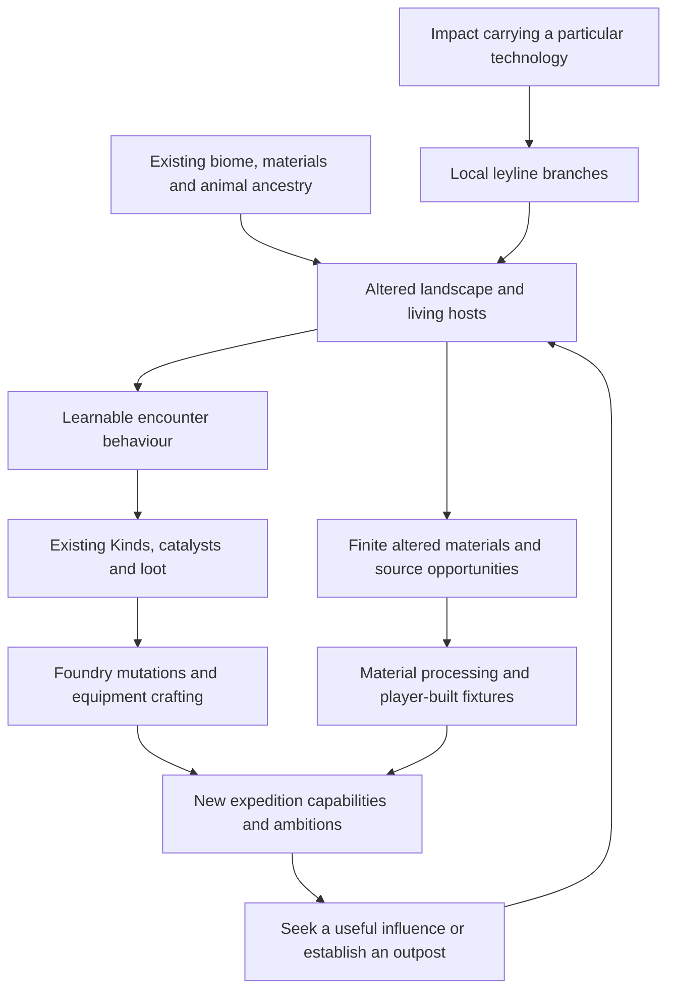

# INT-09 — Meteorite influences across the living world

**Status: Plan ready; gameplay implementation not selected.**
Owner request: 8 September 2026. Author: Codex. Audited baseline: `a3204d9`.

The requested outcome is a coherent design intensive connecting different
asteroid-borne technologies to seeded places, ground leylines, augmented animals,
combat, drops, the Foundry, equipment, crafting and player-built workshops.
Planning can progress alongside the separate image-to-3D wolf experiment.

The owner's underlying direction is accepted under D-030. The identities,
budgets, encounters and delivery sequence below are **recommendations for that
direction**, not additional accepted rules. This document introduces no runtime
tuning, new world profile or save migration.

## 1. Intent recovered from the previous conversations

The original user messages were recovered from the local records of these
existing conversations. Titles are preserved verbatim; quoted words are the
owner's, while the design interpretation that follows is a proposal.

| Conversation and message | Recovered intent |
| --- | --- |
| **Build grimdark mob reference library**, 7 Sep, 12:12/12:13 UTC; thread `01a07bc8-a5f3-76a3-b5f6-ff1040d14a37` | Gloomy, fuller river woodland. Meteorite veins can produce “larger trees, water flowing into lava instead, or icing over.” Beasts began as ordinary Earth-like animals; alien magic/technology made them fantastical. |
| Same conversation, 7 Sep, 12:33 UTC, continuation record | Selected wolf → Ash Hound, boar → Whelp, stag → stag, moth → Wisps. Different coloured leylines influence the same base animals differently; the owner specifically connects the Cinder moth to Ember catalyst magic. |
| **Fix INT-03C placement stalls**, 8 Sep, 05:48 UTC; thread `01a07baf-994f-71a2-bb2b-3025e79126e1` | Animals should carry “these currents/glowing scars through them much like the world.” |
| Same conversation, 8 Sep, 06:14 UTC | “different meteorites have different magic/tech in them”; the white smithy is the existing example. Red, blue and green should participate in random seeds, create different mob combat experiences, and provide different collection/extraction goals according to the augmentation the player needs. |
| Current request, 8 Sep | Expand that connection into a detailed world/crafting/building/combat intensive while image-to-3D setup waits. |

The enduring fantasy is **learning to deliberately use the force that changed
the world involuntarily**. A useful discovery explains both an enemy's strange
body and something the player can eventually make. Loot carries a history and
an application. A workshop demonstrates that the player has understood a place.

The sources already preserved in the repository are the [world premise](../world-premise.md),
[influence direction record](meteorite-influences-2026-09-08.md),
[creature adoption](augmented-beasts-2026-09-07.md), and
[current art study](leyline-art-studies-2026-09-08.md).
No missing transcript prevents planning. Exact colour meanings, mixed
influences and extraction rules were not settled in those messages.

## 2. The organising model

**Local host + meteorite influence + degree of alteration = a particular
world expression.** Era remains the existing separate progression context.
“Degree of alteration” initially describes authored forms; it does not imply
a new exposure meter or automatic stat multiplier.

Keep these identities distinct:

| Dimension | What it answers | Example |
| --- | --- | --- |
| Biome / host material | What was here, and what can physically be worked? | Woodland, riverbank, clay, timber, a former smithy |
| Animal ancestry | What is this creature underneath its augmentation? | Wolf, boar, stag, moth |
| Meteorite influence | What process has been exaggerated? | Proposed heat accumulation and release |
| Authored expression | How does this host embody that process? | Moth wings that store heat and vent it |
| Combat capability | What must the player notice or do differently? | Leave a warned release area, then use the recovery window |
| Recovered Kind | What portable transformation can the player work with? | Existing Ember Catalyst |
| Grade / era | How much itemisation capacity or progression is available? | Existing Faint/Stable/Potent, workpiece quality and era rules |

A colour is an identifying cue for a technology. It is not an equipment rarity,
an automatic damage type, a class allegiance or a new currency family. Several
Kinds can express different useful aspects of one influence. A Kind's existing
mechanic need not be exclusive to one geography.

## 3. Four proposed influence identities

These develop the earlier candidate table. The owner has named the colours,
but has not approved this exact catalogue or its working labels.

| Colour / working identity | Core process | Land and water expression | Animal / combat expression | Desired player capability |
| --- | --- | --- | --- | --- |
| **White — Impulse** | Store strain, compress, release motion | Folded mineral seams, stressed stone ribs, directional cracks and periodic pressure breaths | A wolf visibly compresses its stance before a committed burst; read direction and release timing | Controlled force, momentum, mechanical drive and release timing |
| **Red — Excitation** | Accumulate heat, transform material, discharge | Vitrified banks, charred living roots, narrow hot veins and visibly altered flow; later authored molten reaches | A moth's wing chambers brighten before a bounded vent; reposition, then punish recovery | Ignition, heat handling, delayed release and fired craft |
| **Blue — Retention** | Bind, hold a state, resist or delay change | Layered fissures, held cascades, frozen margins and braced growth | A second wolf form leaves a warned binding strip after its committed approach; move out before it closes | Control, preserving an effect, bracing and measured release |
| **Green — Propagation** | Grow a pattern and pass an effect between hosts | Enlarged root systems, repeated growth forms, dense but traversable banks and branching scars | A boar form telegraphs a branching pulse between nearby marked hosts; separate the group or interrupt the source | Transferring effects, conditional recovery, branching control and useful growth |

White's pressure connection grows from D-031. Red's moth/Ember association is
directly grounded in the owner's brief. The specific white wolf, blue wolf and
green boar encounters are later candidate studies. They do not replace the
current roster or turn every passive animal hostile.

Each influence needs a visual verb as well as a hue: compression; swelling and
venting; layering and bracing; branching and repetition. Use that verb in rock,
bark, anatomy, motion and crafted housings. Retain recognisable flesh, fur,
wood and masonry around the alteration. Dark scar margins and narrow buried
light connect the art to the owner's reference without bathing every surface
in emission.

There is room for calm, beautiful and useful augmentation as well as danger.
A huge green canopy can shelter a route; a blue-stilled stream can reveal old
stonework. Whether an altered surface becomes traversable or harmful requires
its own physical rule. A painted ice or lava surface must never silently claim
collision, melting, damage or resource behaviour that does not exist.

## 4. World composition and environmental history

### Let geography retain its identity

Use the existing finite **1,024 × 1,024 m** scale. Compose influence across
underlying habitats: a red river margin and a red rocky shelf share technology
but have different silhouettes, materials and approaches. A biome is not locked
to one colour, and colours do not become sequential level bands.

For the first proof, recommend a small authored-in-rules source catchment:
an impact anchor, a connected exposed branch, an altered material host, a
readable encounter space and a clear working area. Prefer reusing a suitable
successor-profile impact and branch over increasing site counts. Keep hostile
encounters outside the protected starter catchment and preserve the four
existing home opportunities and ordinary progression resources.

Seed variety should change siting, approach, host composition and optional
richness. Recommend guaranteeing every capability actually required by the
selected slice; optional rare combinations can remain discoveries. In the
eventual four-influence pass, guarantee a reachable introductory opportunity
for all four, with the exact count and distance budgets selected then. Players
should be able to pursue a build without restarting for the right map.

### Show a cause that can be followed on foot

An approach should reveal, in order: an ordinary host; altered growth or stone;
a branching scar; a creature carrying the same pattern; and a useful source.
Not every branch has treasure at its end. Broken and buried traces communicate
geology/history; intact extractable sites communicate a distinct physical host
and actual remaining stock.

Ruins predate the catastrophe. Show modest old craft, a directional impact,
surviving material and accidental augmentation. The player supplies deliberate
bracing, containment, controls and new machinery. Do not imply ancient people
built working meteorite extractors after the impact. The sender, purpose,
elapsed time and civilisation names remain mysteries.

### Keep overlap bounded

Initially each encounter and source has one stable influence chosen at
generation. Walking across another colour does not recolour a mob, reroll its
drops or transform its attacks mid-fight. Crossing branches may visually meet
without granting combined powers. After the individual loops work, one authored
red/blue junction could express the already familiar heat/control combination;
procedural mixtures, inheritance and a full exposure simulation remain separate
design work.

## 5. Augmented creatures, combat and readable drops

An animal supplies the body and baseline locomotion. An authored influence
expression adds one signature combat decision before adding more health,
damage or extra attacks. Build a small selected roster, not the sixteen-cell
animal-by-colour product implied by four animals and four influences.

Current mappings are compatibility facts, not the proposed catalogue:

| Existing family / ancestry | Current recovered association | Interpretation to preserve |
| --- | --- | --- |
| Ash Hound / wolf | Quicksilver | Silver-blue scars do not currently make it Frost-aligned |
| `ember_whelp` / selected boar | Ember | The owner's “Cinder Whelp” refers to this existing family |
| Valley Elk / stag | Marrow | Ordinary passive ancestry is retained |
| Marsh and Cinder Wisps / moth | Ember | Current visual differences are not already a typed influence system |

For later variants, associate a named behaviour with the appropriate existing
Kind pool rather than calculating drops from RGB. Impulse might support Impact
or Quicksilver expressions; Retention might support Frost, Preserving or a
particular Vanguard; Propagation might support selected recovery or spreading
expressions. These are mapping candidates, not new identities or a reassignment
of current family rewards. Red does not own all offence, blue all defence and
green all sustain.

Every new signature needs:

- A visible preparation, an exact threatened space, a release and a recovery.
- An ordinary movement/positioning answer available to every starting class.
- A useful build answer such as an existing stagger, control or mitigation
  capability, without making one element compulsory or adding immunities.
- Honest collision and cover behaviour, preserved aim commitment and bounded
  overlap with other mobs and Foundry effects.
- A drop whose existing use resembles the observed behaviour enough to learn.

Compare the same ancestry under two influences in a later review. That proves
the distinction belongs to augmentation rather than merely replacing wolves
with a different species. Keep existing horde chasing/disengagement and combat
authority; this intensive does not redesign the whole AI or the player's dash.

## 6. The economy: three useful ways to progress

| Route | Its useful role | What prevents it replacing the other routes |
| --- | --- | --- |
| Combat and trials | Exciting portable Kinds, gear, pages and replenishable expedition rewards | Existing drop budgets and quality progression; a colour does not promise every desired item |
| Finite field sources | Deliberate access to a useful material or local process | Travel, finite stock, physical work and a specific source role |
| Workshops and advanced craft | Convert bulk materials and chosen Kinds into controlled results | Existing facilities, paid inputs, workpiece capacity and quality/potency rules |

Retain materials, Kinds and device energy as separate owners. Avoid adding red,
blue, green and white “essence” stacks beside the existing Kind economy. A raw
source should produce an existing useful material where possible; when a new
output is necessary, specify its consumer and why existing materials cannot
serve that job before introducing it.

Use influence to guide **where to look**, host/behaviour to guide **what can be
recovered**, and existing quality/era rules to determine **the itemisation
result**. Targeting can weight or identify a source without making every loot
roll deterministic. Preserve broad item drops and normal modifier access.
Do not add a guaranteed rare item to every coloured mob or let an area's glow
grant higher potency by itself.

Existing `distil_ember` already makes a Faint Ember Catalyst at the basic forge
from one iron ore, two charcoal and two units of fuel heat, at Blacksmithing 1
in era one. This is the accepted D-026 [forge progression](forge-clarity-and-early-pacing-2026-09-06.md),
which is newer than historical “catalysts never cast” prose. Preserve it as an
early fallback. Converting every influence source into arbitrary Kinds or
automating their production would be a separate economy change.

## 7. Foundry and equipment: recover a process, then reinterpret it

Keep the existing Foundry as the main source of transformative build variety.
Recovered Kinds travel through the current inward routes and resolve into
existing named mutations. Do not add a parallel meteorite talent tree, four
colour sockets, mandatory attunement or another action bar.

A player who watched a red moth store and release heat can recognise the
connection when an Ember Catalyst produces Kindling or another compatible
Ember reading. The catalyst does not simply copy the moth's attack; the skill,
ingots and route determine the player's version. This leaves room for the
same discovery to serve melee, bow and spell builds.

Equipment retains its distinct job: materials form the base, compatible Kinds
aim crafting, and modifiers scale acquired capabilities. Existing
Rough/Sound/Excellent workpieces and Faint/Stable/Potent Kinds retain their
meaning. Demonstrate a Foundry use and a gear-crafting choice with accurate
previews and actual owned items; do not spend one item simultaneously in both.

Later compound sources can suggest existing ordered interactions such as
Steam Plume. They must not grant a free second Kind, duplicate a reconverging
route or overwrite an already owned mutation. New compound rules require the
same explicit authored contract as D-025.

## 8. Crafting, building and useful local machinery

Buildings should display what the player learned from their expeditions.
Existing material traits and the lattice remain the construction grammar.
Influence can motivate a windowed workshop, an airy firing shelter, a braced
source platform or a planted outpost; it does not prescribe a required room
template or make ordinary timber obsolete.

| Influence | First architectural/material connection | Later functional candidate, separately selected |
| --- | --- | --- |
| White | Existing brick workshop, pressure housing and cargo handling | Retain the finite pressure feeder as the reference loop; a further impulse use must have a specific load and energy budget |
| Red | Recover glass-forming shards; fire existing Cinderglass for framed windows | One local heat-capture attachment supplies finite heat to one existing fired recipe |
| Blue | A restrained glazing/stone treatment communicates held structure without adding a material tier | A retention attachment reduces loss from one explicitly selected stored state; do not invent food spoilage just to require refrigeration |
| Green | Existing wood, reed, resin and cork give exaggerated living hosts a practical building destination | A bounded signal branch requests work at two compatible fixtures, each paying its own energy; cultivated resource renewal remains separate |

Blue/green surfaces are future art candidates, not new material families in the
first proof. Existing Lanternheart, Thrumroot, Stormglass, Pullstone and Ventlung
retain their useful identities; do not rename them as four coloured ores or
require all five in every device. In particular, a propagation-themed control
must still respect Stormglass's existing signal role, not replace it for free.

The source is the reason to choose an outpost location. Storage, access, a
work surface, shelter and sightlines make it practical. The building should
remain useful after source depletion, and reusable components should support
relocation. Work circles, station clearance, extraction access and walking
routes must remain valid after ordinary building and excavation.

For the proposed later red heat proof, the design recommendation is explicit:
**finite source heat replaces the fuel payment for one selected existing fired
recipe**. It does not also supply motion, materials, item quality or mastery.
This would be a new opt-in module and a bounded expansion of D-031, not a
reinterpretation of its pressure pocket. Costs, heat units, attachments and
refund handling require a concrete contract before that slice starts.

Signals request work; energy pays for work. Source balance, stored energy,
recipe inputs, in-flight escrow and completed outputs must have distinct owners.
Retain finite supply, manual alternatives, small buffers, explicit local loading,
pause while inactive and no offline production. This plan does not introduce a
factory network or automatic catalyst/mastery farming.

## 9. Recommended first complete proof: the red glassbank

**Proposed approval unit: INT-09A through INT-09C below.** These form one
complete source → encounter → craft/build → next-expedition loop. Their
numbers are initial proposal values, not measured balance or installed tuning.

1. **Find it.** In a successor world, one reachable branch from a red impact
   enters an existing-style rocky or riverbank host beyond the starter buffer.
   A vitrified margin, vent rhythm and one moth encounter share the same motif.
   This is an authored composition within seeded siting, not a new biome.
2. **Read the threat.** Reuse the liked Cinder moth body and its baseline
   committed projectile. Add one selected heat-release signature: it stops,
   lights its wing channels, warns a small area around itself, then vents once
   and recovers. The release replaces an attack opportunity; it is not free
   additional damage layered onto every shot. Stepping clear works for all
   classes; an applicable existing stagger cancels preparation. Exact warning,
   radius, damage and recovery values follow matched encounter measurement.
3. **Recover augmentation.** Use the existing Ember drop identity, rate and
   potency rules. A particular kill is not promised a catalyst. Verify both a
   deterministic normal-drop case and an unlucky case; existing Faint Ember
   distillation remains the fallback. No extra first-clear currency or pity
   ledger is needed for this first proof.
4. **Work the host.** Propose one **new finite field source** paying 16 existing
   `cinderglass_shard`. Current shards come from Forge rewards; a wild shard
   host does not already exist. Approaching/working this host is available to
   every class through ordinary interaction, without a resistance or colour
   prerequisite. Exact work stages and release handling must be selected in
   the source contract. Saved partial work and depletion are mandatory.
5. **Make something visible.** Existing `refine_cinderglass` consumes eight
   shards and one fuel heat at the basic forge to produce four Cinderglass.
   Two batches from the proposed haul make eight Cinderglass, sufficient for
   four existing framed `glazed_window` pieces at two material units each.
   Each window includes its frame at that existing cost. The player builds the
   workshop through normal paid construction; source discovery grants no free
   forge, windows or recipe bypass.
6. **Use the recovered process.** On a valid existing Foundry arrangement,
   place an owned Ember Catalyst and inspect the resolved mutation. Compare
   the same skill before/after in another ordinary encounter. Also preview its
   alternative equipment-craft use and cost without spending it twice.
7. **Choose the next ambition.** The red source's windowed outpost and Ember
   working provide a concrete return. White pressure remains a different
   existing workshop goal; trials remain the repeatable shard and reward
   route after the field source is exhausted.

The material host and signature attack are new gameplay proposals. Merely
colouring current moths and traces would not satisfy this proof. Conversely,
the proof needs no new skill, Kind family, equipment rank, biome, factory,
permanent world purification or production-quality wolf mesh.

## 10. Delivery sequence and work that can proceed while art waits

| Slice | Reviewable result | Dependency / completion boundary |
| --- | --- | --- |
| **INT-09P — intent and system map** | This source-backed intensive, proposed palette, first journey, decision list and test plan | Planning complete in this document; proposals await selection |
| **INT-09A — typed place and compatibility contract** | Exact first-source/encounter definitions, frozen V6 baseline, one seeded red composition in an isolated successor, all old worlds retained | Owner selects the red proof and successor approach; no new default world until the complete loop passes |
| **INT-09B — encounter and recovery** | One readable Cinder moth signature; finite 16-shard host; current Ember loot and dry-roll fallback; exact saves | Depends on A; needs combat and ownership evidence, not just renders |
| **INT-09C — return and comprehension** | Normal paid windows, actual Foundry use, alternate craft preview, truthful source/use hints and a second expedition | Depends on B; complete first proof, with owner discovery/combat review kept explicit |
| **INT-09D — four influence identities** | White pressure interpretation plus selected blue and green counterparts; one same-animal comparison and a useful return for each | Separate selection after the red loop review; guarantee/siting/content counts fixed before coding |
| **INT-09E — one additional extraction process** | One finite red heat module for one existing recipe, with paid inputs, exact escrow and manual fallback | Separate concrete source/device contract; no general automation dependency |
| **INT-09F — one authored confluence** | One mixed-source encounter and recoverable use that teach an existing compatible compound build | Only after individual influences work; dynamic mixing remains outside scope |

While the wolf service/setup waits, useful independent work is: finalise these
definitions; inspect existing mutation/source links; make isolated encounter
and material compositions using the liked moth and current local assets; and
prepare deterministic economy/compatibility fixtures after the first gameplay
slice is selected. These tasks do not need the final wolf anatomy or texture.

The wolf thread continues owning its image input, mesh experiment and visual
acceptance. This planning task has not modified that work or contacted it with
new implementation instructions. Adopt final creature art through its existing
review process rather than making this lore intensive depend on a service.

## 11. Authority, persistence and tuning boundaries

The sim owns generated identities, associations, finite source balances, loot,
recipe transactions and combat numbers. Godot owns space, timing, tells,
geometry and local feedback under D-010/ADR-0003. Presentation reads the same
influence record as the encounter/source; it never infers gameplay from a
material colour or creates stock while rendering.

Recommend a named successor after `frontier_v6`, selected during INT-09A.
Freeze V6 inputs and helpers before changing geography or its associated
gameplay. Preserve V1–V6 seed/profile identity, terrain, resource IDs, source
depletion, existing family rules, buildings and saved ownership. Current shared
cool-white traces remain an untyped legacy appearance, not retroactive White
sources. Older pressure pockets retain their exact D-031 mechanics.

Use stable source/impact/trace/encounter IDs and deterministic seed streams.
Scene arrival order, cosmetic randomness and repeated inspection must not
reroll influence or rewards. Validate a whole candidate save before import;
partial work, drops, device balances and inventory must describe one checkpoint.
Reject unknown identities deliberately rather than defaulting them to another
colour. Choose an additive record version or schema change from actual saved
state requirements during A; do not announce a save format in a lore proposal.

| Affected files / decisions | Purpose in implementation |
| --- | --- |
| `worldgen.json`, frozen profile inputs, `worldgen.h` and profile helpers; D-003/D-030/D-032 | Source guarantees, associations, starter exclusions, deterministic siting and historical identity |
| `world.json`, `combat_realtime.json`, native combat and enemy presentation; D-010/D-012/D-016 | Selected expression, source/drop association, signature clocks and space |
| `crafting.json`, `foundry.json`, `grammar.json`; D-023/D-025/D-026 | Reuse actual Kind IDs, mutation previews, recipe/fuel and grade contracts; no initial mutation edits expected |
| `construction.json`, `contraptions.json`, inventory/save bridge; D-017/D-018/D-029/D-031 | Existing windows/material traits and any later device's energy, escrow and refunds |
| Leyline/actor/host art resources and existing UI guides; D-013 and interface guidance | Shared shape/motion language and concise source/use explanations |

Names for new tuning keys are chosen with the implementation rather than
reserving a speculative framework. The values that require explicit purpose
and measurement are:

| Proposed control | Player experience it governs | Initial recommendation |
| --- | --- | --- |
| Required source count | Whether the selected ambition can exist in every new seed | One red introductory field opportunity for the proof |
| Source haul | Useful first building result and time before depletion | 16 shards; two current batches; four framed windows |
| Catchment size and branch exposure | How easily a source can be read and found | Tune on actual approaches; no value selected |
| Opening exclusion and route clearance | Quiet first home, safe ordinary supplies and usable workplaces | Preserve current guarantees; fit full source/encounter footprints |
| Vent warning, radius, recovery and cadence | Whether positioning beats the signature and melee gets a turn | Measure against current moth baseline before fixing numbers |
| Vent damage and overlap ceiling | Distinct pressure without an unexplained damage spike | Replace attack opportunities and use existing combat budgets |
| Kind rate and potency | Frequency of build opportunities | Keep existing rules for the first proof |
| Source work stages | Effort and clarity of gathering a useful haul | Select ordinary all-class interaction; no elemental access gate |
| Later heat stock / recipe debit | How much fuel the proposed module can replace | Select only for INT-09E; never assume glowing terrain is fuel |

## 12. Acceptance and review

These are planned checks, not claims that new gameplay exists.

- **Generation:** repeat the proposed profile/seed, verify source/encounter
  associations, accessible work circles and starter protection across the
  existing style of seed matrix. Compare complete historical fingerprints for
  V1–V6; check that unrelated presentation ordering cannot change results.
- **Recognition:** at ordinary player height, distinguish the influence in
  ground, animal and crafted result through shape/motion plus colour, including
  muted-colour review. Ambient scars must not masquerade as an active damage
  warning. Compare daylight, shade and overlapping Foundry effects.
- **Combat:** use matched Ranger/Warden/Kindler builds, a plain baseline and
  selected augmented builds. Demonstrate leaving the vent, applicable stagger,
  actual recovery, cover and bounded multi-mob overlap. Record damage/contact
  and deaths, then keep owner difficulty judgement separate from scripted wins.
- **Economy:** verify exact 16 → 8 → four-window material accounting, ordinary
  fuel payment, no duplicate collection, existing grade/Kind rolls and the
  no-drop fallback. Ensure field supply is finite and Forge replenishment remains
  useful. No automatic mastery or new universal essence enters inventory.
- **Ownership:** exercise partial work, loose drops, death recovery, streaming,
  repeated loads, fresh-process restart, trial entry/suspension and malformed
  state. Later devices additionally require exact cancellation, blocked output,
  unload/pause, dismantling/core refunds and source exhaustion tests.
- **Integration:** build and use the outpost with actual controls, place a
  compatible owned Kind, verify the resolved mutation in combat, return home and
  restore the same world. No debug grants count as the paid journey.
- **Performance:** compare matched approach and mixed-combat frame times to
  the baseline; retain existing loading/support guarantees and actor/hazard
  limits. New colour materials must not cause a first-encounter shader stall.
- **Owner experience:** the player can explain what changed the land, what the
  creature will do, what its recovery is useful for and why another influence
  might be worth seeking. The result should produce a self-chosen next goal.

## 13. Decisions still worth making

| Decision | Recommendation to review | Why it matters |
| --- | --- | --- |
| Exact colour meanings | White impulse, red excitation, blue retention, green propagation | Establishes the shared visual/combat/craft vocabulary |
| First gameplay selection | Red moth + finite glassbank + existing Ember/windows, INT-09A–C | Proves a whole loop using liked art and existing player capabilities |
| World compatibility | A new finite successor; keep existing worlds exact | Prevents changes to the geography, encounters and stock behind saved homes |
| Full-palette guarantees | At least one reachable baseline opportunity per selected influence | Avoids a seed blocking a desired build; optional rare combinations still vary |
| Mob influence lifetime | Fixed authored expression per generated encounter initially | Keeps combat learning and saved reward identity dependable |
| Next extraction benefit | Finite red heat replacing fuel for one recipe | Gives a concrete new workshop use while separating heat from pressure drive |

Mixed influence rules, renewable growth, purification/territory control,
additional eras, new Kind families and a broad factory remain later decisions.
No missing lore answer needs to be invented to complete this plan. The first
three rows are the meaningful choices before the proposed gameplay proof.

## 14. Evidence limits and documentation follow-through

This pass recovered the owner's messages, read the relevant accepted decisions
and specifications, and cross-checked current recipe/source/Kind definitions.
Two independent read-only audits reviewed world/building/save and
combat/loot/crafting integration and found no material errors in the draft.
All 59 local links across this intensive, its source record and the queue
resolve. Whitespace and the final scoped diff are checked before publication.
No game test or art review is represented as having validated the proposed
mechanics.

The master design's older V5/512 m world paragraph and historical catalyst-casting
exclusions lag D-032 and D-026 respectively. This proposal uses the newer
accepted decisions and current focused work items. It does not rewrite those
historical passages or resolve the separately recorded timber-demolition conflict.

On selection, record the bounded change in the decision registry and update
only the affected world/combat/loot/craft/construction/save specifications.
Keep implementation evidence, measured tuning, owner review and publication
status with each delivered slice. This document and its queue entry remain a
planning handoff until then.
