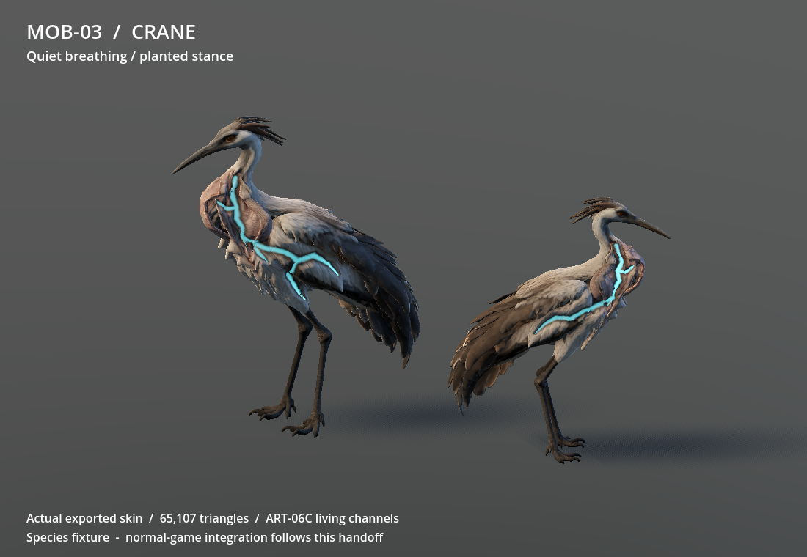
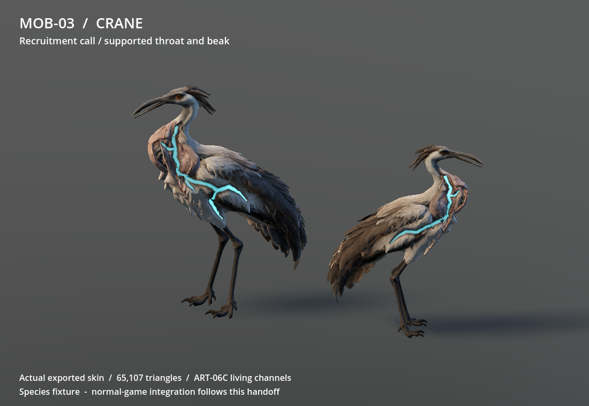
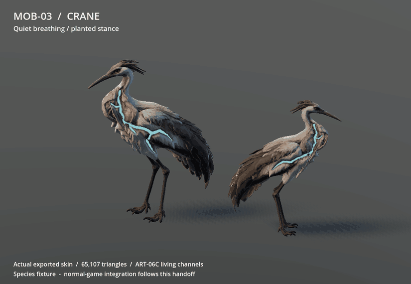

# MOB-03 — crane production result and integration handoff

The approved crane now walks on two fitted legs, breathes while grounded, opens
its attached beak and expands its supported throat for a recruitment call. A
small peck represents its existing weak close attack. The crane is now integrated
and pushed in the normal game: production commit `e7325de` was adopted as
`34c7f55`, followed by native wiring `d9e6b90`. Ram remains a separate integration;
there was no runtime dependency requiring it to precede the crane.

## Remaining limits

The coordinator completed normal-game recruitment, melee presentation and
ordinary Continue checks, recorded below. The earlier species fixture establishes
source motion only; it is not the native-gameplay evidence. Owner playtesting is deferred
under the owner's 15 September standing approval; this is not a claim that the
owner has played or personally judged this motion.

The inherited upright capsule (0.35 m radius, 1.3 m height) differs from the
bird's long neck, beak and tail. It remains unchanged. No terrain foot IK is
included; some sliding on uneven ground and generated feather/cavity roughness
remain. Automated simplification is not hand retopology. Later-era additional
anatomy, other species and hardware measurements remain separate work.

## Checked production output

| Item | Delivered value |
| --- | --- |
| Enemy / role | `shrieker` / existing `recruit` |
| Runtime | [model.glb](../../game/assets/authored/roster/shrieker/model.glb) |
| Exact descriptor | [asset.json](../../game/assets/authored/roster/shrieker/asset.json) |
| Geometry | **65,107 triangles**, two skinned meshes, one **16-bone** skeleton; source 296,116 triangles |
| Weights | Normalised, at most four per vertex; skull, jaw roots and soles retain fitted anchors |
| Skeleton | `CraneRig/Skeleton3D` relative to instantiated GLB root |
| AnimationPlayer | `AnimationPlayer` relative to instantiated GLB root |
| Meshes | `CraneRig/Skeleton3D/CraneBody`, `CraneRig/Skeleton3D/CraneLowerBeak` |
| Maps | Original `base.png`, `orm.png`, `scar-mask.png`; receipt identities retained |
| Editable master | `D:/Wroughtwild/source-art/mob03-crane/rig-v04/shrieker-rigged.blend` |
| Recipe / tuning | [build.py](../../tools/wroughtwild-mob03-crane/build.py), [rig.json](../../tools/wroughtwild-mob03-crane/rig.json) |
| Source receipt | `D:/Wroughtwild/source-art/mob03-crane/input-art06c/source-selection.json` |

All clips animate in place and contain only pose tracks:

| Clip | Seconds | Loop | Meaning |
| --- | ---: | --- | --- |
| `idle` | 4.0 | Yes | Small breathing rise with both feet supported |
| `walk` | 1.2 | Yes | Alternating fitted leg chains; 60% support phase per foot |
| `windup` | 0.5 | No | Neck draws back during the existing melee tell |
| `release` | 0.3 | No | Small peck, then complete neutral pose |
| `call` | 1.25 | No | Beak opens, throat widens, head lifts, then complete neutral pose |

The builder uses one 65,000-triangle collapse target, opens the source's fused
beak seam, and removes nine duplicate faces created by collapse. Seam splits
account for the final count. Original source geometry and packed input are
preserved. Only the lower beak is split; it retains common head-weighted root
vertices. No eyes, crown or folded wings become separate moving props.

### Fit and material

Use a uniform **0.8** scale and **180° Y** rotation at the grounded visual root:
GLB forward is +Z; Enemy faces -Z. Ground offset is `(0,0,0)`. Rest height is two
source units; the supported animated stance is about 1.95 units, or 1.56 m at the
suggested scale, before existing family/elite scaling. Do not fit each axis to
the old humanoid surface or change the collider.

Walk travel is **0.766666667 source units per cycle**: phase advances by actual
horizontal travel divided by that value times the final uniform scale. At the
suggested scale that is **0.613333333 m per cycle**, before family/elite scale.
The 1.2-second clip is an authoring cycle, not a new native movement speed.

Bind the selected ART-06C material, using the included unchanged
`lifeline.gdshader` as the material reference. Base is sRGB; ORM and scar maps
are linear. Scar RGB means contained light, damage coverage and connected-route
travel. ORM G/B controls roughness/metalness, as in the selected shader.
`damage_tint=(0.16,0.14,0.12)`, period 4 s, peak 2.4, minimum 0.32, crest 0.20,
pulse mode 3. The selected Godot colour parameter is `(0.32,0.71,0.76)`; match the ART-06C
viewer by passing `Color(...)` directly to the `source_color` parameter.
The descriptor records all values and file hashes. Preserve shared actor
hit/freeze/burn/status presentation when binding this shader through MOB-01's
adapter. Ambient pulse uses the pause-aware visual clock and independent
instance phase; it has no recruitment or healing meaning.

## Production wiring handoff (implemented by the coordinator)

The handoff below is retained for provenance. The completed integration section
supersedes its future-tense instructions and proposed ram-first ordering.

1. Cherry-pick this worker's checked production commit after the shared MOB-01
   adapter and ram integration. Register only `shrieker` using the descriptor
   and its actual paths. The descriptor is a species handoff, not a new shared
   runtime schema. Keep one imported skeleton; hide the replaced surface and
   disable its procedural pose driver through the shared adapter.
2. Set `idle`/`walk` loop mode explicitly. Sample windup with the existing
   `1 - _windup_left / windup_seconds`. The normal `attack_released("strike")`
   observer drives only the peck follow-through; it must never drive `call`.
   `release` starts at native release time; its visible peck peaks at 0.15 s.
   Damage remains at the existing native instant and is never applied by a key.
3. Add this minimal **presentation observer** in shared `Enemy`, without moving
   or replacing any existing recruitment lines:

   ```gdscript
   signal recruitment_called

   # At the end of the existing force_scream(), after its native _pulse_ring:
   recruitment_called.emit()
   ```

   Connect the crane presentation to that event at binding. A callback resets
   only a transient visual `call` age to zero. The existing function continues
   to reset `_scream_timer`, wake living idle enemies in the actual radius, and
   display its ring at the same instant. Ordinary period/radius stay 4 s/14 m,
   including native era adjustments. Do not poll a second recruitment timer,
   cause recruitment from a clip, or delay the native effect until throat peak.
4. The call opens visibly at about 0.10 s, reaches its throat pose by 0.20 s,
   begins settling at 0.675 s and ends at 1.25 s. Keep actual-travel locomotion on
   root/body, tail, wings and both leg chains while a moving actor calls. Layer
   only `neck`, `upper_neck`, `head`, `jaw`, `resonator` local poses from `call`.
   At rest the complete clip is usable. This bone filter avoids requiring a
   new shared API or a second skeleton.
5. Keep melee windup/release visually ahead of an overlapping call so the
   existing attack tell remains readable. Let suppressed call presentation
   expire; do not replay it later. Preserve the shared freeze policy and cancel
   transient call state on stagger, death, rebind/removal and save restoration.
   No call state enters player saves. Blend/reset the whole pose when returning
   to idle/walk; tested clips contain complete neutral endpoints.
6. Reuse this worker's source/export checks. The coordinator's remaining focused
   check is the actual role: a real native call starts its visual observer once,
   only valid nearby idle living enemies recruit, a melee peck does not call,
   moving-call legs continue walking, and ordinary Continue loads the new
   presentation. Preserve all current gameplay/save assertions. No baseline,
   benchmark, renderer matrix or new owner approval is required.

## Verification actually run

Three focused jobs, one renderer; no whole-game import, parent rehash, benchmark,
soak or broad regression:

1. **Source/rig/export:** fitted anatomy and weighted sampled rest/gait/action
   poses; normalised four-weight limit; one selected saved master reopened.
   Source foot-target error is at most **0.000000054 source units**. Early source
   iterations exposed an unreachable walking target and duplicate collapse
   faces; both were corrected before the selected v04 export. The remaining
   Blender warning concerns choosing the first equivalent PBR texture sampler;
   the final mesh validates and the fixture binds the original maps explicitly.
2. **Headless selected-asset Godot import/state:** **230 assertions passed**,
   including actual skeleton/clip/map paths, 65,107 imported triangles,
   independent instances, complete pose resets, loop continuity, joined melee
   anticipation/release and CPU-evaluated imported skin bounds. Sixteen matching
   jaw-root vertices remain attached during the call; maximum gap is
   **0.000098 source units**. No script or shader errors.
3. **Forward+ motion capture:** **348 assertions passed**, 160 actual viewport
   frames at 20 fps. A camera-angle correction made the beak/cavities readable;
   it did not change the geometry or repeat the state job. Final recipe review
   also corrected the fixture colour binding to use ART-06C's direct Color
   parameter rather than the older fauna adapter's extra conversion. The eight-second GIF
   is derived solely from those frames. No-focus flag and visible pointer pass;
   the wrapper holds the shared render mutex until its owned process exits.

Evidence: [state report](../../game/tests/mob03/evidence/state-report.json),
[capture report](../../game/tests/mob03/evidence/capture-report.json),
[source report](../../game/tests/mob03/evidence/rig-report.json),
[motion metadata](../../game/tests/mob03/evidence/motion-report.json).





## Completed normal-game integration

`CranePresentation` uses the checked rig, maps and descriptor in normal Shrieker
instantiation. `CreatureMotion` selects it from the existing actor manifest. It
retains A2's manual clip seeking and status presentation, with the ART-06C scar
math already used by porcupine. The crane's colour passes directly, as in its
selected source. No boar/wolf/stag/moth/porcupine sampler or asset was replaced.

`Enemy.recruitment_called` emits after the existing `force_scream()` finishes
its timer reset, nearby living-idle recruitment and ring. The callback changes
only a transient visual age. Melee `attack_released("strike")` independently
starts the peck. A moving call retains all non-call bones from the actual-travel
walk; the five neck/head/jaw/resonator local poses come from the checked call clip.
Melee tell/release takes priority and suppressed calls expire without queuing.
Freeze holds the exact pose; stagger/death/rebinding clear transient action state.

The Continue check found that same-world restoration can retain live actors.
SaveManager now resets registered transient actor presentations after successful
world/drop restoration. Only the crane currently registers for that cleanup;
its old call/peck is cleared without adding save fields or changing native actors,
recruitment clocks, effects, ownership or gameplay state.

The new `cinder_archer`/porcupine behavior is untouched. Shrieker numbers, attack
instant, call period/radius and era adjustments, collision, loot and population
remain native. Crane fit/stride come from the checked descriptor. The only new
art setting is `shrieker.crane.cull_margin_m = 0.4`, extending visible animated
bounds without changing collision; its purpose is documented in the actor manifest.

Coordinator checks were limited to the changed runtime connection:

- Headless main import: exit 0, **6.71 seconds**, no reported errors.
- Native actor/Forward+ view: **29 assertions passed**, **3.18 seconds**, no
  script/shader errors. Actual calls preserve recruitment eligibility/timing;
  actual melee does not call; walking legs remain on the base gait while the
  upper body calls. Freeze, status priority, pause, rebind and death were checked.
- Ordinary seed-77 Shrieker/SaveManager/Continue: **10 assertions passed**,
  **39.13 seconds**, preserving world identity, exact progression/finite-source
  ownership, one rig/observer and no replay of transient call/peck.

Source geometry, rig, map and 230/348 worker checks were reused. No source rebuild,
baseline/camera matrix, performance gate or further fauna regression was run.
The first native run passed its behavior assertions but reported a freed fixture
lambda capture. That observer now keeps a weak reference; a follow-up type-warning
parse failure was corrected with an explicit WeakRef type and the failed owned
process was stopped. The first Continue run caught the retained call state;
the runtime cleanup fixed it. Original assertions remain intact and all failed
logs are retained beside the final passing runs at
`D:/Wroughtwild/work/mob03-crane/build/mob03/integration/`.

One selected actual-native moving-call image is retained there as
`native-moving-call.png`; the earlier GIF above remains an exported-model preview.
Rendered checking used Forward+, the shared mutex, visible mouse and an asserted
unfocusable window. Both final owned processes exited and `game/override.cfg`
was removed. No testing is left running.

The ordinary `e0cbd5c..d9e6b90` push to origin/main succeeded, containing the
checked production assets and complete native integration. Documentation and
descriptor status were updated afterward without changing tested runtime values.

For later playtesting:

```powershell
& 'C:/Users/Matty/Godot/Godot_v4.5-stable_win64.exe' --path 'C:/Users/Matty/Dev/project-wroughtwild/game'
```

Use Continue or a fresh world and find a Shrieker. Approach while other idle
enemies are nearby: its native call recruits them and animates the throat/beak,
including while walking. At close range the peck remains a separate melee action.
Try pause/stagger and Save/Continue. No crane/showcase flag is required. R9 stays
stopped; underground lag, other mobs and deferred station/campaign feedback remain.

Reproduce only a relevant focused integration check with
`tools/wroughtwild-mob03-crane/run_native.ps1 -Job native -Capture` or
`-Job restore`; defaults put private state/logs on D: and preserve normal saves.

## Original production publication boundary

Delivery is the checked production commit on **`codex/mob03-crane`**, with its
exact SHA returned in chat. This worker does not push or modify `main`; the
coordinator has now performed the ordinary integration and push above. No shared
actor code, aggregate manifests, tuning, game rules or saves are changed here.
All owned tests/renderers have exited. No normal-game test override was created.
The ignored species fixture is retained for reuse, with isolated D: user data.
